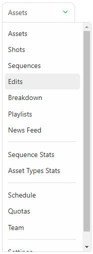

# Managing Edits

## Create an Edit

You can track tasks at the **Edit** Level in Kitsu.

It's especially useful when you have several edits to track through several validation steps. For example, you can track your whole movie, several trailers, and the First Edit, Fine Edit, Mix, etc.

::: warning
Per default, the **Edit** page will not be displayed until you have task types for it on your **production library** (setting page)
:::

To use this page, you need to first create a dedicated task type on your **Global Library**
 with the **Edit** attribute.

See the **Creating a New Task Type** Section to create a new **Task Type**.

[Creating a New Task Type](../configure-kitsu/index.html#task-types)

Once you have created your **Task Types**  on your **Global Library**, add them to your
**Production Library**, you will see the **Edit** displayed on the navigation drop-down menu.

This new page behaves like the asset and shot global page. You can add your edits with the **+ New edit** button.

You can assign tasks, do the review, change status, etc.

You can add a metadata column, fill in the description, etc.

::: tip
Depending on your deliveries, you can also change the resolution per **Edit**.
:::

::: warning
The detail page is different from the other entities.

As **Edit** focuses on a specific long video, the detail page looks more like the comment detail page.
:::

You can **Rename** and **Delete** the Edit entity on this page for the asset and shot entity.

