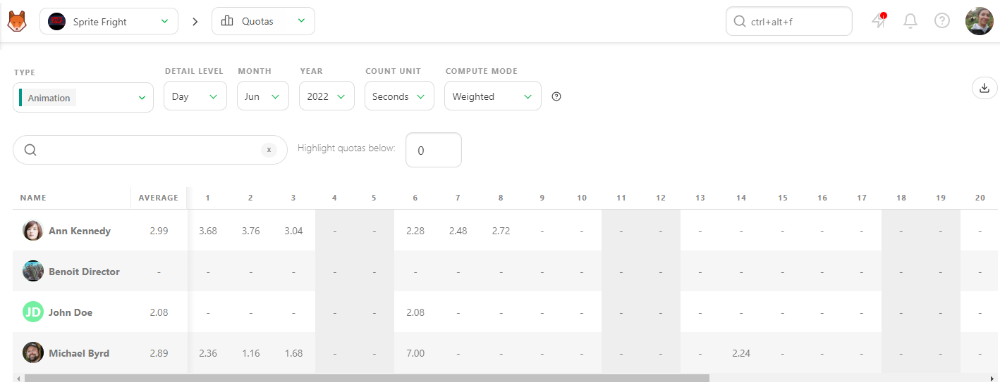
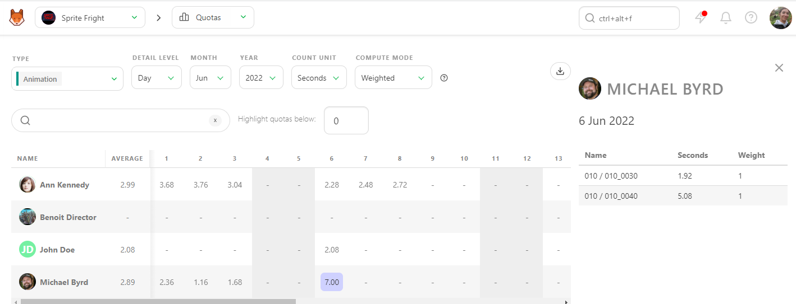
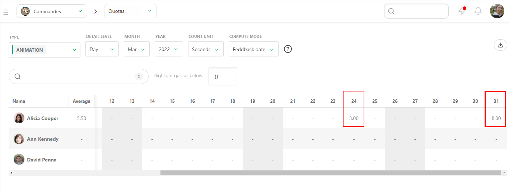
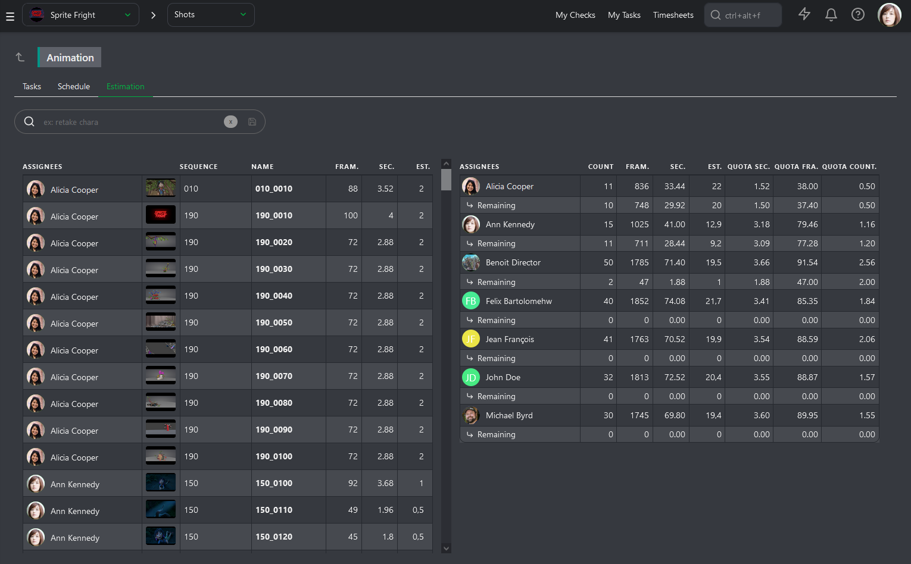
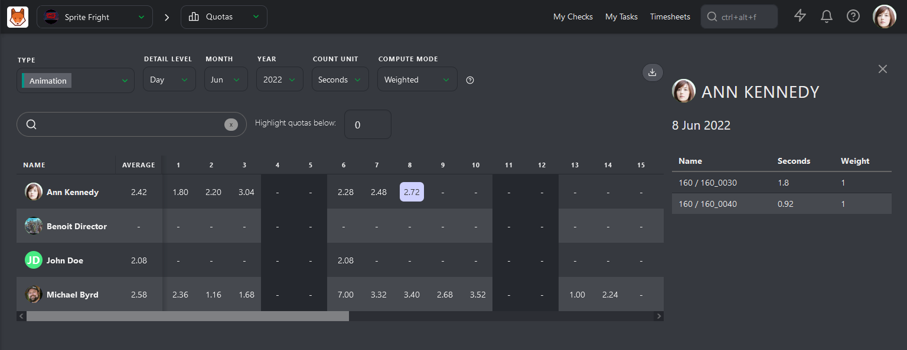
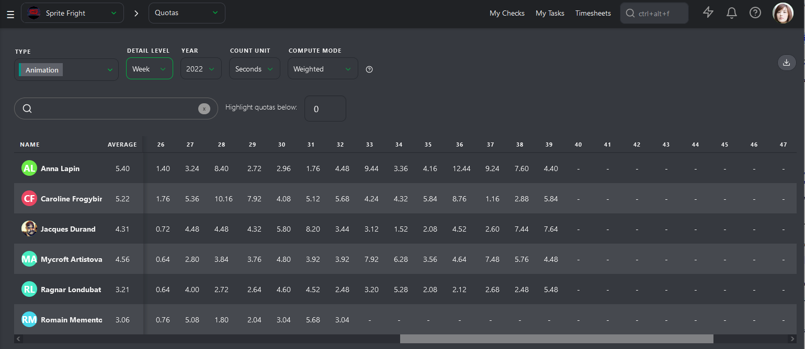

# Quotas

### Using Quotas to Understand Your Teams Speed

Kitsu has two ways to calculate quotas per **task type**.

### Quotas Based on Timesheets

The first method is linked to the timesheet:
Shots are considered complete when the first feedback request is made. Quotas are then weighted according to the time spent on the task, as recorded in the timesheet by the artist.

In this example, Kitsu weights the daily quota based on the timesheet entries.

### Quotas Based on Status Changes

If no timesheet is filled out, Kitsu uses status changes to estimate the duration:
- The task is considered started when the first status change to WIP occurs.
- The task is considered completed on the day the feedback request is made.

Kitsu then distributes the completed frames across all business days between the start and end dates. It calculates the number of frames (or seconds, or tasks) completed per day/week/month per artist.

You can click on a number at any time to see its details in the right panel.

## Checking Quotas

Kitsu provides two methods for calculating quotas per **shot Task Type**. 

### Method 1: Timesheet-Based Calculation

This method weights quotas according to the time spent on tasks as recorded in the timesheets. 

- **Task Completion**: Shots are considered completed upon the first feedback request. The quotas are then weighted based on the time recorded in the timesheet.

In this example, Kitsu calculates the daily quota using timesheet data.

### Method 2: Status-Based Calculation

If no timesheet data is available, Kitsu uses status changes to calculate quotas.

- **Task Start**: The task is considered to have started when its status changes to WIP.
- **Task Completion**: The task is considered completed on the day the feedback request is made.

### Detailed Quota Calculation

Kitsu splits the completed frames among all business days between the task's start and end dates, attributing the number of frames (or seconds, or tasks) submitted per day/week/month to each artist.

At any point, you can click on a number to see detailed information in the right panel.

::: danger
**Note**: If no timesheet is filled, Kitsu defaults to considering:
- The task started with the first status change to WIP.
- The task was completed on the day the feedback request was made.
:::

This method ensures that even in the absence of detailed timesheet data, there is a reliable way to track task progress and calculate quotas accurately.

## Managing Department Quotas

A quota refers to the specific amount of work or number of tasks an artist is expected to complete within a given timeframe, ensuring that the project progresses according to schedule and meets production deadlines.

At the beginning of production, while setting estimates for each task, you can also define estimated quotas for each of your artists. Once a task is approved, the remaining line on the Estimation tab of the Task Type page will update and display the remaining number of tasks and the updated estimated quotas.

You can monitor each team member to see if their estimated quotas stay within the initially established range.

To check their **Actual Quotas**, go to the **Quotas** page.

Kitsu has two ways to calculate quotas. The first is based on daily timesheets filled out by the artists. Quotas are calculated from when the artist fills out their first timesheet on a task until they stop.

The second way is based on status. The calculation starts with the **WIP** status and ends with the **WFA** status. This is **First Take** quotas, meaning that back-and-forth comments are not included in the calculation.

The first column, **Average**, is the most important. Kitsu calculates the average quotas for each artist per **Day**, **Week**, or **Month**.