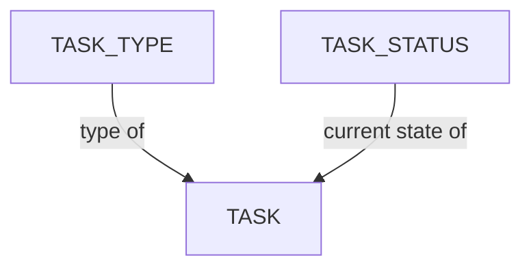

# Task Configuration

Kitsu's data model organizes work around a hierarchy of production entities (studio → production → episode/sequence/shot, or → asset) crossed with a task-tracking system (task type, task status, department).

## Table of Content

1. [Manage Task Types](/guides/task-configuration/managing-task-types/) - Define the pipeline stages (like Modeling, Rigging, or Compositing) that assets, shots, and other entities move through during production.
2. [Manage Task Statuses](/guides/task-configuration/managing-task-statuses/) - Configure the review and approval states (like To Do, Work in Progress, or Done) that track a task's progress through the workflow.
3. [Status Automation](/guides/task-configuration/status-automation/) - Define rules or conditions that automatically trigger changes in the status of tasks based on predefined criteria.

## Data Model

- **Task** - A unit of tracked work, always attached to either a shot or an asset, with an assigned task type and current status.
- **Task Type** - Defines the kind of work a task represents (e.g. Layout, Animation, Lighting); belongs to a department.
- **Task Status** - The current state of a task (e.g. Todo, Work in Progress, Done, Retake, Waiting For Approval).
