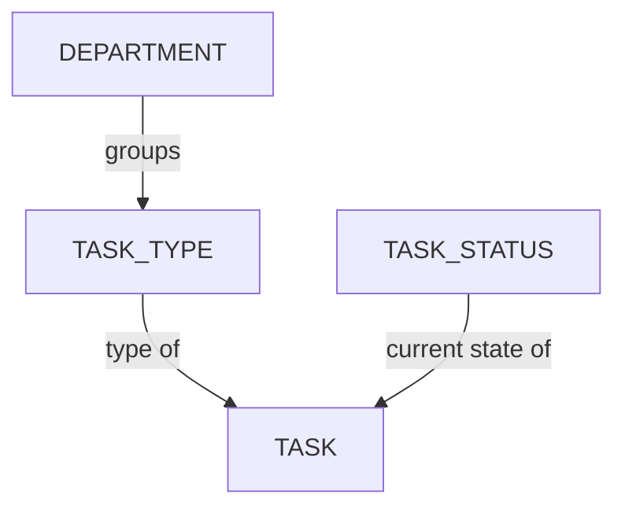

# Managing Task Statuses

<!-- #region body -->

A status represents a specific stage or condition that a task must pass through as part of the review and approval process.

<!-- #region setup -->

In the main menu, select the **Task Status** page under the **Admin** section:

::: tip
By default, Kitsu already provides some examples Statuses.
:::

You'll reach the `Task Status` page:

## Create a Task Status

Let's create the statuses we intend to use during our **Approval Workflow**.

For example: 

| Status | Icon | Description |
|---|---|---|
| **Ready** |  | Indicates that the artists have everything they need to start working and should not begin their tasks without reaching this status. |
| **WIP** |  | Used by artists to inform their team that they are actively working on the task, indicating that there is no need to assign it to someone else. |
| **WFA** |  | Used by artists to notify their supervisors that they have completed their work and are awaiting review. Supervisors can also use a similar status to inform directors that work is ready for review. |
| **Done** |  | Indicates that all work has been completed & approved. This indicates that the current task is complete and the next step in the process can commence. |
| **Retake** |  | Indicates that a comment has been made, prompting the artists to continue working on their task and publish a new version until validation is achieved. |

These statuses are **just examples** of what is achievable in Kitsu! You are free to create your own as needed.

To do this, from the main page, click on the `Add a task status` button in the top right corner.

You'll then need to define some details about you **Task Status**, including:

- **NAME** is the explicit name of the status that will be displayed when you hover your mouse over it in the
- **SHORT NAME** is what will be displayed in Kitsu dashboards
- Choose a background **color** you prefer for this status

You can also select multiple flags:

| Flag | Meaning |
|---|---|
| **IS DEFAULT** | The first status Kitsu displays by default on all tasks. Only **ONE** status can be set as default. |
| **IS DONE** | Marks the status as validating a task: useful for quota management, organizing the to-do list, and updating episode statistics. |
| **HAS RETAKE VALUE** | Marks the status as one used for commenting on a task: helpful for tracking back-and-forth discussion on the task type page and the episode stats page. |
| **IS ARTIST ALLOWED** | Controls whether artists can set tasks to this status. If **No**, artists won't see it in their available statuses list, though they can still comment on it. |
| **IS CLIENT ALLOWED** | Controls whether clients can use this status. If **No**, clients won't see it in their available statuses list. |
| **IS FEEDBACK REQUEST** | Marks the status as used to request a review: helpful for quota tracking without a timesheet, appears in the Pending tab of the to-do list, and groups these statuses on the **My Check** page. Kitsu will prompt for a **preview publish** each time this status is used. |

Click on **Confirm** to save your changes.

Your **Status** is now created in your **Global Library** and will be available to use in your production.

::: tip
At any point during the production, you can return here and create more **Task Status** if needed,
and then add them to your production.
:::

::: warning
You'll notice a few tasks statuses listed under the category of *Concept Status*. These are used by the system and while you can modify them here, you cannot create new ones.
:::

<!-- #endregion setup -->

## Adding Task Statuses to a Production

On the **Navigation Menu**, choose on the dropdown menu the **Setting**.

Per default, Kitsu will load the **Task Status** you have defined when creating the production.

However, you can add or remove specific statuses during production if they are created on the Global Library first.

On the **Task Status** tab, you can choose which **status** you want to add or remove on this production,
validate your choice with the **add** button.

## Update a Task Status

Go to `Main Menu > Task Status`:

Select the Entities or Concepts tab and hover over the task status row you wish to change then click the `Edit` icon:

## Remove a Task Status

To remove a task status from your studio's Global Library, go to `Main Menu > Task Status` and hover over the task status row you wish to select then click the `Delete` icon:

To remove an task status from your production library, go to `Production Menu > Settings > Task Status` and click the `Remove` button to remove the task status from the list:  

<!-- #endregion body -->
