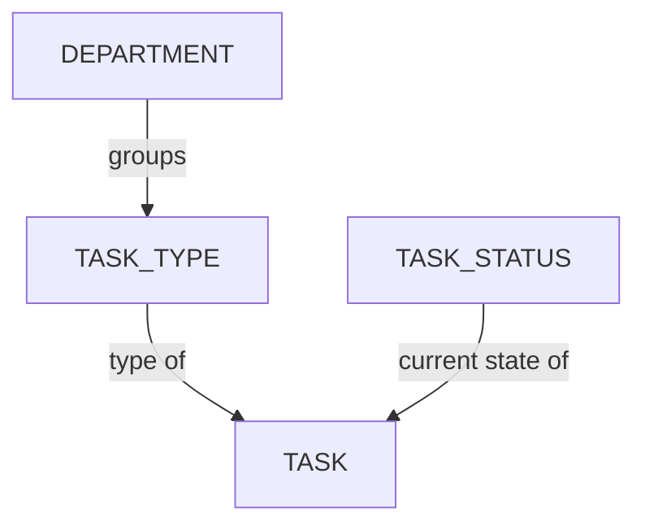

# Managing Task Types

<iframe width="560" height="315" src="https://www.youtube.com/embed/mfAoiMIcqlM?si=LDANaDtNjV3wYmdH" title="YouTube video player" frameborder="0" allow="accelerometer; autoplay; clipboard-write; encrypted-media; gyroscope; picture-in-picture; web-share" referrerpolicy="strict-origin-when-cross-origin" allowfullscreen></iframe>

<!-- #region body -->

Task types can be associated with multiple entities such as assets, shots, sequences, episodes, or edits.

## Creating a New Task Type

<!-- #region setup -->

First, let's create all the **Task Types** needed to manage and track our production.

From the main menu, select the **Task Types** page under the **Admin** section:

::: tip
By default, Kitsu provides some example task types that can be used for a CGI production. You can rename or remove any that are not relevant to your production.
:::

You will notice that these **Task Types** are already linked to a department.

You can click on the `Add Task Type` button in the top right corner to create new **Task Type**.

Next, you will need to supply some information about your task type, including:

- The name of the task type. You need a different one for each task type, even if the entities are different.
- The short name appears in dashboards as a concise version of the name
- If team members need to time log their work for tasks with this task type
- For which entity it will be used
- To which department it should be linked
- The color (this will be reflect in the background color on the main spreadsheet page)

You'll notice that the **Departments** are available as an option to link task types to. Connecting a department to a specific task type helps your team stay organized.

::: info
[About creating departments](/guides/team-management/managing-departments)
:::

Click on **Confirm** to save your changes.

::: warning
Newly created task types will appear at the bottom of the list
:::

To adjust the order, simply click on the **Task Type** and drag it to its appropriate position in the list.

Congratulations, your task type has now be created in your **Global Library**!

::: warning
Once you have created your production, you need to add the **Sequence**, **Episode**, and **Edit** task types to your **Production Library**.
:::

::: tip
At any point during production, you can revisit this section to create additional **Task Types** as necessary and add them into your workflow.
:::

<!-- #endregion setup -->

## Adding Task Types in a Production

On the **Navigation Menu**, choose on the dropdown menu the **Setting**.

By default, Kitsu will add the **Task Types** you have chosen when creating the production.

However, you can add or remove specific **Task Types** if they are created on the Global Library first.

For example, you can import the task workflow from another production in your library.

On the **Task Types** tab, you can choose which production or task type you want to import  or remove on this production,
validate your choice with the **Import** button.

::: tip
If you add a new task type **AFTER** creating an asset or shot:

You need to **add this task type** on the global entity page (shot, asset, sequence, etc.):

A pop-up appears, and you must select the new task type in the dropdown menu:

Confirm to see the task type added to your dashboard:

:::

## Update a Task Type

Go to `Main Menu > Task Types`:

Click the tab for the entity type you need (asset, shot, sequence, episode, or edit) and hover over the task type row you wish to select then click the `Edit` icon:

## Archive a Task Type

If you want to hide a task type but don't want to remove it from the instance, you can edit a task type to archive it.

## Remove a Task Type

To remove a task type from your studio's Global Library, go to `Main Menu > Task Types` and hover over the task type row you wish to select then click the `Delete` icon:

To remove an task type from your production library, go to `Production Menu > Settings > Task Types` and click the `Remove` button to remove the task type from the list:  

Alternatively, you can also remove a task type from the global Asset or Shot page. Click the chevron next to the Task Type name and select `Delete all`.

::: danger Attention
Removing a task type from the global Asset or Shot page will remove all corresponding tasks, assignments, previews, and comments. This is not reversible, unless you have a backup solution in place.
::: 

<!-- #endregion body -->
