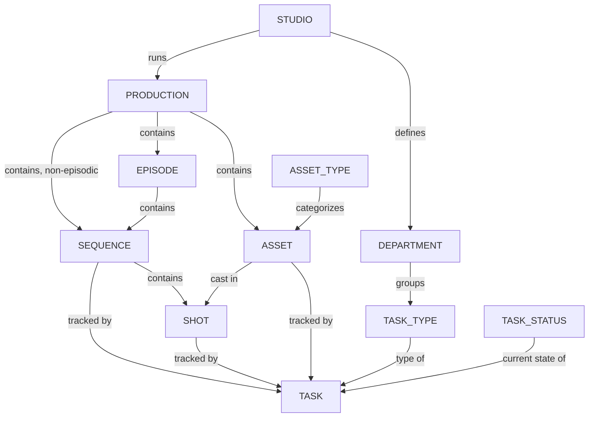

# Task Management

Kitsu's data model organizes work around a hierarchy of production entities (studio → production → episode/sequence/shot, or → asset) crossed with a task-tracking system (task type, task status, department).

## Table of Content

- [Manage Studio Labels](/guides/task-management/manage-studios/) - 
- [Manage Productions](/guides/task-management/manage-productions/) - 
- [Manage Episodes](/guides/task-management/manage-episodes/) - 
- [Manage Sequences](/guides/task-management/manage-sequences/) - 
- [Manage Shots](/guides/task-management/manage-shots/) - 
- [Manage Asset Types](/guides/task-management/managing-asset-types/) - 
- [Manage Task Types](/guides/task-management/managing-task-types/) - 
- [Manage Task Statuses](/guides/task-management/managing-task-statuses/) - 
- [Manage Edits](/guides/task-management/manage-edits/) - 

## Data Model

- **Studio** - The top-level organization. A studio runs one or more productions and defines its own departments.
- **Department** - A functional group within a studio (e.g. Modeling, Animation, Lighting, Compositing). Departments group related task types.
- **Production** - A project (film, series, game, etc.) managed by the studio. Productions contain episodes (if episodic), sequences, shots, and assets.
- **Episode** - A subdivision of a production, used for series-style projects. Optional for feature-style productions.
- **Sequence** - A subdivision of an episode (or directly of a production for non-episodic work), grouping related shots.
- **Shot** - A unit of filmed/animated action within a sequence; the main container for shot-based tasks.
- **Asset** - A reusable production element (character, prop, set, FX setup) that can be cast into one or more shots.
- **Asset Type** - A category for assets (e.g. Character, Prop, Environment, FX).
- **Task** - A unit of tracked work, always attached to either a shot or an asset, with an assigned task type and current status.
- **Task Type** - Defines the kind of work a task represents (e.g. Layout, Animation, Lighting); belongs to a department.
- **Task Status** - The current state of a task (e.g. Todo, Work in Progress, Done, Retake, Waiting For Approval).