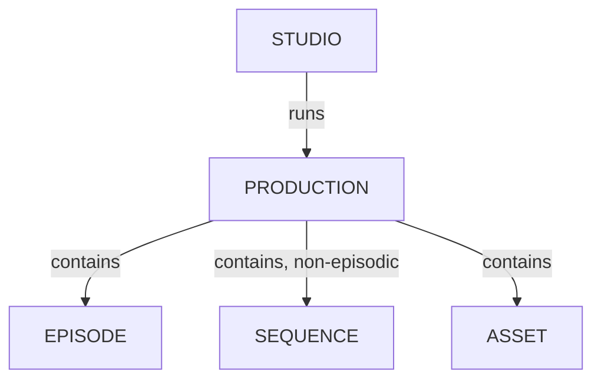

# Managing Productions

## Create a New Production

Click on the `Create a new production` button:

A dialog appears:

Enter your production name, choose a **Production Type**, and select your production style (2D, 3D).

Then, you must fill in technical information, such as the number of FPS, the Ration, and the Resolution.

All these data will be used when Kitsu re-encodes the video previews uploaded.

Then, you need to define your production's start and end dates.

You can define your production workflow in the next part, 3 to 6.

You need to select your asset task type (3), shot task type (4), task status (5), and asset types (6).

::: tip
To create your **Production Workflow**, you will select Task Types from the Global Library.

If you realize you missed some Task Types, you can create them later.

See the [Studio Workflow](../../../configure-kitsu/index.html#studio-workflows) section.
:::

Then, 7 and 8 are the option parts. If you already have a spreadsheet with your asset/shot.

See the **Import from CSV** sections of each entity page for more details:

- [Import Asset from CSV](/guides/pre-production/manage-assets/)
- [Import Shot from CSV](/guides/task-management/manage-shots/)

Validate everything with the `All done` button.

 

### Using Production Templates

Getting a new production set up often means repeating the same configuration steps over and over like choosing task types for shots and assets, defining task statuses, and adjusting project-wide settings to match your team's workflow.

With Project Templates, you can start from a predefined setup in one click:

When creating a new production, simply pick a template and Kitsu will automatically apply your preferred settings.

In the example above, the template comes bundled with pre-configured asset types, task types, task statuses, etc. we don't need to pick manually from the Global Library:

Check out the section [Create Your Own Production Template](#create-your-own-production-template) below to add your own.

## Configure Production-Specific Settings

From the **Navigation Menu**, choose on the dropdown menu the **Setting**. 

The first tab, **Parameters** allows you to change the **Technical information** of the production.

::: warning
If you change the **FPS** or **Resolution** after uploading previews, the changes won't be applied; you must reupload the first previews.
:::

Here, you can enable specific options for the production like:

- Isolate Client Comments (Not Visible To Each Other)
- Allow Artists To Download Previews
- Set New Preview As Entity Thumbnail Automatically

You can also specify the **Maximum Number of Retakes** for this production.

::: tip
You can also change the avatar of the production on the **Parameters** tab.
:::

### Artist Board Status Configuration

In the **Task Status** tab, you can reorder the statuses for the **Board** view.

Once it's done, go to the **Board Status** tab.

Here, you can choose who can see which status on the **Board view**

If you don't select the status properly, it can be overwhelming for the artists if they have too much choice.

Selecting the **Status** properly will make it easier for the artists.

## Close a Production (Archive)

It's good practice to archive a production once it's over, in case you need to reuse assets or other production elements in the next one.

First, click on the Edit button for the target production in the `Main Menu > Studio > Productions` page:

In the dialog, select `Closed` for the production status and click `Confirm`:

Your production is now listed as `Closed`.

## Delete a Production

Deleting a production requires you close it first.

Once this is done, simply click the `Delete` button in the corresponding closed production list item and your production will be removed from your instance:

## Create Your Own Production Template

Go to `Main Menu > Admin > Templates` to manage your production templates.

To create a new one, click the `Add a production template` button and fill in the form:

- Name: your template name
- Type: `Short`, `TV Show`, `Feature Film`, `Only Assets`, or `Only Shots`
- Style: `2D Animation`, `2D Animation (Paper)`, `3D Animation`, `2D/3D Animation`, `VFX`, `Commercial`, `Virtual Reality`, `Motion Design`, `Archviz`, `Stop Motion`, `Catalog`, `NFT collection`, `Video Game`, `Immersive Experience`, or `Augmented Reality`
- Description: a short description of your template

Click `Confirm` to save your template for future usage.