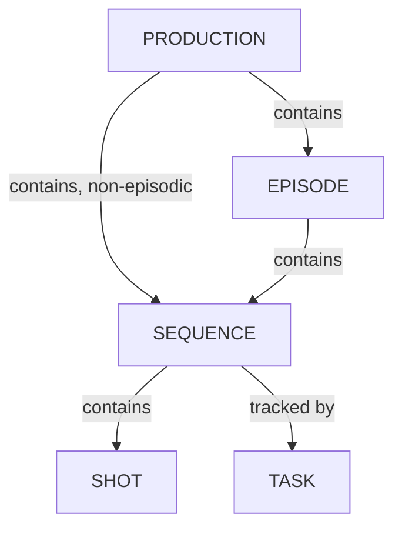

# Managing Sequences

In Kitsu, you can also track tasks at the **Sequence** Level.

It's especially useful when you have macro tasks to track, like Story and color Board, Color Grading, etc.

Use the navigation menu to go to the **Sequences** page:

::: warning
This new page behaves like the asset and shot global page.

To use this page, You first need to create dedicated task types on your **Global Library**
 with the **Sequence** attribute.

See the [Creating a New Task Type](/guides/task-management/managing-task-types/#creating-a-new-task-type) section to create a new Task Type.

Once you have created your **Task Types**  on your **Global Library**, add them to your
**Production Library** (setting page).
:::

## Create a Sequence

Once you have your task types ready in the settings page, you can create a sequence.

This new page behaves like the asset and shot global page. You can add your edits with the **+ New Sequence** button.

You can assign tasks, do the review, change status, etc.

You can add a metadata column, fill in the description, etc.

::: tip
You can create a sequence directly from here (+New sequence button) or create a sequence linked to your shots from the global shot page.
:::

You can **Rename** and **Delete** the Sequence entity on this page, as for the asset and shot entity.

If you click on the name of a sequence, you will see the detail page of this sequence.

On the detailed page, you have access to the sequence casting to see all the assets used in the whole sequence.

You can also access the schedule, Preview Files, Activity, and Timelog of the sequence **tasks**.

## Update a Sequence

Hover over the sequence row you wish to edit in the list and click the `Edit` icon:  

## Delete a Sequence

Hover over the sequence row you wish to remove in the list and click the `Delete` icon:  

