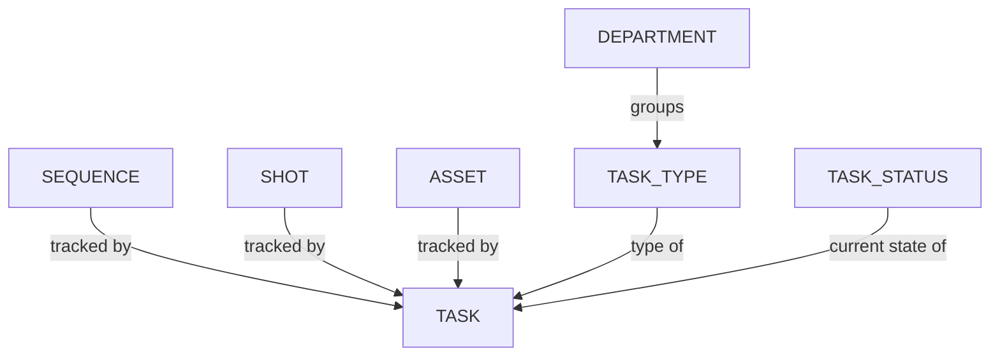

# Managing Task Statuses

A status represents a specific stage or condition that a task must pass through as part of the review and approval process.

In the main menu, select the **Task Status** page under the **Admin** section:

::: tip
By default, Kitsu already provides some examples Statuses.
:::

You'll reach the `Task Status` page:

## Create a Task Status

<!-- #region setup -->

Let's create the statuses we intend to use during our **Approval Workflow**.

For example: 

| Status | Icon | Description |
|---|---|---|
| **Ready** |  | Indicates that the artists have everything they need to start working and should not begin their tasks without reaching this status. |
| **WIP** |  | Used by artists to inform their team that they are actively working on the task, indicating that there is no need to assign it to someone else. |
| **WFA** |  | Used by artists to notify their supervisors that they have completed their work and are awaiting review. Supervisors can also use a similar status to inform directors that work is ready for review. |
| **Done** |  | Indicates that all work has been completed & approved. This indicates that the current task is complete and the next step in the process can commence. |
| **Retake** |  | Indicates that a comment has been made, prompting the artists to continue working on their task and publish a new version until validation is achieved. |

These statuses are **just examples** of what is achievable in Kitsu! You are free to create your own as needed.

To do this, from the main page, click on the `Add a task status` button:

You'll then need to define some details about you **Task Status**, including:

- **NAME**, the explicit name of the status that will be displayed when you hover your mouse over it in the.
- **SHORT NAME**, what will be displayed in Kitsu.
- **IS DEFAULT**, the first status that Kitsu will display by default on all tasks. You can only have **ONE** default status in Kitsu.
- **IS DONE**, if this status is utilized to validate a task (which is beneficial for quota management, organizing the to-do list, and updating episode statistics).
- **HAS RETAKE VALUE**, if this status is used for commenting on a task (helpful for tracking the back-and-forth discussions on the task type page and for the episode stats page).
- **IS ARTIST ALLOWED**, are artists allowed to set tasks to this status? If **No**, the artist won't see this status in their list of available statuses. However, they can still post comments on it.
- **IS CLIENT ALLOWED**, Can the client use this Status? If **No**, the client won't see this status in their list of available statuses.
- **IS FEEDBACK REQUEST**, if this status is used to request a review (helpful for quota tracking if you don't use a timesheet, it will appear in the Pending tab of the to-do list, and all these statuses will be grouped on the **My Check** page. Kitsu will prompt you to **publish a preview** each time you use this status).
- Finally, choose a background **color** you prefer for this status.

Click on **Confirm** to save your changes.

Your **Status** is now created in your **Global Library** and will be available to use in your production.

::: tip
At any point during the production, you can return here and create more **Task Status** if needed,
and then add them to your production.
:::

::: warning
You'll notice a few tasks statuses listed under the category of *Concept Status*. These are used by the system and while you can modify them here, you cannot create new ones.
:::

<!-- #endregion setup -->

## Adding Task Statuses to a Production

On the **Navigation Menu**, choose on the dropdown menu the **Setting**.

Per default, Kitsu will load the **Task Status** you have defined when creating the production.

However, you can add or remove specific statuses during production if they are created on the Global Library first.

On the **Task Status** tab, you can choose which **status** you want to add or remove on this production,
validate your choice with the **add** button.

## Update a Task Status

Go to `Main Menu > Task Status`:

Select the Entities or Concepts tab and hover over the task status row you wish to change then click the `Edit` icon:

## Remove a Task Status

To remove a task status from your studio's Global Library, go to `Main Menu > Task Status` and hover over the task status row you wish to select then click the `Delete` icon:

To remove an task status from your production library, go to `Production Menu > Settings > Task Status` and click the `Remove` button to remove the task status from the list:  

## Status Automation

### Create a New Status Automation

<!-- #region statusautomationsetup -->

A **Status Automation** defines rules or conditions that automatically trigger changes in the status of tasks based on predefined criteria. You can set up **Status Automation** for both asset and shot tasks.

For assets, you can establish **Status Automations** between tasks. For example, when the concept task status is set to `done`, the downstream modelling task status is automatically changed to `ready`.

Additionally, you can create **Status Automations** that update the **Asset Status** based on task statuses. For example, when the concept task is set to `done` , then the linked asset status is set to ``layout``.

::: tip
You can also ask Kitsu to **copy the latest preview** with the Automation.
:::

Go to the main menu and select **Automations**:

From this page, you can create **Status Automations** by clicking the `+ Add status automation` button:

You have the option to create **Status Automation** for either the **asset** or the **shot**.

Next, you can select the **task type** and the **status** that will trigger the Automation.

You can specify which **Task Type** will respond to the Automation and select the **Status** that will be changed.

You need to change the trigger from "Status" to **Ready For** in order to initiate the change in **Ready For** status.

You will notice the **Applied Task Type** will now display **Shot task type**.

To create a **Status Automation** for shots, you must change the **Entity Type** to shots.

Your new **Status Automation** is now created in your **Global Library**.

::: warning
You must add status automations to your **Production Library** once you have created your production.
:::

::: tip
At any point during the production, you can return here and create more **Status Automations** if needed, and then add them to your production.
:::

<!-- #endregion statusautomationsetup -->

### Add a Status Automation to a Production

On the **Navigation Menu**, choose on the dropdown menu the **Setting**.

Per default, Kitsu will load no **status automation** of your
status automation **Global Library** into your **Production Library**.

But you can use only specific **Status Automation**, depending on your production type.

On the **Status Automation** tab, you can choose which automation you want to use on this production,
validate your choice with the **add** button.

