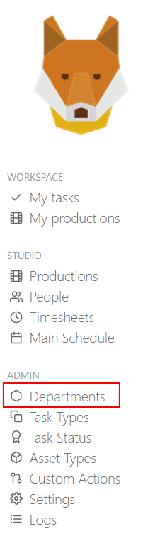
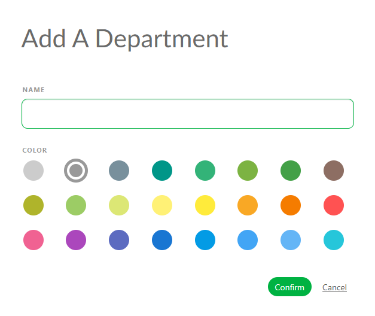
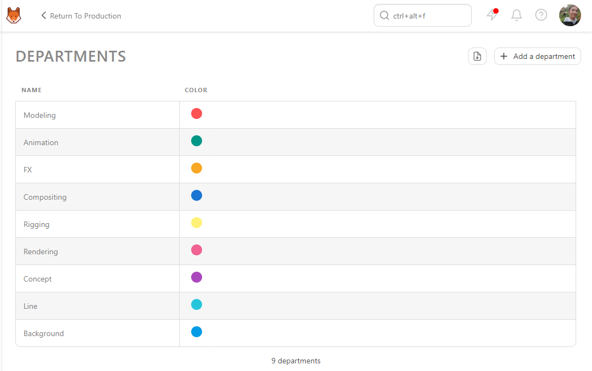

# Managing Departments

### Creating Departments

Departments are designed to help supervisors and artists focus on their tasks. Once a user is linked to one or more departments, supervisors and artists gain direct access to a filtered view of all tasks associated with that task type. Departments are also used to define what metadata columns appear for users within that department.

If a metadata column is linked to a department, then they will only show up for users in that department. If a metadata column is not associated with a department, they will show up for everyone.

::: tip
By default, Kitsu provides some example departments to help you get started.
:::

Defining your studio's Departments is typically the first step in setup, as multiple objects such as people and task types are linked to a department.

On the main menu  select the
**Department** page under the **Admin** section.

If you need to create more departments, you can click on the  button.

When adding a department, you need to define:

- The name of the department
- A color (it will be displayed as a small round circle next to a column task type or a custom column)

Click on **Confirm** to save your changes.

Once you finish creating the department, your page should look like this. Whereby each department has a unique name and corresponding color.

