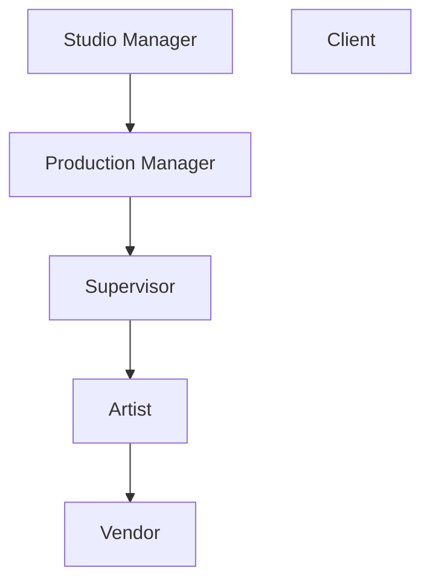

# User Permission Roles

<!-- #region body -->

::: warning Definition
A permission role defines a set of access rights and privileges granted to a user within a system or application, dictating what actions they can perform and what resources they can access.
:::

Roles are very important, so it's useful to understand what each of them does and which ones might be relevant to specific team members. 

Here's the org hierarchy as a simple chart:

And a summary of the permissions per role:

| Role | Access Scope | Can Do | Cannot Do |
|---|---|---|---|
| **Artist** | Only productions/tasks they're assigned to | <ul><li>Create personal filters (global & task type pages)</li><li>Edit own comments</li><li>Check checklists on assigned tasks</li><li>Create on-the-fly playlists (not savable)</li></ul> | <ul><li>See client comments</li><li>Access unassigned projects</li></ul> |
| **Vendor** | Only specifically assigned tasks (narrower than Artist) | <ul><li>Similar to Artist, but everything not assigned is hidden</li></ul> | <ul><li>See/edit anything not explicitly assigned</li></ul> |
| **Supervisor** | Their own department(s): assets, shots, tasks, assignments, stats, breakdown, playlists (inherits Artist permissions) | <ul><li>Assign tasks to their team artists</li><li>Comment on all tasks in their department(s)</li><li>Check/pin checklists & comments in their dept</li><li>Edit own comments</li><li>Add/edit studio or client playlists</li><li>See client comments & validations</li><li>See comments from other departments</li></ul> | <ul><li>Access studio team, main timesheets, production list</li><li>Define task types/statuses/asset types</li><li>Comment on or assign artists in other departments</li></ul> |
| **Production Manager** | Productions they're assigned to: assets, shots, tasks, assignments, stats, breakdowns, playlists (inherits Supervisor permissions) | <ul><li>Create assets/shots (manually or CSV import)</li><li>Comment on any task in the production</li><li>Edit/pin/check any comment or checklist in the production</li><li>Add task columns</li><li>Delete/add tasks</li><li>Add/edit studio or client playlists</li><li>See client comments & validations</li></ul> | <ul><li>Access studio page, main timesheets, production list</li><li>Define task types/statuses/asset types</li></ul> |
| **Studio Manager** | All productions and settings (admin-level, inherits Supervisor permissions) | <ul><li>Create/edit/delete productions</li><li>Full studio access (timesheets, people, schedule)</li><li>Set permission roles</li><li>Customize task types/statuses/asset types & studio branding</li><li>Add/delete task columns</li><li>Create custom metadata columns</li></ul> | — |
| **Client** | Only their own production | <ul><li>Access global asset/shot pages</li><li>Access stats pages</li><li>Access client playlists with limited status visibility when commenting</li></ul> | <ul><li>See task assignments</li><li>See comments they didn't write</li><li>See Client retake/validation status (Supervisors & Studio Manager only)</li></ul> |

## Artist

Artists can only access the productions they are part of. They can comment on tasks, upload media, and change statuses only on tasks that have been assigned to them. Their access is limited to a predefined set of statuses as determined by the Studio Manager.

**They can:**
* Create personal filters on the global page and Task Type page.
* Edit their own comments.
* Check the checklist on their assigned tasks.
* Create playlists-on-the-fly for shots or assets, but won't be able to save these playlists.

**They cannot:**
* See client comments.
* Access anything inside of projects that they haven't been assigned to.

When an artist logs in to Kitsu, the first page they will see is their **My Tasks** page.

## Supervisor

Department supervisors inherit Artist permissions.

Department supervisors have read and write access to their department(s) they work on:
assets, shots, tasks, assignments, statistics, breakdown, and playlists.

**They can:**
* Assign tasks to their team artists (same department).
* Post comments on all tasks or their department(s).
* Check a checklist in their own department.
* Pin a comment.
* Edit their own comments.
* Add/edit a playlist for the studio or the client.
* See client comments and validations.
* See comments from other departments.
* View the timesheets of their team department(s).

**They cannot:**
* Access the studio team, the main timesheets, and the production list
* Define task types, task statuses, and asset types.
* Comment on other departments than theirs; they can't assign artists from other departments.

## Production Manager

Production managers inherit Department supervisor permissions.

Production managers have read and write access to the productions they are assigned to, including
assets, shots, tasks, assignments, statistics, breakdowns, and playlists.

**They can:**

* Create assets and shots, either manually or through a CSV batch import.
* Post comments on any tasks within the production.
* Edit any comment within the production.
* Check any checklist within the production.
* Pin any comment within the production.
* Add a task column.
* Delete or add a task.
* Add/edit a playlist for the studio or the client.
* See client comments and validations.

**They cannot:**

* Access the studio page, the main timesheets, and the production list.
* Define task types, task statuses, and asset types.

## Studio Manager

A Studio Manager acts in the same way as an Administrator, having read and write access to all productions and settings within Kitsu. Some of their privileges include:

### Create and edit a production

The Studio Manager can create a new production, define its type, FPS, ratio, and resolution, and add a cover picture. They can also edit and delete any production.

### Manage the studio

The Studio Manager has access to everything in the studio, including:

* Read / write access across all the productions
* Access to the global timesheets page
* The ability to view all people in the studio
* Access to the main schedule

In the People page, The Studio Manager **defines the permission role of each user**.

They can also:

* Customize global aspects of Kitsu: for example adding and modifying task types, task statuses, and asset types.
* Set permission roles
* Customize high-level studio information, such as customizing the studio name adding the company logo, and defining the number of hours per day of work etc.
* Choose to use the original filename for downloading media.

### Manage productions

They have full access to all productions on your Kitsu site. Additionally:

* They have the same permissions as the supervisor.
* They can add / delete a task column.
* They are allowed to create custom metadata columns.

## Vendor

Vendors have similar permissions to artists. 

The main difference is that while an artist can still see tasks in their production (though they can only edit tasks assigned to them), a vendor can only see and edit tasks that they are specifically assigned to. 

Everything else that is not assigned is hidden.

## Client

The client can only see the production of which they are part of.

**They can:**

* Access the global page of the assets/shots.
* Access the stats pages.
* Access Client playlists with limited access to task status when they post a comment

**Note**
* Only Supervisors and the Studio Manager can see the Client retake or validation status.

**They cannot:**

* See task assignments
* See comments that they didn't write

<!-- #endregion body -->