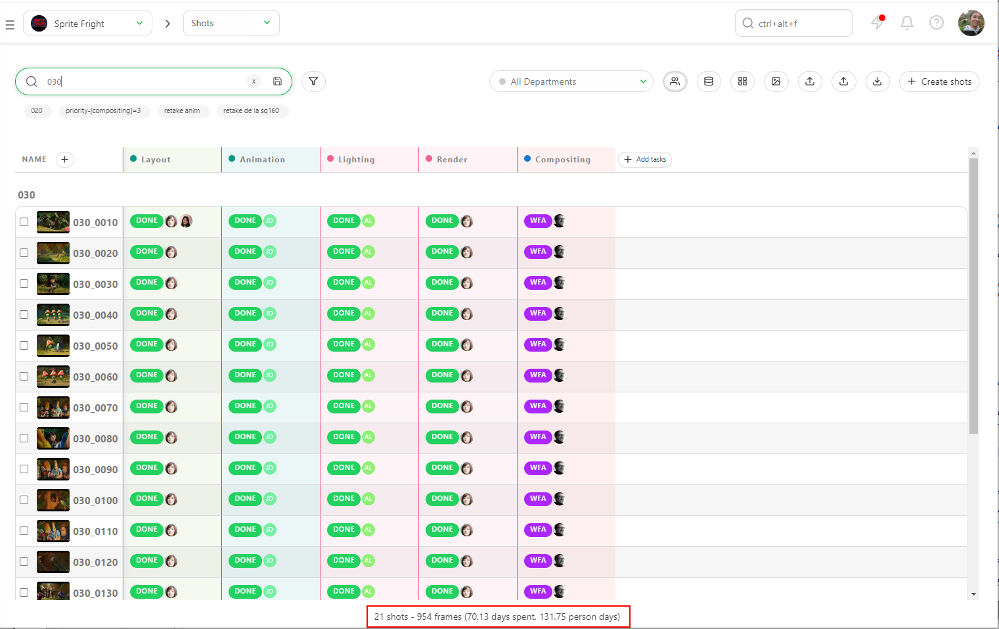
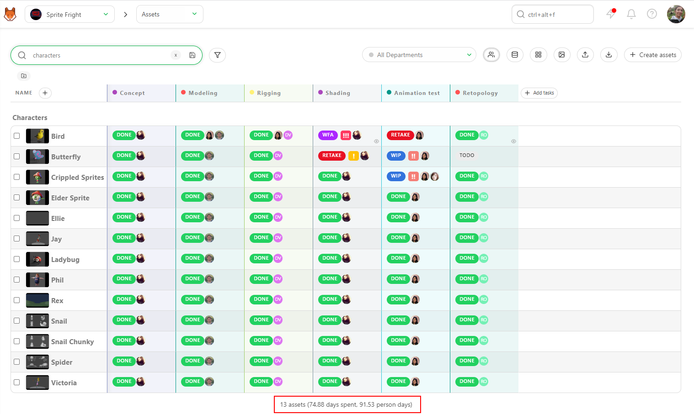
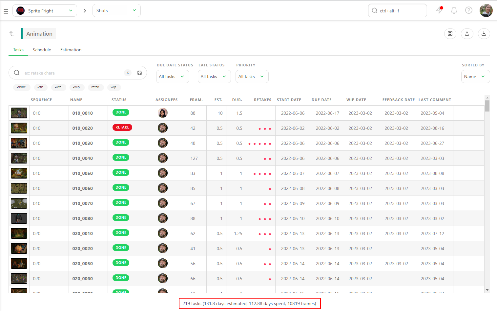
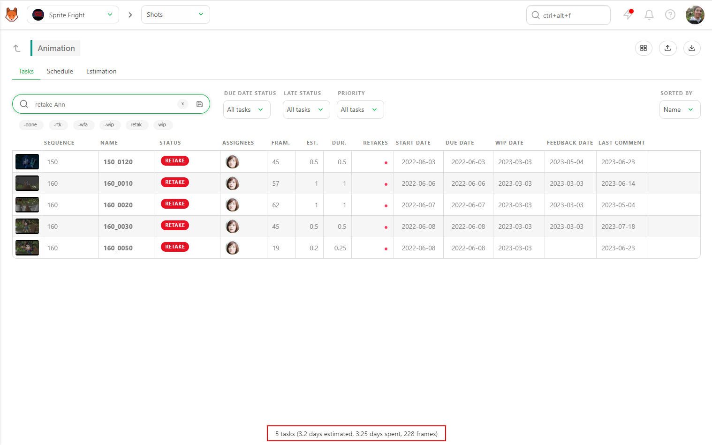
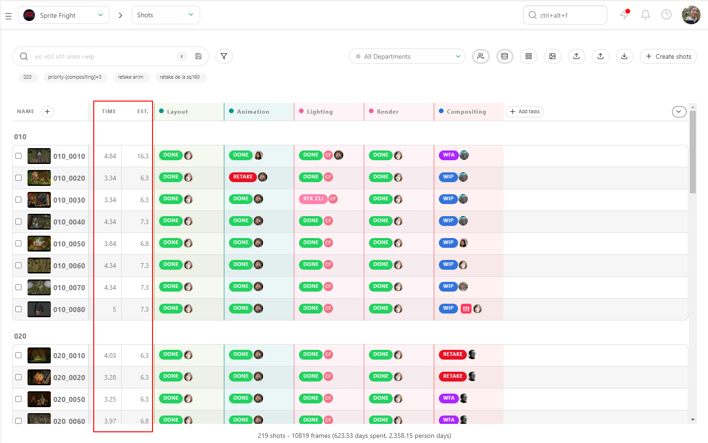
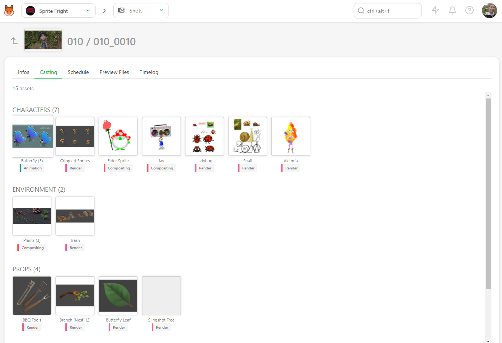

## Durations over Estimates

To focus on the big picture and have a global view of the **Bid**, you can compare the estimated **Person days** versus the reality **Days Spent** on various pages.

### Estimation Summary

On the shots' global page, you can see the sum-up of all the estimations versus duration. You can also apply filters for more specific insights. 

For example, to focus on a specific sequence, filter your global page by the sequence's name. The sum-up at the bottom will update accordingly.

This allows you to know the **Duration** versus **Estimation** for that particular **Sequence**.

Similarly, you can filter the global asset page. 

For example, you can filter by a specific **Asset Type** such as **Character**. The sum-up at the bottom will update to show the estimation versus duration for that asset type.

### Task Type Duration over Estimation

To delve into details, click on the name of a task type. The sum-up at the bottom of the screen will show **Duration** versus **Estimation** for this specific task type.

You can get a global view or focus on a **specific status** or **Artist's name**. As on the global page, the sum-up will update with each filter applied.

This way, you can closely monitor the performance and efficiency of specific tasks and artists, ensuring that estimations align with actual durations and making adjustments as necessary.

### Durations over Estimations for an Asset / Shot

To closely examine the details, you can display **Estimation** and **Time Spent** columns (duration) for each asset and shot in Kitsu.

On the global page for shots or assets, you can see the sum-up of each task's **Estimation** and **Duration**. This allows you to quickly identify discrepancies or issues.

### Detailed Analysis

If something appears wrong or needs further investigation, click on the asset or shot name to go to the detail page.

On the detail page, at the top left of the screen, you'll find a summary of the asset's or shot's lifecycle. This includes details of each task's **Status**, **Estimation**, **Duration**, **Start and Due Date**, and **Assignation**.

This comprehensive view helps you understand where the discrepancies lie and take corrective actions if necessary. By closely monitoring these details, you can ensure better alignment between estimations and actual durations, leading to more accurate future planning and resource allocation.