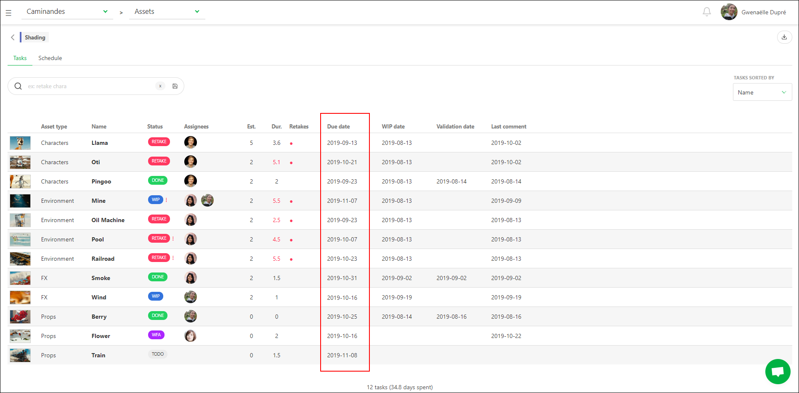
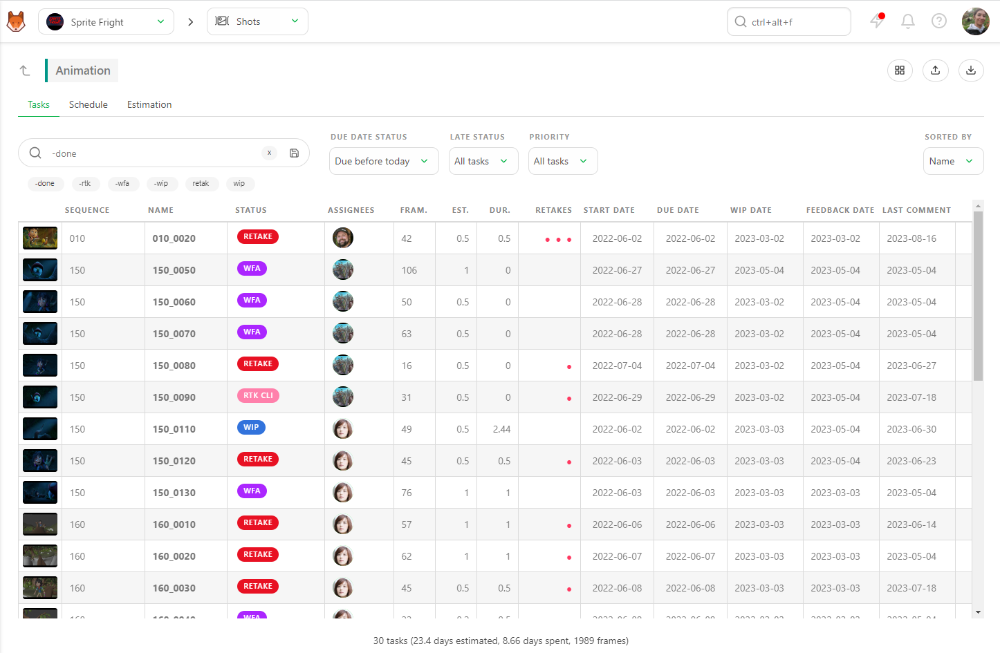
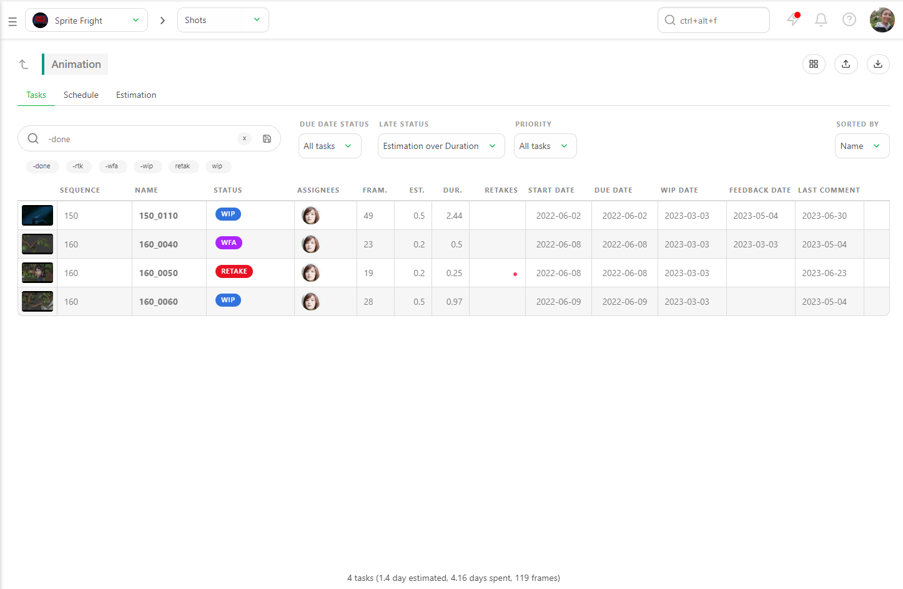
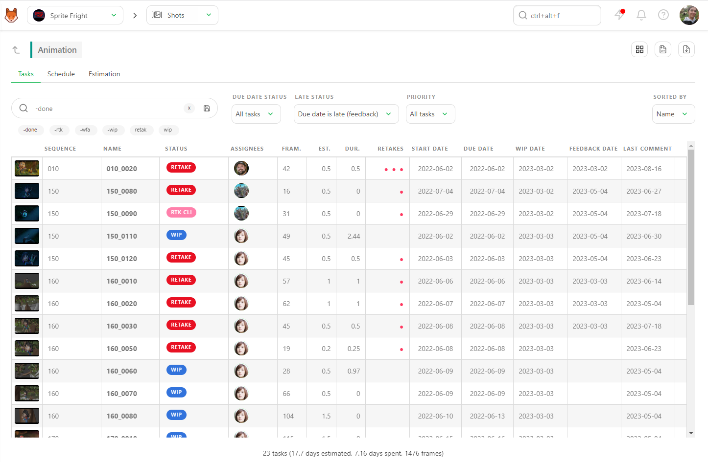
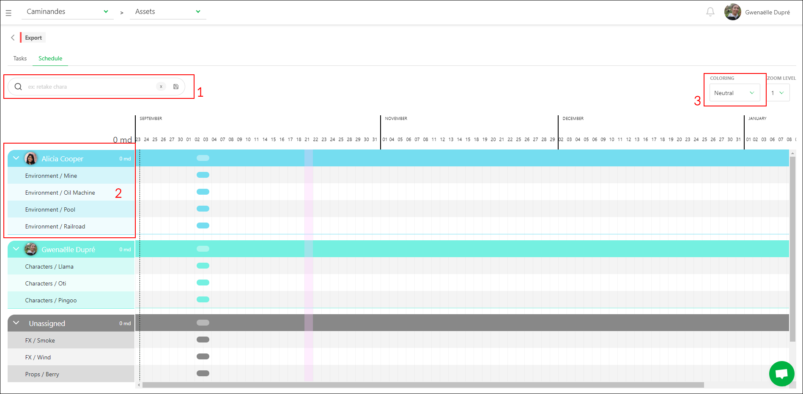
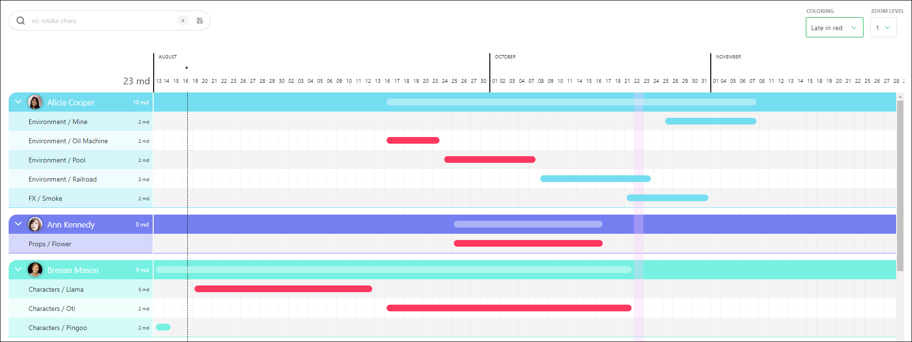

## Ensure Tasks are On Time

To know if a task is on time, you need two things:
- The **Task Type** of the task
- An **Estimation** (Bid) in days, along with an estimated **Start date** and **Due date** for the task.

Once this information is entered, you can **compare estimation to reality** on the Task Type page.

### Methods to Compare Estimations and Actuals

There are two main ways to do this:
1. **Filtering by Due Date Status**
2. **Using the Gantt Diagram**

::: tip
Kitsu automatically grabs the date and status of **WIP** (Work in Progress) and **WFA** (Waiting for Approval). You can compare your **estimated start date** versus **when the Artist really starts**, and compare the **estimated due date** to **when the Artist asks for approval**.
:::

### Filtering by Due Date Status

On the **Tasks** tab, the first filter you see is **Due Date Status**. Set it to **Due before today** to display all tasks with a **Due date** set **Due Before Today**.

Next, to determine what is finished and what still needs to be finished. Use the **-Done** filter to exclude completed tasks.

This will show you all the late tasks with the two filters applied, meaning they are only validated after the **Estimated Due Date**. The summary at the bottom of the page updates in real time based on the applied filters.

You can export this page as a `CSV` file and open it with spreadsheet software.

### Using the Late Status Filter

The **Late Status** filter built into the page helps you immediately see which tasks took more time than estimated (**Estimation over Duration**).

Filter the late tasks using the **Due date late** option. There are two ways to calculate if a task is late:
1. **Estimated due date** versus **Feedback**
2. **Estimated due date** versus **Done**

Depending on your studio's calculation method, Kitsu will provide the answer.

### Using the Gantt Diagram

On the **Task Type Page**, go to the **Schedule** tab. The **Start** and **End** dates of this task type, as set on the production schedule, are visible at the top of the screen.

The **Gantt Diagram** will be dark grey before and after these dates, providing a visual cue for task timing.

Change the **Coloring** from **Status color** to **Late in Red**. This will show tasks in **Grey** if they are on time and **Red** if they are late.

You can return to the **Tasks** tab for more details, and Kitsu will retain your filters from tab to tab.
