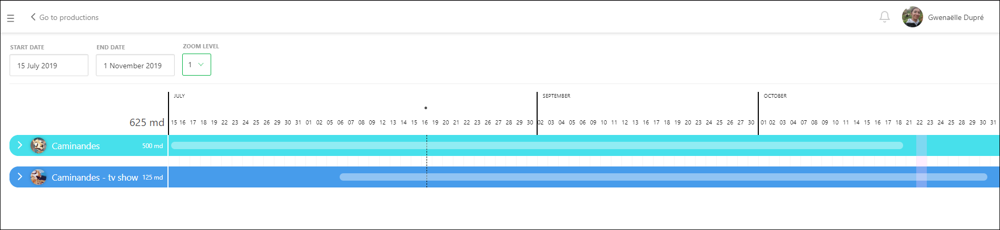
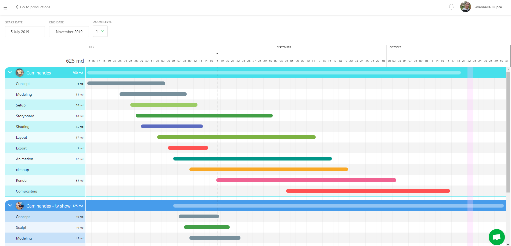

## Utilize the Main Schedule

With the **Main Schedule**, you can access all the **Production Schedules** at once.

If you unfold a production, you will see the details of each **Task Type** used in that production. By unfolding multiple productions, you can which teams are being utilized simultaneously.

You can move each **Task Type Bar** to adjust the schedule to fit the studio's needs.

::: warning
Each change you make will be applied to the Production Schedule.
:::