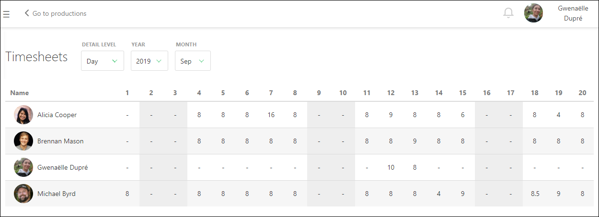
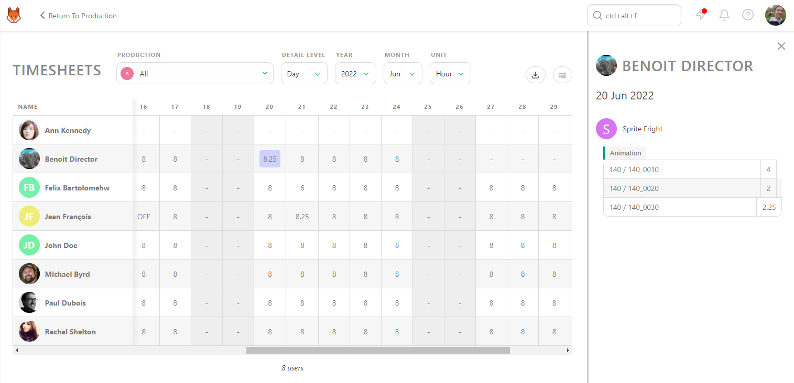
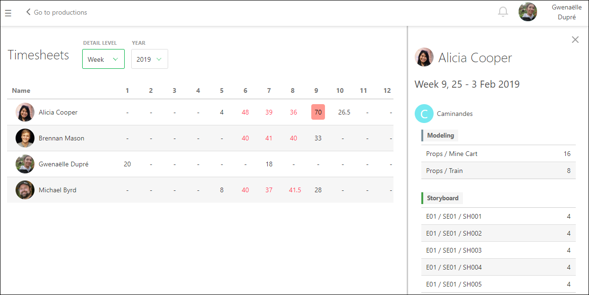
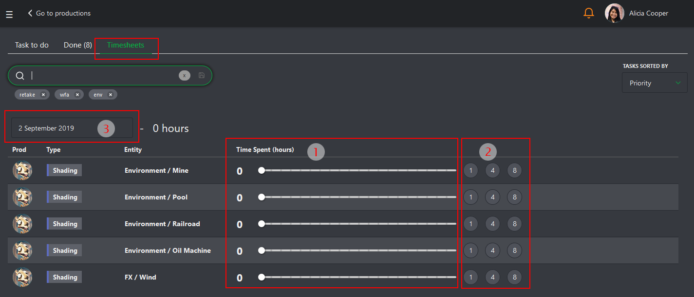
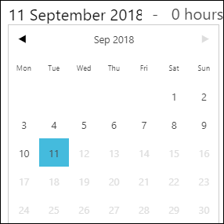
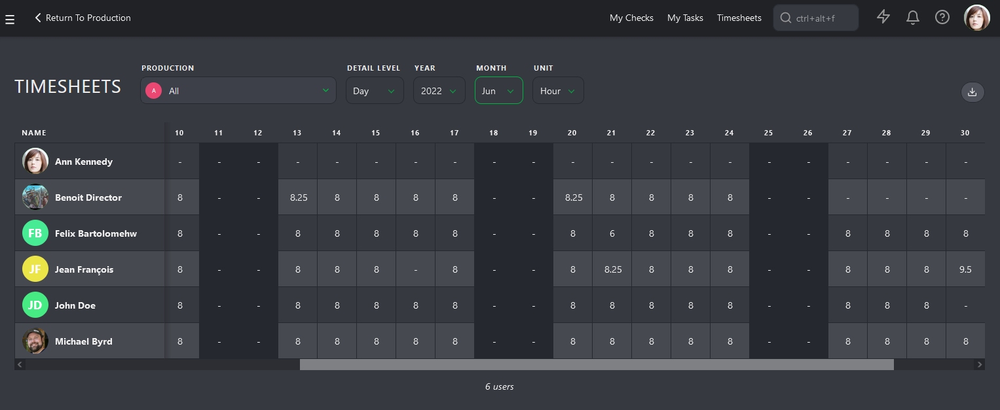
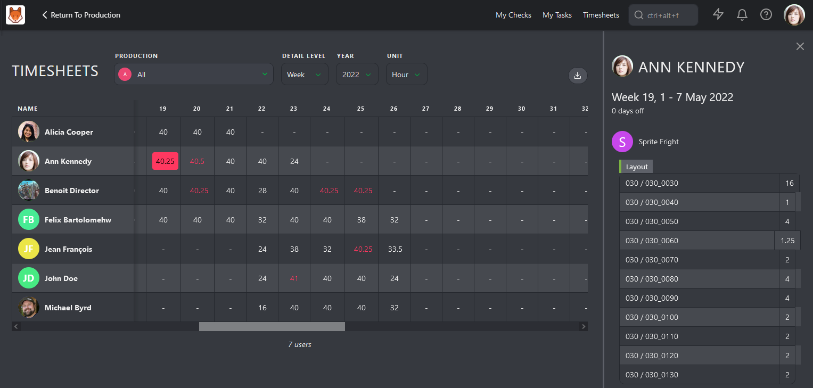

## Team Timesheets

::: warning
All of the previous chapters are based on the fact that **Estimation** and **Duration** are filled for each task.
:::

Everybody has to do their part. You and the supervisor will handle the estimation, while your team will fill out their timesheets.

Navigate to the main menu and select the Timesheet page.

### Viewing Timesheets

On this page, you can view each team member's timesheet by day. This allows you to check whether they fill it out daily, took a day off, or worked extra hours.

If you have a question about a timesheet entry, click on it to see the details of the production, task type, and specific task.

Once everything looks good at the day level, you can change the **Detail Level** from Day to Week, Month, or Year.

You can view all the productions you manage simultaneously or look at each production individually.

### Exporting Timesheets

As with all other pages in Kitsu, you can export the timesheet data as a CSV file and open it in spreadsheet software for further analysis.

## Complete Your Timesheet

If your production requires it, you can log your time spent using the **Timesheets** tab or the **Timesheets** shortcut button at the top of the screen.

### How to Log Time:
- Use the slider next to each task to record hours spent.
- For quick input, use the **1**, **4**, or **8 hours** buttons.

### Missed a Day?  
Click the date picker to backfill entries. You can also mark days as **Day Off** if you weren't working on that day.

## Department Timesheets

As a Supervisor, you may also be responsible for monitoring your team's hours. The Timesheet page shows how many hours they work daily, weekly, and monthly.

It's important to highlight abnormal patterns such as extra hours, sick days, or lack of vacation. The timesheet view can provide a high-level overview of where artists are spending their time, which can help you take care of your team to ensure they are not burning out.

