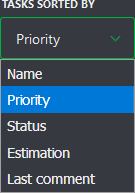
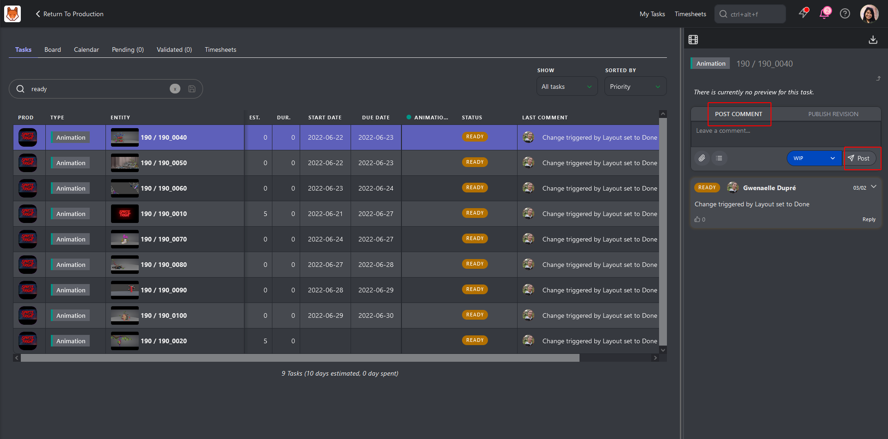
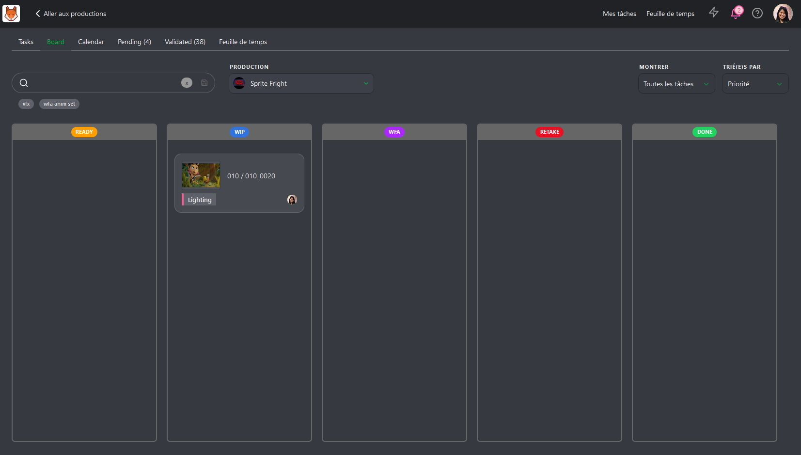

# アーティストとしてのはじめ方

このガイドでは、Kitsuの主要な機能を理解し、アーティストとしての利用を開始するための手順を説明します。

---

## 初期設定とプロフィールのカスタマイズ

最初にプロフィールを設定し、個人情報を更新してKitsuのインターフェイスをカスタマイズします。これにより、チームメンバーがあなたを認識しやすくなり、通知や設定をワークフローに合わせて調整できます。

1. **プロフィールにアクセス**:  
   画面右上のアバターをクリックし、**プロフィール**を選択します。

2. **体験をカスタマイズ**:  
   - 名前、メールアドレス、電話番号、タイムゾーン、言語を更新します。  
   - 他のメンバーが認識しやすいようにアバター写真をアップロードします。  
   - 通知の受信方法（メールまたはSlack）を選択します。  
   - **テーマ**カラーを選択し、**サポートチャット**の表示/非表示を切り替えます。

:::tip プロのヒント
このセクションでは、**ドキュメント**、**チュートリアル**、私たちの**Discordコミュニティ**、**YouTubeチャンネル**、および公開**ロードマップ**へのクイックリンクも提供されています。いつでも役立つリソースにアクセスできます。
:::

セキュリティを強化するため、デフォルトのパスワードを強力で一意のパスワードに変更することをお勧めします。

---

## 担当タスクの管理

**My Tasks**ページは、割り当てられたタスクを管理する主要なハブで、ログインすると自動的に表示されます。ここでは、割り当てられたタスクのリストと主要な情報を確認できます。

### 利用可能な主要情報:
- **Production**: タスクが関連付けられているプロジェクト。
- **Entity**: 割り当てられた特定のアセットやショット。
- **Estimates & Duration**: タスクの時間に関する情報。
- **Due Date**: タスクの締切。
- **Status**と**Priority**: タスクの緊急度を理解するための重要な詳細。

### 追加機能:
- **Show**ドロップダウンでは、**すべてのタスク**または**今週の期限**にフォーカスするタスクを選択できます。
- **Sorted By**ドロップダウンでは、タスクを**名前**、**優先度**、**ステータス**、**見積もり**、または**最終コメント**で並べ替えることができます。
- これらのフィルターを使用してタスクリストを絞り込むか、検索ボックスで特定のタスクを見つけてください。

**My Tasks**ページには以下の方法でアクセスできます:
- 画面上部のショートカット。
- メインメニューの**User**セクション内の**MY TASKS**。
- Kitsuロゴをクリック。 

---

## タスク進捗の更新

タスクの進捗状況が進んだら、その状態をチームに知らせる必要があります。

### タスクのステータスを更新する
1. **My Tasks**ページまたは関連アセットページでタスクの**ステータス**アイコンをクリックします。
2. コメントを追加して進捗状況を報告したり、質問をしたりします。
3. ステータスを変更します（例:「Ready」から「WIP」）。
4. **Post**をクリックして変更を保存します。

最新のコメントを編集するには、**History**ボタンをクリックし、**Edit**を選択します。 

---

## タスクの確認 (ボードビュー)

**Board Tab**では、ステータスに基づいて列に整理されたタスクを表示できます。各タスクカードには以下が含まれます:
- サムネイル
- タスクタイプ名
- エンティティ名

- カードをクリックすると、右側にパネルが開き、コメントを表示または追加できます。  
- タスクのステータスを更新するには、目的の列にドラッグします。

---

## タスクの確認 (カレンダービュー)

**Calendar View**では、タスクが**開始日**と**期限**に基づいてカレンダーに表示されます。複数日にわたるタスクはカレンダー上で視覚的に拡張されます。

- タスクをクリックすると、右側にパネルが開き、更新やコメントが可能です。  
- 他のビューと同様に、ここでもタスクを並べ替えたり、フィルターをかけたりできます。

---

## コンセプトの共有

**コンセプトアーティスト**の場合、コンセプトをアップロードして共有できます。

### コンセプトのアップロード:
1. **Todo Page**から**Return to Production**をクリックしてダッシュボードにアクセスします。
2. メインメニューから**Concepts**ページに移動します。
3. **Add a new reference to concepts**をクリックし、ファイルをアップロードします。

### コンセプトをアセットにリンクする:

コンセプトをアップロードしたら、それをアセットにリンクして、適切な制作要素と関連付けます。これにより、チームが正しいコンテキストで参照し、フィードバックを提供しやすくなります。

1. コンセプトのコメントパネルを開き、**Link**をクリックします。
2. コンセプトに関連付けるアセットを選択します。

---

## レビューのリクエスト

タスクが完了したら、レビューをリクエストできます。その手順は以下の通りです:
1. タスクステータスを**Waiting for Approval (WFA)**に変更します。
2. プレビューファイルをドラッグしてアップロードエリアにドロップするか、**Attach Preview**をクリックして添付します。
3. **Post**をクリックして送信を完了します。

以前のリビジョンは保存され、参照用にアクセス可能なままです。

---

## タイムシートの記入

制作で必要な場合は、**Timesheets**タブまたは画面上部の**Timesheets**ショートカットボタンを使用して作業時間を記録します。

### 時間を記録する方法:
- 各タスクの横にあるスライダーを使用して作業時間を記録します。
- 簡単に入力するには、**1時間**、**4時間**、**8時間**のボタンを使用します。

### 記録漏れの日は？
日付選択ツールをクリックしてエントリを埋め戻します。作業していない日は**Day Off**としてマークすることもできます。

