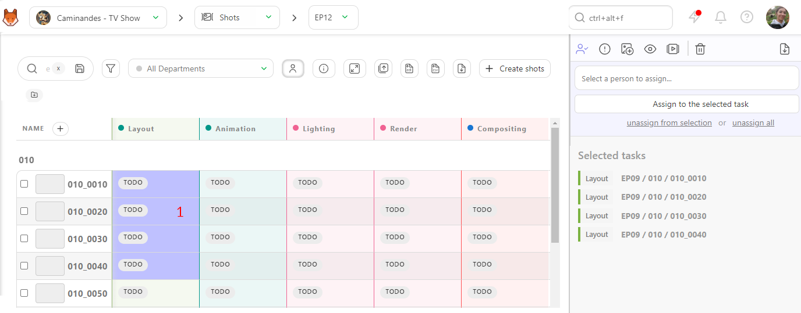

# タスクの割り当て

キットゥでは、タスクは制作のさまざまな側面を計画、整理、追跡するために使用される基本要素です。

タスクをユーザーに割り当てることで、以下のような利点があります。
- 各タスクの担当者が明確になります。
- ユーザーは割り当てられたタスクを認識します。
- ユーザーは各タスクに費やした時間を記録できます。
- 個々の作業負荷を監視できます。
- ユーザーごとのタスクグループは、詳細なタスクタイプページで表示されます。
- チームスケジュールは、スタジオの概要を提供します。
- チームの生産性を予測できます。
- チームの実際のパフォーマンスを追跡できます。

## チームにユーザーを追加する

チームの準備に関するセクション](../team/README.md)では、Kitsuにユーザーを追加する方法、そのユーザーの権限レベルを設定する方法、およびユーザーを部署にリンクする方法について説明しています。

::: ヒント
ユーザーにタスクを割り当てるには、まずそのユーザーをプロダクションに追加する必要があります。プロダクション外のユーザーにはタスクを割り当てることができないことにご注意ください。
:::

まず、ユーザーをプロダクションに追加しましょう。プロジェクト内で、ページ上部のドロップダウンメニューから「チーム」ページを選択します。

このページでは、このプロジェクトに割り当てられたすべてのユーザーを確認できます。 プロジェクトを新規作成したばかりの場合は、このページは空欄となります。 特定のプロジェクトのチームページに素早く移動するには、ドロップダウンメニューでプロジェクト名を選択します。

::: 警告
権限と部門は、**スタジオレベル**で設定されます。制作レベルでは、これらの設定を変更することはできません。
:::

## タスクの割り当て方法
### グローバルページからのタスクの割り当て

すべてのユーザーをプロダクションに追加したら、最初のタスクを割り当てましょう！

::: ヒント 定義
キットでは、各タスクタイプのタスクは、以下の図のように、タスクセルのステータスによって視覚的に表現されます。
:::

割り当てたいタスクのステータスをクリックします。

すると、画面の右側にコメントパネルが表示され、そのタスクの設定に関するさまざまなオプションが表示されます。

次に、割り当てボタンをクリックして割り当てダイアログを開きます

ここで、タスクにユーザーを割り当てることができます。ボックスをクリックすると、利用可能なユーザーの一覧がポップアップ表示されます。または、ユーザー名を入力すると、特定のユーザーをすばやく絞り込むことができます。割り当てたいユーザーを選択し、「**assign to selected task**」ボタンをクリックして割り当てを完了します。 

::: ヒント メモ
1つのタスクに複数のユーザーを割り当てることができます
:::

また、同時に複数のタスクにユーザーを割り当てることもできます。 まず、割り当てたいタスクを選択する必要があります。 キーボードの **Ctrl/Cmd** キーを押しながら、選択したいタスクをクリックします。 あるいは、**Shift** キーを使用して、タスクの範囲を選択することもできます。 選択したタスクが青くハイライトされていることが分かるでしょう。

タスクをハイライトしたら、割り当てるユーザーを選択し、**[確認]**ボタンをクリックして選択を確定します。同様に、**[選択から割り当て解除]**オプションを使用して、これらの割り当てを解除することもできます。

これで、各タスクのステータスの横に担当者のアバターが表示されます。

スプレッドシートの上部にある**[割り当ての表示/非表示]**ボタンを使用して、タスク割り当ての表示/非表示を切り替えることができます 。

タスクの割り当ては、ユーザーの役割に応じて、ユーザーが閲覧できる内容を決定する場合があることに留意してください（例えば、ベンダーは何かを閲覧する前にタスクに割り当てられる必要があります）。

割り当てが完了すると、全員が各自のタスクと責任を把握できます！

### 詳細なタスクタイプページからのタスクの割り当て

詳細なタスクタイプページからタスクを割り当てることもできます。これにアクセスするには、タスクタイプの列見出しをクリックします。

次に、ステータスをクリックしてコメントパネルを開きます。そこから、グローバルページと同じオプションが利用できます。ユーザーに割り当てるタスクを1つまたは複数同時に選択できます。

