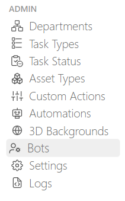
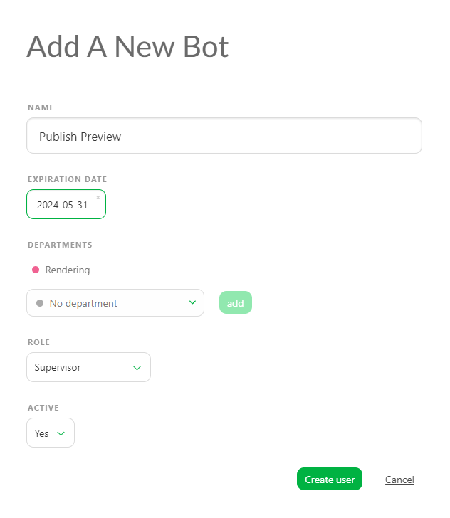
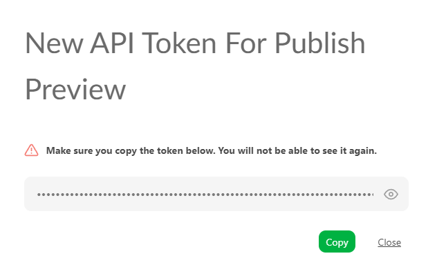

# ボット

Kitsuのボットは、自動化されたタスクを実行できる非物理的なユーザーです。これにより、実際のユーザーとしてログインすることなく、スクリプトを実行したり、KitsuのAPIとやりとりしたりすることができます。 

::: ヒント
ボットはアクティブユーザーとしてカウントされないため、契約プランに関係なく、必要な数だけ作成することができます。
:::B

## ボットを使用する理由

ボットの主な用途は、Gazu や Kitsu API を使用できるその他のアプリケーションでのスクリプト作成です。ボットは、実ユーザーに限定されているものを除き、ほぼすべての API ルートにアクセスできます。

主な利点：**
- 自動化されたタスクやスクリプトの実行
- Kitsu API とのやりとり
- トークンを使用することでシステムセキュリティを維持

## ボットの作成方法

::: 警告
初めてボットを作成すると、**JWTトークン**が発行されます。このトークンはAPIへの接続に不可欠ですので、安全に保管してください。
:::

1. **ボットページに移動します。**メインメニューの管理セクションで、ボットページに移動します。



2. **新しいボットを追加：** [新しいボット] ボタンをクリックします。  ポップアップウィンドウが表示され、ボットの詳細を入力できます。

- **名前：** ボットに名前を付けます。
- **有効期限：** 必要に応じて有効期限を設定します。
- **部署：** ボットを特定の部署にリンクします。
- **役割：** ボットの役割を定義します。
- **アクティブ：** ボットをアクティブにするか非アクティブにするかを選択します。


3. **ボットの作成：** 詳細を入力し、**ユーザー作成**をクリックします。



新しいポップアップにボットの**APIトークン**が表示されます。



## ボットの管理

ボットページでは、他のユーザーと同様に、ボットを管理することができます。例えば、以下の操作が可能です。
- 役割の割り当て
- 有効期限の設定
- ステータスの変更（アクティブまたは非アクティブ

## ボットの使用例

以下は、ボットを使用してプロジェクト**MyProduction**全体を取得するためのスクリプトの例です。

```js
import gazu
gazu.set_host(「yourkitsu.cg-wire.com/api/」)
gazu.set_token(「my_jwt_token」)
p = gazu.project.get_project_by_name(「MyProduction」)
```

このスクリプトは、実際のユーザーのログイン認証情報を使用せずに、ボットを使用してKitsu APIとやりとりする方法を示しています。必要に応じて、コメントを公開するボットがある場合は、そのボットに実際のユーザーと同じ権限を付与して、権限を考慮することができます。

## セキュリティに関する考慮事項

ボットのトークンが侵害された場合は、新しいトークンを再生成することで、古いトークンを無効にすることができ、システムのセキュリティを確保することができます。
