# チャットの統合

## Discordの統合

### ボットアカウントの作成

1. [Discordウェブサイト](https://discord.com/)にログインしていることを確認してください。
2. [アプリケーションページ](https://discord.com/developers/applications)に移動します。
3. 「新規アプリケーション」ボタンをクリックします。
4. アプリケーションに名前を付け（例：「Kitsu」）、「作成」をクリックします。

5. 「Bot」タブに移動し、「Add Bot」をクリックして、Botユーザーを作成します。
「Yes, do it!」をクリックして続行します。

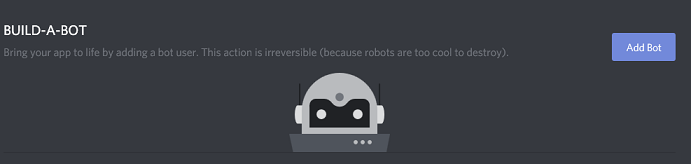

6. 「Username」の隣にあるアイコンをクリックすると、ボットのアイコンを追加できます。このアイコンはボットがチャットを行う際に使用されます。

7. 他のユーザーにボットを招待してもらいたい場合は、「Public Bot」にチェックが入っていることを確認してください。

8. ボットが他のメンバーを確認できるようにするには、「Server Members Intent」にチェックが入っていることを確認してください。

9. 「Copy」ボタンをクリックしてトークンをコピーします。 

10. Kitsuの「設定」画面で、テキストフィールド「Discord token (optional)」にトークンを貼り付け、「Save settings」をクリックします。

### ボットの招待

ボットユーザーを作成したら、それをサーバーに追加する必要があります。以下の手順に従ってください。

1. [Discord ウェブサイト](https://discord.com/) にログインしていることを確認してください。
2. [アプリケーションページ](https://discord.com/developers/applications) に移動します。
3. ボットのページをクリックします。
4. 「OAuth2」タブから「URL Generator」に進みます。
5. 「Scopes」で「bot」のみにチェックを入れます。

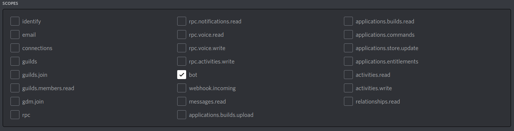

6. 「Bot Permissions」で「Send Messages」のみにチェックを入れます。

7. 生成されたURLを使用して、サーバーにボットを追加します。URLをブラウザにコピー＆ペーストし、ボットを招待するサーバーを選択して、「Authorize（認証）」をクリックします。

> **_注意：_** ボットを追加するには、そのユーザーに「Manage Server（サーバー管理）」権限が必要です。

> **_注意：_** 通知を有効にするには、ユーザーはボットと同じサーバー上にいる必要があります。

### Discord 通知を有効にする

各ユーザーは、プロフィールで Discord にプッシュ通知を設定できます。「Discord 通知を有効にする」を「はい」に切り替え、「Discord ユーザー名」（フォーマットは username#number）を入力する必要があります。

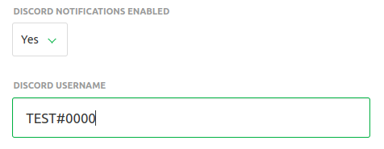

完了です！

## Slack 統合

Slack との連携には、Slack スペースに専用のアプリケーションを作成する必要があります。以下の手順で設定を進めてください。

### Slack に Kitsu アプリケーションを作成

まず、[https://api.slack.com/apps](https://api.slack.com/apps) に接続します。

「新しいアプリを作成」ボタンをクリックします。

名前に「Kitsu」と入力し、Kitsuインスタンスとリンクするワークスペースを選択します。

適切な権限を設定する

アプリを作成したら、リストからアプリの名前をクリックしてアプリのページに移動します。「基本情報」セクションに移動し、右下の「権限」ボタンをクリックします。

スコープセクションで、必要な権限を追加します。

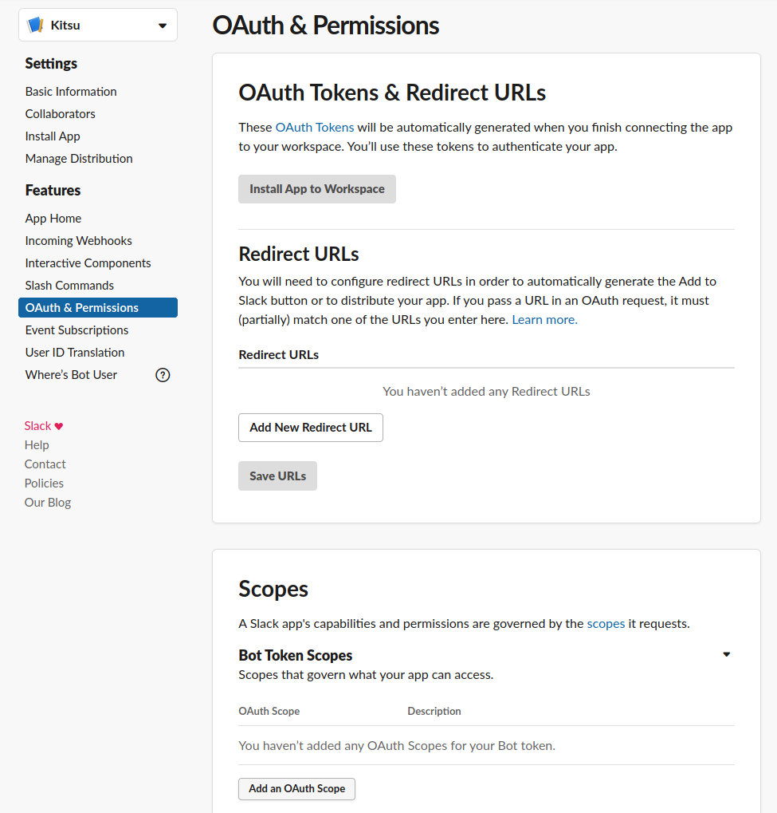

必要な権限のスコープは `chat:write:bot` です。

### ワークスペースにアプリをインストール

ワークスペースにアプリをインストールします。「アプリのインストール」セクションに移動し、「ワークスペースにアプリをインストール」ボタンをクリックしてインストールします。

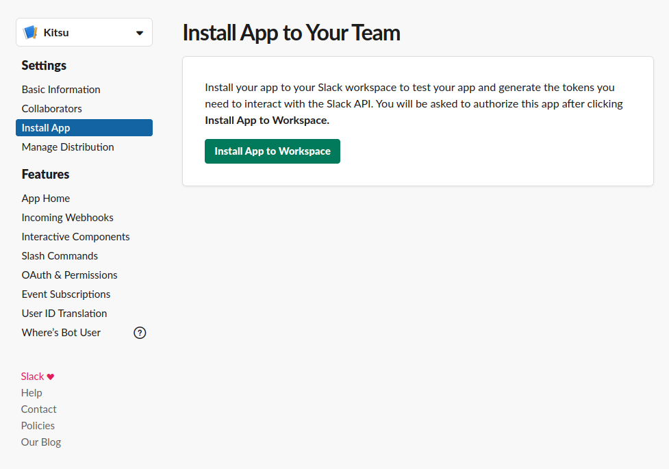

インストールを確認します。

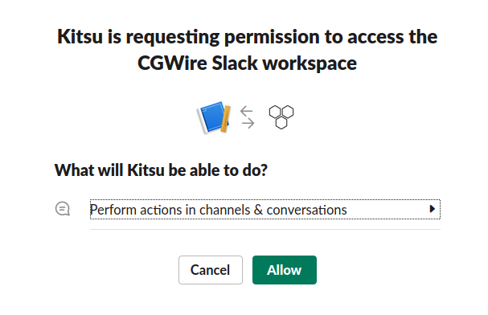

これで、Kitsu Slack アプリが稼働しました。あとは、Slack ワークスペースに送信される通知に Kitsu をリンクするだけです。

### トークンの取得

*アプリのインストール*セクションに戻ります。Kitsu インスタンスを Slack にリンクするために必要なトークンが表示されます。

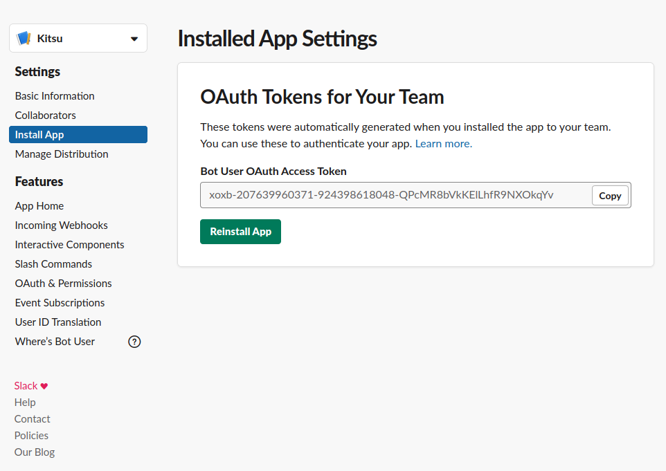

### Kitsuを新しいSlackアプリケーションにリンク

有効なトークンを使って、Kitsuの設定ページに移動し、トークンを入力します。

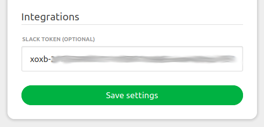

### プロフィールでSlack通知を有効にする

最後に、プロフィールセクションでSlack通知をオンにします。Slackのプロフィールで「その他」をクリックすると表示される、Slackで使用しているメンバーIDを入力します。

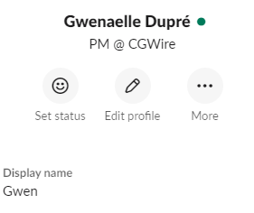

Kitsuのプロフィールで、Slack通知を「オン」に設定し、Slackのニックネームを入力します。

これで、Slackワークスペースで直接通知を受け取ることができます！

## Mattermost 統合

### 受信 Webhook、カスタムユーザー名、Webhook 用プロフィール画像を有効にする

1. Mattermost サーバーにシステム管理アカウントでログインしていることを確認してください。
2. Mattermost インストールで受信 Webhook を受信でき、Webhook 用にカスタムユーザー名とプロフィール画像を設定できるか確認してください。
1. 「システムコンソール」 --> 「統合」 --> 「統合管理」に進みます。

2. パラメータ「Enable incoming Webhooks」、「Enable integrations to override usernames」、および「Enable integrations to override profile picture icons」が「true」に設定されていることを確認します。

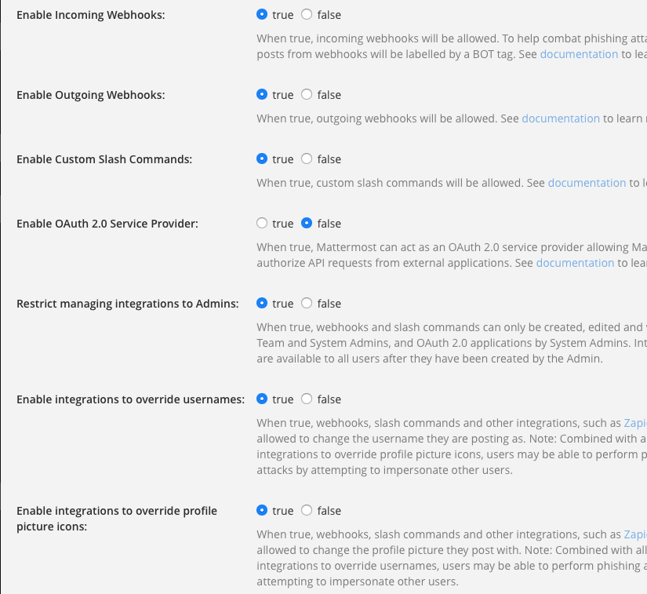

### MattermostでWebhookを設定する

1. Mattermostサーバーにシステム管理アカウントでログインしていることを確認してください。
2. 「Integrations」 --> 「Incoming Webhooks」 --> 「Add incoming Webhook」の順にアクセスします。

3. 受信Webhookを作成します。

* **Title**: Kitsu
* **Description**: Kitsu
* **Channel**: メッセージはユーザーに送信されるので、新しいチャンネルを作成するか、既存のチャンネルを使用します。
* **Lock to this channel**: False に設定します。
* **Username**: Kitsu (これは Kitsu によって上書きされます)。
* **プロフィール画像**: 重要ではありません。Kitsuによって上書きされます。

4. 「保存」をクリックすると、Mattermostが新しいURLを生成します。このURLをコピーします。

5. Kitsuの「設定」で、テキストフィールド「Mattermost Webhooks (オプション)」にURLを貼り付け、「設定を保存」をクリックします。

> **_注意:_** 通知を有効にしたいユーザーは、これらの手順で使用したのと同じ Mattermost サーバー上に存在していなければなりません。

### Mattermost 通知を有効にする

各ユーザーは、プロフィールで Mattermost にプッシュ通知を行うように設定できます。「Mattermost 通知を有効にする」を「はい」に切り替え、「Mattermost ユーザー名」を入力する必要があります。

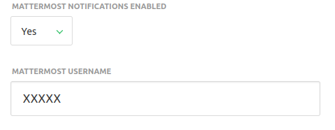

完了です！
