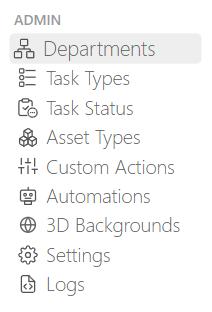
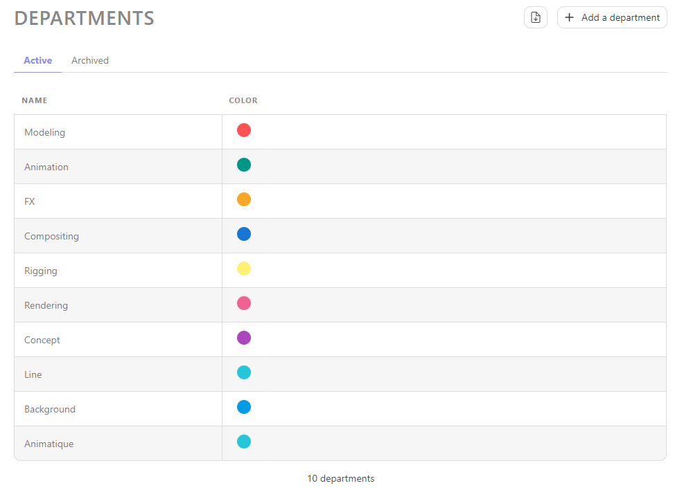
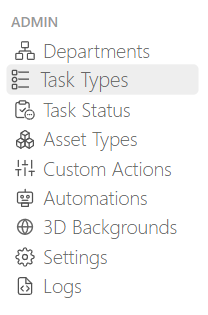
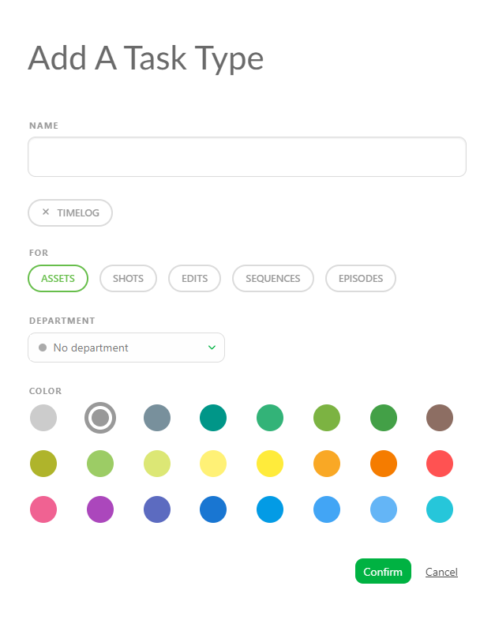
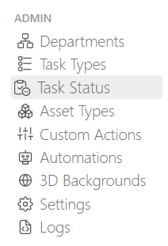
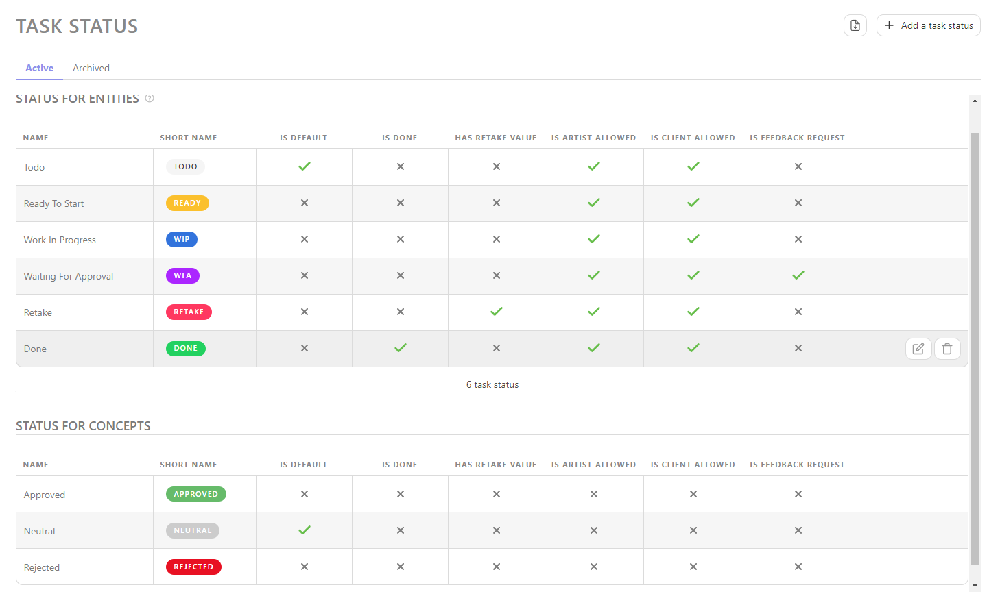
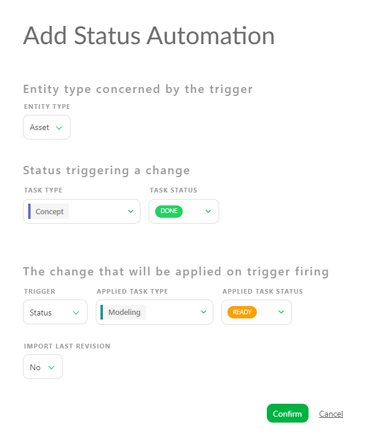
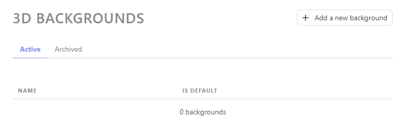
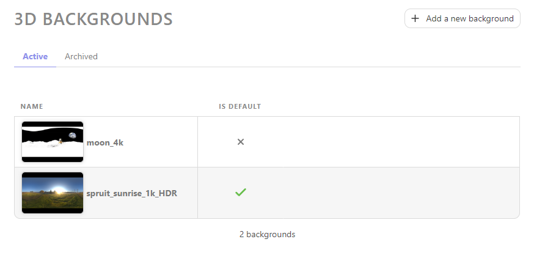
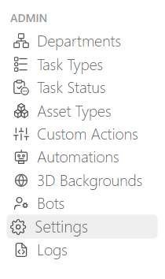

# Kitsuの使い方

Kitsuを使用すると、ユーザーは2Dおよび3D制作、VFX、ビデオゲーム、その他の関連作業を含む、さまざまな制作プロジェクトを追跡することができます。

Kitsuで追跡できるコンテンツは、静止画広告のようなシンプルなものから、3時間の長編映画まで、さまざまな要素のプロジェクトに対応できます。

しかし、制作に取り掛かる前に、まず**スタジオワークフロー**を設定する必要があります。

## スタジオワークフロー
### スタジオワークフローの理解

::: 警告 定義
ワークフローとは、制作における作業プロセスを構成するタスクの構造化された連携を指します。
:::

例えば、CGI制作では、モデリング、リギング、シェーディングなどのタスクが実行され、アセットが完成します。

::: 警告 定義
- モデリング、シェーディングなどのプロセスは、**タスクタイプ**と呼ばれます。
- アセットやショットなどの個々のオブジェクトは「**エンティティ」**と呼ばれます。
- 「**タスク」**とは、実行する必要のある特定のアクションやアクティビティを指します。 タスクはエンティティに帰属させることができ、通常はタスクタイプで分類されます。

:::

対応するタスクを持つエンティティは、アセットワークフローの基礎となります。 その後、各タスクはアーティストに割り当てられます。アセットのワークフローを決定したら、ショットやシーケンスなどについても同様に決定します。

タスクのワークフローが定義されたら、次のステップでは**承認ワークフロー**を確立します。これには、チーム内でのコミュニケーションに使用するステータスをすべて定義することが含まれます。ステータスは、制作の進行状況を追跡するのにも役立ちます。

制作の**ワークフロー**は、タスクとステータスの合計です。

### グローバルライブラリと制作ライブラリ

Kitsuには2種類の**ライブラリ**があります。
- 1つ目はスタジオレベルの**グローバルライブラリ**です。
スタジオマネージャーのみがアクセスできます。

- 2つ目は**制作ライブラリ**で、グローバルライブラリで作成した要素を選択して追加します。

各制作を特定のワークフローで分離しておくことが目的です。

**グローバルライブラリ**では、部門、タスクタイプ、タスクステータス、アセットタイプ、ステータスの自動化を作成および変更することができます。必要な数だけ要素を作成し、任意の名前を付け、ニーズに合った最適な色やオプションを選択することができます。

**グローバルライブラリ**に要素が追加されたら、**グローバルライブラリ**から新たに作成した要素を**プロダクションライブラリ**に追加することができます。

## 部署
### 部署の作成

部署は、スーパーバイザーやアーティストが各自の作業に集中できるよう設計されています。 ユーザーが1つまたは複数の部署にリンクされると、スーパーバイザーやアーティストは、そのタスクタイプに関連するすべてのタスクのフィルタリングされたビューに直接アクセスできるようになります。 部署は、その部署内のユーザーに表示されるメタデータカラムを定義するためにも使用されます。

メタデータ列が部署に関連付けられている場合、その列は、その部署内のユーザーのみに表示されます。メタデータ列が部署に関連付けられていない場合、その列は、すべてのユーザーに表示されます。

::: ヒント 
デフォルトでは、Kitsuは、作業を開始する際に役立ついくつかのサンプル部署を提供しています。
:::

スタジオの部署を定義することは、通常、セットアップの最初のステップです。人やタスクの種類など、複数のオブジェクトが部署に関連付けられます。

メインメニューの  で、
**管理**セクションの**部署**ページを選択します。

さらに多くの部門を作成する必要がある場合は、[部門作成] ボタンをクリックします。

部門を追加する際には、以下の項目を定義する必要があります。

- 部門名
- 色（円形の小さな円として、列のタスクタイプまたはカスタム列の隣に表示されます）

変更を保存するには、**Confirm**をクリックします。

部門の作成が完了すると、ページは次のようになります。各部門には固有の名前と色が割り当てられています。 

## タスクの種類
### 新しいタスクの種類を作成する

次に、制作物の管理と追跡に必要なすべての**タスクの種類**を作成します。タスクの種類は、アセット、ショット、シーケンス、エピソード、編集など、複数のエンティティに関連付けることができます。

メインメニュー  から
**管理**セクションの**タスクの種類**ページを選択します。

::: ヒント 
デフォルトでは、KitsuはCGI制作で使用できるいくつかのサンプルタスクタイプを提供しています。制作に関連のないものは、名前を変更したり削除したりすることができます。
:::

これらの**タスクタイプ**は、すでに部門にリンクされていることに気づくでしょう。

ボタンをクリックして、新しい**タスクタイプ**を作成することができます。

次に、タスクタイプに関するいくつかの情報を入力する必要があります。

- タスクタイプの名称
- チームメンバーがこのタスクタイプで作業時間を記録する必要があるかどうか
- どのエンティティで使用するか
- どの部署にリンクするか
- 色（これはメインのスプレッドシートページの背景色に反映されます）

以前に作成した**部署**が、タスクタイプをリンクするオプションとして利用できることに気づくでしょう。特定のタスクタイプに部署を関連付けることで、チームの組織化に役立ちます。

**確認**をクリックして変更を保存します。

::: 警告 
新しく作成したタスクタイプはリストの一番下に表示されます
:::

順序を調整するには、**タスクタイプ**をクリックして、リスト内の適切な位置までドラッグするだけです。

おめでとうございます。これで、お客様の**グローバルライブラリ**にタスクタイプが作成されました。 

::: 警告
制作を作成したら、**シーケンス**、**エピソード**、**編集**の各タスクタイプを**制作ライブラリ**に追加する必要があります。
:::

::: ヒント
制作のどの段階でも、必要に応じてこのセクションに戻って追加の**タスクタイプ**を作成し、ワークフローに追加することができます。
:::

## アセットタイプ
### アセットワークフローの定義

グローバルワークフローを作成したら、**アセットタイプ**を定義することができます。

ショットがシーケンスによって整理されるのと同様に、アセットは**アセットタイプ**によって整理されます。フォルダを使用して、すべてのアセットをカテゴリー別に整理するようなものと考えてください。

メインメニューの  で、
**管理**セクションの**アセットタイプ**ページを選択します。

::: ヒント
デフォルトでは、KitsuはCGI制作に使用できるいくつかのサンプルアセットタイプを提供しています。
:::

新しい**アセットタイプ**を作成するには、ボタンをクリックします。

次に、**アセットタイプ**に関するいくつかの情報を入力する必要があります。

- アセットタイプの名称
- 特定のアセットタイプ用のワークフロー

異なるアセットタイプには、異なるワークフローが存在します。例えば、環境アセットは通常リギング作業を必要としないため、キャラクターと比較すると環境のタスクは少なくなります。

アセットタイプを**作成**または**編集**する際には、特定の**タスクタイプ**を追加することができます。このアセットタイプに対して特定のワークフローを選択しない場合、制作アセットのワークフローが適用されます。

ただし、このアセットタイプに対して特定のタスクタイプを選択した場合は、それらのみが制作に適用されます。

変更を保存するには、**Confirm（確認）**をクリックします。

新しい**アセットタイプ**が**グローバルライブラリ**に作成されました。制作物の作成時に使用できるようになります。

::: ヒント
制作物の作成中にいつでもこのセクションに戻って、必要に応じて追加の**アセットタイプ**を作成し、ワークフローに追加することができます。
:::

## タスクステータス
### 承認ワークフローの定義

次に、**承認ワークフロー**で使用するステータスを作成します。

メインメニューの  で、
**管理**セクションの**タスクステータス**ページを選択します。

::: ヒント
デフォルトで、Kitsuにはすでにいくつかのステータスの例が用意されています。
:::

ステータスは、レビューと承認プロセスの一部として、タスクが通過しなければならない特定の段階や条件を表します。

たとえば、**「準備完了」** ステータスは、アーティストが作業を開始するために必要なものがすべて揃っていることを示し、このステータスに達するまではタスクを開始してはならないことを意味します。

**WIP** : **作業中**ステータスは、アーティストがチームに現在作業中であることを知らせるために使用します。このステータスでは、他の担当者に割り当てる必要がないことを示します。

**WFA**: **承認待ち**ステータスは、アーティストが作業を完了し、レビュー待ちの状態であることを上司に通知するために使用します。また、同様のステータスを上司が使用して、ディレクターに作業がレビュー可能になったことを通知することもできます。

完了！[完了ステータス](../img/getting-started/done_icon.png): **完了**ステータスは、すべての作業が完了し承認されたことを示します。これは、現在のタスクが完了し、次のプロセス段階を開始できることを意味します。

**再提出** : **再提出**ステータスは、コメントが追加されたことを示し、検証が完了するまで、アーティストがタスクの作業を継続し、新しいバージョンを公開することを促します。

これらの**ステータス**は、Kitsuで達成可能なことの例にすぎません。必要に応じて独自のステータスを作成することも可能です。

これを行うには、メインページから、[タスクステータスの追加]ボタン（../img/getting-started/add_task_status.png）をクリックします。

次に、ご自身の**タスクステータス**について、いくつかの詳細を定義する必要があります。

[ステータスの追加]ボタン（../img/getting-started/add_status.png）

- **NAME**、マウスをステータスに重ねた際に表示されるステータスの明示的な名前。
- **SHORT NAME**、Kitsuに表示される名前。
- **IS DEFAULT**、Kitsuがすべてのタスクにデフォルトで表示する最初のステータス。Kitsuではデフォルトステータスは**1つ**のみ設定できます。
- **完了**、このステータスがタスクの検証に使用される場合（クォータ管理、ToDoリストの整理、エピソード統計の更新に役立ちます）。
- **再提出の値**、このステータスがタスクのコメントに使用される場合（タスクタイプページやエピソード統計ページでのやり取りを追跡するのに役立ちます）。
- **IS ARTIST ALLOWED**（アーティストが許可されているか）：アーティストがこのステータスを設定することは許可されていますか？ いいえの場合、アーティストは利用可能なステータスのリストでこのステータスを見ることはできません。 ただし、アーティストはこれにコメントを投稿することはできます。
- **IS CLIENT ALLOWED**（クライアントが許可されているか）：クライアントがこのステータスを使用することはできますか？ いいえの場合、クライアントは利用可能なステータスのリストでこのステータスを見ることはできません。
- **フィードバックリクエスト**：このステータスがレビュー依頼に使用された場合（タイムシートを使用しない場合のノルマ管理に役立ちます）、このステータスはToDoリストの「保留中」タブに表示され、これらのステータスはすべて**マイチェック**ページにグループ化されます。このステータスを使用するたびに、Kitsuは**プレビューの公開**を促します）。
最後に、このステータスに使用する背景の**色**を選択します。

**確認**をクリックして変更を保存します。

ステータス**がグローバルライブラリに作成され、制作で使用できるようになりました。

::: ヒント
制作のどの段階でも、ここに戻って必要に応じてさらに**タスクステータス**を作成し、
制作に追加することができます。
:::

::: 警告
「コンセプトステータス」のカテゴリの下に、いくつかのタスクステータスがリストされていることに気づくでしょう。これらはシステムによって使用されるもので、ここで変更することはできますが、新しいものを追加することはできません。
:::

## 自動化

### 新しいステータスの作成 自動化

ステータス自動化**は、事前に定義された基準に基づいて、タスクのステータスを自動的に変更するルールまたは条件を定義します。**ステータス自動化**は、アセットタスクとショットタスクの両方に対して設定できます。

アセットの場合、タスク間で**ステータス自動化**を設定できます。たとえば、コンセプトタスクのステータスが「完了」に設定されると、下流のモデリングタスクのステータスが自動的に「準備完了」に変更されます。

さらに、タスクのステータスに基づいて**アセットステータス**を更新する**ステータス自動化**を作成することもできます。たとえば、コンセプトタスクが「完了」に設定されると、リンクされたアセットステータスが「レイアウト」に設定されます。

::: ヒント
Automationで、**最新のプレビューをコピー**するようにKitsuに依頼することもできます。
:::

メインメニューに移動します！[メインメニュー](../img/getting-started/main_button.png)**Automation**を選択します。

このページから、**[+ステータス自動化を追加]**ボタンをクリックして**ステータス自動化**を作成できます。

**ステータス自動化**は、**アセット**または**ショット**のいずれかに対して作成できます。

次に、自動化をトリガーする**タスクタイプ**と**ステータス**を選択できます。

どの**タスクタイプ**がオートメーションに対応するかを指定し、変更する**ステータス**を選択することができます。

Ready For**ステータスで変更を開始するには、トリガーを「ステータス」から「**Ready For**」に変更する必要があります。

適用タスクタイプ**が**ショットタスクタイプ**と表示されるようになります。

ショットの**ステータス自動化**を作成するには、**エンティティタイプ**をショットに変更する必要があります。

新しい**ステータス自動化**が**グローバルライブラリ**に作成されました。

::: 警告
プロダクションを作成したら、ステータス自動化を**プロダクションライブラリ**に追加する必要があります。
:::

::: ヒント
プロダクションの作成中にいつでもここに戻って、必要に応じてさらに**ステータス自動化**を作成し、プロダクションに追加することができます。
:::

## 3D背景

### HDRファイルのグローバルライブラリの作成

3D Backgrounds 機能は、`.HDR` 背景を組み込むことで、3D ファイル（`.GLB`）のレビューが容易になり、3D ファイルのレビューが強化されます。

`.GLB` ファイル形式は、さまざまな 3D アセットおよびリソースを包含するバイナリコンテナです。これらのアセットには、3D モデル、テクスチャ、マテリアル、およびアニメーションが含まれます。

警告 定義
これは、照明情報を使用して 3D ファイルをレビューできることを意味します。
:::

このセクションでは、独自の `.HDR` ファイルライブラリを作成して制作に使用することができます。

メインメニューに移動します！[メインメニュー](../img/getting-started/main_button.png)から、**3D背景**を選択します。

ここから、**「新しい背景を追加」**ボタンをクリックして `.HDR` 背景を追加できます。

このポイントから、`.HDR` 背景を選択し、名前を指定し、この `.HDR` をデフォルトの背景として使用するかどうかを決定する必要があります。

::: ヒント
「デフォルトとして使用」オプションにチェックを入れると、デフォルトのグレーの背景の代わりにこのHDRが制作全体に適用されます。
:::

すべての `.HDR` ファイルをアップロードすると、Kitsu がそれらをリストとして表示します。

新しい **3D 背景** が **グローバルライブラリ** に作成されました。

::: 警告
制作を作成したら、**制作ライブラリ** に追加する必要があります。
:::

## 設定
### Kitsu の設定

デフォルトの Kitsu ロゴをスタジオのロゴに置き換えるなど、スタジオに適用されるいくつかのグローバル設定を構成することができます。

これを行うには、メインメニューボタン 
 をクリックし、**管理**セクションで**設定**をクリックします。

### スタジオの設定
**スタジオロゴの設定**をクリックし、使用する画像を選択します。これにより、サイトおよびアプリ内のさまざまな場所で表示されるKitsuロゴが置き換わります。また、Kitsuインスタンスで使用される**スタジオ名**を変更することもできます。

このページの残りの設定は、すべての制作に影響するグローバル設定です。これらの一部を以下に示します。

- 1日あたり、チームが作業を行う時間を何時間にするか。
- ダウンロード用のファイル名として、オリジナルのファイル名を使用するか。
- デフォルトで画像をHD画質で表示する。このオプションは、インターネット接続が非常に高速な場合にのみ使用してください。
- タイムシートについては、アーティストが1週間以上前のタイムシートを修正できないように制限することもできます。

最後に、さまざまなチャット統合に関する設定も見つかります。設定方法の詳細については、[Chat Integration](../chat-integration/README.md) セクションを参照してください。

::: 警告
作業が完了したら、最後に必ず**設定を保存**してください。
:::
