# 制作固有のワークフロー設定

## 制作固有の設定
**ナビゲーションメニュー**から、ドロップダウンメニューで**設定**を選択します。 

最初のタブ、**パラメータ**では、制作の**技術情報**を変更することができます。

警告
プレビューをアップロードした後に **FPS** または **解像度** を変更しても変更は適用されません。最初のプレビューを再アップロードする必要があります。
:::

ここでは、制作物に対して特定のオプションを有効にすることができます。

- クライアントコメントを分離する（お互いに表示されない

- アーティストによるプレビューのダウンロードを許可する

- 新しいプレビューをエンティティのサムネイルとして自動的に設定する

この制作物に対する**最大リテイク数**を指定することもできます。

::: ヒント
**パラメータ**タブで制作物のアバターを変更することもできます。
:::

## タスクのステータス
### 制作物に対する特定のタスクタイプの設定

**ナビゲーションメニュー**でドロップダウンメニューから**設定**を選択します。

デフォルトでは、プロダクションを作成する際に定義した**タスクステータス**が読み込まれます。

ただし、グローバルライブラリで先に作成されている場合は、プロダクション中に特定のステータスを追加または削除することができます。

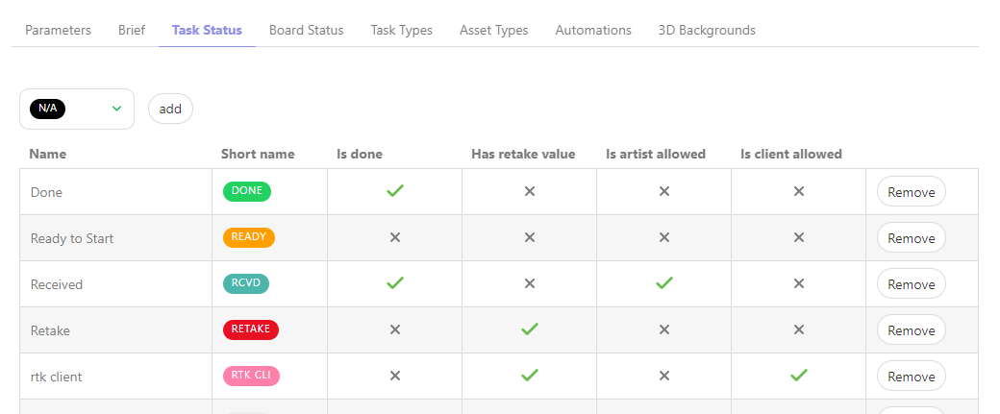

**タスクステータス**タブでは、このプロダクションに追加または削除する**ステータス**を選択し、
**追加**ボタンで選択を確定します。

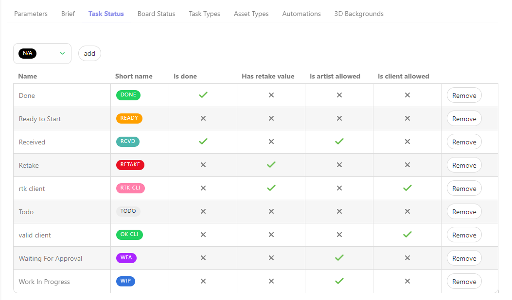

## タスクタイプ
### プロダクションで特定のタスクタイプを有効にする

**ナビゲーションメニュー**で、ドロップダウンメニューから**設定**を選択します。

デフォルトでは、キットは制作を作成する際に選択した**タスクタイプ**を追加します。

ただし、グローバルライブラリで先に作成されている場合は、特定の**タスクタイプ**を追加または削除することができます。

たとえば、ライブラリ内の別の制作物からタスクワークフローをインポートすることができます。

**タスクタイプ**タブでは、この制作物にインポートまたは削除する制作物またはタスクタイプを選択し、
**インポート**ボタンで選択を検証します。

::: 警告
アセットやショットを作成した後に新しいタスクタイプを作成した場合は、**DELIVERY**（配信）タスクタイプが作成されます。

グローバルページで**このタスクタイプを追加**する必要があります。

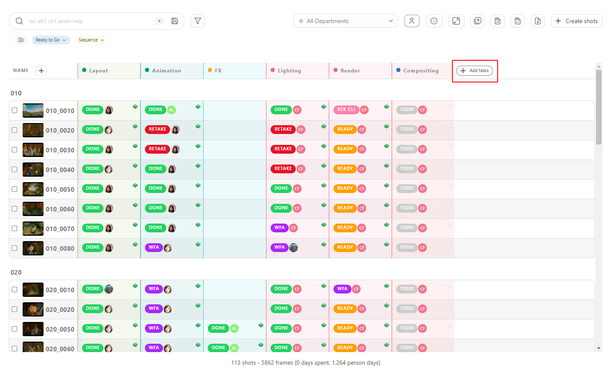

ポップアップウィンドウが表示されますので、ドロップダウンメニューから新しいタスクタイプを選択してください。

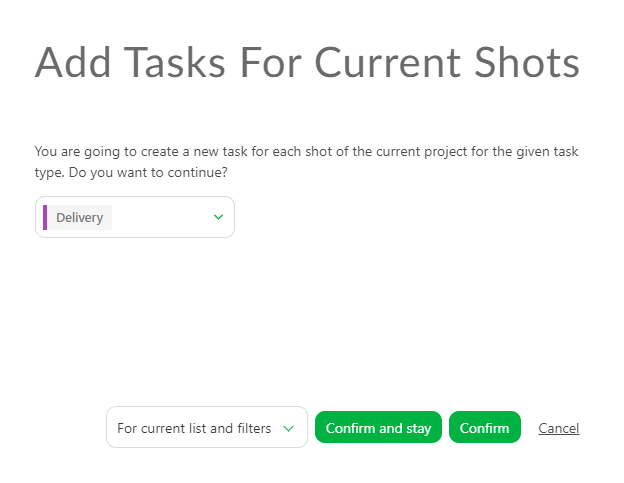

**確認**をクリックして検証します。

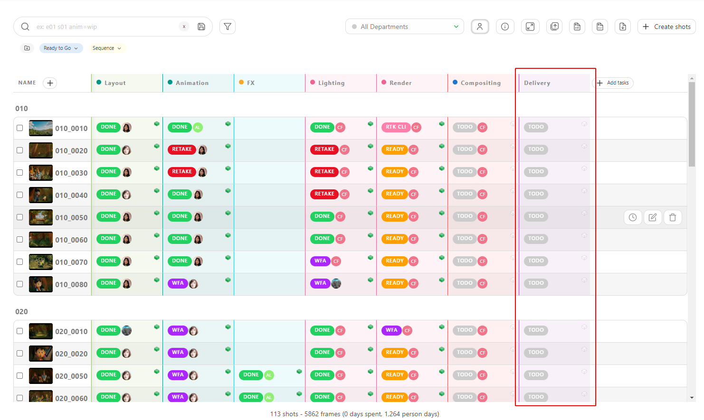

:::

## アセットタイプ
### プロダクションでの特定のアセットタイプの有効化

**ナビゲーションメニュー**で、ドロップダウンメニューから**設定**を選択します。

デフォルトでは、プロダクションを作成する際に定義した**アセットタイプ**が読み込まれます。

ただし、グローバルライブラリで先に作成されている場合は、特定のアセットタイプを追加または削除することができます。

**アセットタイプ**タブでは、この制作物に追加または削除する**アセットタイプ**を選択し、
**追加**ボタンで選択を確定します。

## ステータスオートメーション
### プロダクションのステータスオートメーションの設定

**ナビゲーションメニュー**で、ドロップダウンメニューから**設定**を選択します。

デフォルトでは、Kitsuはお客様の**ステータスオートメーション**の**
グローバルライブラリ**を**プロダクションライブラリ**に読み込みません。

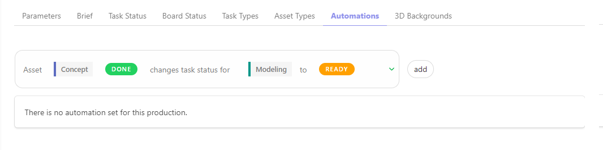

ただし、生産の種類に応じて、特定の**ステータス自動化**のみを使用することができます。

**ステータス自動化**タブで、この生産で使用する自動化を選択し、
**追加**ボタンで選択を検証します。

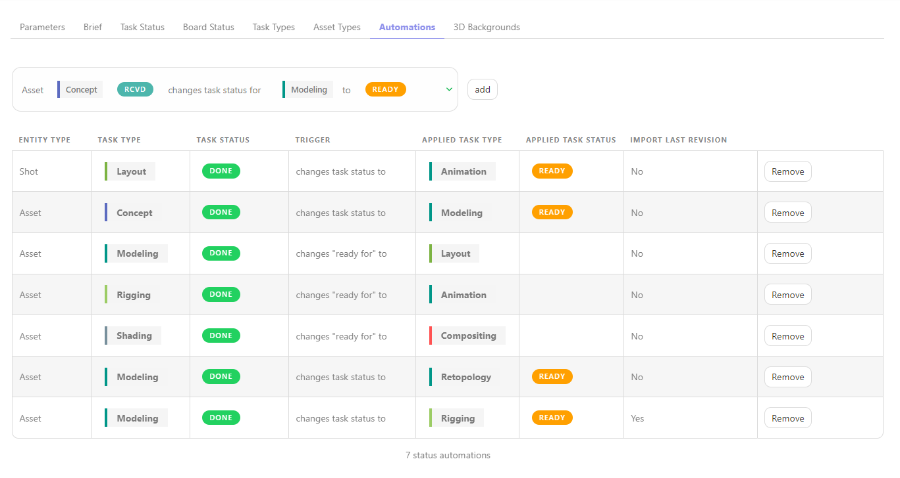

## プレビュー背景
### 特定のプレビュー背景をプロダクションに選択

**ナビゲーションメニュー**で、ドロップダウンメニューから**設定**を選択します。

**プレビュー背景**タブでは、この制作物に追加または削除するHDRファイルを選択できます。

**追加**ボタンで選択を確定します。

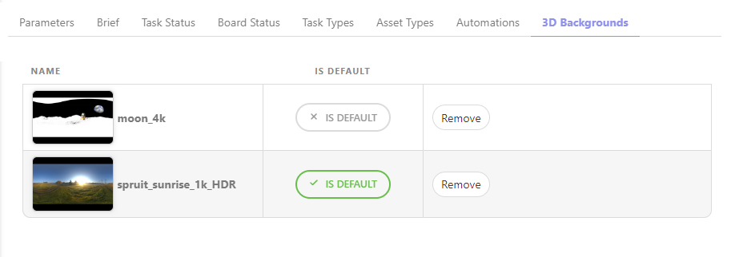

HDR背景を使用して3Dファイルを確認できます。

## アーティストボード
### アーティストボードのステータス設定

**ナビゲーションメニュー**で、ドロップダウンメニューから**設定**を選択します。

**タスクステータス**タブで、**ボード**ビューのステータスを並べ替えることができます。

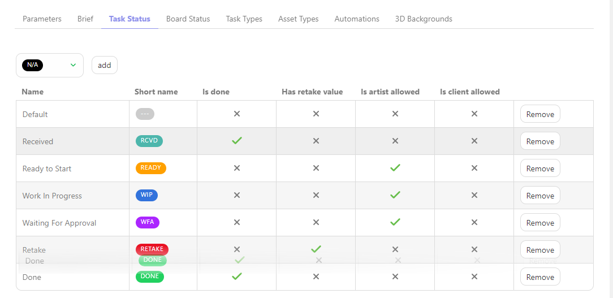

設定が完了したら、**Board Status** タブに移動します。

ここでは、**Board view** でどのステータスを誰に表示させるかを選択できます

ステータスを適切に選択しないと、アーティストにとって選択肢が多すぎて負担になる場合があります。

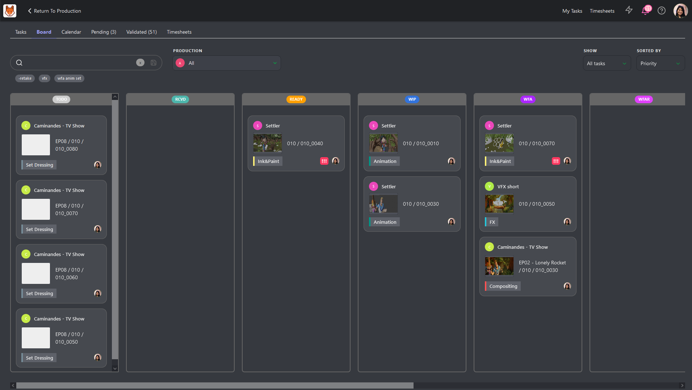

適切な**ステータス**を選択することで、アーティストにとってより使いやすくなります。

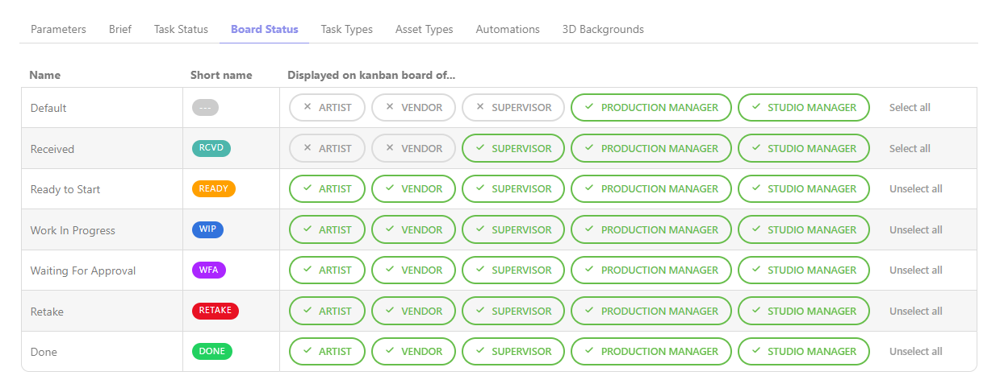

