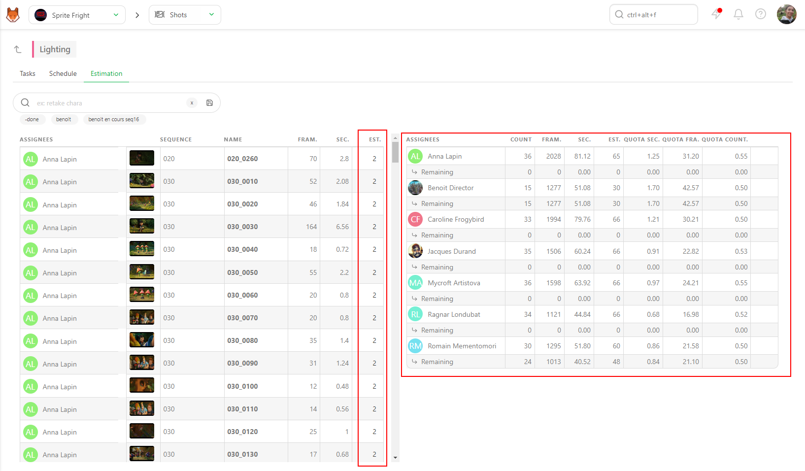
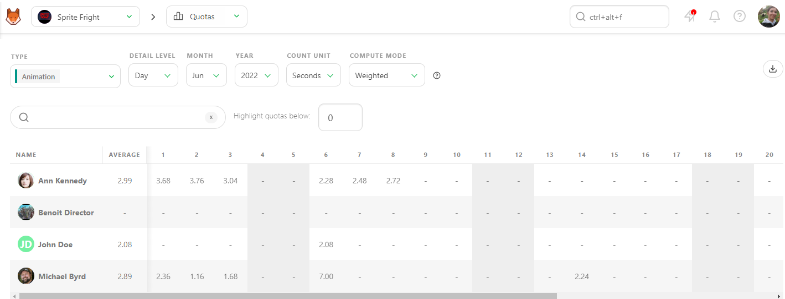
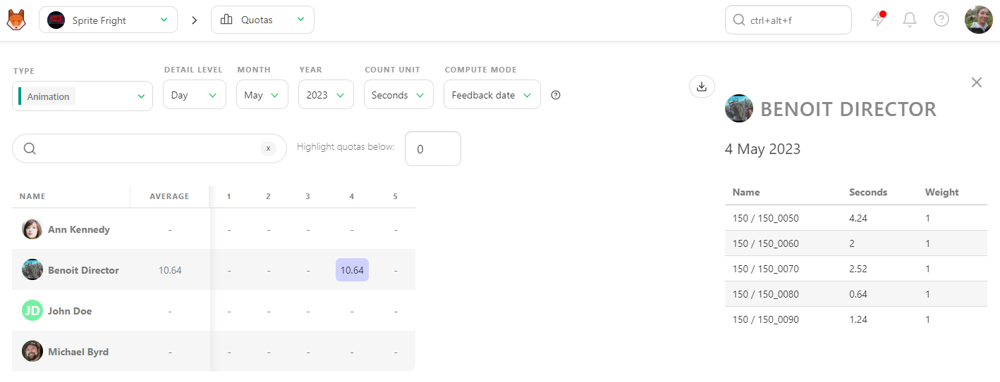
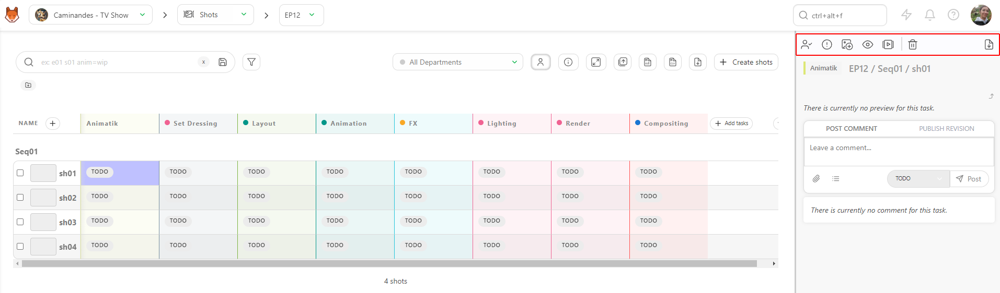
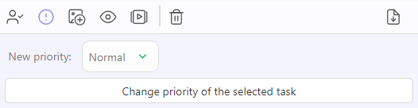
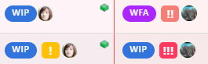

# 見積もりおよびチームのノルマ

各タスクの見積もり作業は大変な作業のように感じられるかもしれませんが、そのメリットは努力をはるかに上回ります。タスクの見積もりを記入することで、以下のことが可能になります。

- 制作中のタスクの見積もり日数を明確に把握できます。
- タスクの見積もり時間を実際の所要時間と簡単に比較でき、今後のタスクをより正確に予測できます。
- タスクの見積もり、開始日、期限が確定したら、エンティティスケジュールまたはチームスケジュールからタスクを調整できます。
- アーティストが各タスクに費やすべき時間を意識し、整理された状態を維持できるよう支援します。
- 現在および将来の制作に関する予測を改善します。

Kitsuは、タスクの見積もりを簡単に追跡、確認、予測できるさまざまな機能を提供しています。 それらを可能にする機能の一部を見てみましょう。

## タスクの見積もりを追加する

まず、タスクタイプの名前をクリックします。

すると、[詳細タスクタイプ] ビューが表示されます。ここでは、特定のタスクタイプのすべてのタスクのリストと、追加の詳細を確認できます。

タスクに見積もりを追加するには、[見積もり (Est.)] フィールドをクリックし、日数を入力します。 **Ctrl/Cmd** または **Shift** キーを押しながら複数のタスクを選択し、選択したすべてのタスクに同じ見積もりを適用することができます。

::: ヒント
期間は、タスクに実際に要した時間を表し、記録された時間から自動的に計算されます。この点については、後ほど詳しく説明します。
:::

フィールドをクリックしてポップアップカレンダーから日付を選択することで、**開始日**を定義することもできます。

**期限**は、入力された**見積もり**と**開始日**に基づいて自動的に計算されます。

### 詳細なタスクタイプビューの機能:
詳細なタスクタイプビューで利用できるケースと機能の概要は以下の通りです。

- タスクのステータスを確認および変更する
- タスクに担当者を割り当てる
- タスクの見積もり（日数）を追加する
- アーティストのタイムシートから記録された時間の累計を確認する
- やりとりの回数をリテイクのステータスで追跡する
- カレンダー選択機能を使用してタスクの開始日を追加する
- 開始日と見積もりに基づいて自動生成された期限を確認する
- WIP（作業中）とフィードバックの日付が自動的に入力されていることを確認する
- 最新のコメントセクションを監視して、このタスクタイプの最新アクティビティを常に把握する

## チームの速度予測
### 予測クォータを使用したチームの速度予測

正確な予測を設定するには、**[予測]** タブを使用します。

左半分には、割り当てとフレーム数（1）とともにタスクがリスト表示されます。制作に設定した**FPS**に基づいて、**秒**数が自動的に計算されます（2）。

::: ヒント 定義
**クォータ**は、**チームの速度**を視覚化します。

アーティストが**予定日数**内にすべてのタスクを完了するために、1日に平均して何ショット、何フレーム、何秒必要かを把握できます。
:::

右半分には、部門チーム全体（割り当てられたタスクに基づく）、完了に必要なショット数、フレーム数、秒数、平均ノルマが表示されます。また、**残り**行も表示され、チームの現在の状況がわかります。

最後の列は**見積もり**です。見積もりを変更するには、行をマウスでポイントし、編集可能なエリアをクリックします。

また、複数のタスクを同時に選択して、一度にすべてを編集することもできます。

右側の**見積もり**（日数）を変更するたびに、**平均ノルマ**がリアルタイムで更新されます。

**スケジュール**タブの詳細については、[タスクタイプのスケジュール](../schedules/README.md#Set-a-Task-Estimation)を参照してください。

## ノルマ
### チームのスピードを把握するためのノルマの使用

Kitsuには、**タスクの種類**ごとにノルマを計算する方法が2つあります。

### タイムシートに基づくノルマ
最初の方法はタイムシートとリンクしています。
最初のフィードバックリクエストが行われた時点でショットが完了したと見なされます。 アーティストがタイムシートに記録したタスクに費やした時間に応じて、ノルマに重みが付けられます。

この例では、Kitsuはタイムシートの入力内容に基づいて日々のノルマを加重します。

### ステータス変更に基づくノルマ
タイムシートが記入されていない場合、Kitsuはステータス変更を使用して期間を推定します。
- タスクは、WIPへの最初のステータス変更が発生した時点で開始されたと見なされます。
- タスクは、フィードバックリクエストが作成された日に完了したと見なされます。

その後、Kitsuは開始日と終了日の間の全営業日にわたって完了したフレームを分配します。 アーティストごとに、1日/1週間/1か月あたりの完了フレーム数（または秒数、またはタスク数）を計算します。

いつでも数字をクリックすると、右パネルに詳細が表示されます。

## 優先度の変更

優先順位は制作中に頻繁に変更されることがあり、この優先順位の変更をチームに簡単に知らせたい場合があります。

これを行うには、タスクのステータス（1）の近くのスペースをクリックします。

アクションボックスが表示されます。

アクションメニューのアイコンをクリックして、**優先度の変更**を選択します。

優先度には、すべてのタスクのデフォルト値である**「通常」**、**「高」**、**「非常に高い」**、**「緊急」**の4つのレベルがあります。**「確認」**ボタンで変更を保存します。

ステータスや担当者と同様に、複数のタスクを選択して「選択したタスクの優先度を変更」を選択することで、複数のタスクの優先度を同時に変更することができます。

タスクのステータスの横に感嘆符が表示されます。感嘆符の数が多いほど、タスクの緊急度が高いことを示します。

* (1) は **通常**
* (2) は **高**
* (3) は **非常に高い**
* (4) は **緊急**

