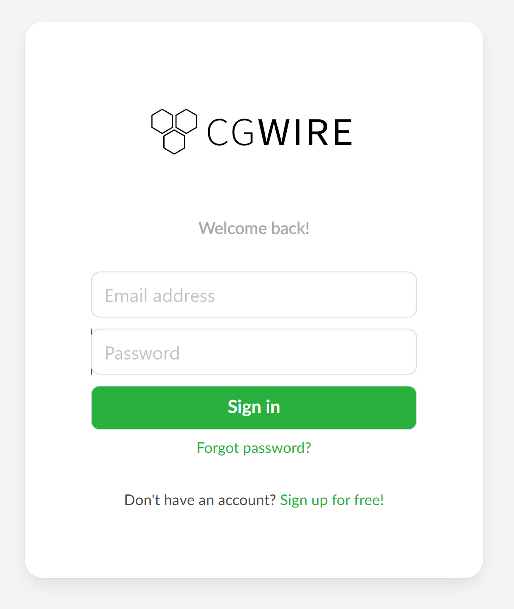
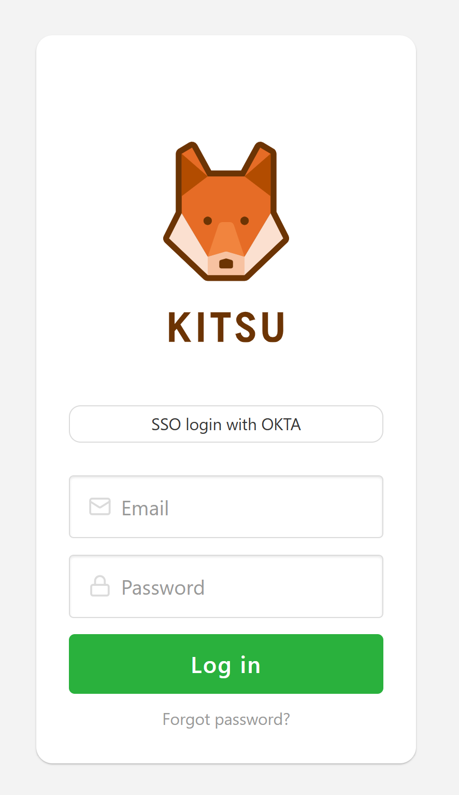
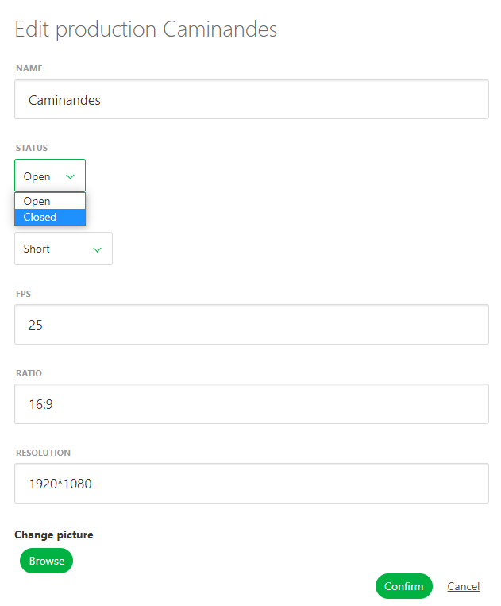
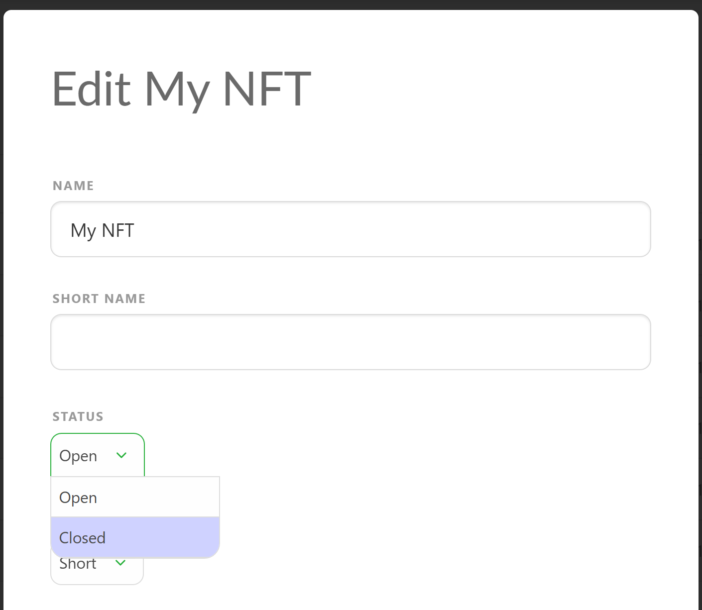

# よくある質問

このFAQガイドでは、Kitsuの一般的な問題に対する簡単な解決策を提供します。ログインの問題、タスク管理、生産の整理など、以下のセクションでステップバイステップの説明と役立つヒントを見つけることができます。さらにサポートが必要な場合は、詳細な[Kitsuのドキュメント](../configure-kitsu/)を確認するか、サポートにお問い合わせください。

---

## ログインの問題

### Kitsuにログインできません
まず、使用している**ウェブアドレス**を確認してください。

- ウェブアドレスが **account.cg-wire.com/signin** でCGWireのロゴが表示されている場合は、**間違ったページ**にアクセスしています。
  
  

  **アカウントページ**は、購読や請求書の管理専用です。購読を登録していない限り、アクセスできません。

- Kitsuインスタンスの正しいウェブアドレスは、**your-studio-name.cg-wire.com** の形式である必要があります。このページでは、Kitsuのロゴとログイン画面が表示されます。

  

正しいリンクがわからない場合は：
- 受信した招待メールを確認してください。
- スタジオの管理者にお問い合わせください。

---

## タスク管理

### 新しいタスクタイプを作成しましたが、生産に表示されません
新しいタスクタイプを作成した場合（[ドキュメントを参照](../configure-kitsu/#task-types)）、それが生産に表示されない場合は、**Studio Library**で作成されたタスクタイプを**Production Library**に明示的に追加する必要があります。

#### 違いを理解する：
- **Studio Library**：スタジオ全体で使用するすべてのタスクタイプが最初に作成され、保存される場所です。
- **Production Library**：各生産には独自のライブラリがあり、使用する前にタスクタイプをここに追加する必要があります。

#### 生産にタスクタイプを追加する手順
1. ナビゲーションメニューから生産の**設定**ページに移動します。  
   

2. **タスクタイプ**タブに移動します。  
   

3. 適切なエンティティタブ（例：アセット、ショット、シーケンス、エピソード、編集）を選択します。  
4. 右側のリストからタスクタイプを見つけてクリックして追加します。

追加が完了したら、エンティティページに戻り、**タスクタイプを追加**をクリックします。  

:::warning
**権限**:  
   メインメニューに**設定**オプションが表示されない場合、必要な権限を持っていない可能性があります。この場合は、スタジオ管理者に連絡してください。
:::

---

### タスクタイプの列が正しい順序になっていません
タスクタイプの列が順序通りでない場合は、以下の方法で調整できます：

- **スタジオ全体の順序**:  
  1. メインメニューの**管理者**セクションで**タスクタイプ**をクリックします。  
     
  2. タスクタイプをドラッグ＆ドロップして希望の順序に並べ替えます。  
     

- **生産固有の順序**:  
  1. 生産の**設定**ページに移動します。
  2. **タスクタイプ**タブに移動し、ドラッグ＆ドロップで順序を調整します。

---

### タスクタイプの列が表示されていません
エンティティページでいくつかのタスクタイプの列が表示されない場合：

1. 部門フィルターを確認し、**すべての部門**に設定されていることを確認してください。  
   

2. **追加情報を表示**ボタンがハイライトされていることを確認してください。  
   

3. 列が縮小されている場合、追加情報が表示されないと列は表示されません。

---

## チームと割り当て

### タスクに誰も割り当てることができません
コメントパネルの担当者リストが空の場合、**People**ページに追加した人が生産に追加されていないことを意味します。

#### 生産に人を追加する手順
1. 生産メニューから**チーム**ページに移動します。  
   

2. **チーム**ページは空ですが、右側に人のリストが表示されます。  
   

3. 個別または部門ごとに人を追加します。

追加後、彼らは生産にアクセスできるようになり、タスクを割り当てることができます。

---

### 割り当てがすべて消えました
担当者のアバターが表示されなくなった場合：

1. **割り当てを非表示**ボタンを誤ってクリックしていないか確認してください。  
   

2. ボタンを再度クリックすると、アバターが再表示されます。

---

## 生産管理

### 生産を削除またはアーカイブする方法
生産へのアクセスが不要になった場合：

1. メインメニューから、**STUDIO**セクションの**生産**を選択します。  
   

2. アーカイブしたい生産を見つけ、編集ボタンをクリックします。  
   

3. **ステータス**を**オープン**から**クローズ**に変更して確定します。  
   

アーカイブされた生産はナビゲーションメニューには表示されなくなりますが、引き続きアクセス可能です。

---

## その他

### 使用中のストレージを確認するには？
現在、Kitsuではインターフェイスやアカウントページでストレージ使用量を直接表示する機能はありません。そのため、アプリ内での生産やアセットの使用量を確認することはできません。

使用中のストレージを確認する必要がある場合：
- Kitsuがスタジオのサーバーでホストされている場合は、システム管理者またはITチームにお問い合わせください。
- クラウドホスティングされたKitsuインスタンスを使用している場合は、**support@cg-wire.com** にスタジオ名とアカウント情報を記載してメールを送信してください。当社のチームが必要な情報を提供します。