# 長編映画制作の作成

Kitsuでワークフローを設計し、より多くの人を招待したので、今度は制作を作成します。 

[新しい制作を作成]ボタンをクリック
します。

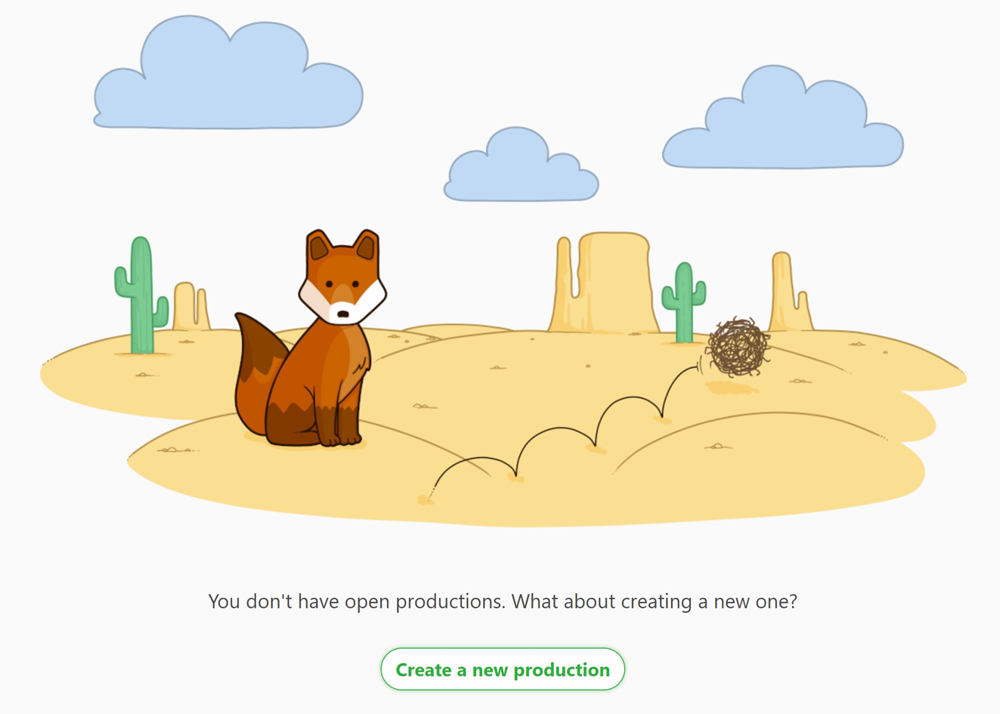

作品名を入力し、**タイプ**として**長編映画**を選択し、作品のスタイル（2D、3D）を選択します。

次に、FPS数、アスペクト比、解像度などの技術情報を入力します。

これらのデータは、Kitsuがアップロードされたビデオプレビューを再エンコードする際に使用されます。

次に、作品の開始日と終了日を定義する必要があります。

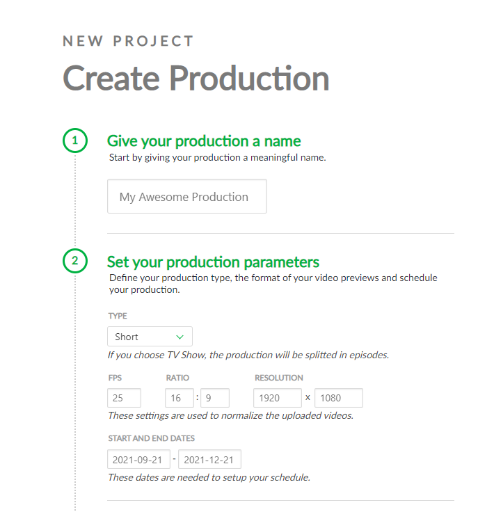

プロダクションのワークフローは、次のパート3から6で定義できます。

アセットタスクタイプ（3）、ショットタスクタイプ（4）、タスクステータス（5）、アセットタイプ（6）を選択する必要があります。

::: ヒント
**制作ワークフロー**を作成するには、グローバルライブラリからタスクタイプを選択します。

タスクタイプをいくつか見落としていたことに気づいた場合は、後で作成することができます。

[スタジオワークフロー](../first_production/README_configure_Kitsu.md#studio-workflow) のセクションを参照してください。
:::

次に、7と8はオプション部分です。アセット/ショットの一覧が記載されたスプレッドシートがすでに用意されている場合は、

**インポートCSV**のセクションを参照してください。

[アセットのインポート](../batch-action/README.md#create-assets-from-a-csv-spreadsheet-file)

[ショットのインポート](../batch-action/README.md#create-shots-from-a-csv-spreadsheet-file)

 ボタンですべてを検証します。

## Kitsuグローバルページの紹介

Kitsuのグローバルアセットページへようこそ。

見てみましょう。

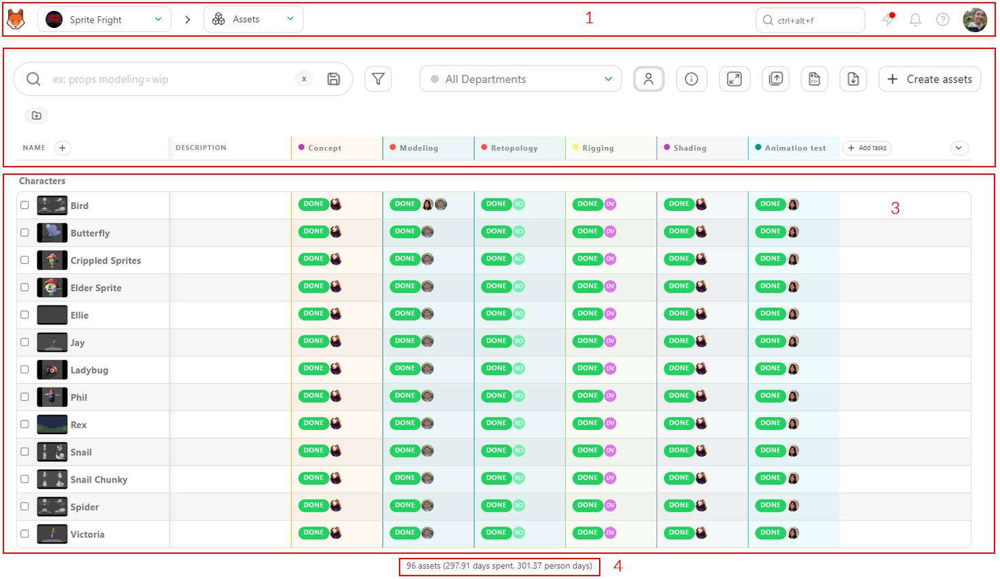

上部 (1) には、**グローバルナビゲーション** があり、これはすべての制作ページで常に表示されます。

**左から右へ:**

### メインメニュー

左上のボタン、Kitsu（またはお客様のスタジオロゴ）をクリックすると、メインメニューが開きます。

メインメニューでは、割り当てられたタスク、制作物、グローバルおよびチームスケジュール、ワークフローのカスタマイズページ、およびKitsu設定に直接アクセスできます。

::: 詳細 メインメニューの詳細
**ワークスペース**
- マイタスク：割り当てられたタスク 
- マイチェック：あなたの部署に応じて、ステータスが**フィードバックリクエスト**となっているすべてのタスク
- マイプロダクション：プロダクションページの選択に戻ります。

**スタジオ**
- プロダクション
- 担当者
- タイムシート
- メインスケジュール
- チームスケジュール
- すべてのタスク
- ニュースフィード
- エンティティ検索

**ADMIN**
- 部署
- タスクの種類
- アセットの種類
- カスタムアクション
- 自動化
- 3D背景
- ボット
- 設定
- ログ

::: 警告 権限の表示
ワークスペースセクションは、アーティストには表示されない「マイチェック」を除くすべての権限に対して有効になっています。

アーティスト（およびそれ以上）は、自身の**タイムシート**も表示でき、**エンティティ検索**にもアクセスできます
:::

### ナビゲーション

メインメニューアイコンの右側にナビゲーションドロップダウンメニューが表示されます。

制作を選択できます。実際の制作名と実際のページ名が常に表示されます。

ドロップダウンメニューを使用して、制作から制作へと移動できます（複数の制作がある場合）。

制作を選択すると、次のドロップダウンメニューで、その制作の異なるページを移動することができます。

::: 詳細 ナビゲーション詳細
最初のセクションは、タスクのトラッキングについてです。
- アセット
- ショット
- シーケンス
- 編集（特定のタスクを作成した場合）

2番目のセクションは、制作の側面についてです。
- コンセプト
- ブレイクダウン
- プレイリスト
- ニュースフィード

3番目のセクションは統計情報です
- シーケンス統計
- アセットタイプ統計

4番目のセクションはチーム管理に関連しています
- スケジュール
- クォータ
- チーム

5番目のセクションは制作の設定です
- 設定

::: ヒント
アセットページから開始しますが、制作ホームページを他のエンティティに変更することができます（設定ページを参照）。
:::

### グローバル検索、ニュース、通知、およびドキュメント
グローバル検索はナビゲーションドロップダウンメニューの右側にあります。 4つの最初の結果を表示するクイックアクセス検索です。 さらに多くの結果やフィルタリングオプションが必要な場合は、**エンティティ検索**ページを参照してください。

次のアイコン  は、ニュースとフィードバックページへの直接リンクです。

アニメーションGIFで新機能のすべてをご覧いただけます。また、Kitsuに追加してほしい次期機能に関するご意見もご投稿いただけます。

ベルのアイコンは、通知（割り当て、コメント、タグ）を表示します！[通知](../img/getting-started/notification_icon_on.png)。未読の通知の数は、ベルのアイコンに表示されます。

アバターの直前のアイコンは、ドキュメントボタンです。
 あなたが今読んでいるドキュメントです！

### 個人設定
アバターをクリックすると、メニュー（設定、ドキュメントなど）を開くことができます。

## タスクリスト

### エンティティスプレッドシート

画面の2番目の部分は、すべてのエンティティ（アセット、ショット、シーケンス、編集）に共通です。これはグローバルなタスクスプレッドシートです。

ここでは、各タスクのステータス、割り当て、優先度などを確認できます。

::: ヒント
スプレッドシートの最初の行と列のヘッダーは、ページを下にスクロールしても常にページの上部に表示されます。

また、他の列を常に表示しておくために「固定」することもできます。
:::

### フィルター

左側の最初の要素はフィルターボックスです。 簡単なフィルタリング、シーケンス、アセットタイプなど、お好きなものを入力できます。

より高度なフィルタリングが必要な場合は、フィルタービルダーボタンを使用してください。

すべてのフィルターを保存し、ページとして使用することができます。

::: 警告
長編映画のフィルターを起動するには、キーボードの「**Enter**」キーを押す必要があります。
:::

### 表示の簡素化

画面の右側には、左から右へ、アサインメントの表示/非表示、追加カラムの表示/非表示、サムネイルの拡大/縮小を行うためのボタンがあります。
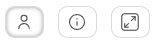

### インポート / エクスポート
バッチインポートサムネイル 、最後にインポート  またはエクスポート  データの

### メタデータカラム
以下に、カラムの名前があります。「名前」の隣にある(+)をクリックしてください！[メタデータカラムの追加](../img/getting-started/add_column_custom.png)をクリックすると、新しいメタデータカラムを作成できます。次に、タスクタイプのカラムの名前があります。

### ビューのカスタマイズ
画面の一番右側にあるスクロールバーの隣に、テキストカラムの非表示/表示オプションがあります

。

### ビューの要約
画面の一番下にある最後の部分（4）は、表示されているページの要約です。ページにフィルタを適用すると、要約も更新されます。

アセットまたはショットの数、見積もり日数、およびすでに費やした日数の合計を確認できます。

## アセットの作成
### 最初のアセットの作成
制作を作成し、Kitsuインターフェースの概要を理解したので、最初のアセットを作成してみましょう。

アセットページで、**[アセットを追加]**をクリックします。

::: 警告
アセットを作成すると、タスクワークフローが適用され、**すべてのタスクがアセットと同時に作成されます**。
:::

ポップアップウィンドウが開きます。

**アセットタイプ**を選択するよう求められます（1）。
新しいアセットタイプを追加していない場合、Kitsuは「キャラクター」、「環境」、「エフェクト」、「小道具」などの例を提供します。
まずはキャラクターから始めましょう。

::: ヒント
アセットタイプリストとタスクパイプラインはカスタマイズすることもできます。
[ワークフローのカスタマイズ](../customization-pipeline/README.md#modify-an-existing-asset-types) )
:::

**名前**を入力し (2)、アーティストが何をすべきか理解し、アセットを素早く識別できるように説明を入力します。

複数のアセットを作成する場合は、**[Confirm and stay]**をクリックします。

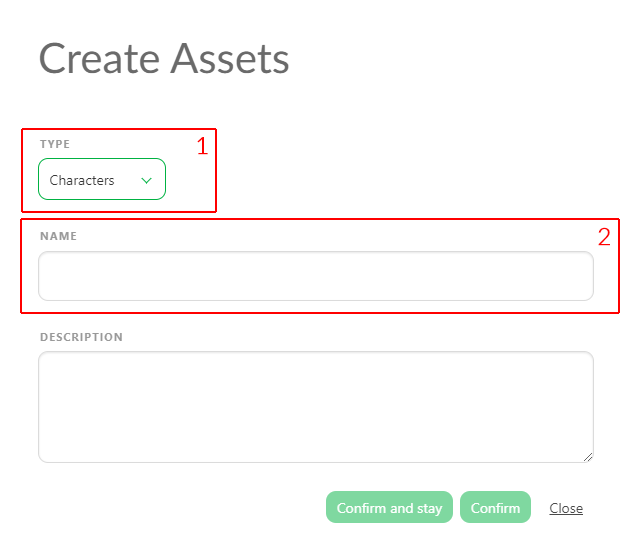

アセットの種類を変更して、アセットを追加し続けることができます。

::: ヒント
「確認して退出」をクリックするたびに、新しく作成されたアセットが背景に表示されます。
:::

最後のアセットを追加したら、
「確認」をクリックします。アセットが作成され、ウィンドウが閉じます。

ヒント
「確認して続行」をクリックしたものの、追加するアセットがないことに気づいた場合は、「閉じる」をクリックすると、ウィンドウがキャンセルされます。
ヒント

また、アセットワークフローで選択されたタスクも同時に作成されます。

さらに**アセット**を追加する必要がある場合は、**+ Create assets**（アセットの作成）ボタンをクリックします。

::: 詳細 CSVスプレッドシートファイルからアセットを作成
アセットのリストがすでにスプレッドシートファイルに用意されている場合もあります。
Kitsuでは、インポートする方法が2つあります。1つ目は、`.csv`ファイルをインポートし、データを直接Kitsuにコピー＆ペーストする方法です。

まず、スプレッドシートを`.csv`ファイルとして保存します。

次に、Kitsuのアセットページに戻り、**インポート**アイコンをクリックします。

ポップアップウィンドウの**「CSVからデータをインポート」**が開きます。**「参照」**をクリックして、`.csv`ファイルを選択します。

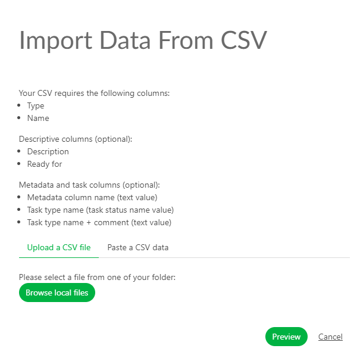

結果を確認するには、**[プレビュー]**ボタンをクリックします。

データのプレビューで列の名前を確認し、調整することができます。

注：**[エピソード]**列は、**[テレビ番組]**制作の場合のみ必須です。

すべてが適切であることを確認したら、**[確認]**ボタンをクリックしてデータをKitsuにインポートします。

これで、すべてのアセットがKitsuにインポートされ、設定に従ってタスクが作成されました。

:::

::: 詳細 スプレッドシートファイルのコピー/ペーストによるアセットの作成

スプレッドシートを開き、データを選択してコピーします。

次に、Kitsuのアセットページに戻り、**インポート**アイコンをクリックします
。

ポップアップウィンドウ**CSVからのインポート**が開きますので、**CSVデータの貼り付け**タブをクリックします。

以前に選択したデータを貼り付け、**[プレビュー]**ボタンで結果を確認できます。

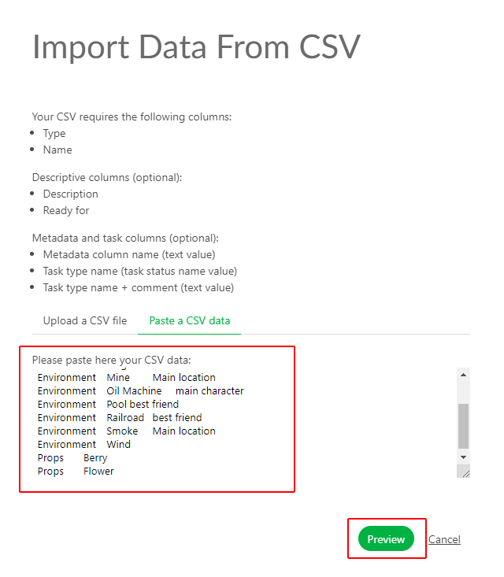

データのプレビューで列の名前を確認し、調整することができます。

注意：**エピソード**の列は、**テレビ番組**の制作の場合のみ必須です。

すべて問題なければ、**確認**ボタンをクリックしてデータをKitsuにインポートします。

これで、すべてのアセットがKitsuにインポートされ、設定に従ってタスクが作成されました。

:::

### アセットの詳細を確認する

アセットの詳細を確認するには、その名前をクリックします。

新しいページが開き、右側にタスク、割り当て、ステータスのニュースフィードの一覧が表示されます。

各タスクのステータスをクリックすると、コメントパネルが開き、コメントの履歴や異なるバージョンを確認できます。

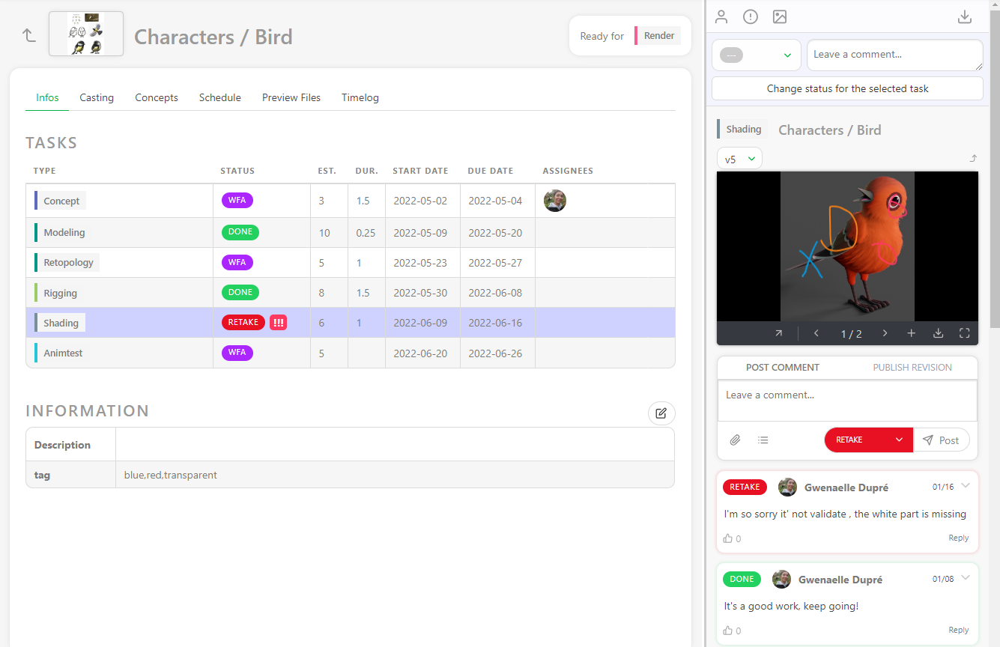

また、**キャスティング**にもアクセスできます。

このアセットに関連付けられた**コンセプト**にもアクセスできます。

**スケジュール**は、タスクタイプページのデータを事前に記入していれば利用できます。すでにデータを記入している場合は、ここで直接修正できます。 

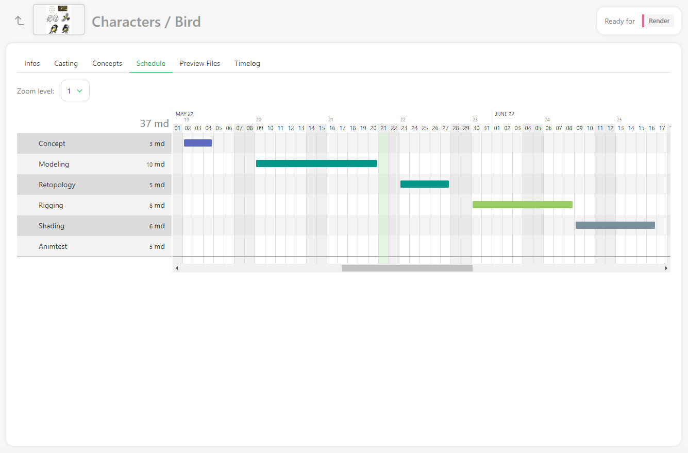

さまざまなタスクタイプでアップロードされた**プレビューファイル**、 

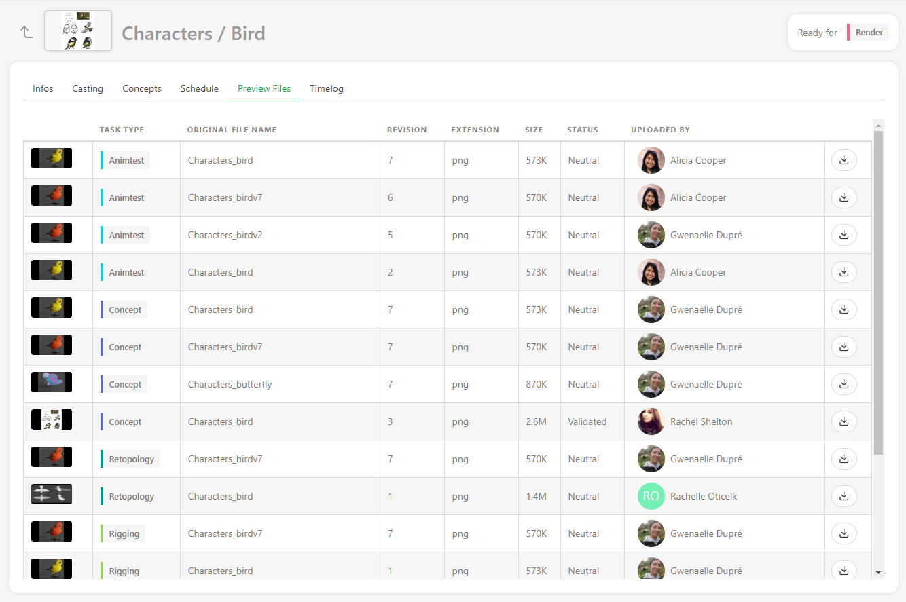

そして、このアセットのタスクでタイムシートが記入された場合の**タイムログ**。

## アセットを作成した後にタスクを追加する

アセットを作成した後にタスクが欠けていることに気づいた場合でも、追加することができます。

まず、欠けているタスクタイプがタスクタイプタブの設定ページに追加されていることを確認します。

次に、アセットページに戻り、**+ タスクを追加**をクリックします

### アセットを更新する
アセットはいつでも更新でき、名前やアセットタイプを変更したり、説明文を修正したり、グローバルページに追加したカスタム情報を追加したりすることができます。

アセットを編集するには、アセットページに移動し、編集したいアセットの上にカーソルを合わせて、**編集**ボタンをクリックします
！[編集ボタン](../img/getting-started/edit_button.png) (1) の右側にある
行をクリックします。

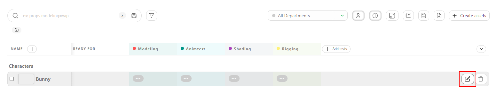

アセットのメインページの説明を拡張するには、最初の語句 (2) をクリックすると、説明の全文を含むポップアップが開きます。

アセットを削除するには、FAQ : [アセットの削除方法](../faq-deletion/README.md##how-to-delete-an-asset)を参照してください。

::: 詳細 CSV インポートによるアセットの更新
CSV インポートを使用すると、データを素早く更新することができます。

アセットの**タイプ**、**アサイン**、タスクの**ステータス**を更新したり、**コメント**を追加したりすることができます。

**既存のデータを更新する**オプションをオンにする必要があります。すると、更新される行が
青くハイライトされます。

:::

::: 詳細 スプレッドシートファイルのコピー＆ペーストによるアセットの更新

スプレッドシートを開き、データを選択してコピーします。

次に、Kitsuのアセットページに戻り、**インポート**アイコンをクリックします
！[インポートアイコン](../img/getting-started/import.png)。

ポップアップウィンドウ「**CSVからデータをインポート**」が開きます。「**CSVデータを貼り付け**」タブをクリックします。

！[インポートデータコピーペーストタブ](../img/getting-started/import_pastcsvdata_asset.png)

以前に選択したデータを貼り付け、**[プレビュー]** ボタンで結果を確認できます。

データをプレビューして、列の名前を確認し、調整することができます。

注：**[エピソード]** 列は、**[テレビ番組]** 制作の場合のみ必須です。

オプション「**既存データの更新**」をオンにする必要があります。すると、更新される行が
青くハイライトされます。

すべてのアセットをKitsuにインポートし、設定に従ってタスクを作成しました。

:::

## コンセプトの作成
### コンセプトのアップロード

**コンセプト**を作成するには、ナビゲーションメニューから**コンセプト**ページに移動します。

コンセプトをアップロードするには、「**コンセプトへの新しい参照を追加**」ボタンをクリックします。

同時に1つまたは複数のコンセプトをアップロードできます。

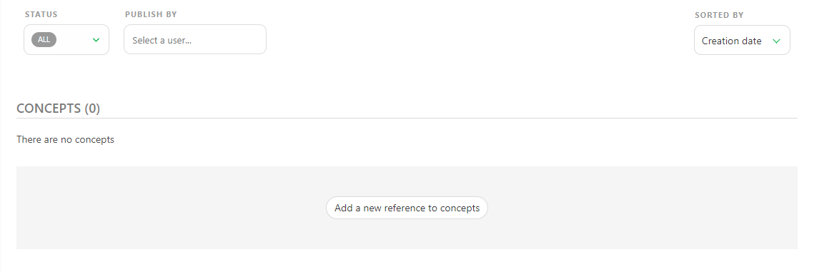

プレビューをアップロードすると、コンセプトページは次のようになります。

コンセプトとやりとりするには2つの方法があります。画像をクリックすると拡大表示されます。
もう1つはステータス部分をクリックして右側の**コメントパネル**を開く方法です。

コメントパネルでは、コンセプトを既存のアセットにリンクするか、削除するかの2つのオプションがあります。
また、アセットにコメントを追加したり、ステータスを変更することもできます。

**コンセプト**ごとに1つのバージョンを持つことが基本です。承認されていない場合は、同じコンセプトの複数のバージョンを作成しないよう、新しいコンセプトをアップロードする必要があります。

1つのコンセプトは1つのタスクです。

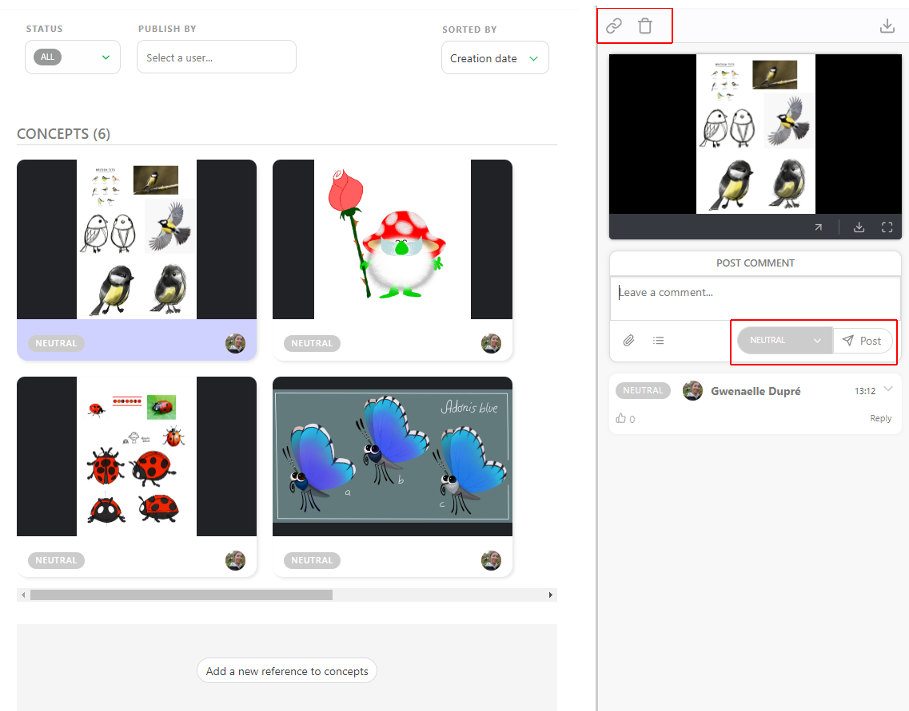

### コンセプトとアセットのリンク

コンセプトをアップロードすると、アセットにリンクすることができます。

リンクはアセットのステータス部分で確認できます。

コンセプトのステータス部分をクリックすると、右側にコメントパネルが開きます。

コメントパネルの上部には、コンセプトをアセットにリンクするか、コンセプトを削除するかの2つのオプションがあります。

アセットをリンクするには、[リンク] ボタン  をクリックします。

Kitsu が、アップロードしたコンセプトにリンク可能なすべての **アセット** を表示します。

Kitsu は、コメントパネルの上部にリンクされたアセットをリスト表示します。現時点では、リンクはありません。

アセットをリンクするには、それをクリックします。リンクされたアセットの名前は、コンセプトのプレビューの下の画面の上部に表示されます。

コンセプトがアセットにリンクされると、アセットの詳細ページで確認できます。

アセットページに戻り、コンセプトを確認したいアセット名をクリックします。

デフォルトでは、キャスティングの詳細が画面の2番目の部分に表示されます。
ドロップダウンメニューを使用してコンセプトを選択します。

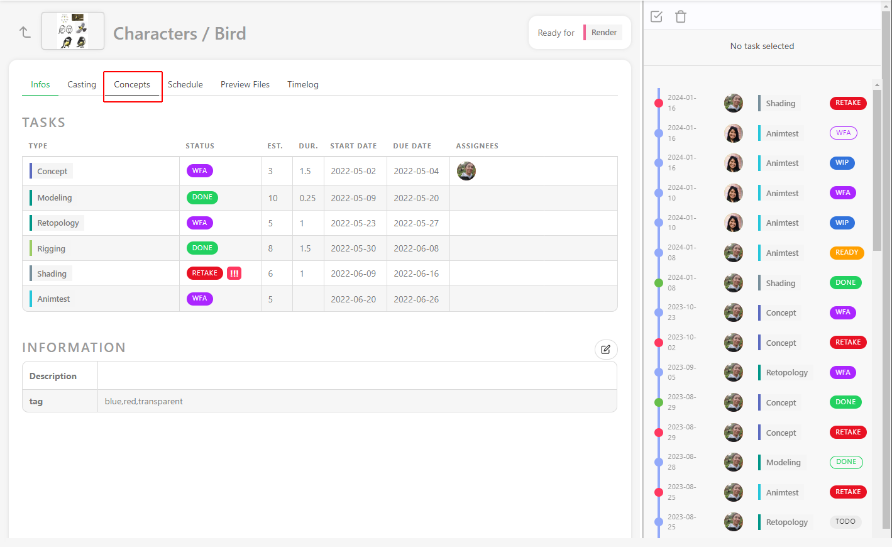

コンセプトセクションに入ると、このアセット用に作成されたすべてのコンセプトが表示されます。ステータスごとにフィルタリングすることができます。

## ショットの作成
### 最初のショットの作成

制作用の**ショット**を作成する時が来ました。

::: 警告
ショットは、Kitsuのシーケンスにリンクされています。
つまり、シーケンスを作成してから、そのシーケンスにショットを追加する必要があります。
:::

ショット**ページに移動する必要があります。
ドロップダウンメニューを使用して、**ショット**をクリックします。

ショット作成を開始するには、**ショットを追加**ボタンをクリックします。

::: 警告
ショットを作成すると、設計したタスクワークフローが適用され、すべてのタスクがショットと同時に作成されます。
:::

ショットの作成用に新しいポップアップが開きます。
これでシーケンスとショットを作成できます。

最初のシーケンス、例えば「sq01」を入力し、
次に**追加**します。

シーケンスが作成されたことが確認できます。このシーケンスにショットを追加するには、シーケンスを選択し、ショットを作成します。

例えば、ショットの列に「sh0010」と入力し、再度**追加**します。
ショットのパディングを定義することもできます。

::: ヒント
ショットをSH0010、SH0020、SH0030のように10個ずつ作成したい場合は、**ショットパディング**を10に設定します
:::

新しいショットがシーケンスごとにリスト化され、リンクされているのが確認できます。
これで最初のシーケンスの最初のショットが作成されました。

それでは、1つ以上のショットを追加してみましょう！ご覧の通り、ボックスにはすでに名前のコードが含まれていますが、
増分されています。そのため、**追加**をクリックして
さらにショットを作成する必要があります。

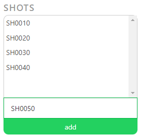

シーケンスを追加するには、左側部分に移動し、新しいシーケンスの名前を入力し、**追加**をクリックします。
2番目のシーケンスが選択され、ショットを追加できるようになります。

::: ヒント
ショットがシーケンス上で誤って配置された場合は、ショットを編集する必要があります
！[編集ボタン](../img/getting-started/edit_button.png)をクリックし、
シーケンスを変更します。
！[ショットの編集 シーケンスの変更](../img/getting-started/edit_shot.png)

！[シーケンスの変更](../img/getting-started/change_seq.png)
:::

ショットを削除するには、FAQを参照してください。 : [ショットの削除方法](../faq-deletion/README.md#how-to-delete-a-shot)

シーケンスを削除するには、FAQを参照してください。 : [シーケンスの削除方法](../faq-deletion/README.md#how-to-delete-a-sequence)

## EDLファイルからショットを作成
すでに**EDL**ファイルにショットリストが用意されているかもしれません。
Kitsuでは、**EDL**ファイルを直接インポートして、シーケンス、ショット、フレーム数、フレームイン/アウトを作成することができます。

**グローバルショットページ**には、**[インポートEDL]**ボタンがあります。

ポップアップで、編集時に使用するビデオファイルの命名規則を選択できます。

これは、プロジェクト_シーケンス_ショット.拡張子という名前で編集上のビデオクリップが命名されていることを意味します。

LGC制作のEDLの例です。

動画ファイルの名前はLGC_100-000.movです。これは、LGCが制作名、100がシーケンス名、000がショット名であることを意味します。

命名規則が決まったら、EDLファイルをインポートできます。

次に、**[Upload EDL]**をクリックします。

すると、Kitsuがショットを作成します。

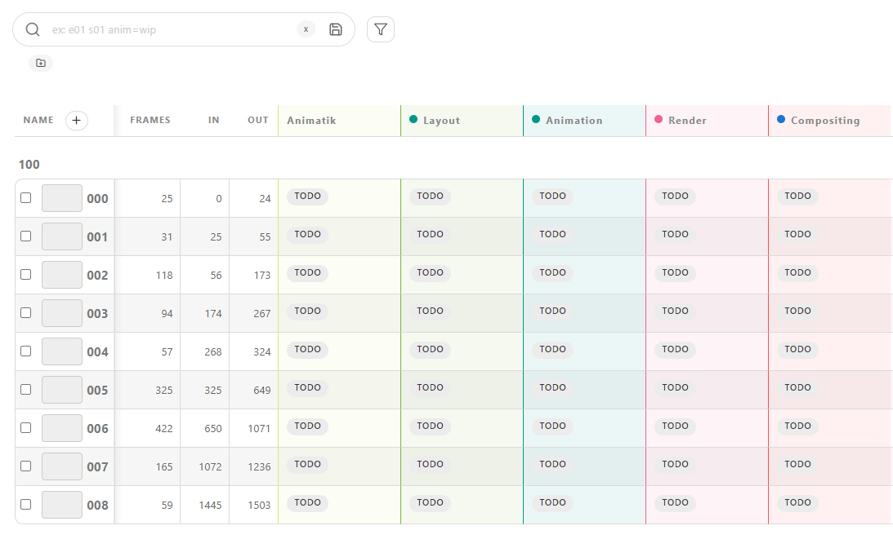
:::

::: 詳細 CSVスプレッドシートファイルからショットを作成
ショットのリストがすでにスプレッドシートファイルに用意されているかもしれません。
Kitsuでは、インポートする方法が2つあります。1つ目は、`.csv`ファイルを直接インポートする方法、2つ目は、データを直接Kitsuにコピー＆ペーストする方法です。

まず、スプレッドシートを`.csv`ファイルとして保存します。

次に、Kitsuのショットページに戻り、**インポート**アイコンをクリックします。

「CSVからデータをインポート」というポップアップウィンドウが開きます。「参照」をクリックして、`.csv`ファイルを選択します。

結果を確認するには、「プレビュー」ボタンをクリックします。

データのプレビューで、列の名前を確認し、調整することができます。

注：**エピソード**の列は、**テレビ番組**制作の場合のみ必須です。

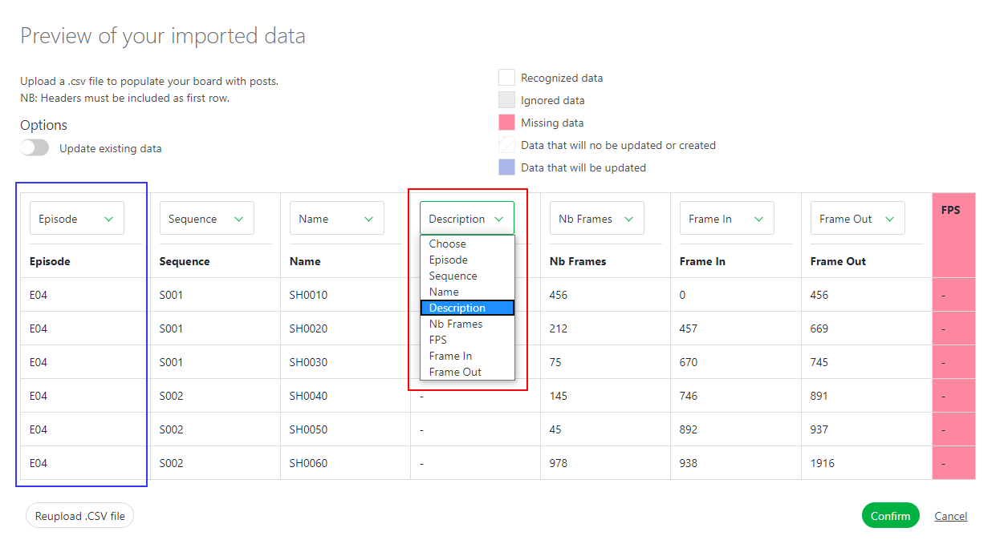

すべてが適切であることを確認したら、**確認**ボタンをクリックしてデータをKitsuにインポートします。

すべてのショットがKitsuにインポートされ、**設定**に従ってタスクが作成されます。

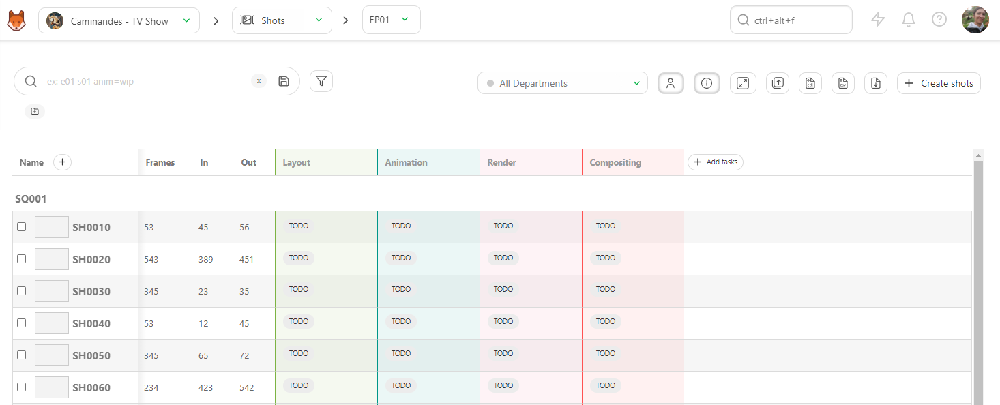
::::

:::: 詳細 スプレッドシートファイルのコピー＆ペーストによるショットの作成
スプレッドシートを開き、データを選択してコピーします。

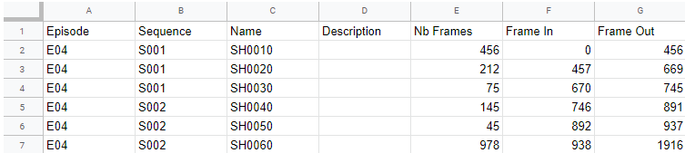

次に、キットゥのショットページに戻り、**インポート**アイコンをクリックします
！[インポートアイコン](../img/getting-started/import.png)。

ポップアップウィンドウ「**CSVからデータをインポート**」が開きます。「**CSVデータを貼り付け**」タブをクリックします。

！[インポートデータコピーペーストタブ](../img/getting-started/import_pastcsvdata_shot.png)

以前に選択したデータを貼り付け、**[プレビュー]** ボタンで結果を確認できます。

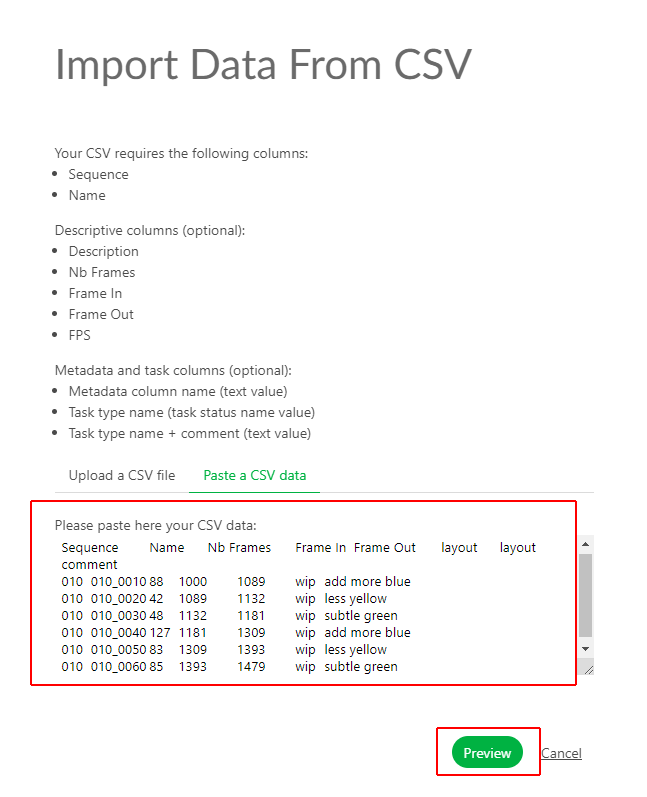

データのプレビューで列の名前を確認し、調整できます。

注：**[エピソード]** 列は、**[テレビ番組]** 制作の場合のみ必須です。

すべてが正しく入力されたら、**Confirm**ボタンをクリックしてデータをKitsuにインポートします。

すべてのショットがKitsuにインポートされ、**設定**に従ってタスクが作成されます。

:::

### ショットの詳細を確認する

ショットの詳細を確認したい場合は、ショット名をクリックします。

新しいページが開き、右側にタスク、アサイン、ステータス・ニュースフィードの一覧が表示されます。
タブ名をクリックすることで、各ページを移動できます。

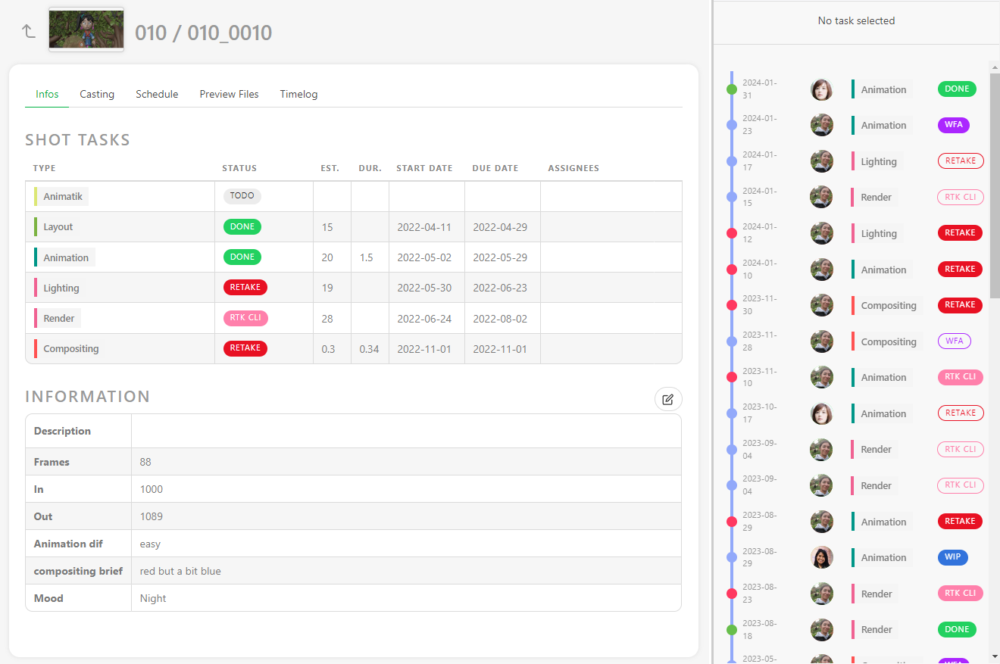

各タスクのステータスをクリックすると、コメントパネルが開き、コメントの履歴や異なるバージョンを確認できます。

また、**キャスティング**にもアクセスできます。

**スケジュール**は、タスクタイプページのデータを事前に記入している場合に利用できます。すでにデータを記入している場合は、ここで直接修正できます。 

各種タスクタイプでアップロードされた**プレビューファイル**、

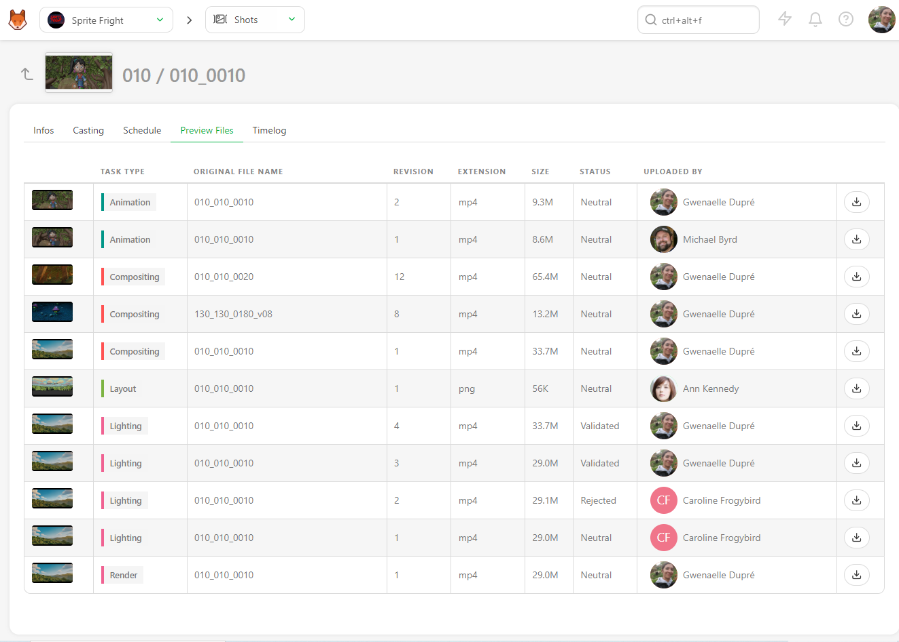

そして、このアセットのタスクでタイムシートが記入された場合の**タイムログ**。

## ショットを作成した後にタスクを追加する
ショットを作成した後にタスクが不足していることに気づいた場合でも、追加することができます。

まず、不足しているタスクタイプがタスクタイプタブの設定ページに追加されていることを確認します。

次にショットページに戻り、+タスクを追加をクリックします。

### ショットを更新する

ショットはいつでも更新でき、名前や順序を変更したり、説明を修正したり、グローバルページに追加したカスタム情報を追加したりすることができます。

ショットを編集するには、ショットページに移動し、変更したいショットの上にカーソルを移動させて、行の右側にある**[編集]**ボタンをクリックします
！[編集ボタン](../img/getting-started/edit_button.png) (1)。

メインショットページの説明を拡張するには、最初の文字 (2) をクリックすると、説明の全文を含むポップアップが開きます。

::: 詳細 ショット情報のCSVインポートによる更新
CSVインポート**を使用して、**NBフレーム**、**フレームIN**、**フレームOUT**、または任意のカスタム**メタデータ列**としてデータを更新することができます。

アサインメント**、タスクの**ステータス**を更新し、**コメント**を追加することができます。

スプレッドシートを開き、データを選択してコピーします。

次に、Kitsuのショットページに戻り、**インポート**アイコンをクリックします
。

ポップアップウィンドウ**インポートデータからCSV**が開きます。**CSVデータを貼り付け**タブをクリックします。

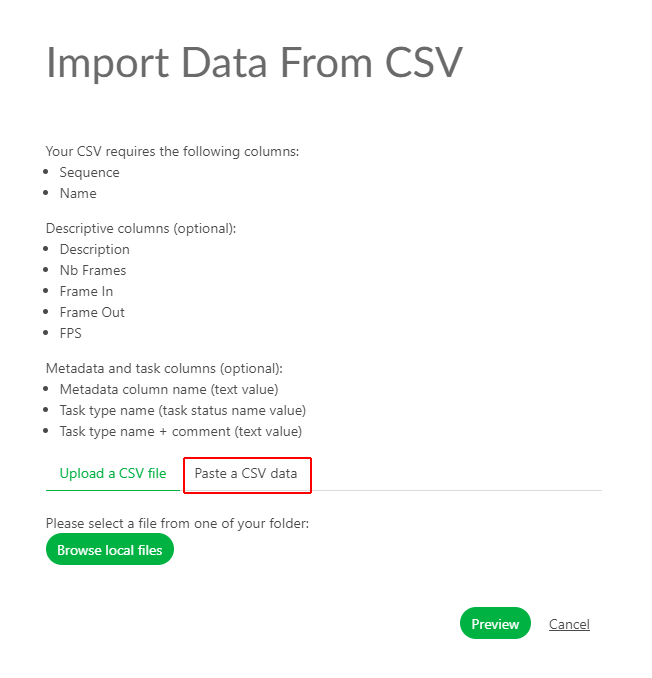

以前に選択したデータをペーストし、**[プレビュー]**ボタンで結果を確認できます。

オプション：既存データの更新** をオンにする必要があります。
更新されたショットは青くなります。

注：**エピソード**の列は、**テレビ番組**制作の場合のみ必須です。

すべてが正しく入力されたら、**Confirm** ボタンをクリックしてデータをKitsuにインポートします。

すべてのショットがKitsuにインポートされ、**Settings**に従ってタスクが作成されます。

:::

## ショットにフレーム数とフレーム範囲を追加する

この段階では、アニマティックが完了しているはずです。つまり、
各ショットの長さ（**フレーム数**、**フレーム範囲イン**、**フレーム範囲アウト**）が分かっているはずです。
この情報をスプレッドシートに追加できます。この方法であれば、
すべてのフレームが計算され、抜けや過剰計算がないことを確認できます。

::: 警告
ショットとシーケンスを手動で作成した場合、
「フレーム」列は非表示になります。「フレーム」列を表示するには、少なくとも1つのショットを編集してフレーム数を入力する必要があります。
ショットをCSV/スプレッドシートで作成し、フレーム数をインポートした場合は、列が表示されます。
:::

ショットを編集してフレーム範囲の情報を入力する必要があります。
編集ボタンをクリックしてください！[編集ボタン](../img/getting-started/edit_button.png)
ショット行の右側にある

！[ショット編集 シーケンス変更](../img/getting-started/edit_shot.png)

新しいウィンドウでショットの**In**と**Out**を入力できます。その後、**確認**ボタンをクリックして保存します。

これで、ショットページの全体スプレッドシートにフレーム範囲が表示されます。

**フレーム**、**イン**、**アウト**の列のロックを解除したので、
グローバルショットページから直接入力することができます。

入力したいケースをクリックしてデータを追加します。

::: ヒント
**フレームイン**と**フレームアウト**を入力すると、Kitsが自動的に**フレーム数**を計算します。
:::

**CSVインポート**を使用して、フレーム範囲をすばやく更新することもできます。
[CSVインポートでショット情報を更新](../batch-action/README.md#update-shots-information-with-csv-import)

ショット値の履歴にもアクセスできます。

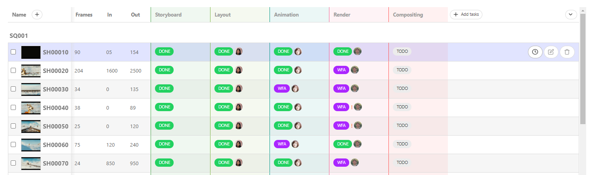

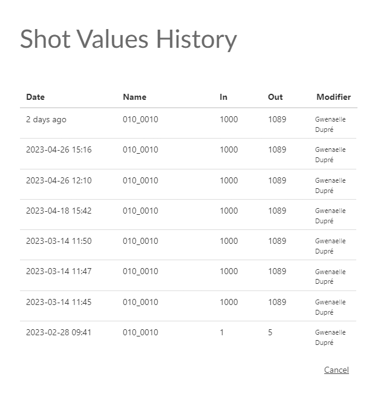

## カスタムメタデータカラムの作成

一般的なスプレッドシートページにさらに情報を追加するには、カスタム**メタデータカラム**を作成する必要があります。

ページに追加する追加情報として、**難易度レベル**、**天候**、**タグ**などがあります。 カスタムメタデータカラムには、すべてのテキスト（または数値）情報を保存できます。

名前カラムの近くにある**+**をクリックします。

タイプ**オプションでは、情報をどのように保存するかを選択できます。
- 自由入力の**テキスト**、
- **数値**、
- **チェックボックス**、
- **選択肢リスト**、
- **タグリスト**、
- **チェックリスト**。

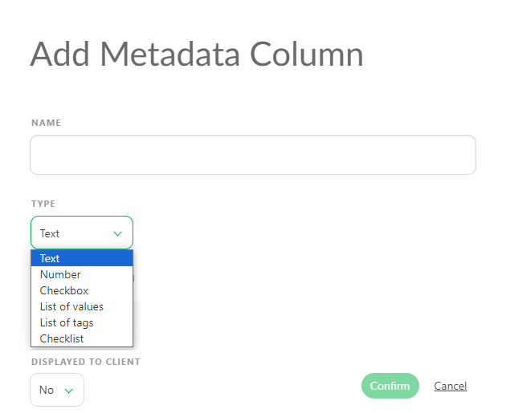

::: 警告 
**テキスト**、**数値**、および**チェックボックス**では、各エンティティに対して異なる情報を追加することができます。 最初に計画する必要はありません。

**値のリスト**、**タグのリスト**、および**チェックリスト**では、各エンティティに対して同じ選択肢が提供されます。さらに、これは現在入力する必要があります。

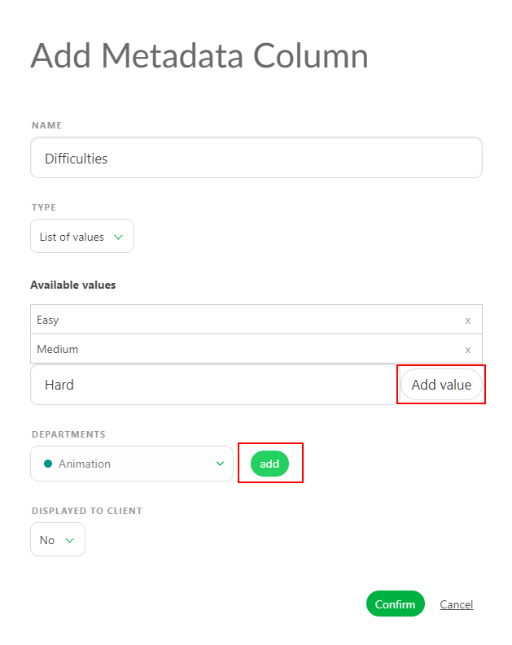

利用可能な値**の下にリスト要素を入力し、**値を追加**をクリックして確認します。
:::

メタデータカラム**を1つまたは複数の**部門**にリンクすることもできます。

::: ヒント
メタデータカラムを部門にリンクします。アーティスト/スーパーバイザーは、自分のToDoページおよび部門フィルタリングビューでこれを見ることができます。

メタデータ列を1つまたは複数の部門にリンクすることができます。リストから部門をクリックし、**追加**をクリックして有効にします。

ここでは、VFX列が2つの部門にリンクされています。

:::

::: 詳細 メタカラムの編集
アセットまたはショットのグローバルページで、メタデータカラムの右端にある矢印をクリックし、**[編集]**をクリックします。

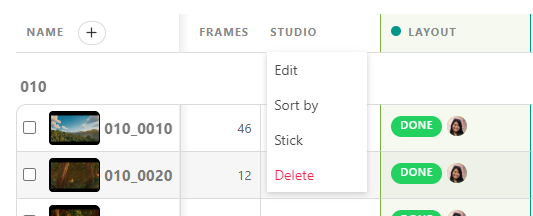
:::

この情報は、グローバルスプレッドシートページで直接入力できます。
ケースは編集可能です。

::: ヒント
左側の複数のエンティティを選択し、メタデータ列を一括で変更することができます。
:::

::: 詳細 手動で編集
編集ボタン  を使用して情報を変更することもできます。

編集ポップアップに新しい行が表示されます。リストから情報を選択するか、
あるいは、選択内容に応じて、自由形式のテキストや数値を入力したり、チェックボックスにチェックを入れたり、チェックリストを使用したりすることができます。

編集が完了したら、必ず「確認」ボタンをクリックしてください。

:::

メタデータ列を編集または削除するには、スプレッドシートの一般ページに移動します。
メタデータ列の名前の近くにある矢印  をクリックします。

::: ヒント
この新しい列を使用して、グローバルページを**ソート**することができます。列名の右にある矢印をクリックして、メニューを開きます。次に、**ソート**をクリックします。

メタデータ列を左側に**固定**することもできます。
:::

## シーケンスの作成

Kitsuでは、**シーケンス**レベルでタスクを追跡することもできます。
これは、
ストーリーやカラーボード、カラーグレーディングなど、マクロタスクを追跡する際に特に便利です。

ナビゲーションメニューを使用して、**シーケンス**ページに移動します。

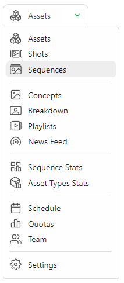

::: 警告
この新しいページは、アセットおよびショットのグローバルページと同様に動作します。

このページを使用するには、まず**グローバルライブラリ**に**シーケンス**属性を持つ専用のタスクタイプを作成する必要があります。

新しい**タスクタイプ**を作成するには、「**パイプラインのカスタマイズ**」セクションを参照してください。

[Pipeline customization](../customization-pipeline/README.md)

グローバルライブラリで**タスクタイプ**を作成したら、それを**
プロダクションライブラリ**（設定ページ）に追加します。
:::

タスクタイプが設定ページで準備できたら、シーケンス（アセットまたはショットと同じ）を作成する必要があります。

この新しいページは、アセットやショットのグローバルページと同様に動作します。**+ 新規シーケンス** ボタンで編集を追加できます。

タスクの割り当て、レビュー、ステータスの変更などを行うことができます。

メタデータ列を追加したり、説明を記入したりすることができます。

::: ヒント
シーケンスは、ここ（+新規シーケンスボタン）から直接作成することも、グローバルショットページからショットにリンクされたシーケンスを作成することもできます。
:::

このページでは、アセットやショットと同様に、シーケンスのエンティティを**名前変更**したり、**削除**したりすることができます。

シーケンス名をクリックすると、そのシーケンスの詳細ページが表示されます。

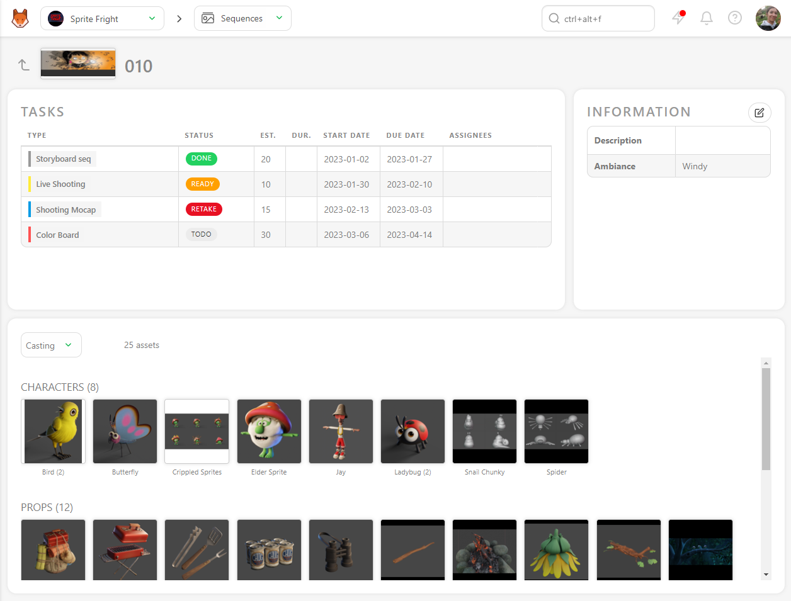

詳細ページでは、シーケンスのキャストにアクセスできます。
シーケンス全体で使用されているすべてのアセットを確認できます。

また、シーケンスのタスクのスケジュール、プレビューファイル、アクティビティ、タイムログにもアクセスできます。

## 編集の作成

Kitsuでは、**編集**レベルでタスクを追跡できます。

特に、
複数の編集を複数の検証ステップで追跡する必要がある場合に便利です。
例えば、映画全体、複数の予告編、ファースト・エディット、ファイン・エディット、ミックスなどを追跡できます。

::: 警告
デフォルトでは、**Edit**ページは、**制作ライブラリ**（設定ページ）にそれ用のタスクタイプが作成されるまで表示されません
:::

このページを使用するには、まず**グローバルライブラリ**に**Edit**属性を持つ専用のタスクタイプを作成する必要があります。

新しい**タスクタイプ**を作成するには、「**パイプラインのカスタマイズ**」セクションを参照してください。

[Pipeline customization](../customization-pipeline/README.md)

グローバルライブラリで**タスクタイプ**を作成したら、**プロダクションライブラリ**に追加します。
すると、ナビゲーションのドロップダウンメニューに**編集**が表示されます。

この新しいページは、アセットおよびショットのグローバルページと同様に動作します。**+ 新規編集** ボタンで編集を追加できます。

タスクの割り当て、レビュー、ステータスの変更などを行うことができます。

メタデータ列を追加したり、説明を記入したりすることができます。

::: ヒント
配信内容によっては、**[編集]** ごとに解像度を変更することもできます。
:::

::: 警告
詳細ページは他のエンティティとは異なります。

**編集**は特定のロングビデオに焦点を当てているため、詳細ページはコメント詳細ページにより似たものとなります。
:::

このページでは、アセットおよびショットエンティティの編集エンティティを**名前変更**および**削除**することができます。

## ブレイクダウンリストの作成

ブレイクダウンを記入すると、ショットの組み立てに役立ちます。
ブレイクダウンには、ショットを作成するために追加する必要のあるアセットのすべての詳細が記載されています。
これにより、何も見落とすことがなくなります。

ドロップダウンメニューで **[BREAKDOWN]** を選択します。

ブレークダウンページの左側には、エピソード/シークエンス/ショットメニュー（1）があります。作成したものの中から選択できます。これらは画面の右側に表示され、
作成したすべてのアセットは、この制作（メインパックおよびエピソード）で利用できます（3）。さらに、
中央セクションには、ショットの選択肢が表示されます（2）。

では、次にキャストしたいショットを選択します。

サムネイルがまだない場合はアセットをテキストで表示したり、
サムネイルのサイズを拡大することができます。

また、ブレイクダウン中にリストにアセットを追加する必要があることに気づくかもしれません。

ブレークダウンページから直接、新しいアセットを作成することができます。「利用可能なすべてのアセット」の右側にある「+」をクリックします。

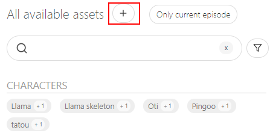

また、複数のショットを一度に選択することもできます。最初のショットをクリックし、**シフト**キーを押したまま、選択する最後のショットをクリックします。

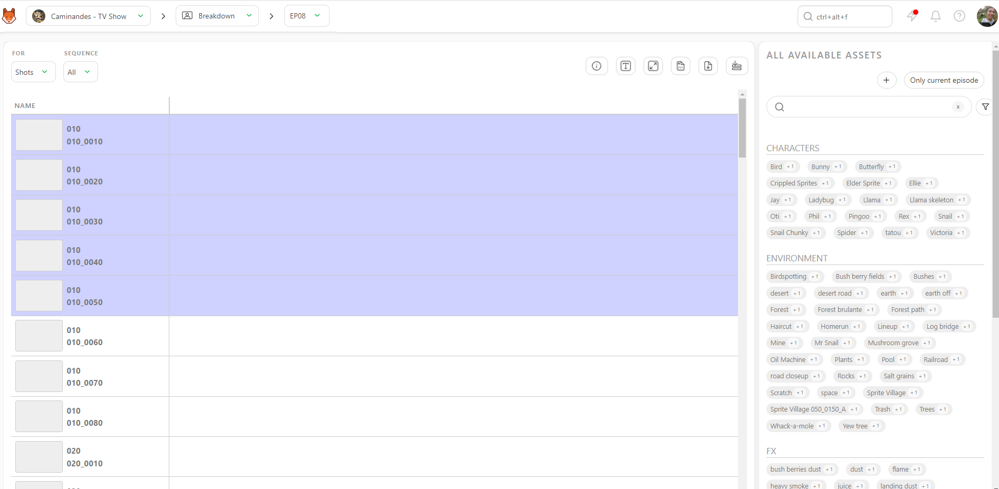

次に、割り当てたいアセットをクリックします。
キャラクター、背景など、右側の部分 (3) から選択します。
複数のショットを選択した場合、選択した内容は多数のショットに適用されます。

アセットが配置されたショットをコピーし、このアセット選択を別のショットに貼り付けます。

アセットの上にカーソルを移動させると、**+1** または **+10** と表示されます。これは、
そのアセットを追加した回数を表しており、必要なだけクリックできます。

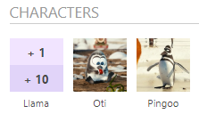

シーケンスやショットを指定せずに、すべてのアセットをテレビ番組のエピソードにリンクすることもできます。

この方法では、ストーリーボード/アニマティックの段階の前に、すべてのアセットを1つまたは複数のエピソードにリンクすることができます。

画面中央にアセットが表示されているのが確認できます（2）。
アセット名の隣には、追加された回数が表示されています。この
例では、キャラクターアセット「Llama」を2回追加しています。

誤ってアセットを2回追加してしまった場合は、画面中央部分でこのショットのアセットを選択する必要があります（2）。そこから、**-1**をクリックします。
このショットの作業が完了したら、他のショットの作業に進みます。
選択した内容は自動的に保存されます。

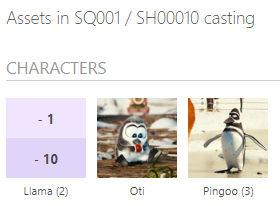

ストーリーボードの作成中に新しいアセットが作成された場合は、アセットページに戻り
（ドロップダウンメニューを使用）、必要なアセットを作成します。以前に作成したタスクは、これらの新しいアセットに即座に適用されます。
ただし、割り当てを行う必要があり、その後、
ブレークダウンを継続できます。

これで、**Breakdown**ページは以下のようになります。

アセットを組み立てて個々のパーツを追跡する必要がある場合は、アセットのブレークダウンリストを作成することもできます。

画面左上にある**FOR**の下のドロップダウンメニューで**asset**を選択します。

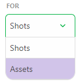

2番目のドロップダウンメニューにアクセスして、アセットの種類を選択できます。 **キャラクター**、**環境**、**小道具**、**FX**、...

ショットの分類と同様の方法で、アセットの分類ページを完成させることができます。 まず、左側の部分で1つまたは複数のアセットを選択し、次に右側の部分の要素を追加します。

::: 詳細 CSVファイルからブレイクダウンリストを作成する

すでにスプレッドシートファイルでブレイクダウンリストが準備できているかもしれません。Kitsuでは、それをインポートする方法が2つあります。1つ目は、.csvファイルを直接インポートする方法、2つ目は、データを直接Kitsuにコピー＆ペーストする方法です。

まず、Kitsuの推奨に従って、スプレッドシートを「.csv」ファイルとして保存します。

インポート]ボタンをクリックします！[インポート]ボタン（../img/getting-started/import.png）

「CSVからデータをインポート」というポップアップウィンドウが開きます。「参照」をクリックして、`.csv`ファイルを選択します。

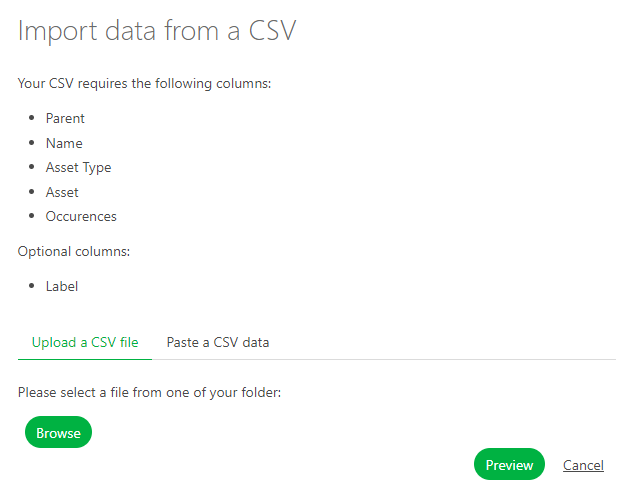

結果を確認するには、「プレビュー」ボタンをクリックします。

データのプレビューで列名を確認し、必要に応じて調整します。

注：**[エピソード]**列は、**[テレビ番組]**制作の場合のみ必須です。

すべてが適切であることを確認したら、**[確認]**ボタンをクリックしてデータをKitsuにインポートします。

これで、ブレークダウンがKitsuにインポートされました。

:::

::: 詳細 スプレッドシートファイルをコピー＆ペーストしてブレークダウンリストを作成

スプレッドシートを開き、データを選択してコピーします。

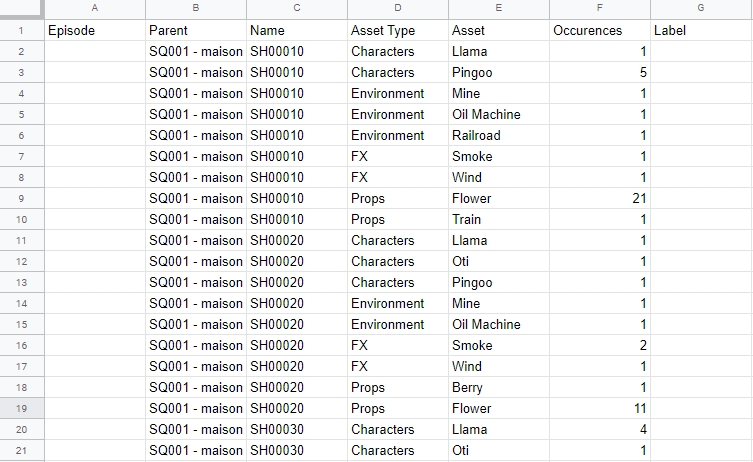

次に、Kitsuのブレークダウンページに戻り、**インポート**アイコンをクリックします 
。

ポップアップウィンドウ「**CSVからデータをインポート**」が開きますので、「**CSVデータを貼り付け**」タブをクリックします。

以前に選択したデータを貼り付け、**[プレビュー]** ボタンで結果を確認できます。

データのプレビューで列の名前を確認し、調整できます。

注：**[エピソード]** 列は、**[テレビ番組]** 制作の場合のみ必須です。

すべてが適切であることを確認したら、**Confirm**（確認）ボタンをクリックしてデータをKitsuにインポートします。

これで、すべてのアセットがKitsuにインポートされました。

:::

## アセットの状態の紹介：使用可能

ほとんどの場合、ショットタスクでアセットを使用する際に、アセットのタスクが承認されるのを待つ必要はありません。

たとえば、アセットが**コンセプト**段階で承認された場合、**ストーリーボード**段階で使用することができます。
次に、**モデリング**段階で承認された場合、**レイアウト**段階で使用することができます。

まさにアセットの状態**「準備完了」**がやっていることです。この状態は、アセットのタスクの状態を知らせ、ショットのタスクに対する使用可能性を比較します。

ブレークダウンを記入したので、どのショットにどのアセットが使用されているかが正確にわかります。

まず、タスクのステータスと関連するアセットの状態を定義する必要があります。セルをクリックして**準備完了**を変更することができます。ショットタスクのドロップダウンメニューが表示されます。

::: ヒント
**自動化**を使用して、重労働を軽減することができます。

「準備完了」トリガーで自動化を設定できます。 
:::

アセットの状態をいくつか「準備完了」に変更したので、ショットページで結果を確認できます。

いくつかの白いボックスが「緑色」になっていることに気づくでしょう。このショットで使用されるすべてのアセットが、この特定のタスクの準備が完了していることを示しています。

白いボックスが表示されている場合、Kitsuは、このタスクに準備ができているアセットの数を示します。

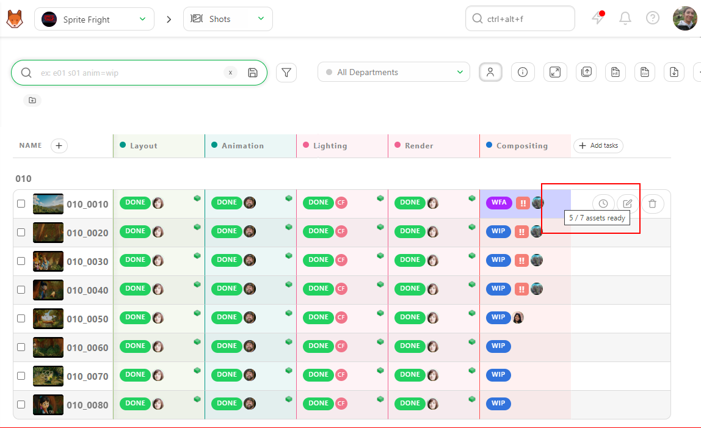

::: ヒント
ボックスが表示されていない場合、このショットにはアセットが割り当てられていません。
:::

ショット名をクリックすると、詳細ページに移動します。
すると、そのショットで使用されているすべてのアセットとそのステータスが表示されます。

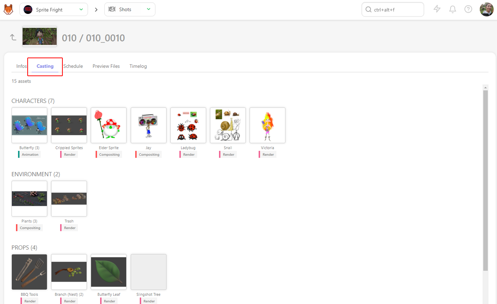

特定のタスクでショットを開始できるかどうかを判断する最も簡単な方法です。
