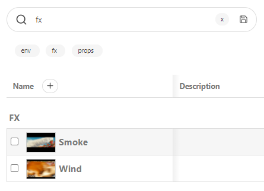
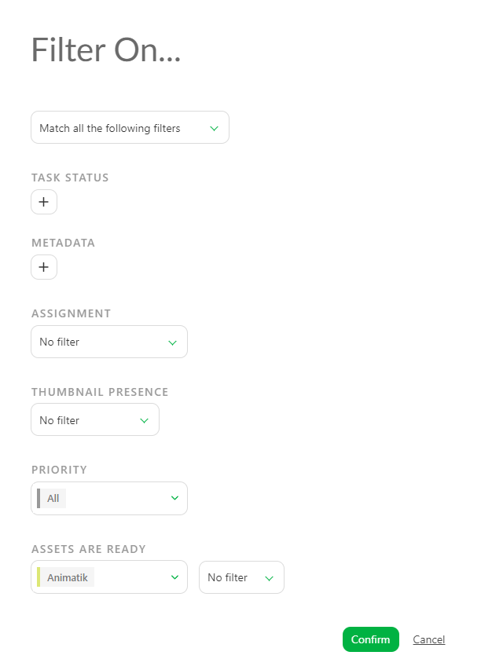
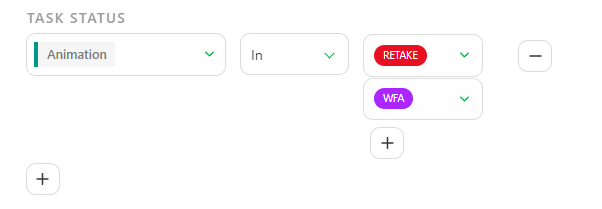
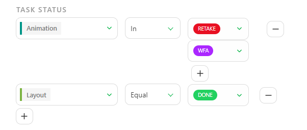
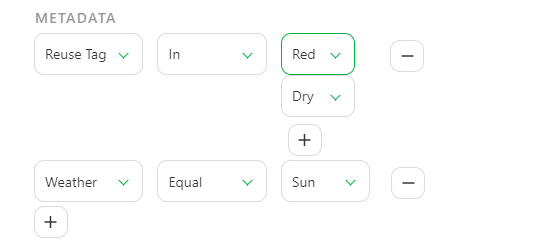
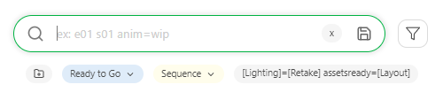
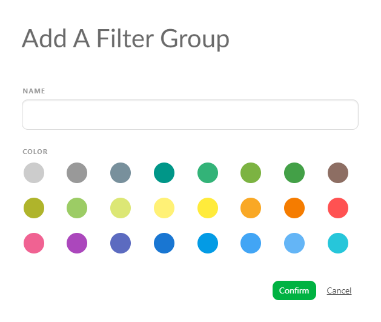
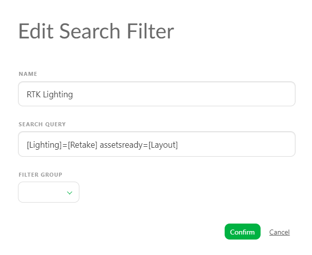

# フィルター

フィルタリングとは、特定の条件や基準に基づいてデータを選択的に取得することを指します。これにより、ユーザーは注目したい情報を簡単に絞り込んだり、分析用の関連データサブセットを抽出したりすることができます。

Kitsuでは、探しているものを簡単に検索できる機能が用意されています。

## 検索バー
### 検索バーを使用したフィルターの作成
**Kitsu**では、**検索バー**でフィルターを設定します。
検索クエリを**保存**することができます。一度保存すれば、
クリックするだけでクエリを再実行できます。

**検索バー**、**フィルタービルダー**、**保存**オプションは、次のページで見つけることができます。 

* アセット
* ショット
* シーケンス
* エディット
* エピソード

注：**検索バー**およびプリビルドフィルタは、以下のページでのみ利用可能です
* マイ制作
* マイタスク
* 人物
* シーケンス統計
* エピソード統計
* アセットタイプ統計
* クォータ
* チーム
* 詳細タスクタイプページ

::: ヒント
Kitsuの他のページでは、プリビルドフィルタが利用できます。
:::

検索バー**のクエリは、新しい文字が入力されるたびに適用されます。素早く結果を得るために、すべてを入力する必要はありません。

::: 警告
フィルタは、**長編映画**タイプの制作を除いて即座に適用されます。
Kitsuには数千もの要素が存在すると予想されるため、処理を高速化するには、検索語を入力して**Enter**キーを押して適用する必要があります。
:::

### フィルタの例
例えば、アセットページで「Ot」と入力すると、
「Ot」で始まるアセットの検索結果が表示されます。

特定の**アセットの種類**を検索することもできます。「Props」、「Character」、
「Environment」、「Fx」などです。検索結果には、その種類のアセットがすべて表示されます。

例えば、**FX**アセットをすべて検索してみましょう。

別の例として、特定の**シーケンス**の**ショットページ**を取得してみましょう。
例えば、第1話の第2シーケンスのショットのみを表示することができます。

ドロップダウンメニューで最初のエピソードを選択し、`sq002`を検索します。
結果は、シーケンスSQ002からのすべてのエピソードのすべてのショットを取得します。

同様に、タスクへの**特定のステータス**リンクを検索することができます。

::: ヒント
すべてのページで、**エンティティ**に関する**フィルタ**を作成することができます。

* **シーケンス** : `se01`, `se02` など、または除外 : `-se01`, `-se02` など
* **アセットタイプ**: `characters`, `environment`, `fx` など、または除外 `-characters`, `-fx`, など

また、以下の構文に従って、**タスクのステータス**に関する**フィルタ**を作成することもできます。
**タスク=ステータス** グローバルエンティティページで

例：

* レイアウトは作業中（wip）です。 `layout=wip.`
* コンセプトは、fxのみ承認待ち（wfa）です。 `concept=wfa fx.`
* シーケンス2では、レイアウトはwipです。 `se02 layout=wip`
* アニメーションが再撮影され、レンダリングが承認待ち（wfa）の状態です。 `animation=retake render=wfa`。

**詳細なタスクタイプページ**では、次のように入力してフィルタリングできます
- ステータス: `wip` または `-done` を除外、複数のステータス `[wfa] [retake].`
- アーティスト名: `Alicia` または `-Paul` を除外

すべてのフィルタを組み合わせることもできます。

`[wfa] [retake] -alicia 020.`
:::

## フィルターの作成
### フィルタービルダーの利用

より高度なフィルタリングを行う最も簡単な方法は、フィルタービルダーを利用することです。 まずは、下記に示す**フィルタービルダー**アイコンをクリックしてください。

次に、対話型のフィルタービルダーダイアログを使用して、希望するフィルター条件を作成します。

::: 警告 
最初のオプション「**以下のすべてのフィルタに一致**」では、フィルタビルダーで選択したすべてのオプションがフィルタリングに使用されます。

- タスクのステータス
- メタデータ
- 割り当て
- サムネイルの存在
- 優先度
- 準備完了/アセットが準備完了

2番目のオプション「**以下のいずれかのフィルタに一致**」では、利用できないフィルタオプションはスキップされます。
:::

### タスクのステータスによるフィルタリング

**タスクのステータス**のフィルタリング**タスクのステータス**のフィルタリングは、ステータス別にタスクの種類を絞り込むのに役立ちます。

- **Equal**（等しい）は、このステータスを持つすべてのタスクをこのタスクの種類について報告します
- **Not Equal**（等しくない）は、このステータスを除くすべてのタスクを報告します
- **In**（含む）は、選択したすべてのステータスを持つすべてのタスクを報告します

**-** ボタンを使用して、選択したステータスのいずれかを削除することができます。

ステータスの下にある **+** を使用して、ステータスを追加することができます。

::: ヒント
複数のタスクタイプのステータスをフィルタリングしたい場合は、画面左側のタスクステータスオプションの下にある**+**をクリックします。

:::

### メタデータのフィルタリング

**メタデータ**フィルタを使用すると、追加の列の情報に基づいてページをフィルタリングすることができます。

- **Equal**（等しい）は、このメタデータ列のこの情報を持つすべてのタスクを報告します
- **Not Equal**（等しくない）は、この情報を**除く**すべてのタスクを報告します
- **In**（含む）は、選択したすべての情報を持つすべてのタスクを報告します

::: ヒント
複数のメタデータで要素をフィルタリングしたい場合は、画面左側のメタデータオプションの下にある**+**をクリックします。

:::

### アサインメントのフィルタリング

このオプションは、人およびアサインメントに関連しています。

- フィルタなし：ユーザーを検索しません
- 割り当て済み：特定のタスクタイプで誰かに割り当てられたタスクを検索できます
- 割り当てなし：特定のタスクタイプで誰にも割り当てられていないタスクを検索できます
- 割り当てあり：特定のタスクタイプの割り当て済みのタスクをすべて報告します
- 割り当てなし：特定のタスクタイプの割り当てのないタスクをすべて報告します

::: 警告
割り当てのフィルタリングは、1つのタスクタイプにつき1人に対してのみ行うことができます。

複数の割り当てフィルタを追加することはできません。
:::

### サムネイルのフィルタリング

デフォルトでは、このフィルタは「フィルタなし」に設定されており、サムネイルの有無をチェックしないことを意味します。

次に選択肢は以下の通りです。
サムネイルあり：サムネイルのあるすべてのエンティティを表示
サムネイルなし：サムネイルのないすべてのエンティティを表示

### 優先度によるフィルタリング

特定の優先度レベルでタスクタイプをフィルタリングすることができます。

ヒント
優先度についての詳細は、
[優先度の変更](../estimation/README.md#change-priorities)
を参照してください。

まず、タスクタイプを選択し、次に以下のいずれかを選択します。 
- **通常**（優先度のデフォルトレベル）
- **高**
- **非常に高い**
- **緊急**

::: 警告
優先度のフィルタリングは、**1つ**のタスクタイプに対して**1つ**の優先度レベルのみ可能です。

複数の優先度フィルタを追加することはできません。
:::

### 「準備完了」ステータスの使用

アセットまたはショットのグローバルページでフィルタリングを行う場合、「準備完了」ステータスでフィルタリングを行うことができます。

- アセットページでは、「準備完了」列を検索します。

ショットページでは、これらのタスクのすべてのアセットが準備完了であるかどうかを確認します（「制作物の作成」を参照）。

::: 警告
**準備完了**のフィルタリングは、**1つ**のタスクタイプのみ可能です 

複数の**準備完了**フィルタを追加することはできません。
:::

## 保存したフィルタの管理

Kitsuでは、フィルタクエリを保存して後で再利用することができます。保存するには、**Enter**キーを押すか、**保存**ボタンをクリックします
。

検索バー**の下に、保存したクエリがボタンとして表示されます。

::: ヒント
左端のアイコンと色つきのボタンに注目してください。

これを使用すると、フィルタグループを作成することができます。この方法では、保存したフィルタを色つきのグループに整理して保存しておくことができます。

:::

このページに戻ると、ボタンが常に表示されています。これらのボタンを使用すると、一般的なクエリをより迅速に実行することができます。

フィルタを作成して保存すると、検索バーの下にボタンとして表示されます。

フィルタの名前を、より明確な言葉に変更することができます。

保存したフィルタは長すぎて読みにくいものです。保存したフィルタの上にマウスカーソルを移動させると、編集と削除の2つのアイコンが表示されます。

ポップアップウィンドウの「**名前**」セクションに表示される名前を変更することができます。

保存したクエリを「**フィルタリンググループ**」内に保存するか、外に保存するかを選択することができます

### フィルタの削除

誤って**フィルタボタン**を作成してしまった場合は、その横にある「×」をクリックしてください
！[フィルタ削除] (../img/getting-started/filter_delete.png)。

フィルタの結果は表示されますが、ボタンは表示されません。
テキストを削除して検索をキャンセルするか、検索バーの横にある「×」をクリックしてください
！[検索削除] (../img/getting-started/filter_cross_delete.png)。

### 事前設定済みのフィルター

事前設定済みのフィルターは、次のページでご覧いただけます。

- マイチェック
- タイムシート
- チームスケジュール
- すべてのタスク
- ニュースフィード
- コンセプト
- クォータ
- タスクタイプの詳細ページ（検索バー付き

この特定のページでは、弊社が作成したオプションを選択できます。

ドロップダウンメニューで、必要なオプションを選択できます。
