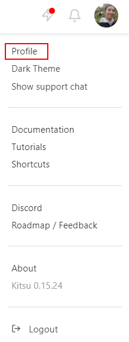
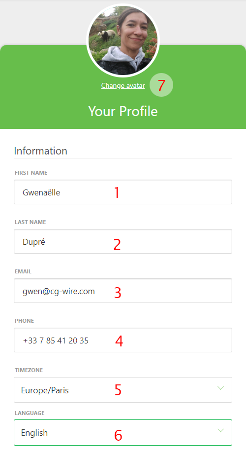
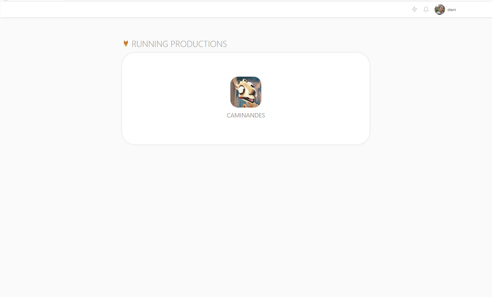
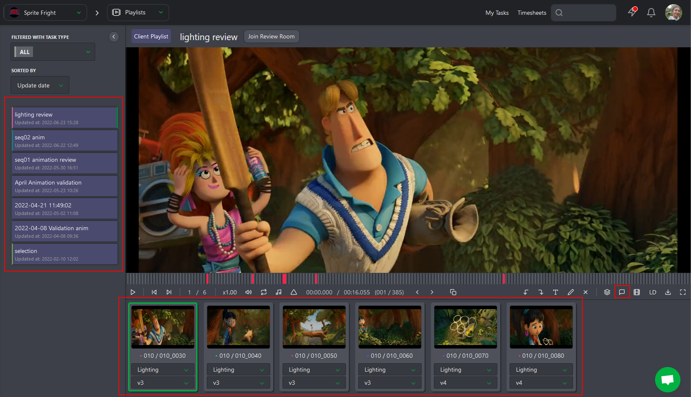
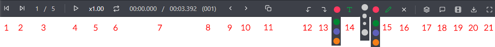
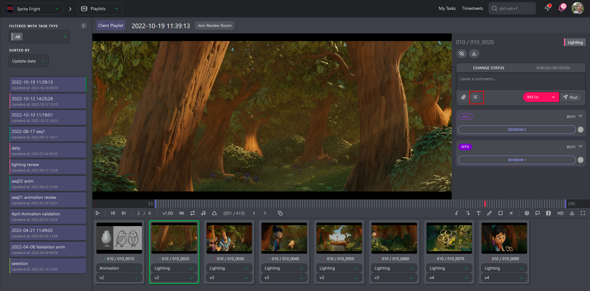
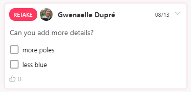
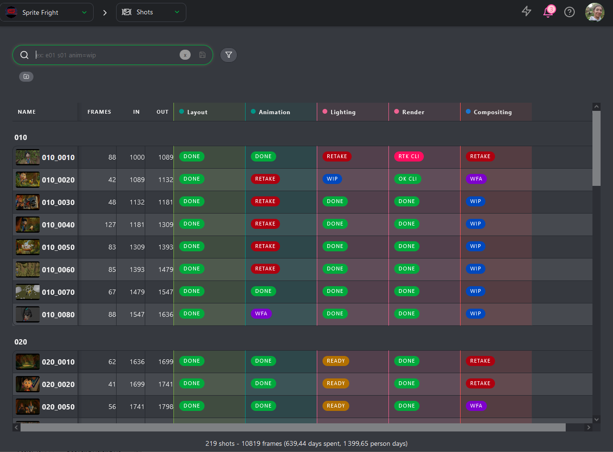
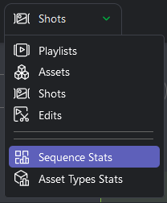
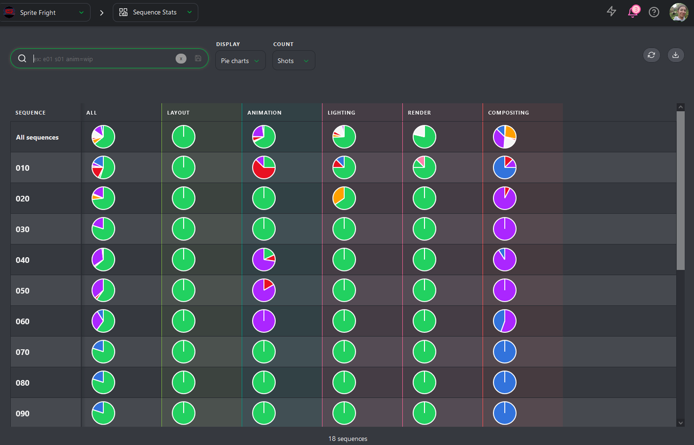

# クライアントとしてのスタート

## 最初の接続

最初の接続の際には、お客様の連絡先情報をプロフィールにご記入いただくことをお勧めいたします。
画面右上の名前をクリックし（1）、次に**プロフィール**をクリックします（2）。

注：この**ドキュメント**へのリンクが利用可能です（4）。
また、このメニューで**ダークテーマ**に切り替えることもできます（3）。また、Slack（5）にアクセスしたり、ロードマップ（6）を確認することもできます。

この新しいページでは、名前 (1) (2)、メールアドレス (3)、電話番号 (4)、
タイムゾーン (5)、ウェブサイトの言語 (6) を変更したり、
アバターとして自分の写真を投稿 (7) することができます。 誰が何をしているのかがわかりやすくなります。

また、通知を希望する場合は、メールまたはSlackのどちらかを選択できます。

さらに下にスクロールすると、必要に応じてパスワードを変更することもできます。
デフォルトのパスワードは、ご自身で設定したパスワードに変更することをお勧めします。

## プレイリストの確認

**Kitsu** における中心となるページは **プレイリスト** ページです。
プロダクション アバターをクリックすると、このページにアクセスできます。

プロダクション アバターをクリックすると、**プレイリスト** ページに移動します。

プレイリストには、あなたがコメントするアセットやショットがすべて集められます。

左側では、**タスクタイプ**、**日付**、または**名前**（1）ごとにプレイリストをソートし、次に作成されたプレイリストのリスト（2）を表示することができます。中央部分では、最新のプレイリストに素早くアクセスできます（3）。

### プレイリストの詳細

左側では、さまざまなプレイリストにアクセスできます。中央では、選択したプレイリストのさまざまな要素が表示されます。アセットまたはショットです。右側では、コメントセクションにアクセスできます。

コメントパネルでは、プレビューを承認するコメントを入力できます。

要素（アセットまたはショット）の上部には、さまざまなオプションへのアクセスがあります。

* (1) 前ショット/アセット
*(2) 次ショット/アセット
* (3) 要素の位置
* (4) 再生/一時停止ボタン
* (5) 速度を変更できます：x1..0、x0.50、x0.25
* (6) 選択したショットをループ再生
* (7) ショットの実際のタイムコード/グローバルタイムコード
* (8) 実際のフレーム
* (9) 前フレーム
* (10) 次フレーム
* (11) スプリットスクリーン：2つのタスクタイプを並べて比較できます
* (12) アノテーションの取り消し
* (13) アノテーションのやり直し
* (14) 画像上にコメントを書き込み、テキストの色を変更
* (15) 画像上にコメントを書き込み、線の色とサイズを変更
* (16) 描画を選択し、×をクリックして削除する
* (17) プレイリスト内のすべての要素のタスクタイプを変更する
* (18) コメントを投稿し、ステータスを変更するためのパネルセクションを開く
* (19) 要素のリストを隠す
* (20) プレイリストをダウンロードする
* (21) フルスクリーン

## コメントを共有

まず、コメントセクションを開きます。 

そこから、アーティストに変更を依頼したい場合は、ステータスを  に変更できます。

コメントに**チェックリスト**を追加できます。

「チェックリストを追加」ボタンをクリックすると、チェックリストの最初の項目が表示されます。

コメントを入力し、**Enter**キーを押してチェックリストに別の行を追加するか、または「チェックリストを追加」ボタンを再度クリックします。

## アセットのグローバルビュー

クライアントとして、画面上部のドロップダウンメニューからアセットのグローバルページに移動できます。

グローバルページでは、アセットの各ステップのステータスをすべて確認できます。

## ショットのグローバルビュー

クライアントとして、画面上部のドロップダウンメニューからショットのグローバルページに移動できます。

グローバルページでは、ショットの各ステップのステータスをすべて確認できます。

## 制作レポート

スタジオとのコミュニケーションを円滑にするため、制作レポートに直接アクセスできます。レポートは、**シーケンス統計**と**アセットタイプ統計**の2つの部分に分かれています

**シーケンス統計**ページはリアルタイムで更新されます。このページを見るたびに、最新の情報が確認できます。

ショット数またはフレーム数ごとの統計を表示するように選択できます。

また、**表示モード**を変更することもできます。**円グラフ**表示から
**カウント**表示に切り替えることができます。

この表示をダウンロードして、制作の進捗状況を追跡することができます。
