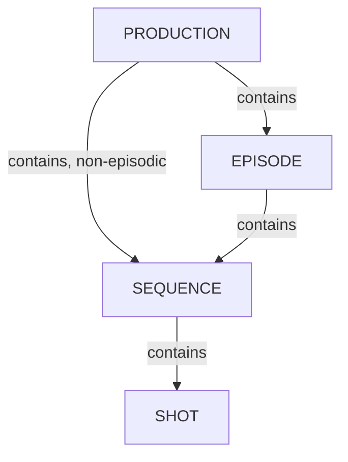

# プロダクション構成

Kitsuのデータモデルは、プロダクションエンティティの階層（プロダクション → エピソード／シーケンス／ショット、または → アセット）と、タスク追跡システム（タスクタイプ、タスクステータス、部門）を組み合わせて作業を整理します。

## 目次

1. [プロダクションの管理](/ja/guides/production-structure/manage-productions/) - Kitsuで管理するプロダクション（プロジェクト）の作成、設定、整理を行います。
2. [エピソードの管理](/ja/guides/production-structure/manage-episodes/) - プロダクション内のエピソードを追加、編集、整理します。
3. [シーケンスの管理](/ja/guides/production-structure/manage-sequences/) - プロダクションまたはエピソード内のシーケンスを追加、編集、整理します。
4. [ショットの管理](/ja/guides/production-structure/manage-shots/) - シーケンスを構成するショットを追加、編集、整理します。
5. [スタジオラベルの管理](/ja/guides/production-structure/manage-studios/) - 複数拠点・複数スタジオのプロダクション向けです。各タスクを担当するスタジオを識別するために使用するスタジオラベルを作成、整理します。

## データモデル

- **部門** - スタジオ内の機能グループ（例：モデリング、アニメーション、ライティング、コンポジット）。部門は関連するタスクタイプをまとめます。
- **プロダクション** - スタジオが管理するプロジェクト（映画、シリーズ、ゲームなど）。プロダクションには、エピソード（エピソード形式の場合）、シーケンス、ショット、アセットが含まれます。
- **エピソード** - シリーズ形式のプロジェクトで使用される、プロダクションの下位区分。長編形式のプロダクションでは任意です。
- **シーケンス** - エピソードの下位区分（または、エピソード形式でない作業ではプロダクションの下位区分）で、関連するショットをまとめます。
- **ショット** - シーケンス内の撮影・アニメーション上のアクションの単位。ショットベースのタスクを格納する主要なコンテナです。