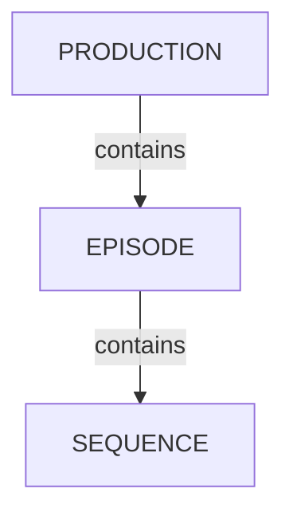

# エピソードの管理

<iframe width="560" height="315" src="https://www.youtube.com/embed/I-9QC6w2VOQ?si=ZUclg5iIPqMvUFK0" title="YouTube video player" frameborder="0" allow="accelerometer; autoplay; clipboard-write; encrypted-media; gyroscope; picture-in-picture; web-share" referrerpolicy="strict-origin-when-cross-origin" allowfullscreen></iframe>

<!-- #region body -->

TV Show 制作では、エピソードコンテナを使用してシーケンスやショットを整理できます。

## エピソードの概要

<!-- #region setup -->

制作メニューで `Episodes` をクリックします。

現在の制作に含まれるすべてのエピソードが一覧表示されたエピソードページが表示されます。

エピソード名をクリックすると、詳細ページが表示されます。

## エピソードの作成

`Episodes` ページの右上にある `New episode` をクリックします。

モーダルが表示されます。フォームに入力して `Confirm` をクリックします。

- **Name**: エピソード名
- **Status**: エピソードの制作ステータス（canceled、complete、running、standby）
- **Description**: エピソードの内容の簡単な説明
- **Resolution**: エピソードの解像度（例: "1920x1080"、"4K" など）

::: info
グローバルショットページからエピソードを作成することもできます。
:::

<!-- #endregion setup -->

## エピソードの更新

一覧で編集するエピソードの行にカーソルを合わせ、`Edit` アイコンをクリックします。  

## エピソードのタスクタイプ

エピソードには独自のタスクを設定できます。これは、単一のシーケンスやショットではなく、エピソード全体に関わる作業（編集、コンフォーム、アニマティック、サウンドミックス、納品など）に便利です。

タスクタイプをエピソードで使用できるようにするには、エンティティタイプとして `Episode` を指定して作成する必要があります。

メインメニューで `Task Types` に移動し、`Add task type` をクリックします。

- **Name**: タスクタイプ名（例: "Edit"、"Conform"、"Delivery"）
- **For entity type**: `Episode` を選択
- **Color**: インターフェースでタスクタイプに使用される色
- **Priority**: リスト内でのタスクタイプ列の位置

タスクタイプを作成したら、制作に追加します。制作設定に移動し、タスクタイプリストから選択してください。

エピソードページには、エピソードのタスクタイプごとに1列が表示され、各タスクのステータスを確認できます。

タスクセルをクリックするとタスクパネルが開きます。ここでは、ショットやアセットのタスクと同様に、ステータスの変更、アーティストの割り当て、プレビューの公開、コメントの追加を行えます。

::: info
エピソードタスクタイプは、TV Show 制作でのみ使用できます。他の制作タイプにはエピソードコンテナがないためです。
:::

## エピソードの削除

一覧で削除するエピソードの行にカーソルを合わせ、`Delete` アイコンをクリックします。  

::: warning
エピソードを削除すると、対応するシーケンス、ショット、タスクも削除されます。削除したデータを復元することはできません。
:::

<!-- #endregion body -->