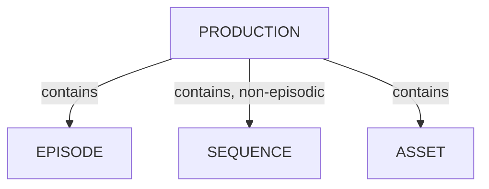

# プロダクションの管理

<iframe width="560" height="315" src="https://www.youtube.com/embed/ZDDqZxdED0s?si=aZTOFBXQeV6SpBcQ" title="YouTube video player" frameborder="0" allow="accelerometer; autoplay; clipboard-write; encrypted-media; gyroscope; picture-in-picture; web-share" referrerpolicy="strict-origin-when-cross-origin" allowfullscreen></iframe>

<!-- #region body -->

<!-- #region setup -->

プロダクションのリストにアクセスするには、ナビゲーションメニューを使用して `My Productions` をクリックします：

管理者は `Productions` ページからプロダクションを編集および削除することもできます：

## 新しいプロダクションを作成する

`Create a new production` ボタンをクリックすると、ページが表示されます：

プロダクション名を入力し、**Production Type** を選択して、プロダクションのスタイル（2D、3D）を選択します。

次に、FPSの数、比率、解像度などの技術情報を入力する必要があります。

これらのデータは、Kitsuがアップロードされたビデオプレビューを再エンコードする際に使用されます。

続いて、プロダクションの開始日と終了日を定義します。

次のパート（3～6）で、プロダクションのワークフローを定義できます。

アセットタスクタイプ（3）、ショットタスクタイプ（4）、タスクステータス（5）、アセットタイプ（6）を選択する必要があります。

::: tip
**Production Workflow** を作成するには、グローバルライブラリからタスクタイプを選択します。

一部のタスクタイプ、アセットタイプ、またはタスクステータスを選択し忘れた場合は、プロダクション中に後から追加できます。

[Studio Workflow](../../../configure-kitsu/index.html#studio-workflows) セクションを参照してください。
:::

<!-- #endregion setup -->

続いて、7と8はオプションのパートです。アセットやショットのスプレッドシートをすでに用意している場合に使用できます。

詳細については、各エンティティページの **Import from CSV** セクションを参照してください：

- [アセットをCSVからインポート](/ja/guides/production/manage-assets/)
- [ショットをCSVからインポート](/ja/guides/production-structure/manage-shots/)

`All done` ボタンですべてを確定します。

### プロダクションテンプレートの使用

新しいプロダクションをセットアップする際には、ショットやアセットのタスクタイプの選択、タスクステータスの定義、チームのワークフローに合わせたプロジェクト全体の設定調整など、同じ設定手順を何度も繰り返すことがよくあります。

プロジェクトテンプレートを使用すれば、あらかじめ定義された設定からワンクリックで開始できます：

新しいプロダクションを作成する際にテンプレートを選択するだけで、Kitsuが希望する設定を自動的に適用します。

上の例では、テンプレートにあらかじめ設定されたアセットタイプ、タスクタイプ、タスクステータスなどが含まれているため、グローバルライブラリから手動で選択する必要はありません：

独自のテンプレートを追加するには、以下の [独自のプロダクションテンプレートを作成する](#create-your-own-production-template) セクションを参照してください。

## プロダクション固有の設定を行う

**Navigation Menu** から、ドロップダウンメニューの **Setting** を選択します。 

最初のタブである **Parameters** では、プロダクションの **Technical information** を変更できます。

::: warning
プレビューをアップロードした後に **FPS** または **Resolution** を変更しても、変更は適用されません。最初のプレビューを再度アップロードする必要があります。
:::

ここでは、次のようなプロダクション固有のオプションを有効にできます：

- クライアントコメントを分離する（互いに表示されない）
- アーティストによるプレビューのダウンロードを許可する
- 新しいプレビューをエンティティのサムネイルとして自動的に設定する

このプロダクションの **Maximum Number of Retakes** を指定することもできます。

::: tip
**Parameters** タブでは、プロダクションのアバターも変更できます。
:::

### アーティストボードのステータス設定

アーティストにタスクを割り当てると、アーティストがログインした際にToDoページに表示されます。

デフォルトのビューではタスクが従来のリスト形式で表示されますが、ボード形式で表示することもできます。各 **Status** は列として表示され、割り当てられたタスクはカードとして表示されます。タスクの進行に応じて、カードをステータス間でドラッグできます。

ボードビューをカスタマイズするには、プロダクションの設定ページに移動します。

**Task Status** タブでは、**Board** ビューに表示されるステータスの順序を変更できます。

ステータスをドラッグして移動すると、ボードビューで表示される順序を変更できます。

完了したら、**Board Status** タブに移動します。

ここでは、**Board view** でどの権限ロールがどのステータスを表示できるかを選択できます。

ステータスを適切に選択しないと、選択肢が多すぎてアーティストが圧倒される可能性があります。

**Status** を適切に選択すると、アーティストが作業しやすくなります。

::: tip
**Board** ビューに表示されるステータスのカスタマイズは、権限ロールごとに設定されます。個々のユーザー単位でカスタマイズすることはできません。
:::

## プロダクションを終了する（アーカイブ）

次のプロダクションでアセットやその他のプロダクション要素を再利用する必要がある場合に備えて、プロダクションが終了したらアーカイブすることをおすすめします。

まず、`Main Menu > Studio > Productions` ページで対象プロダクションの編集ボタンをクリックします：

ダイアログでプロダクションのステータスに `Closed` を選択し、`Confirm` をクリックします：

これで、プロダクションが `Closed` として一覧に表示されます。

## プロダクションを削除する

プロダクションを削除するには、まずプロダクションを終了する必要があります。

完了したら、終了したプロダクションのリスト項目にある `Delete` ボタンをクリックするだけで、プロダクションがインスタンスから削除されます：

## 独自のプロダクションテンプレートを作成する

`Main Menu > Admin > Templates` に移動して、プロダクションテンプレートを管理します。

新しいテンプレートを作成するには、`Add a production template` ボタンをクリックしてフォームに入力します：

- Name: テンプレート名
- Type: `Short`、`TV Show`、`Feature Film`、`Only Assets`、または `Only Shots`
- Style: `2D Animation`、`2D Animation (Paper)`、`3D Animation`、`2D/3D Animation`、`VFX`、`Commercial`、`Virtual Reality`、`Motion Design`、`Archviz`、`Stop Motion`、`Catalog`、`NFT collection`、`Video Game`、`Immersive Experience`、または `Augmented Reality`
- Description: テンプレートの簡単な説明

`Confirm` をクリックして、テンプレートを保存し、今後使用できるようにします。

<!-- #endregion body -->