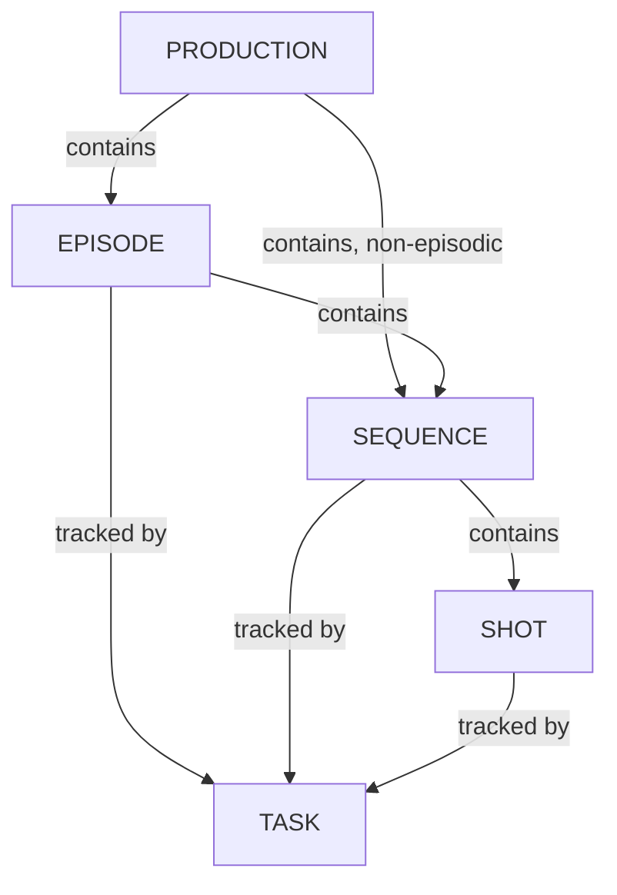

# シーケンスの管理

<iframe width="560" height="315" src="https://www.youtube.com/embed/Y5Fx6jlgQok?si=8WzQxoSdRSQ3nIwZ" title="YouTube video player" frameborder="0" allow="accelerometer; autoplay; clipboard-write; encrypted-media; gyroscope; picture-in-picture; web-share" referrerpolicy="strict-origin-when-cross-origin" allowfullscreen></iframe>

<!-- #region body -->

Kitsuでは、**シーケンス**レベルでタスクを追跡することもできます。

Story and Color Board、カラーグレーディングなど、マクロタスクを追跡する場合に特に便利です。

<!-- #region setup -->

ナビゲーションメニューから**シーケンス**ページに移動します。

すべてのシーケンスをまとめて表示することも、テレビ番組の制作の場合はエピソードごとに表示することもできます。

タスクの割り当て、レビュー、ステータスの変更、メタデータ列の追加、説明の入力などを行えます。

シーケンス名をクリックすると、そのシーケンスの詳細ページが表示されます。

詳細ページでは、シーケンス全体で使用されているすべてのアセットを確認するために、シーケンスのキャスティングにアクセスできます。

シーケンスの**タスク**のスケジュール、プレビューファイル、アクティビティ、タイムログにもアクセスできます。

## シーケンスの作成

**+ 新しいシーケンス**ボタンでシーケンスを作成できます。

::: tip
ここ（+新しいシーケンスボタン）から直接シーケンスを作成することも、グローバルショットページからショットにリンクされたシーケンスを作成することもできます。
:::

<!-- #endregion setup -->

## シーケンスの更新

リストで編集するシーケンスの行にカーソルを合わせ、`Edit`アイコンをクリックします。  

## シーケンスの削除

リストで削除するシーケンスの行にカーソルを合わせ、`Delete`アイコンをクリックします。  

<!-- #endregion body -->