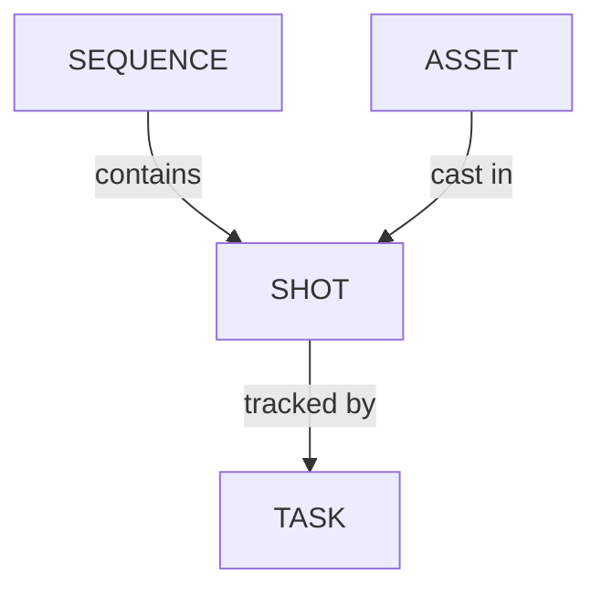

# ショットの管理

<iframe width="560" height="315" src="https://www.youtube.com/embed/akjCFIaryYw?si=0qtJQUoLF7C_xPdE" title="YouTube video player" frameborder="0" allow="accelerometer; autoplay; clipboard-write; encrypted-media; gyroscope; picture-in-picture; web-share" referrerpolicy="strict-origin-when-cross-origin" allowfullscreen></iframe>

<!-- #region body -->

::: warning
ショットはKitsuのシーケンスに紐付けられます。
ショットを追加するには、最初にシーケンスを作成する必要があります。
:::

## ショットを作成する

<!-- #region setup -->

制作のための**ショット**を作成しましょう。

**Shots**ページに移動するには、ドロップダウンメニューを使用して`Shots`をクリックします。

ショットの作成を開始するには、**Add shots**ボタンをクリックします。

::: warning
ショットを作成すると、設計したタスクワークフローが適用され、すべてのタスクがショットと同時に作成されます。
:::

ショットを作成するための新しいポップアップが開きます。シーケンスと、それに対応するショットを追加できます。

最初のシーケンス（例：SQ01）を入力し、`add`をクリックします。

このシーケンスにショットを追加するには、シーケンスを選択し、ショット列の入力フィールドに名前（例：SH0020）を入力して、もう一度`add`をクリックします。

::: tip
手動で入力する代わりに、ショットのパディングを設定することもできます。

ショットにSH0010、SH0020、SH0030のように10刻みの名前を付けたい場合は、**Shot Padding**を10に設定します。
:::

新しいショットが一覧表示され、シーケンスに紐付けられていることを確認できます。これで、最初のシーケンスの最初のショットが作成されました！

それでは、さらにショットを追加しましょう。

入力フィールドには、設定したパディングに基づいて増分された名前コードがあらかじめ入力されるため、`add`をクリックし続けるだけでショットを追加できます。

シーケンスを追加するには、左側の部分に移動し、新しいシーケンスの名前を入力して、`add`をクリックします。

2番目のシーケンスが選択され、ショットを追加できるようになります。

> [!TIP]
> ショットを誤ったシーケンスに配置した場合は、専用のショットページでショットを編集してシーケンスを変更する必要があります。詳しくは`ショットを更新する`セクションを参照してください。

<!-- #endregion setup -->

## ショットをインポートする

### EDLファイルから

すでに**EDL**ファイルにショットリストを用意している場合があります。
Kitsuでは、**EDL**ファイルを直接インポートして、シーケンス、ショット、フレーム数、フレームイン、フレームアウトなどを作成できます。

**Global Shot Page**に、**Import EDL**ボタンがあります。

ポップアップで、編集時に使用した動画ファイルの命名規則を選択できます。

これは、編集時の動画クリップがproject_sequence_shot.extensionという名前になっていることを意味します。

LGC制作におけるEDLの例を示します。

動画ファイルはLGC_100-000.movという名前になっています。これは、LGCが制作名、100がシーケンス名、000がショット名であることを意味します。

命名規則を設定したら、EDLファイルをインポートできます。

次に、**Upload EDL**をクリックします。

するとKitsuがショットを作成します。

### スプレッドシートファイルから

すでにスプレッドシートファイルにショットリストを用意している場合があります。
Kitsuでは、2つの方法でインポートできます。`.csv`ファイルを直接インポートする方法と、データをKitsuに直接コピー＆ペーストする方法です。

#### オプション1：CSVファイルをインポートする

まず、スプレッドシートを`.csv`ファイルとして保存します。

次に、Kitsuのショットページに戻り、**Import**アイコンをクリックします。

**Import data from a CSV**ポップアップウィンドウが開きます。**Browse**をクリックして、`.csv`ファイルを選択します。

#### オプション2：スプレッドシートからコピー／ペーストする

スプレッドシートを開き、データを選択してコピーします。

次に、Kitsuのショットページに戻り、**Import**アイコンをクリックします。

**Import data from a CSV**ポップアップウィンドウが開くので、**Paste a CSV data**タブをクリックします。

先ほど選択したデータを貼り付けます。

#### インポートをプレビューして確認する

どちらの方法を使用した場合でも、**Preview**ボタンをクリックして結果を確認します。

データをプレビューしながら、列名を確認・調整できます。

注：**Episode**列は、**TV Show**制作の場合のみ必須です。

問題がなければ、**Confirm**ボタンをクリックしてデータをKitsuにインポートします。

すべてのショットがKitsuにインポートされ、**Settings**に従ってタスクが作成されます。

## ショットの詳細を確認する

<!-- #region view-shots -->

ショットの詳細を確認するには、その名前をクリックします。

タスク一覧、割り当て、右側のステータスニュースフィードが表示された新しいページが開きます。
タブ名をクリックすると、それぞれを切り替えて表示できます。

各タスクのステータスをクリックすると、コメントパネルが開き、コメントの履歴とさまざまなバージョンを確認できます。

**Casting**にもアクセスできます。

**Schedule**は、あらかじめタスクタイプページのデータを入力している場合に利用できます。すでにデータを入力している場合は、ここで直接変更できます。

さまざまなタスクタイプにアップロードされた**Preview Files**、

また、このアセットのタスクについてタイムシートを入力している場合は、**Timelog**にもアクセスできます。

<!-- #endregion view-shots -->

## ショット作成後にタスクを追加する

ショットを作成した後にタスクが不足していることに気付いた場合でも、後から追加できます。

まず、`Settings`ページの`Task Type`タブに[不足しているタスクタイプが追加されていることを確認](/ja/guides/task-configuration/managing-task-types/)します。

次に、`Shots`ページに戻り、`+ Add tasks`をクリックします。

タスクタイプの作成について詳しくは、[対応するドキュメントページ](/ja/guides/task-configuration/managing-task-types/)を参照してください。

## ショットを更新する

ショットはいつでも更新できます。名前やシーケンスの変更、説明の編集、グローバルページに追加したカスタム情報の追加などが可能です。

ショットページに移動し、変更したいショットにカーソルを合わせて、**Edit**ボタンをクリックするとショットを編集できます。

メインのショットページで説明を展開するには、ショット名をクリックします。完全な説明がポップアップで開きます。

### CSVから

**CSV Import**を使用して、データを一括更新できます。

スプレッドシートを開き、データをコピーして、`Import Shots From CSV`セクションと同じように貼り付けます。

違いは、**Option: Update existing data**をオンにする必要があることだけです。

更新されたショットは青色で表示されます。

注：**Episode**列は、**TV Show**制作の場合のみ必須です。

## ショットにフレーム数とフレーム範囲を追加する

アニマティックが完成すると、各ショットの長さ（**number of frames**、**Frame range In**、**Frame range Out**）がわかります。この情報をスプレッドシートに追加して、パイプラインですべてのフレームが確実に処理されるようにできます。

::: warning
ショットとシーケンスを手動で作成した場合、**Frame**列は非表示になります。少なくとも1つのショットを編集し、フレーム数を入力して**Frame**列を表示する必要があります。

CSV／スプレッドシートを使ってショットを作成し、フレーム数をインポートした場合は、この列が表示されます。
:::

フレーム範囲の情報を入力するには、ショットを編集する必要があります。ショット行の右側にある`Edit`アイコンをクリックします。

新しいウィンドウでショットの**Frame In**と**Frame Out**を入力できます。次に、**Confirm**ボタンをクリックして保存します。

これで、ショットページの全体スプレッドシートにフレーム範囲が表示されます。

::: tip
**Frame In**と**Frame Out**を入力すると、Kitsuが自動的に**Number of Frame**を計算します。
:::

**Frames**、**In**、**Out**列のロックが解除されたので、グローバルショットページからセルを直接編集できます。編集したいセルをクリックするだけです。

::: info
ここでも、**CSV Import**を使用すると、フレーム範囲をより速く更新できます。
:::

::: info
動画のプレビューからフレーム数を確認できます。
:::

## ショットの変更履歴にアクセスする

ショットの変更履歴にもアクセスできます。

`History`アイコンをクリックします。

すべての変更を一覧表示したテーブルを含むダイアログが表示されます。

## ショットを削除する

一覧で削除したいショットの行にカーソルを合わせ、`Delete`アイコンをクリックします。

これにより、ショットがアーカイブ／クローズされます。完全に削除するには、もう一度`Delete`アイコンをクリックします。

<!-- #endregion body -->