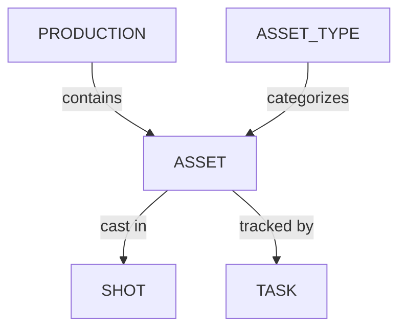

# プロダクション

1. [コンセプトを管理する](/ja/guides/production/manage-concepts/) - プロダクション用のコンセプトアートを作成、整理、検証する方法を学びます。
2. [アセットタイプを管理する](/ja/guides/production/managing-asset-types/) - プロダクション全体でアセットをグループ化・分類するために使用するカテゴリ（キャラクター、プロップ、環境など）を作成・整理します。
3. [アセットを管理する](/ja/guides/production/manage-assets/) - プロダクション全体で使用するアセットを作成、整理、追跡する方法を学びます。
4. [タスクを割り当てる](/ja/guides/production/assign-tasks/) - タスクを担当者に割り当てる方法を学びます
5. [割り当てを見つける](/ja/guides/production/find-assignments/) - 自分に割り当てられたタスクを見つける方法を学びます
6. [ブレイクダウンとキャスティング](/ja/guides/production/breakdown-casting/) - スクリプトや絵コンテを分解し、アセットをショットにキャスティングする方法を学びます。
7. [メタ列](/ja/guides/production/meta-column/) - プロダクションのメタデータを作成・整理する方法を学びます。
8. [3D背景](/ja/guides/production/3d-background) - .HDR背景で3Dレビューを改善します

## データモデル

- **アセット** - 1つ以上のショットにキャスティングできる、再利用可能なプロダクション要素（キャラクター、プロップ、セット、FXセットアップ）。
- **アセットタイプ** - アセットのカテゴリ（例：キャラクター、プロップ、環境、FX）。