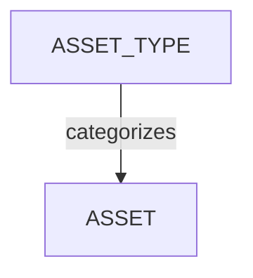

# アセットタイプの管理

<iframe width="560" height="315" src="https://www.youtube.com/embed/Mgnenq75Wv0?si=ZR67ZkflyMUf5ga4" title="YouTube video player" frameborder="0" allow="accelerometer; autoplay; clipboard-write; encrypted-media; gyroscope; picture-in-picture; web-share" referrerpolicy="strict-origin-when-cross-origin" allowfullscreen></iframe>

<!-- #region body -->

## アセットワークフローを定義する

グローバルワークフローを作成したら、**アセットタイプ**を定義できます。

<!-- #region setup -->

ショットをシーケンスごとに整理できるのと同様に、アセットは**アセットタイプ**ごとに整理できます。すべてのアセットをカテゴリごとに整理するために、フォルダーを使用するようなものだと考えてください。

メインメニューで、**管理者**セクションの下にある**アセットタイプ**ページを選択します。

::: tip
デフォルトでは、Kitsu には CGI 制作で使用できるサンプルのアセットタイプがいくつか用意されています。
:::

新しい**アセットタイプ**を作成するには、右上隅にある`アセットタイプを追加`ボタンをクリックします。

次に、以下を含む**アセットタイプ**の情報を入力する必要があります。

- アセットタイプの名前
- 特定のアセットタイプ用のワークフロー

アセットタイプごとに異なるワークフローを設定できます。たとえば、環境アセットでは通常リギングタスクが必要ないため、キャラクターと比べて環境用のタスクを少なくすることができます。

**アセットタイプ**を**作成**または**編集**するときに、特定の**タスクタイプ**を追加できます。このアセットタイプに特定のワークフローを選択しない場合は、制作アセットワークフローが適用されます。

ただし、このアセットタイプに特定のタスクタイプを選択した場合は、それらのみが制作に適用されます。

変更を保存するには、**確認**をクリックします。

これで、新しい**アセットタイプ**が**グローバルライブラリ**に作成されました。制作を作成するときに使用できるようになります。

::: tip
制作中はいつでもこのセクションに戻り、必要に応じて追加の**アセットタイプ**を作成してワークフローに追加できます。
:::

<!-- #endregion setup -->

## 制作で特定のアセットタイプを有効にする

**ナビゲーションメニュー**で、ドロップダウンメニューから**設定**を選択します。

デフォルトでは、制作を作成するときに定義した**アセットタイプ**が Kitsu によって読み込まれます。

ただし、特定のアセットタイプが最初にグローバルライブラリで作成されている場合は、それらを追加または削除できます。

**アセットタイプ**タブでは、この制作に追加または削除する**アセットタイプ**を選択し、**追加**ボタンで選択を確定できます。

## アセットタイプを更新する

`メインメニュー > アセットタイプ`に移動します。

選択するアセットタイプの行にカーソルを合わせ、`編集`アイコンをクリックします。

## アセットタイプを削除する

スタジオのグローバルライブラリからアセットタイプを削除するには、`メインメニュー > アセットタイプ`に移動し、選択するアセットタイプの行にカーソルを合わせて`削除`アイコンをクリックします。

制作ライブラリからアセットタイプを削除するには、`制作メニュー > 設定 > アセットタイプ`に移動し、`削除`ボタンをクリックしてリストからアセットタイプを削除します。  

<!-- #endregion body -->