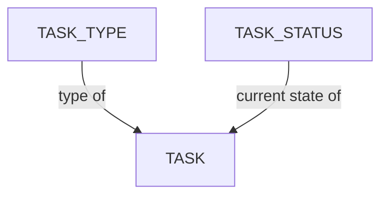

# タスク設定

Kitsuのデータモデルは、制作エンティティの階層（スタジオ → 制作 → エピソード／シーケンス／ショット、または → アセット）と、タスク追跡システム（タスクタイプ、タスクステータス、部門）を組み合わせて作業を整理します。

## 目次

1. [タスクタイプの管理](/ja/guides/task-configuration/managing-task-types/) - アセット、ショット、その他のエンティティが制作中に進むパイプラインの段階（モデリング、リギング、コンポジットなど）を定義します。
2. [タスクステータスの管理](/ja/guides/task-configuration/managing-task-statuses/) - ワークフローにおけるタスクの進捗を追跡するためのレビューおよび承認状態（未着手、作業中、完了など）を設定します。
3. [ステータスの自動化](/ja/guides/task-configuration/status-automation/) - あらかじめ定義された条件に基づいてタスクのステータス変更を自動的にトリガーするルールや条件を定義します。

## データモデル

- **タスク** - 追跡対象となる作業単位で、必ずショットまたはアセットに紐付けられ、タスクタイプと現在のステータスが割り当てられています。
- **タスクタイプ** - タスクが表す作業の種類（例：レイアウト、アニメーション、ライティング）を定義します。部門に属します。
- **タスクステータス** - タスクの現在の状態（例：未着手、作業中、完了、リテイク、承認待ち）です。