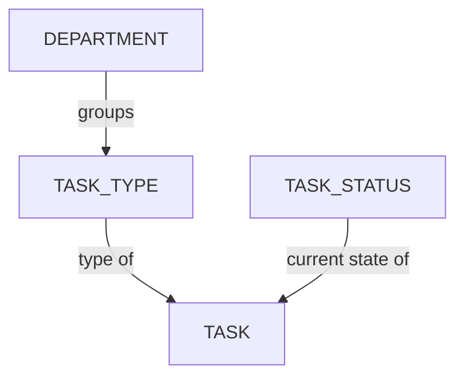

# タスクステータスの管理

<iframe width="560" height="315" src="https://www.youtube.com/embed/JbmXL-EcrnY?si=rEHH_vPy-8Cp_MLg" title="YouTube video player" frameborder="0" allow="accelerometer; autoplay; clipboard-write; encrypted-media; gyroscope; picture-in-picture; web-share" referrerpolicy="strict-origin-when-cross-origin" allowfullscreen></iframe>

<!-- #region body -->

ステータスは、レビューおよび承認プロセスの一環として、タスクが通過する特定の段階または状態を表します。

<!-- #region setup -->

メインメニューで、**管理**セクションの下にある**タスクステータス**ページを選択します。

::: tip
デフォルトでは、Kitsuにはすでにいくつかのステータスの例が用意されています。
:::

`タスクステータス`ページが表示されます。

## タスクステータスを作成する

**承認ワークフロー**で使用するステータスを作成してみましょう。

例:

| ステータス | アイコン | 説明 |
|---|---|---|
| **Ready** |  | アーティストが作業を開始するために必要なものをすべて揃えていることを示します。このステータスになるまでは、タスクを開始しないでください。 |
| **WIP** |  | アーティストがタスクに積極的に取り組んでいることをチームに知らせるために使用します。これにより、別の人に割り当てる必要がないことを示します。 |
| **WFA** |  | アーティストが作業を完了し、レビューを待っていることをスーパーバイザーに知らせるために使用します。スーパーバイザーが、作業のレビュー準備が整ったことをディレクターに知らせるために、同様のステータスを使用することもできます。 |
| **Done** |  | すべての作業が完了し、承認されたことを示します。現在のタスクが完了し、プロセスの次のステップを開始できることを示します。 |
| **Retake** |  | コメントが追加されたことを示します。アーティストは検証が完了するまでタスクの作業を続け、新しいバージョンを公開します。 |

これらのステータスは、Kitsuで実現できることの**ほんの一例**です。必要に応じて、自由に独自のステータスを作成できます。

作成するには、メインページの右上にある`タスクステータスを追加`ボタンをクリックします。

次に、**タスクステータス**について、以下を含むいくつかの詳細を定義する必要があります。

- **名前**は、マウスをその上に移動したときに表示されるステータスの明示的な名前です
- **短い名前**は、Kitsuのダッシュボードに表示される名前です
- このステータスに使用する背景**色**を選択します

複数のフラグを選択することもできます。

| フラグ | 意味 |
|---|---|
| **デフォルトに設定** | すべてのタスクで、Kitsuがデフォルトで最初に表示するステータスです。デフォルトに設定できるステータスは**1つだけ**です。 |
| **完了に設定** | タスクを検証するステータスとして設定します。割り当て数の管理、To Doリストの整理、エピソード統計の更新に役立ちます。 |
| **リテイク値あり** | タスクへのコメントに使用するステータスとして設定します。タスクタイプページやエピソード統計ページで、タスクに関するやり取りを追跡するのに役立ちます。 |
| **アーティストに許可** | アーティストがタスクをこのステータスに設定できるかどうかを制御します。**いいえ**の場合、アーティストの利用可能なステータス一覧には表示されませんが、このステータスにコメントすることはできます。 |
| **クライアントに許可** | クライアントがこのステータスを使用できるかどうかを制御します。**いいえ**の場合、クライアントの利用可能なステータス一覧には表示されません。 |
| **フィードバックリクエスト** | レビューをリクエストするために使用するステータスとして設定します。タイムシートなしでの割り当て数の追跡に役立ち、To Doリストの保留中タブに表示され、**マイチェック**ページでこれらのステータスをグループ化します。このステータスが使用されるたびに、Kitsuは**プレビュー公開**を促します。 |

変更を保存するには、**確認**をクリックします。

これで**ステータス**が**グローバルライブラリ**に作成され、制作で使用できるようになります。

::: tip
制作の途中でも、必要に応じていつでもここに戻って、さらに**タスクステータス**を作成し、
その後、それらを制作に追加できます。
:::

::: warning
*コンセプトステータス*のカテゴリにいくつかのタスクステータスが表示されていることに気付くでしょう。これらはシステムによって使用されるもので、ここで変更することはできますが、新しく作成することはできません。
:::

<!-- #endregion setup -->

## 制作にタスクステータスを追加する

**ナビゲーションメニュー**で、ドロップダウンメニューから**設定**を選択します。

デフォルトでは、制作の作成時に定義した**タスクステータス**がKitsuによって読み込まれます。

ただし、特定のステータスが最初にグローバルライブラリで作成されていれば、制作中に追加または削除できます。

**タスクステータス**タブで、この制作に追加または削除する**ステータス**を選択し、
**追加**ボタンで選択を確定します。

## タスクステータスを更新する

`メインメニュー > タスクステータス`に移動します。

エンティティまたはコンセプトタブを選択し、変更するタスクステータスの行にカーソルを合わせて、`編集`アイコンをクリックします。

## タスクステータスを削除する

スタジオのグローバルライブラリからタスクステータスを削除するには、`メインメニュー > タスクステータス`に移動し、削除するタスクステータスの行にカーソルを合わせて、`削除`アイコンをクリックします。

制作ライブラリからタスクステータスを削除するには、`制作メニュー > 設定 > タスクステータス`に移動し、**削除**ボタンをクリックして一覧からタスクステータスを削除します。  

<!-- #endregion body -->