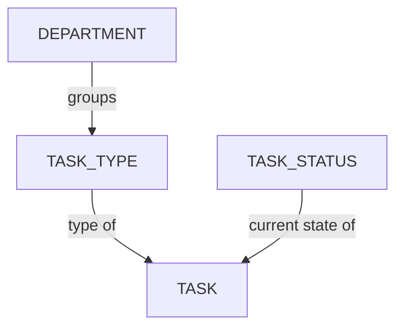

# タスクタイプの管理

<iframe width="560" height="315" src="https://www.youtube.com/embed/mfAoiMIcqlM?si=LDANaDtNjV3wYmdH" title="YouTube video player" frameborder="0" allow="accelerometer; autoplay; clipboard-write; encrypted-media; gyroscope; picture-in-picture; web-share" referrerpolicy="strict-origin-when-cross-origin" allowfullscreen></iframe>

<!-- #region body -->

タスクタイプは、アセット、ショット、シーケンス、エピソード、編集など、複数のエンティティに関連付けることができます。

## 新しいタスクタイプの作成

<!-- #region setup -->

まず、制作を管理・追跡するために必要なすべての**タスクタイプ**を作成しましょう。

メインメニューから、**Admin** セクションにある **Task Types** ページを選択します。

::: tip
デフォルトでは、Kitsu には CGI 制作に使用できるサンプルのタスクタイプがいくつか用意されています。制作に関係のないものは、名前を変更したり削除したりできます。
:::

これらの**タスクタイプ**は、すでに部門にリンクされていることがわかります。

右上隅にある `Add Task Type` ボタンをクリックして、新しい**タスクタイプ**を作成できます。

次に、タスクタイプに関する以下の情報を入力する必要があります。

- タスクタイプの名前。エンティティが異なる場合でも、タスクタイプごとに異なる名前が必要です。
- ダッシュボードに名前の簡潔なバージョンとして表示される短い名前
- チームメンバーがこのタスクタイプのタスクに費やした時間をタイムログに記録する必要があるかどうか
- 使用するエンティティ
- リンク先となる部門
- 色（メインのスプレッドシートページで背景色として反映されます）

**Departments** がタスクタイプのリンク先として選択できることに気付くでしょう。部門を特定のタスクタイプに接続すると、チームの整理に役立ちます。

::: info
[部門の作成について](/ja/guides/team-management/managing-departments)
:::

**Confirm** をクリックして変更を保存します。

::: warning
新しく作成したタスクタイプはリストの一番下に表示されます
:::

順序を調整するには、**Task Type** をクリックして、リスト内の適切な位置までドラッグします。

これで、**Global Library** にタスクタイプが作成されました。おめでとうございます！

::: warning
制作を作成したら、**Sequence**、**Episode**、**Edit** のタスクタイプを**Production Library**に追加する必要があります。
:::

::: tip
制作中はいつでもこのセクションに戻り、必要に応じて追加の**タスクタイプ**を作成してワークフローに追加できます。
:::

<!-- #endregion setup -->

## 制作へのタスクタイプの追加

**Navigation Menu** で、ドロップダウンメニューから **Setting** を選択します。

デフォルトでは、制作の作成時に選択した**タスクタイプ**が Kitsu によって追加されます。

ただし、特定の**タスクタイプ**が最初に Global Library に作成されていれば、それらを追加または削除できます。

たとえば、ライブラリ内の別の制作からタスクワークフローをインポートできます。

**Task Types** タブでは、この制作にインポートまたは削除する制作またはタスクタイプを選択し、**Import** ボタンで選択を確定できます。

::: tip
アセットまたはショットを作成した**後**に新しいタスクタイプを追加する場合：

グローバルエンティティページ（ショット、アセット、シーケンスなど）で**このタスクタイプを追加**する必要があります。

ポップアップが表示されるので、ドロップダウンメニューから新しいタスクタイプを選択する必要があります。

確定すると、ダッシュボードにタスクタイプが追加されます。

:::

## タスクタイプの更新

`Main Menu > Task Types` に移動します。

必要なエンティティタイプ（アセット、ショット、シーケンス、エピソード、または編集）のタブをクリックし、選択するタスクタイプの行にカーソルを合わせて `Edit` アイコンをクリックします。

## タスクタイプのアーカイブ

タスクタイプを非表示にしたいが、インスタンスから削除したくない場合は、タスクタイプを編集してアーカイブできます。

## タスクタイプの削除

スタジオの Global Library からタスクタイプを削除するには、`Main Menu > Task Types` に移動し、選択するタスクタイプの行にカーソルを合わせて `Delete` アイコンをクリックします。

制作ライブラリからタスクタイプを削除するには、`Production Menu > Settings > Task Types` に移動し、`Remove` ボタンをクリックしてリストからタスクタイプを削除します。  

また、グローバルの Asset ページまたは Shot ページからタスクタイプを削除することもできます。タスクタイプ名の横にあるシェブロンをクリックし、`Delete all` を選択します。

::: danger Attention
グローバルの Asset ページまたは Shot ページからタスクタイプを削除すると、対応するすべてのタスク、割り当て、プレビュー、コメントが削除されます。バックアップソリューションを導入していない限り、この操作を元に戻すことはできません。
::: 

<!-- #endregion body -->