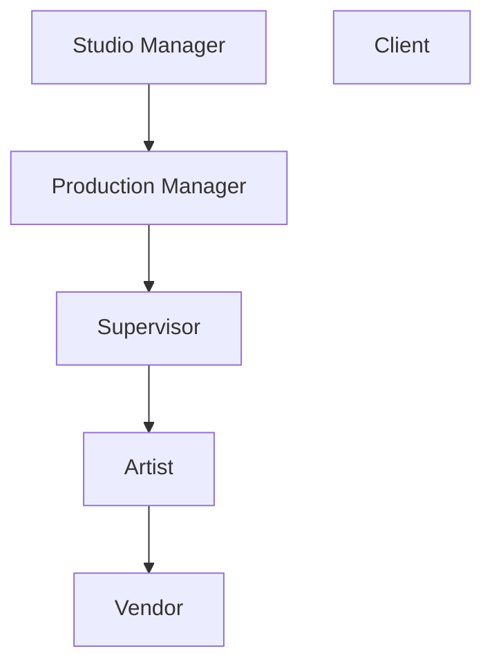

# ユーザー権限ロール

<iframe width="560" height="315" src="https://www.youtube.com/embed/hPXF4dGz7AQ?si=5HLEQbY6P9l9TEu_" title="YouTube video player" frameborder="0" allow="accelerometer; autoplay; clipboard-write; encrypted-media; gyroscope; picture-in-picture; web-share" referrerpolicy="strict-origin-when-cross-origin" allowfullscreen></iframe>

<!-- #region body -->

::: warning 定義
権限ロールとは、システムまたはアプリケーション内でユーザーに付与されるアクセス権と権限のセットを定義するもので、ユーザーが実行できる操作やアクセスできるリソースを決定します。
:::

ロールは非常に重要なので、それぞれがどのような役割を持ち、どのロールが特定のチームメンバーに関連する可能性があるのかを理解しておくと便利です。

組織階層を簡単な図にすると、次のようになります。

ロールごとの権限の概要は次のとおりです。

| ロール | アクセス範囲 | できること | できないこと |
|---|---|---|---|
| **アーティスト** | 自分に割り当てられた制作物／タスクのみ | <ul><li>個人フィルターの作成（グローバルページとタスクタイプページ）</li><li>自分のコメントの編集</li><li>割り当てられたタスクのチェックリストの確認</li><li>その場限りのプレイリストの作成（保存不可）</li></ul> | <ul><li>クライアントのコメントの閲覧</li><li>割り当てられていないプロジェクトへのアクセス</li></ul> |
| **ベンダー** | 明示的に割り当てられたタスクのみ（アーティストより限定的） | <ul><li>アーティストと同様。ただし、割り当てられていないものはすべて非表示</li></ul> | <ul><li>明示的に割り当てられていないものの閲覧／編集</li></ul> |
| **スーパーバイザー** | 自分の担当部門：アセット、ショット、タスク、割り当て、統計、ブレイクダウン、プレイリスト（アーティストの権限を継承） | <ul><li>チームのアーティストへのタスクの割り当て</li><li>担当部門のすべてのタスクへのコメント</li><li>担当部門のチェックリストとコメントの確認／ピン留め</li><li>自分のコメントの編集</li><li>スタジオまたはクライアントのプレイリストの追加／編集</li><li>クライアントのコメントと承認の閲覧</li><li>他部門のコメントの閲覧</li></ul> | <ul><li>スタジオチーム、メインタイムシート、制作物一覧へのアクセス</li><li>タスクタイプ／ステータス／アセットタイプの定義</li><li>他部門のアーティストへのコメントまたはタスクの割り当て</li></ul> |
| **プロダクションマネージャー** | 自分に割り当てられた制作物：アセット、ショット、タスク、割り当て、統計、ブレイクダウン、プレイリスト（スーパーバイザーの権限を継承） | <ul><li>アセット／ショットの作成（手動またはCSVインポート）</li><li>制作物内の任意のタスクへのコメント</li><li>制作物内の任意のコメントまたはチェックリストの編集／ピン留め／確認</li><li>タスク列の追加</li><li>タスクの削除／追加</li><li>スタジオまたはクライアントのプレイリストの追加／編集</li><li>クライアントのコメントと承認の閲覧</li></ul> | <ul><li>スタジオページ、メインタイムシート、制作物一覧へのアクセス</li><li>タスクタイプ／ステータス／アセットタイプの定義</li></ul> |
| **スタジオマネージャー** | すべての制作物と設定（管理者レベル、スーパーバイザーの権限を継承） | <ul><li>制作物の作成／編集／削除</li><li>スタジオへの完全なアクセス（タイムシート、人物、スケジュール）</li><li>権限ロールの設定</li><li>タスクタイプ／ステータス／アセットタイプとスタジオのブランディングのカスタマイズ</li><li>タスク列の追加／削除</li><li>カスタムメタデータ列の作成</li></ul> | — |
| **クライアント** | 自分が参加している制作物のみ | <ul><li>グローバルなアセット／ショットページへのアクセス</li><li>統計ページへのアクセス</li><li>コメント時にステータスの表示が制限されたクライアントプレイリストへのアクセス</li></ul> | <ul><li>タスクの割り当ての閲覧</li><li>自分が書いていないコメントの閲覧</li><li>クライアントのリテイク／承認ステータスの閲覧（スーパーバイザーとスタジオマネージャーのみ）</li></ul> |

## アーティスト

アーティストは、自分が所属している制作物にのみアクセスできます。タスクへのコメント、メディアのアップロード、ステータスの変更は、自分に割り当てられたタスクに対してのみ行えます。アクセスできるステータスは、スタジオマネージャーが定めた事前定義済みのセットに制限されます。

**できること：**
* グローバルページとタスクタイプページで個人フィルターを作成する。
* 自分のコメントを編集する。
* 割り当てられたタスクのチェックリストを確認する。
* ショットまたはアセットのプレイリストをその場で作成する。ただし、これらのプレイリストを保存することはできない。

**できないこと：**
* クライアントのコメントを閲覧する。
* 自分に割り当てられていないプロジェクト内のものにアクセスする。

アーティストがKitsuにログインすると、最初に表示されるページは**マイタスク**ページです。

## スーパーバイザー

部門スーパーバイザーは、アーティストの権限を継承します。

部門スーパーバイザーは、自分が担当する部門の以下の項目に対する読み取りおよび書き込みアクセス権を持ちます。
アセット、ショット、タスク、割り当て、統計、ブレイクダウン、プレイリスト。

**できること：**
* 同じ部門のチームアーティストにタスクを割り当てる。
* 自分の担当部門のすべてのタスクにコメントを投稿する。
* 自分の担当部門のチェックリストを確認する。
* コメントをピン留めする。
* 自分のコメントを編集する。
* スタジオまたはクライアントのプレイリストを追加／編集する。
* クライアントのコメントと承認を閲覧する。
* 他部門のコメントを閲覧する。
* 自分の担当部門のチームのタイムシートを表示する。

**できないこと：**
* スタジオチーム、メインタイムシート、制作物一覧にアクセスする。
* タスクタイプ、タスクステータス、アセットタイプを定義する。
* 自分の担当部門以外にコメントする。他部門のアーティストを割り当てることもできない。

## プロダクションマネージャー

プロダクションマネージャーは、部門スーパーバイザーの権限を継承します。

プロダクションマネージャーは、自分に割り当てられた制作物の以下の項目に対する読み取りおよび書き込みアクセス権を持ちます。
アセット、ショット、タスク、割り当て、統計、ブレイクダウン、プレイリスト。

**できること：**

* アセットとショットを手動またはCSV一括インポートで作成する。
* 制作物内の任意のタスクにコメントを投稿する。
* 制作物内の任意のコメントを編集する。
* 制作物内の任意のチェックリストを確認する。
* 制作物内の任意のコメントをピン留めする。
* タスク列を追加する。
* タスクを削除または追加する。
* スタジオまたはクライアントのプレイリストを追加／編集する。
* クライアントのコメントと承認を閲覧する。

**できないこと：**

* スタジオページ、メインタイムシート、制作物一覧にアクセスする。
* タスクタイプ、タスクステータス、アセットタイプを定義する。

## スタジオマネージャー

スタジオマネージャーは管理者と同じように機能し、Kitsu内のすべての制作物と設定に対する読み取りおよび書き込みアクセス権を持ちます。主な権限には次のようなものがあります。

### 制作物の作成と編集

スタジオマネージャーは新しい制作物を作成し、そのタイプ、FPS、比率、解像度を定義して、カバー画像を追加できます。また、任意の制作物を編集および削除できます。

### スタジオの管理

スタジオマネージャーは、以下を含むスタジオ内のすべてにアクセスできます。

* すべての制作物に対する読み取り／書き込みアクセス
* グローバルタイムシートページへのアクセス
* スタジオ内のすべての人物を表示する権限
* メインスケジュールへのアクセス

人物ページでは、スタジオマネージャーが**各ユーザーの権限ロールを定義します**。

また、次の操作を行えます。

* Kitsuのグローバル設定をカスタマイズする。たとえば、タスクタイプ、タスクステータス、アセットタイプの追加や変更など。
* 権限ロールを設定する
* スタジオ名の変更、会社ロゴの追加、1日の作業時間数の定義など、スタジオの基本情報をカスタマイズする。
* メディアのダウンロード時に元のファイル名を使用するよう設定する。

### 制作物の管理

Kitsuサイト上のすべての制作物に完全にアクセスできます。さらに、次の操作を行えます。

* スーパーバイザーと同じ権限を持つ。
* タスク列を追加／削除する。
* カスタムメタデータ列を作成できる。

## ベンダー

ベンダーの権限はアーティストと似ています。

主な違いは、アーティストが自分の制作物内のタスクを閲覧できる（ただし編集できるのは自分に割り当てられたタスクのみ）のに対し、ベンダーは自分に明示的に割り当てられたタスクのみを閲覧および編集できる点です。

割り当てられていないものはすべて非表示になります。

## クライアント

クライアントは、自分が参加している制作物のみを閲覧できます。

**できること：**

* アセット／ショットのグローバルページにアクセスする。
* 統計ページにアクセスする。
* コメントを投稿する際、タスクステータスへのアクセスが制限されたクライアントプレイリストにアクセスする。

**注**
* クライアントのリテイクまたは承認ステータスを閲覧できるのは、スーパーバイザーとスタジオマネージャーのみです。

**できないこと：**

* タスクの割り当てを閲覧する。
* 自分が書いていないコメントを閲覧する。

<!-- #endregion body -->

