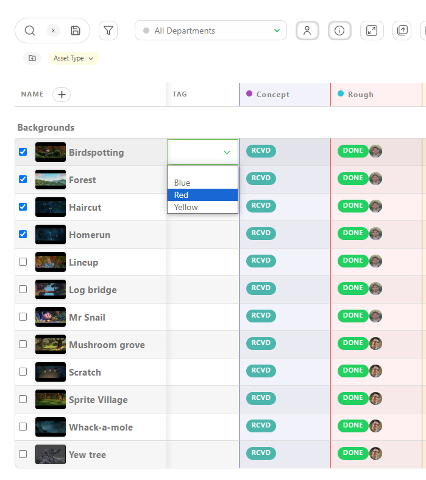
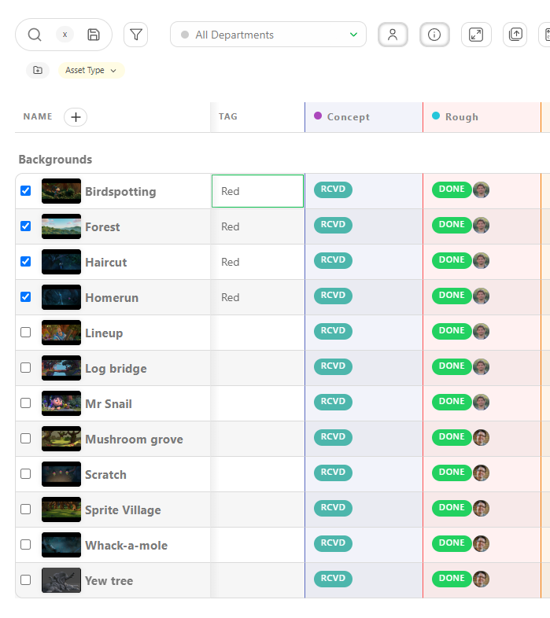
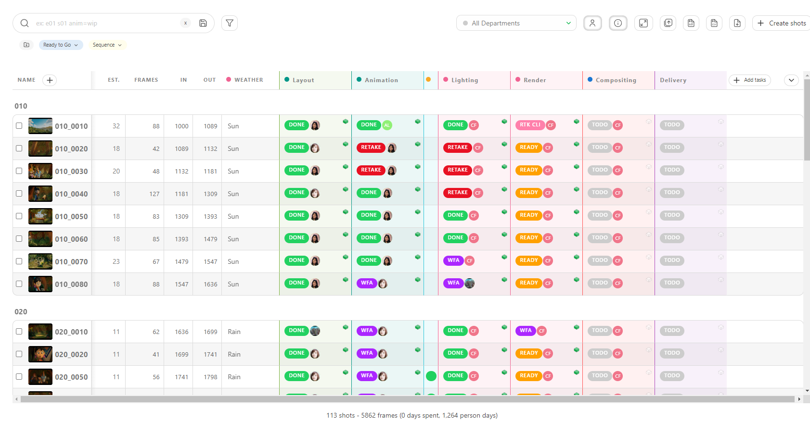

# メタデータ列
一般的なスプレッドシートページにさらに情報を追加するには、**メタデータ列**を作成することができます。

メタデータ列を使用すると、制作に関連する追加情報を追跡することができます。 例えば、タスクの難易度を追跡するメタデータ列や、タスクの特定の側面を識別するのに役立つカスタムタグを試す列などがあります。 カスタムメタデータ列では、さまざまな形式でデータを保存できるため、データの入力、フィルタリング、検証が容易になります。

## メタデータカラムの作成

新しいカスタムメタデータカラムを追加するには、カラム名の隣にある「+」アイコンをクリックします。

まず、フィールドの名前を任意で選択します。次に、ニーズに合わせて適切な**タイプ**を選択します。

- **テキスト**：
- このタイプは、文字と数字の両方を含むテキストベースの入力を処理します。説明、コメント、テキストコンテンツなどの情報を柔軟に保存できます。

- **数値**：
- 数値データ専用です。フレームレート、日付、時刻など、数値のみで構成される情報を追跡する場合に推奨されます。

- **チェックボックス**：
- このオプションでは、項目をオンまたはオフとしてマークすることができます。 例えば、予告編用のカットのショットを指定するなど、2つの状態のみが考えられるデータの追跡に適しています。

- **値のリスト**：
- このタイプでは、一意の要素を1つだけ選択できるオプションのリストを定義します。選択肢が限られているデータを追跡する際に最適です。例えば、カメラの動きを追跡する場合、「静止」、「パン」、「チルト」、「ズーム」などのオプションが考えられます。

- **タグのリスト**: 
- ここでは、複数のタグを定義できます。1つの項目のみを選択できる値のリストとは異なり、このタイプではリストから複数のエントリを選択できます。 

- **チェックリスト**: 
このタイプでは、オプションのリストが提示され、それぞれにチェックボックスが付いています。 制作パイプラインにおいて独自のタスクとして扱うほどではない、ショットやアセットに関連する細かいサブタスクを追跡するのに便利です。

:::警告 
テキスト**および**数値**のメタデータタイプを作成する際、作成時にデフォルト値は必要ありません。

ただし、「**値のリスト**」、「**タグのリスト**」、および「**チェックリスト**」を使用する場合は、作成時に含める値を指定する必要があります。

利用可能な値」の下にリスト要素を入力し、「値を追加」をクリックして確認します。
:::

### メタデータカラムと部門のリンク

メタデータカラムを1つまたは複数の部門にリンクすることもできます。アーティスト/スーパーバイザーは、自分のToDoページと部門フィルタリングされたビューでそれを見ることができます。

部門をさらに作成するには、[部門の作成](../configure-kitsu/README.md#create-departments)を参照してください。

メタデータ列を1つまたは複数の部門にリンクすることができます。 リストから部門をクリックし、**追加**をクリックして確定します。

ここでは、VFX列が2つの部門にリンクされています。

::: 詳細 メタデータカラムの編集方法
アセットまたはショットのグローバルページで、メタデータカラムの右端にある矢印をクリックし、**[編集]**をクリックします。

:::

おめでとうございます。新しく作成したメタデータカラムがグローバルページで利用可能になりました。

::: ヒント 一括更新
同じ値で複数のアイテムを更新したい場合は、まず下記のように対象のアイテムをチェックし、その後値を更新します。 入力した値は、すべてのアイテムにわたって更新されます。

:::

::: 詳細 エンティティの編集
スプレッドシート内のエンティティを直接更新することもできますが、編集ボタン  を使用して複数のメタデータカラムを更新することもできます。

選択すると、その特定のエンティティのすべてのメタデータ列の値を入力または調整することができます。作業が完了したら、必ず「確認」ボタンを押してください。

::::

メタデータ列を編集または削除する必要がある場合は、メタデータ列の名前の隣にあるスプレッドシートのページで、矢印をクリックします！[メタデータ列の詳細](../img/getting-started/arrow.png)。 

::: ヒント
メタデータ列の編集や削除に加えて、ここから**ソート**をクリックして、新しい列でグローバルページを**ソート**することもできます。

さらに、メタデータ列を**固定**することもできます。つまり、大きなデータセットをスクロールしている間も左側に固定され、表示されたままになります。
:::

## メタデータ列の整理
### すべてのメタデータ列の表示または非表示

グローバルスプレッドシートを整理しておくために、必要のない列を非表示にすることができます。この操作は列を削除するものではなく、単に表示を隠すだけで、使用されている他の領域では保持されます。

これを行うには、ページの右上にある「追加情報の非表示」
 ボタンをクリックします。

 

情報を再度表示するには、同じボタンをクリックします。
 グレーでハイライトされません。

 

### メタデータカラムの表示または非表示

グローバルページ上で特定の**メタデータ列**を非表示または表示する必要がある場合があります。

メタデータ列を非表示にするには、グローバルページの右端にある矢印をクリックします。

非表示**または**表示**する列を選択することができます。

## 固定コラム

参照頻度の高い情報がある場合、そのコラムをショット名の隣に**固定**することができます。

コラムの右側にある矢印をクリックしてコラムメニューを開き、**固定**を選択します。

