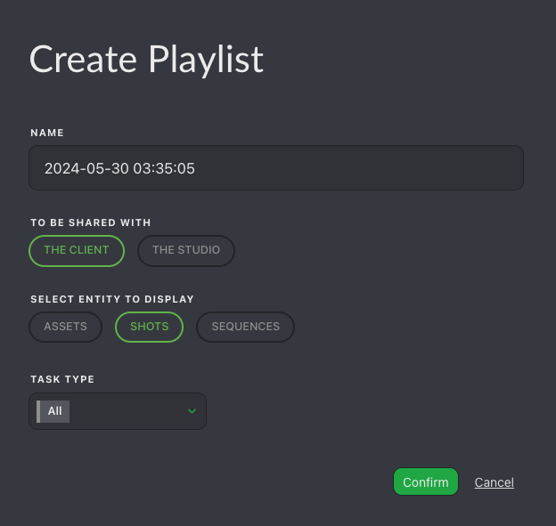
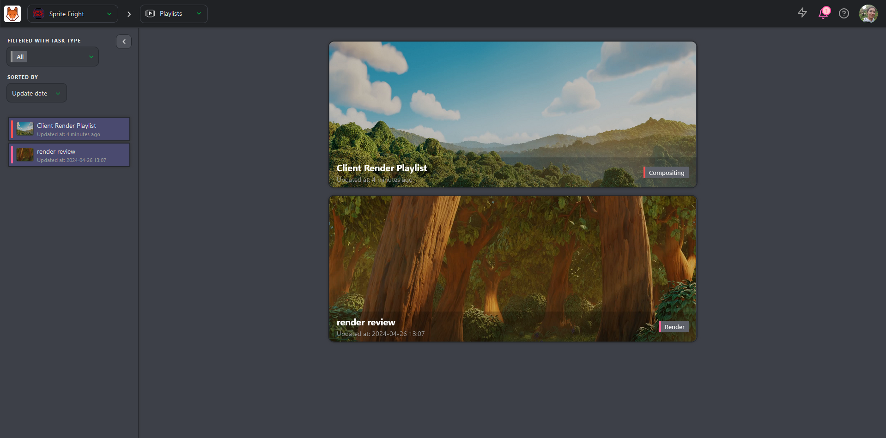
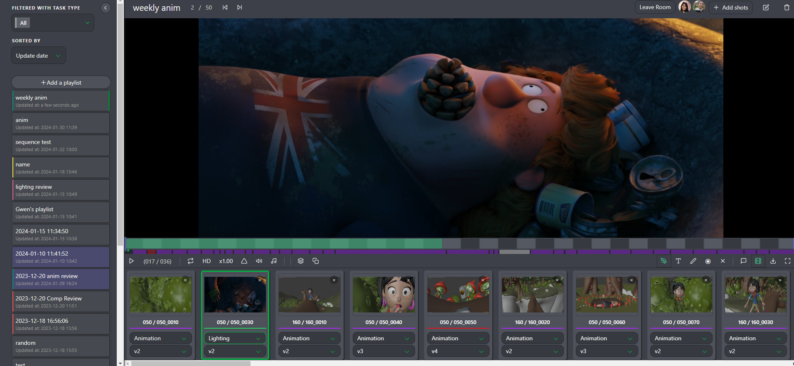

# クライアントプレイリスト

## クライアントプレイリストの作成

クライアントとレビューを行うための最初のステップは、共有およびレビューしたいコンテンツのプレイリストを作成することです。このプロセスは通常のプレイリストの作成と似ていますが、Kitsuには、スタジオ外の関係者との共同作業を支援する便利な機能がいくつか含まれています。

まず、プレイリストを作成し、レビューしたいアイテムを追加します。 作成方法については、このセクションを参照してください（../review/README.md#create-a-playlist）。

主な違いは、「共有先」で「クライアント」を選択することです。これにより、適切な権限が確保され、クライアントにはこの特定のプレイリストへのアクセスのみが提供されます。

## クライアントプレイリストの確認

プレイリストを作成したら、クライアントに確認してもらう準備ができたことを通知します。

::: 警告
クライアントはチームの一員である場合にのみ本番環境にアクセスでき、**クライアントプレイリスト**のみを表示できます。同じ本番環境内のクライアントを分ける方法はありませんのでご注意ください。 
:::

クライアントはプレイリストを管理するためにいくつかのオプションがあります。

::: 危険 クライアントの権限
- クライアントはすべてのタスクタイプのすべてのバージョンを見ることができます。
- クライアントは自身が投稿したコメントとそれらのコメントに対する返信のみを見ることができます。クライアントは内部コメントを見ることができません。
- クライアントはリビジョンが公開された日時のみを見ることができますが、公開したユーザーを見ることはできません。
- クライアントは**「クライアントが許可されている」**タグのステータスを見ることと使用することのみが可能です。
:::

クライアントは（左から右へ）以下の操作が可能です。
* ビデオの再生または一時停止。
* 1つの要素のループ再生。
* LD（低解像度）とHD（高解像度）の切り替え。
* 再生速度の変更：2倍速（x2）、通常速（x1）、半分の速さ（x0.50）、4分の1の速さ（x0.25）。
* 再生中の注釈の表示。
* 音声のミュートまたはミュート解除。
* 音声の波形の表示。
* プレイリスト内のすべての要素のタスクタイプの変更。
* 比較ツールの使用。
* テキストおよび描画オプションの使用、選択した項目の削除。
* コメントセクションを表示する。
* プレイリストの要素を隠す。
* プレイリストを、個別の要素すべてを含む**Zip**ファイル、**.csv**テキストファイル、または**Build .mp4**としてダウンロードし、ムービー全体を作成する（ショットのみ）。
* フルスクリーン表示にする。

::: ヒント
クライアントは、キーボードの左右矢印を使用して、プレビューをフレームごとに移動することができます。
:::

また、クライアントは以下を行うことができます。
* 要素をクリックして、要素から要素へと移動する。
* 全体の要素と比較した各要素の色と長さを見る。
* 全体の要素と比較した選択した要素の位置を緑色のドットで表示する。

## 再生コントロール

プレイリスト化されたショット/アセットごとに、クライアントは確認したい**タスク**と**バージョン**を選択することができます。

また、[比較] ボタン  をクリックし、2番目のタスクタイプを選択することで、ショットの2つのタスクを並べて再生することもできます。

::: ヒント
プレイリストの主な目的は、クライアントがショットとアセットを確認するのを支援することです。 プレビューから直接ショットにコメントを追加することができます。
:::

コメントを追加するには、**コメント**ボタンをクリックします。

これにより右側のパネルが開き、コメントとステータスの履歴が表示されますが、内部コメントやステータスにはアクセスできません。

**描画**ボタン  を使用して動画上に描画したり文字を入力したりしながら、同時にコメントを書き込むことができます。

描画されたコメントはビデオ上で確認できます（タイムラインの下の赤い点で示されています）。

::: 警告 
クライアントのコメントはスーパーバイザーとプロダクションマネージャーのみが確認できます。アーティストはステータスのみ確認できます。

スーパーバイザーとプロダクションマネージャーはクライアントのコメントをコピーし、必要に応じて修正し、チームに公開することができます。

:::

## レビュールーム

レビュールームは、効率的で同期されたデイリーズレビューセッションを行うために設計された共同作業スペースです。これにより、すべての参加者が同時に同じコンテンツを閲覧することができ、リアルタイムでのフィードバックやディスカッションが容易になります。

**レビュールーム**に参加するには、プレイリストの上部にあるボタンをクリックします。レビュールームはすべての参加者を同期します。

レビュールーム内の全員が再生、一時停止、ショット、フレームの選択をリアルタイムで確認できます。

さらに、レビュールームでは同期描画注釈もサポートしています。この機能により、参加者はレビュー中のフレームに直接描画することができ、その注釈はセッション内の全員に表示されます。この機能により、コミュニケーションと明瞭性が向上し、特定の詳細の指摘、変更の提案、作品の重要な側面の強調が容易になります。

