# 制作レポートの作成

## 制作の概要

プロデューサーとして、制作プロセス全体を包括的に把握することは不可欠です。

Kitsuは、通知に圧倒されたり、集中力を欠いたりすることなく、情報を把握し、制作を効率的に管理するためのさまざまなツールを提供します。

### ニュースフィードの機能
ニュースフィードセクションでは、制作に関するリアルタイムの更新情報が表示されます。

- **リアルタイム更新**：ステータスの変更がすべて、分単位でリアルタイムに表示されます。
- **サマリー表示**：画面の右側に、ニュースアイテムの総数とステータスごとの内訳が表示されます。
- **フィルタリングオプション**：タスクのステータス、タスクの種類、担当者別にリストをフィルタリングして、特定のエリアに焦点を絞ることができます。
- **コメントパネル**：行をクリックすると、右側にコメントパネルが開き、必要な詳細情報が表示されます。

#### フィルタの使用

**フィルタビルダー**ボタンを使用して、情報を表示する期間をカスタマイズできます。これは、特定のスーパーバイザーや期間に焦点を当てる場合に便利です。

#### 例

特定の月のスーパーバイザーに焦点を当てたい場合は、名前を選択し、**[From]**ボックスで日付を選択します。

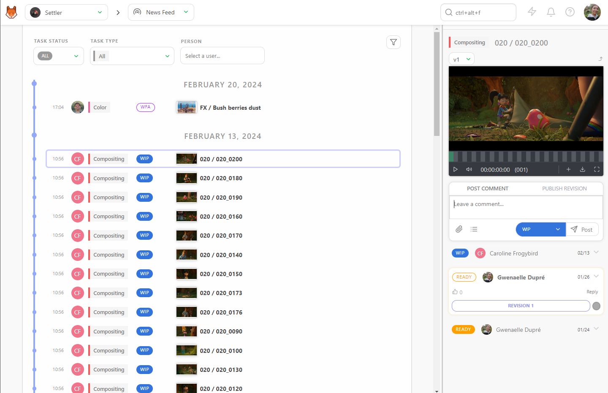

## 制作の現状を把握する
制作の現状を把握することは非常に重要です。Kitsuは詳細な統計と視覚化を提供し、進捗状況を効果的に追跡できるようにします。

### ショートフィルム/長編映画固有の機能
ここでは、ショートフィルム/長編映画のワークフローに固有の機能について説明します。

#### シーケンス統計

**シーケンス統計**ページでは、制作の状況をシーケンスごとに円グラフで表示します。 円グラフの色分けはステータスに対応しており、制作の状況を素早く把握できます。

- **すべてのシーケンス**：最初の行は制作全体を表します。
- **すべてのタスク**：最初の列にはすべてのタスクが同時に表示されます。

最初の円グラフに注目すると、制作の正確な状態を確認できます。さらに詳細を確認するには、残りの行を見て、各タスクタイプの状態をグローバルに把握します。

#### アセットタイプ統計

シーケンス統計と同様に、**アセットタイプ統計**ページではアセットタイプごとの円グラフが表示され、制作全体におけるアセットのステータスを明確に把握できます。

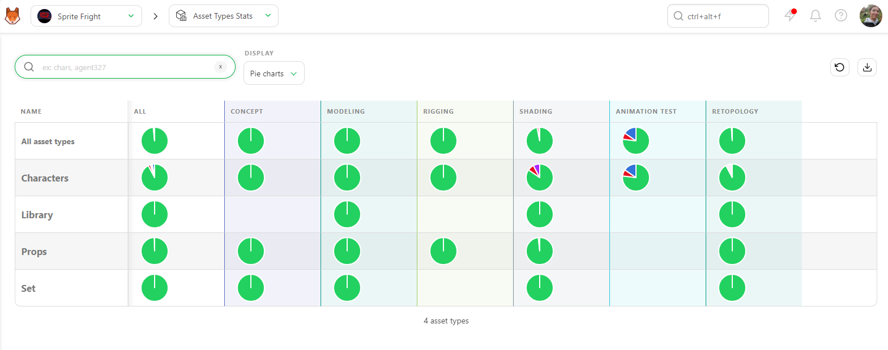

#### カウントビュー

また、**カウント**としてデータを表示し、アセット、ショット、フレームの正確な数と、それらのステータスごとの割合を確認することもできます。

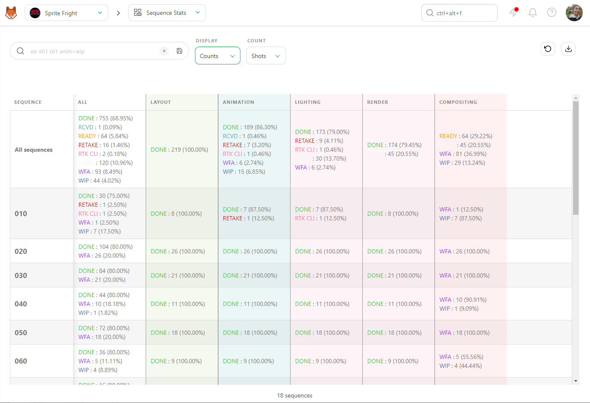

#### データのエクスポート

このページは `.csv` テキストファイルとしてエクスポートし、スプレッドシートソフトウェアにインポートして、さらに分析やレポート作成を行うことができます。

これらのツールを活用することで、制作プロセスを常に把握し、すべてがスケジュール通りに円滑に進行していることを確認できます。

### テレビ番組固有

**エピソード統計ページ**では、テレビ番組に関する追加情報にアクセスできます。

### リテイクの表示
**エピソード統計**ページのデフォルト設定は**リテイク**です。この表示では、各タスクタイプにおける各エピソードのリテイク（やり直し）の回数を参照できます。表示される色は3色のみです。
- **検証済みの場合は緑**
- **リテイクの場合は赤**
- **進行中の場合はグレー**

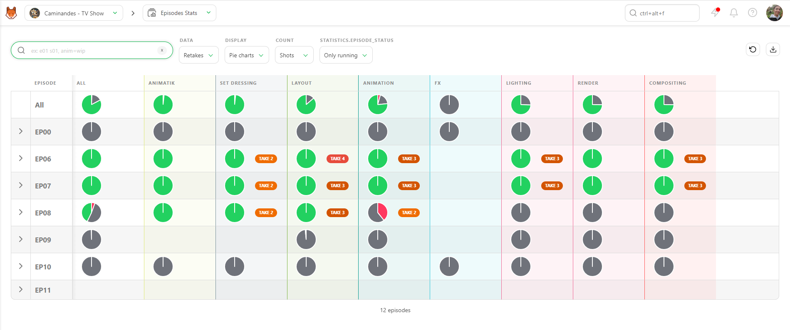

エピソードを展開すると、各テイクの割合とリテイクと承認の推移が表示されます。これにより、各タスクごとのエピソードの進捗状況を確認できます。

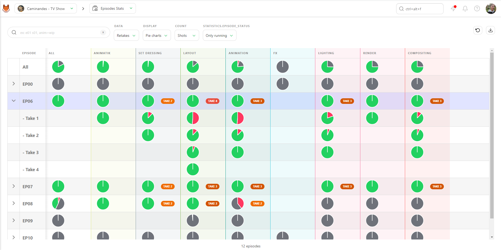

通常、最初のエピソードには多くのやり取りがありますが、時間が経つにつれて改善されていくはずです。しかし、後半のエピソードにまだ多くのリテイクがある場合は、何か修正すべき点があるはずです。ディレクターやスーパーバイザーと問題について話し合う時が来たということです。

### ステータス表示

データ表示の2つ目のオプションは、**ステータス**です。このステータス表示は、**シーケンス** / **アセットタイプ** 統計ページと同様に機能します。

データを**カウント**として表示することもできます。この方法では、ステータスごとのショット/フレームの正確な数とパーセンテージが表示されます。

このページを `.csv` テキストファイルとしてエクスポートし、スプレッドシートソフトウェアにインポートすることができます。

## タスクが期限内に完了していることを確認する

タスクが期限内に完了しているかどうかを確認するには、次の2つの情報が必要です。
- タスクの **タスクタイプ**
- タスクの **見積もり**（入札）の日数、およびタスクの **開始予定日**と**期限**。

この情報を入力すると、タスクタイプのページで**見積りと実績**を比較することができます。

### 見積りと実績を比較する方法

これを行うには主に2つの方法があります。
1. **期限ステータスによるフィルタリング**
2. **ガントチャートを使用する**

::: ヒント
Kitsu は、**WIP**（作業中）と **WFA**（承認待ち）の日付とステータスを自動的に取得します。 **見積開始日**と**アーティストが実際に開始した日**を比較したり、**見積期限日**と**アーティストが承認を求めた日**を比較することができます。
:::

### 期限日ステータスによるフィルタリング

**タスク**] タブで、最初に表示されるフィルタは [**期日ステータス**] です。 [**期日ステータス**] を [**今日より前に期日が到来**] に設定すると、[**期日が今日より前に設定**] されたすべてのタスクが表示されます。

次に、完了したものとまだ完了していないものを判断します。 [**-完了**] フィルタを使用すると、完了したタスクが除外されます。

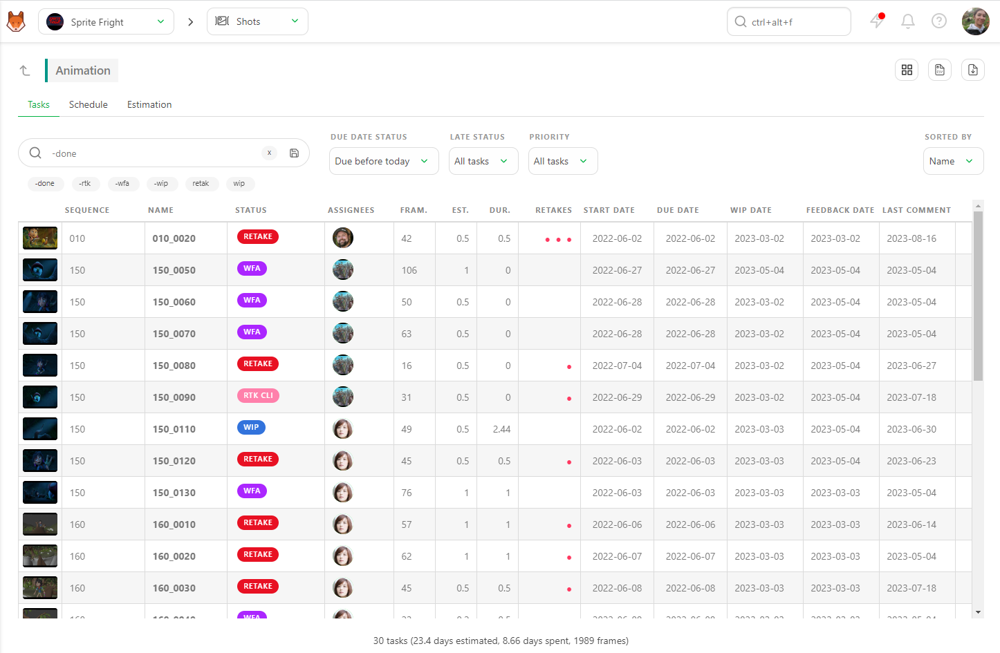

これは、2つのフィルタが適用されたすべての期限遅れのタスクを表示します。つまり、**見積もり期限**後にのみ確認されるということです。ページ下部のサマリーは、適用されたフィルタに基づいてリアルタイムで更新されます。

このページを `CSV` ファイルとしてエクスポートし、スプレッドシートソフトウェアで開くことができます。

### 遅延ステータスフィルタの使用

ページに組み込まれている**「遅延ステータス」**フィルタを使用すると、見積もりよりも時間がかかったタスク（**「見積もり超過時間」**）をすぐに確認することができます。

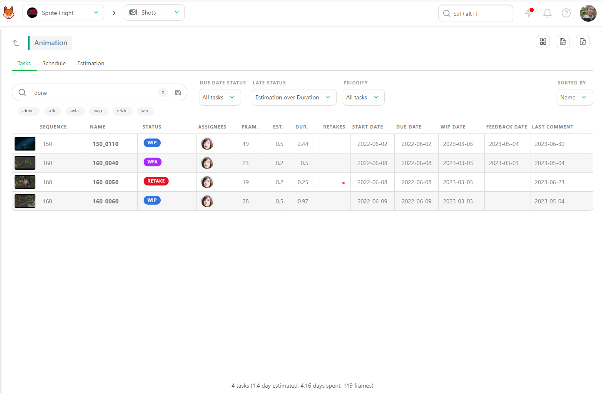

**期限遅延**オプションを使用して、遅延したタスクをフィルタリングします。タスクが遅延しているかどうかを計算するには、次の2つの方法があります。
1. **見積もり期限**と**フィードバック**の比較
2. **見積もり期限**と**完了**の比較

スタジオの計算方法に応じて、Kitsuが回答を提供します。

### ガントチャートを使用する

**タスクタイプページ**で、**スケジュール**タブに移動します。 制作スケジュールで設定されたこのタスクタイプの**開始**日と**終了**日は、画面の上部に表示されます。

**ガントチャート**は、これらの日付の前後が濃いグレーで表示され、タスクのタイミングを視覚的に示します。

**着色**を**ステータスカラー**から**遅延は赤**に変更します。これにより、期限通りのタスクは**グレー**で、遅延しているタスクは**赤**で表示されます。

詳細を確認するには、**[タスク]** タブに戻ることができます。また、Kitsuはタブ間でフィルタを保持します。

## タスクが遅延している理由を理解する

どのタスクが遅延しているか、または遅延する予定かを知ったので、**その理由**を理解する必要があります。タスクが遅延する理由はいくつかあります。

- アーティストが多くのタスクに圧倒されている。
- タスクのやり取りが多すぎる。
- タスクが過小評価されている可能性があり、期限内に完了させるのが難しい。
- 前のタスクがすでに遅れている。

### アーティストの作業負荷の確認

アーティストのタスク数を確認するには、[タスク] タブでアーティスト名を指定して [タスクタイプ] ページをフィルタリングします。

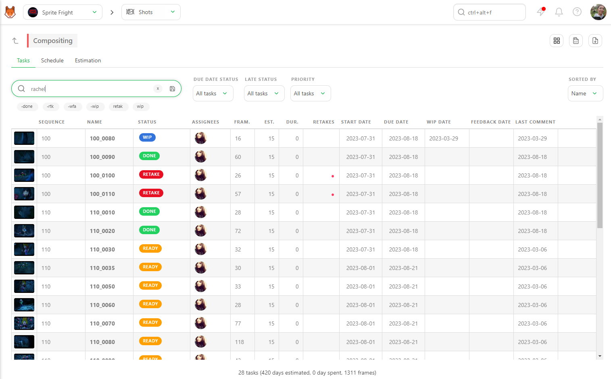

また、**-done** フィルターを追加して、そのアーティストが完了したタスクを確認することもできます。次に、**Due Date Status** フィルターを **Due previous week** または **Due this week** に設定して、必要な情報を検索します。

これにより、そのアーティストが完了すべきタスクの数が表示されます。

### やりとりの確認

やりとりの回数を特定するには、[タスク] タブの [リテイク] 列を確認します。 **赤いドット**はそれぞれ **リテイク** を表します。 該当行をクリックすると、**コメントパネル** が開き、タスクの全履歴を確認できます。 これは、アーティストが指示を誤解していたかどうか、指示が各バージョンで変更されたかどうかなど、何が起こっているかを把握する最善の方法です。

### タスクが過小評価されていないかを確認する

タスクが過小評価されていないかを確認するには、グローバルページに戻り、ショットまたはアセットの名前をクリックして、キャスティングやその他の追加情報を確認します。 たとえば、シーンに登場するキャラクターが多すぎる場合や、アクションシーンが大掛かりである場合などです。

### 前作業の確認

最後に、アセット/ショットの詳細を表示しながら、前作業を確認することができます。クリックすると、**タスクタイプ**専用のページに移動し、以前の作業に関する詳細情報を確認できます。これにより、以前のタスクの遅延が現在のタスクに影響しているかどうかを把握できます。

## 見積もり以上の期間

全体像に焦点を当て、**入札**の全体的な概要を把握するには、さまざまなページで、見積もりの**人日**と実際の**作業日数**を比較できます。

### 見積もりサマリー

ショットのグローバルページでは、すべての見積もりの期間のサマリーを確認できます。また、より詳細な情報を得るためにフィルターを適用することもできます。

例えば、特定のシーケンスに焦点を当てるには、シーケンス名でグローバルページをフィルタリングします。すると、下部のサマリーが更新されます。

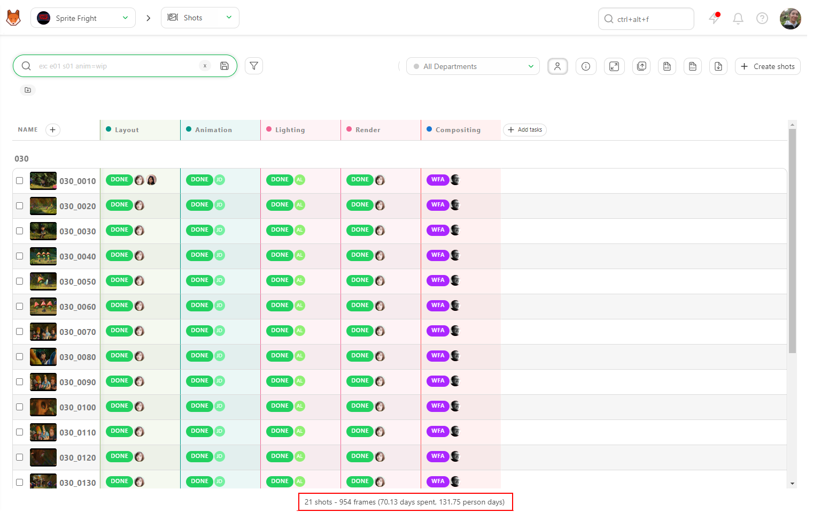

これにより、特定のシーケンスの**期間**と**見積もり**を知ることができます。

同様に、グローバルアセットページをフィルタリングすることもできます。

たとえば、**キャラクター**などの特定の**アセットタイプ**でフィルタリングすることができます。下部のサマリーが更新され、そのアセットタイプの推定時間と期間が表示されます。

![グローバルアセットページのサマリーフィルター] (../img/getting-started/global_asset_sumup.png)

タスクタイプ別 見積もり期間

詳細を確認するには、タスクタイプの名前をクリックします。画面下部のサマリーには、この特定のタスクタイプに対する**期間**と**見積もり**が表示されます。

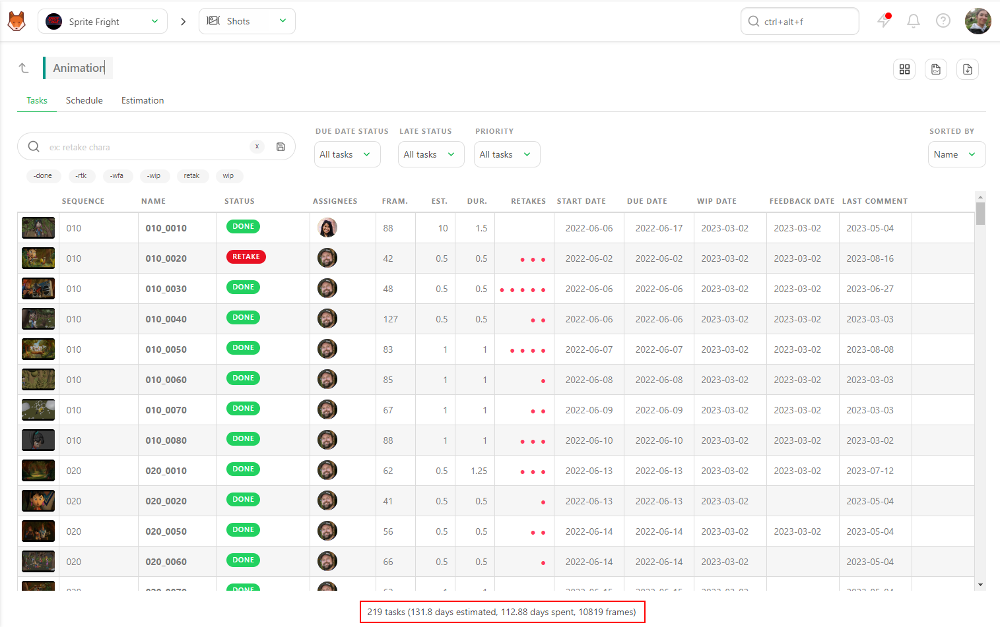

全体像を確認したり、**特定のステータス**や**アーティスト名**に焦点を当てることができます。グローバルページと同様に、適用したフィルタに応じてサマリーが更新されます。

このように、特定のタスクやアーティストのパフォーマンスや効率を詳細に監視し、見積もりが実際の所要時間と一致していることを確認し、必要に応じて調整することができます。

### アセット/ショットの見積もり所要時間

詳細を精査するには、キット内の各アセットとショットに対して、**「見積もり」**と**「所要時間」**（期間）の列を表示することができます。

ショットまたはアセットのグローバルページでは、各タスクの**「見積もり」**と**「期間」**の合計を確認できます。これにより、不一致や問題を素早く特定できます。

### 詳細分析

何かがおかしいと思われたり、さらに調査が必要な場合は、アセット名またはショット名をクリックして詳細ページに移動します。

詳細ページの画面左上には、アセットまたはショットのライフサイクルの概要が表示されます。これには、各タスクの**ステータス**、**見積もり**、**期間**、**開始日と期限**、**割り当て**の詳細が含まれます。

この包括的なビューは、相違点がどこにあるかを把握し、必要に応じて修正措置を取るのに役立ちます。これらの詳細を綿密に監視することで、見積もり時間と実際の所要時間の整合性をより確実にし、より正確な将来の計画とリソースの割り当てが可能になります。

## クォータの確認

Kitsuは、**ショットのタスクタイプ**ごとのクォータを計算する2つの方法を提供しています。 

### 方法1：タイムシートに基づく計算

この方法では、タイムシートに記録されたタスクに費やされた時間に応じてクォータに重み付けをします。 

- **タスクの完了**：最初のフィードバックリクエスト時にショットが完了したとみなされます。その後、タイムシートに記録された時間に基づいてクォータに重み付けがされます。

この例では、Kitsuはタイムシートデータを使用して日々のノルマを計算します。

### 方法 2: ステータスに基づく計算

タイムシートデータが利用できない場合、Kitsuはステータスの変更を使用してノルマを計算します。

- **タスクの開始**: タスクのステータスがWIPに変更された時点で、タスクが開始されたと見なされます。
- **タスクの完了**: フィードバックのリクエストが作成された日に、タスクが完了したと見なされます。

### 詳細なノルマ計算

Kitsuは、タスクの開始日と終了日の間の全営業日について、完了したフレームを分割し、各アーティストに割り当てます。1日/1週間/1か月ごとに提出されたフレーム（または秒数、またはタスク）の数を割り当てます。

いつでも数字をクリックすると、右パネルに詳細情報が表示されます。

::: 危険
**注意**: タイムシートが記入されていない場合、Kitsuは以下の条件を考慮します。
- タスクがWIPにステータスが変更されたときに開始された。
- タスクがフィードバックリクエストが作成された日に完了した。
:::

この方法では、詳細なタイムシートデータがなくても、タスクの進捗を確実に追跡し、正確なノルマを計算することができます。

## チームのタイムシート

::: 警告
これまでのすべての章は、各タスクに**見積もり**と**期間**が入力されていることを前提にしています。
:::

全員が自分の役割を果たさなければなりません。あなたと上司は見積もりを担当し、チームメンバーはタイムシートを入力します。

メインメニューに移動し、タイムシートページを選択します。

### タイムシートの表示

このページでは、各チームメンバーのタイムシートを日ごとに表示することができます。これにより、メンバーが毎日タイムシートを記入しているか、休みを取ったか、あるいは残業したかを確認することができます。

タイムシートの入力内容について疑問がある場合は、該当する行をクリックすると、制作、タスクの種類、特定のタスクの詳細を確認できます。

日単位で問題がなければ、**詳細レベル**を日単位から週単位、月単位、年単位に変更できます。

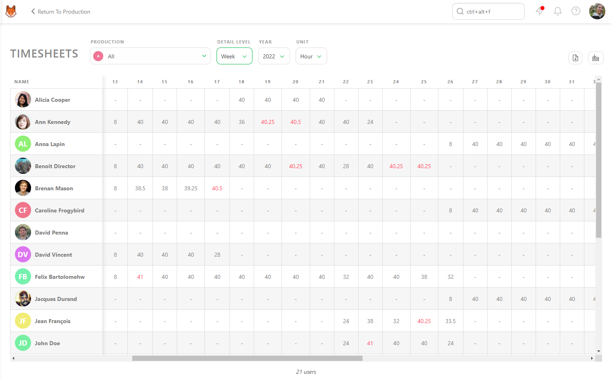

管理しているすべての制作を同時に表示することも、各制作を個別に表示することもできます。

### タイムシートのエクスポート

Kitsuの他のすべてのページと同様に、タイムシートのデータをCSVファイルとしてエクスポートし、表計算ソフトウェアで開いてさらに分析を行うことができます。
