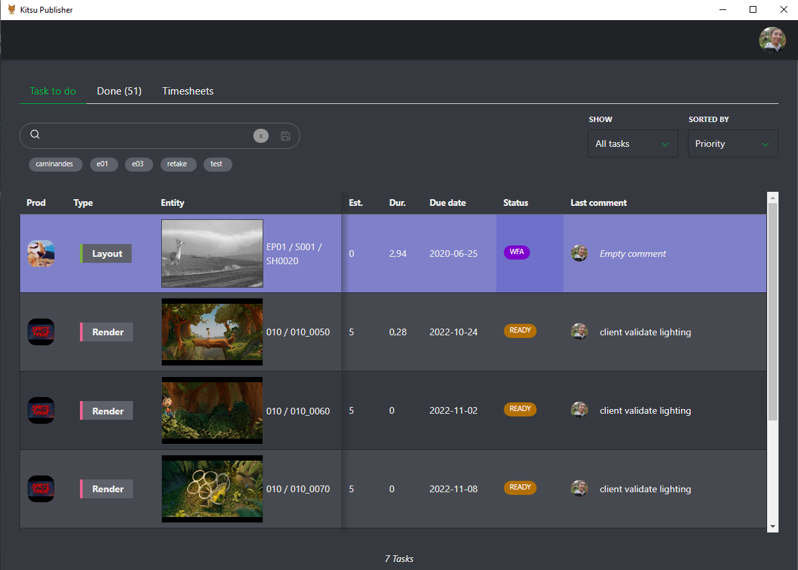
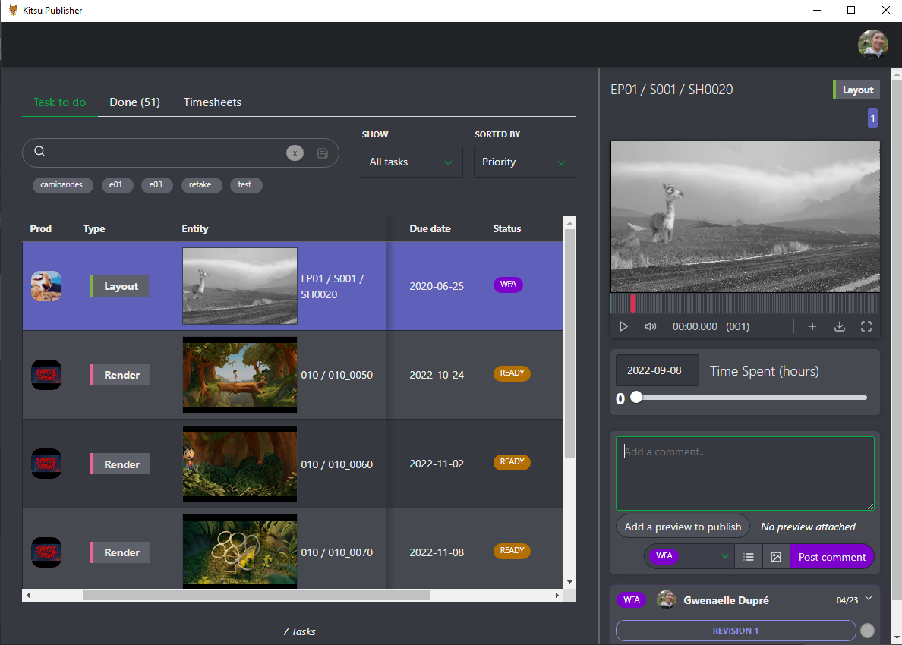
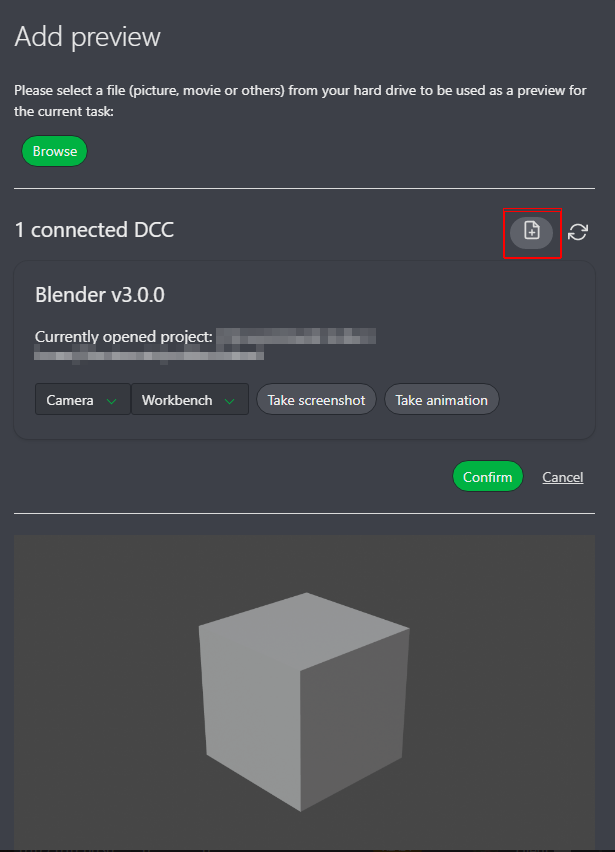
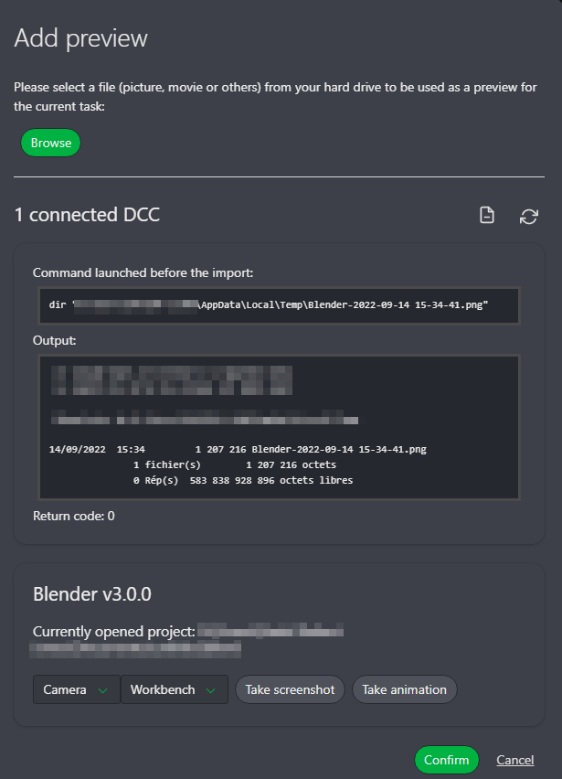

# Kitsu Publisher

Kitsu は、制作進行の共有と配信の検証を合理化し、関係者間のコミュニケーションを強化することで、より迅速で高品質なアウトプットを実現するウェブアプリケーションです。 

Kitsu Publisher はデスクトップアプリケーションで、DCC ツールと Kitsu を橋渡しし、アーティストがそれぞれのツールから直接タスクの管理、コメントの追加、プレビューの送信を行うことを可能にします。

## DCC 統合 ステータス:

現在サポートされているもの：
- Blender
- Toon Boom Harmony
- Unreal Engine

現在作業中のもの：
- Photoshop
- Nuke

## インストール

### Kitsu Publisher のインストール

#### 事前要件

リリース](https://github.com/cgwire/kitsu-publisher-next/releases/latest) から、お使いの OS に該当するアプリ用のインストーラー/パッケージ/ポータブル版をダウンロード（または、ご希望であればビルド： [開発環境](#development-environment) 参照）する必要があります。

すべてのコマンドのファイル名にはキーワード {version} が含まれています。このバージョンを、お使いの Kitsu Publisher の現在のバージョンに置き換える必要があります。

#### Linuxの場合

- **debパッケージ**（Debianベースのディストリビューション用）：
- パッケージをインストールするには：

```shell
dpkg -i kitsu-publisher_{version}_amd64.deb
```

- パッケージはアプリケーションと$PATHに追加されます。

- **rpmパッケージ**（RHELベースのディストリビューション用）：
- パッケージをインストールするには：

```シェル
rpm -i kitsu-publisher_{version}_x86_64.rpm
```

- パッケージはこれでアプリケーションと $PATH に追加されました。

- **snap パッケージ**:
- パッケージをインストールするには:

```シェル
snap install kitsu-publisher_{version}_amd64.snap --dangerous
```

- パッケージは現在、アプリケーションおよび $PATH にあります。

- **tar.gz アーカイブ**:
- アーカイブを展開するには:

```shell
tar -xf kitsu-publisher-{version}.tar.gz
```

- アプリケーションを実行するには:

```shell
kitsu-publisher-{version}/kitsu-publisher
```

- **AppImage**:
- アプリケーションを実行するには:

```shell.
/Kitsu publisher-{version}.AppImage
```


Windowsの場合

- **NSISインストーラー**:
インストーラー `Kitsu-publisher-Setup-{version}.exe` をダブルクリックし、指示に従ってください。

- **MSIインストーラー**:
インストーラー `Kitsu-publisher-{version}-ia32.msi` をダブルクリックしてアプリをインストールします。

- **ポータブルアプリケーション**：
実行ファイル `Kitsu-publisher-{version}.exe` をダブルクリックします。

- **Zipポータブルアプリケーション**：
Zipファイル `Kitsu-publisher-{version}-ia32-win.zip` を解凍し、`Kitsu publisher.exe` をダブルクリックします。

MacOSの場合

- **DMGインストーラー**:
インストーラー `Kitsu-publisher-{version}.dmg` をダブルクリックし、Kitsuのロゴを「アプリケーション」フォルダにドラッグします。

- **PKGインストーラー**:
```shell
sudo installer -package Kitsu-publisher-{version}.pkg -target /
```

- **Zip形式のポータブルアプリケーション**:
zip形式の「Kitsu-publisher-{version}-mac.zip」をダブルクリックし、Kitsu Publisherアイコンをダブルクリックします。


## 開発環境

### 前提条件

Electronアプリを開発またはビルドするには、[Node.js](https://nodejs.org/en/)>=16.11がインストールされている必要があります。

### 依存関係

Electron アプリに必要なすべての依存関係をインストールするには、プロジェクトフォルダで次のコマンドを実行する必要があります。

```shell
npm install
```

### 実行

Electron アプリを開発モードで実行するには、npm スクリプトを実行する必要があります。

```shell
npm run dev
```

これにより、Electron インスタンスと Vite 開発サーバーが起動します。

### Electron アプリのビルド

#### 事前準備

- DebianベースのLinuxでは、以下のものが必要です。

- 以下のパッケージをインストールします。

```shell
apt-get install build-essential libcairo2-dev libpango1.0-dev
libjpeg-dev libgif-dev librsvg2-dev
```

- rpmのような特定のターゲットをビルドしたい場合は、以下のものをインストールする必要があります。

```shell
apt-get install rpm
```

- Windows では、次のものが必要です:

- node-canvas の [wiki](https://github.com/Automattic/node-canvas/wiki/Installation:-Windows) を参照してください。

- macOS では、次のものが必要です (Homebrew(https://brew.sh/) を使用):

```shell
brew install pkg-config cairo pango libpng jpeg giflib librsvg
```

#### アプリケーションのビルド

npm scripts を実行する必要があります。

- パッケージ化されていないディレクトリのみをビルドする場合：

```shell
npm run build
```

- すべてのターゲットをビルドする場合：

```shell
npm run build:all
```

## DCCs コネクタのインストール

#### 事前準備

最新リリース](https://github.com/cgwire/kitsu-publisher-next/releases/latest) から `connectors-{version}.zip` をダウンロードし、解凍します。

#### Blender (バージョン>2.80)

- connectors/blender ディレクトリに移動する必要があります。

- Windows (PowerShell を使用):

- プラグインのインストール手順に従う場合は、スクリプト「install.ps1」を右クリックして「PowerShellで実行」を選択し、プロンプトモードでスクリプトを実行します。Blenderのインストーラーで複数のインストールを行った場合、すべてのインストールに対してプラグインがインストールされます（ポータブルBlenderを選択した場合はインストールされません）。

- PowerShellコマンドラインでスクリプトを実行したい場合は、次のヘルプを参照してください。

```shell.
\install.ps1 -help
```

- Linuxの場合:

- Blenderがシステムパッケージ（例：debまたはrpm）でインストールされている場合:

```shell
bash ./install.sh --system
```

- Blenderが解凍されたディレクトリ（tar.xzアーカイブ）の場合:

```shell
bash ./install.sh --unpacked-directory=PATH_TO_YOUR_PORTABLE_BLENDER
```

- Blender が snap パッケージでインストールされている場合:

```shell
bash ./install.sh --snap
```

- macOS の場合:

- Blender が dmg イメージまたは Homebrew でインストールされている場合:

```shell
bash ./install.sh --dmg
```

#### Toon Boom Harmony

- connectors/harmony ディレクトリに移動する必要があります。

- Windows（PowerShell を使用）：

- プラグインのインストール手順に従う場合は、スクリプト install.ps1 を右クリックして「PowerShell で実行」を選択し、プロンプトモードでスクリプトを実行します。Toon Boom Harmony のインストーラを使用して複数のインストールを行うと、すべてのインストールに対してプラグインがインストールされます。

- PowerShellのコマンドラインでスクリプトを実行したい場合は、次のヘルプを参照してください。

```shell.
\install.ps1 -help
```

- macOSの場合:

- 近日公開予定

#### Unreal Editor (バージョン>=5)

- connectors/unrealディレクトリに移動する必要があります。

- Windowsの場合 (PowerShellを使用):

- プラグインのインストール手順に従う場合は、スクリプト「install.ps1」を右クリックして「PowerShellで実行」を選択し、プロンプトモードでスクリプトを実行する必要があります。Unreal Editorのインストーラーを使用して複数のインストールを行うと、すべてのインストールに対してプラグインがインストールされます。

- PowerShellのコマンドラインでスクリプトを実行する場合は、次のヘルプを参照してください。

```shell.
\install.ps1 -help
```

- Linuxの場合:

- 近日公開予定

- macOSの場合:

- 近日公開予定

## Kitsu Publisherでのプレビューの公開

まず、Kitsu Publisherとプラグインをコンピュータにインストールする必要があります。

## To-Doリストを確認する

Kitsuの認証情報を使ってKitsu Publisherにログインします。Kitsuと同様のオプションを持つToDoリストが表示されます。


タスクにコメントを追加したり、公開したりするには、ステータスをクリックします。



コメントパネルが開き、プレビューとこのタスクの全履歴が表示されます。

新しい要素として、タイムシートに直接アクセスできるようになりました。カーソルを移動させると、この特定のタスクに費やした時間数に合わせてタイムラインが調整されます。



作業を公開する準備ができたら、**「レビューを追加して公開」**ボタンをクリックします。


## プレビューを公開する プレビューを公開する

プレビューを手動でアップロードするか、Kitsu Publisherに任せることもできます。 Kitsu Publisherは、開いているDCCとプロジェクトを検出します。


お使いのカメラとレンダリングエンジンを選択し、スクリーンショットまたはフルアニメーションレンダリングのどちらかを選択します。

ここでは、例えば「スクリーンショット」オプションを選択します。Kitsu PublisherがDCCにレンダリングを実行させ、結果を表示します。


納得したら、**[確認]**をクリックし、コメントを追加してステータスを変更し、**[コメントを投稿]**をクリックしてプレビューをアップロードします。


これで、Kitsuにログインした全員があなたのコメントと公開されたコメントを見ることができます。


## パブリッシャーの設定

### 保存ディレクトリの変更とスクリプトの追加

アバターから設定にアクセスできます。


ここでは2つのオプションがあります。1つ目は、DCCsによって作成されたエクスポートのディレクトリです。

デフォルトでは、一時ディレクトリに設定されています。変更すると、この特定のフォルダがすべてのエクスポートに使用されます。ネットワークドライブを使用することもできます。

2つ目のオプションは、DCCでエクスポートした後、Kitsuにアップロードする前に実行できるコマンドについてです。

エクスポートされたファイルやフォルダなどに対して、直接コマンドやスクリプトを実行することができます。


コマンドに変数を挿入することができます。 選択した変数を波括弧内に配置するだけです（例：{exportFile}）。 これらの変数は実行時の環境変数にも含まれます。 以下にリストを示します。

- exportsDirectory (String) : エクスポートが行われるディレクトリパス。
- exportFile (String): エクスポートされるファイルのパス。
- exportIsAnimation (Boolean) : エクスポートがアニメーションの場合は true、それ以外は false。
- exportIsScreenshot (Boolean) : エクスポートがスクリーンショットの場合は true、それ以外は false。
- DCCName (String) : DCC の名前。
- DCCVersion (String) : DCC のバージョン。
- currentProject (String) : DCC で開かれている現在のプロジェクトのパス。
- cameraSelected (String) : 選択されたカメラの名前。
- rendererSelected (String) : 選択されたレンダラーの名前。
- extensionSelected (String) : 選択された拡張子の名前。
- entityName (String) : エンティティの名前。
- entityTypeName (String) : エンティティタイプの名前。
- episodeName (String) : エピソードタイプの名前。
- fullEntityName (String) : エンティティの完全な名前。
- projectName (String) : プロジェクトの名前。
- taskStatusName (String) : タスクステータスの名前。
- taskTypeName (String) : タスクタイプの名前

### エクスポートポップアップでの設定結果の表示

プレビューがレンダリングされたら、ディレクトリと起動されたスクリプトを確認できます。



オプションアイコンをクリックすると、インポート前に実行されたコマンドを確認できます。



すべてが正しいことを確認したら、通常通りコメントを投稿します。
