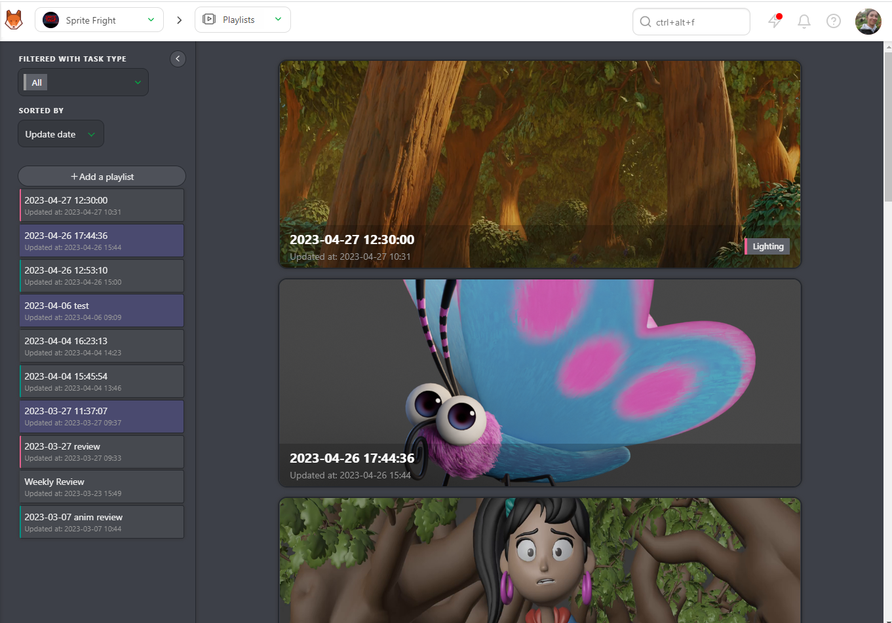
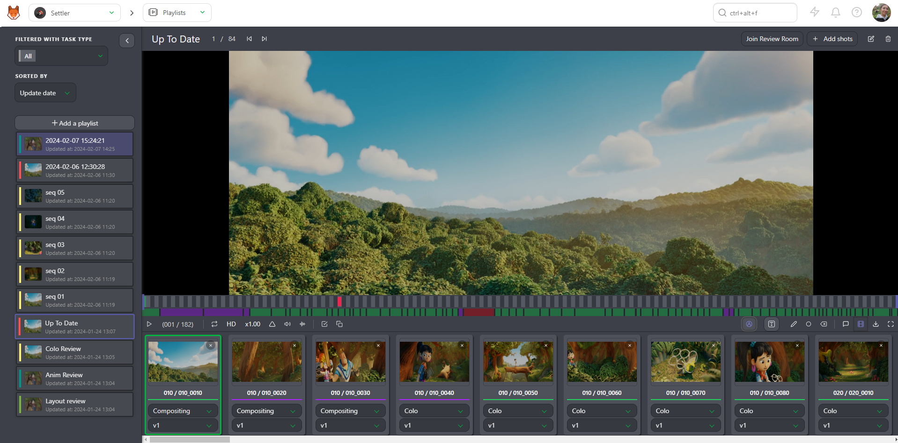
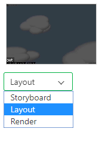
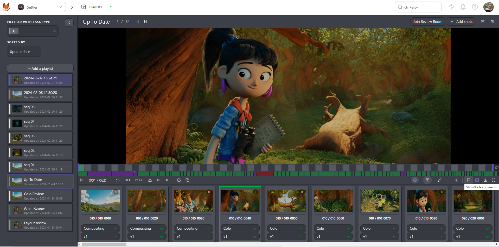
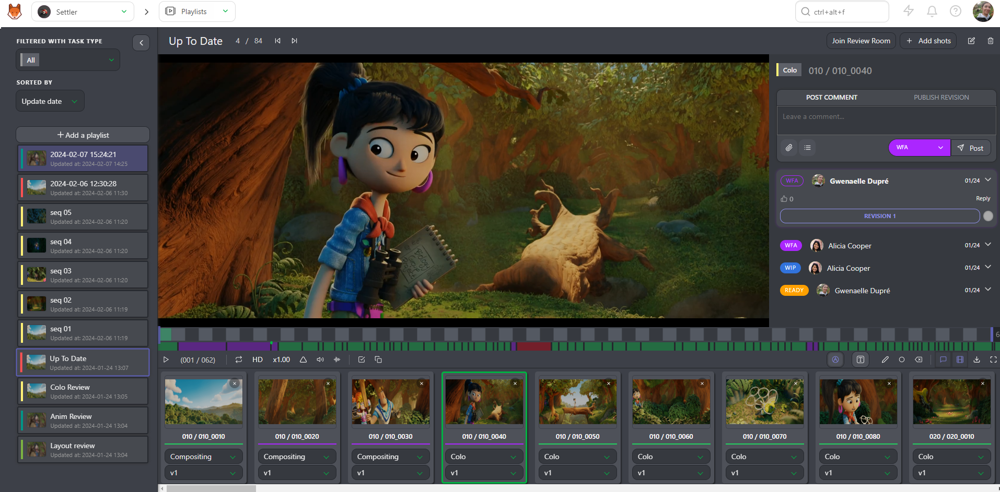

# 毎日および毎週のレビュー

毎日または毎週のレビュー用に、**プレイリスト**を作成することができます。

## 社内レビュー用にプレイリストを作成する

ドロップダウンメニューに**プレイリスト**ページがあります。

**プレイリスト**ページは2つの部分に分かれています。

(1) プレイリストを作成したり、既存のプレイリストを読み込むことができるプレイリストリスト。
(2) 最後に作成したプレイリストと最後に変更したプレイリスト

まず、**プレイリスト**を作成します
。デフォルトの名前は
デフォルト名は日付と時刻です。すぐに変更できます。プレイリストを
スタジオまたはクライアントと共有するか、また、ショットまたはアセットのプレイリストにするかを選択できます。
プレイリストにタスクタイプのタグを追加することもできます。

プレイリストが作成されると、検索/フィルタバーから、プレイリストに追加するショットを選択することができます。

また、**ムービー全体を追加**することもでき、ムービー内のすべてのショットが追加されます。

**デイリー保留中**を選択すると、その日の**WFA**タスクがすべて追加されます。

特定のシーケンスのみに焦点を当てたい場合は、**シーケンス全体を追加**することもできます。

グローバルショット/アセットページと同じ**フィルタ**を使用できます。例えば、すべてを選択するには、
WFAはアニメーションステージの略です。
検索バーに**animation=wfa**と入力します。**Add selection**ボタンで選択を確定します。
Kitsuは、**Animation**ステージで**WFA**ステータスを持つショットを選択します。それでも、Kitsuは自動的に**最新のアップロードバージョン**を読み込みます。

ショットは画面の上部に表示されます。 すべての変更は
自動的に保存されます。

## レビューと検証

プレイリストを作成すると、いくつかのオプションが利用可能になります。

* 再生または一時停止
* 要素から要素への移動
* 選択した要素の位置を全要素数と比較して表示
* サウンドのミュートまたはミュート解除
* 速度変更、2倍速（x2）、通常速度（x1）、半分の速度（x0.50）、4分の1の速度（x0.25）
* 1つの要素をループ再生
* サウンド波形の表示
* 再生中の注釈の表示
* プレイリスト全体の時間コードに対する要素の時間コード
* フレーム数
* プレビューでフレーム単位の移動。キーボードの矢印キーでも移動できます。
* 比較ツール

* 描画コメントの取り消しとやり直しオプション
* テキストと描画オプション、選択した項目の削除

の選択と削除
* プレイリストのすべての要素のタスクタイプの変更
* コメントセクションの表示
* プレイリストの要素の非表示
* LD（低解像度）からHD（高解像度）への切り替え
* すべての分割された要素を含む**Zip**ファイル、**.csv**テキストファイル、または**Build .mp4**（ショットのみ）としてプレイリストをダウンロードして、ムービー全体を作成する
* フルスクリーン

プレイリスト化されたショット/アセットごとに、表示する**タスク**と
**バージョン**を選択できます。

また、ショットの2つのタスクを並べて表示することもできます。

比較] ボタンをクリックします  し、2 番目のタスクタイプを選択します。

プレイリストの主な目的は、ショットやアセットの確認を支援することです。

プレビューから直接ショットにコメントを追加できます。

コメント**ボタンをクリックします。

右パネルにアクセスできるようになりました。このパネルには、コメントの履歴とそのステータスが表示されます。

ビデオ上の描画コメント（タイムラインの下の赤い点）を見ることができます。

**描画**ボタンをクリックすると、ビデオ上に描画したり文字を入力したりすることができます。
