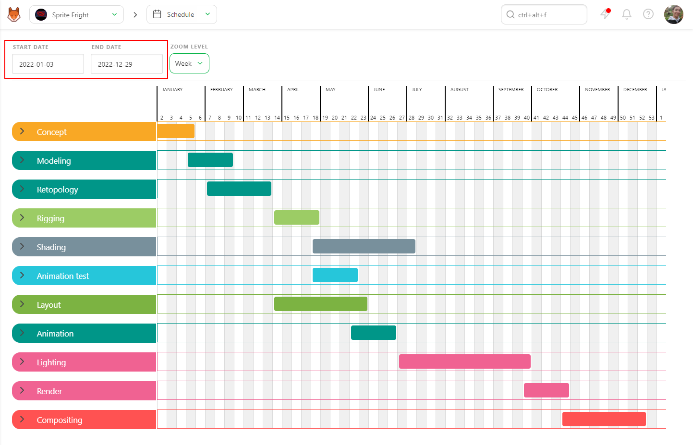
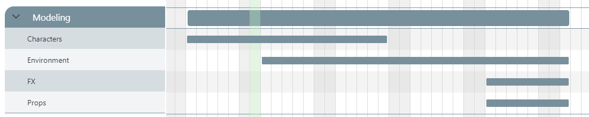
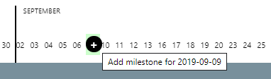
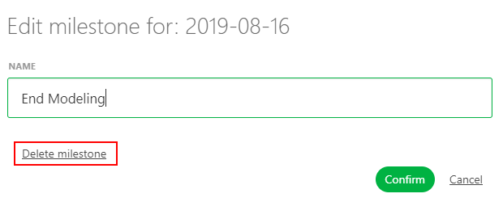
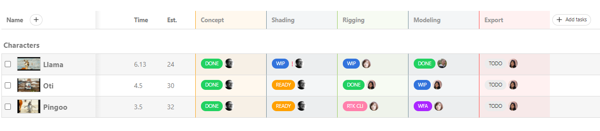
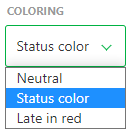
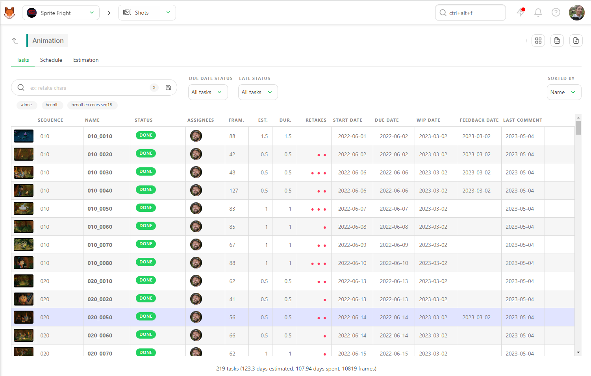
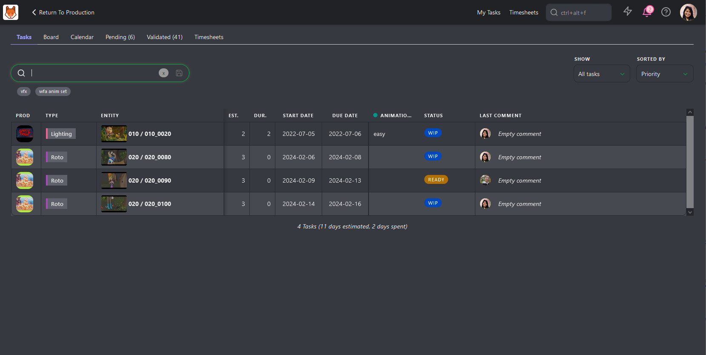

# スケジュール

## 制作スケジュール

スタジオマネージャーとして、グローバルスケジュールを制作の参考として使用することができます。このスケジュールの主な目的は、契約に関連するマイルストーンを追跡することです。これは、お客様の **参照スケジュール** と呼ばれます。

グローバルスケジュールへの記入を開始するには、制作にアセットとショットを追加し、タスクの種類を定義する必要があります。

ドロップダウンメニューで **スケジュール** を選択します。

### 制作スケジュールガントチャート
スケジュールの上部には、プロジェクトの開始日（1）と終了日（2）が表示されています。これらは制作を作成した際に定義されたものです。これらの日付は、ボックスをクリックしてカレンダーを開き、日付を選択することで変更できます。

ガントチャートのスケジュールでは、タスクの種類ごとに開始日と終了日を変更することができます。変更方法は2通りあり、1つ目はバーを直接移動する方法、2つ目は設定ページのタスクの種類セクションで日付を入力する方法です。

前者の方法では、開始日または終了日にカーソルを合わせます。カーソルが両方向矢印に変わります。次に、希望する日付までドラッグしてスライドさせます。

タスクタイプの開始日と終了日を設定すると、生産の流れが一目でわかるようになります。

::: ヒント
ガントチャートのバーをすべて選択し、**CTRL / CMD** + **左クリック**で同時に移動することができます。
:::

完了したら、次のステップとして、各タスクタイプを展開して、関連するショットシーケンス/アセットタイプを表示します。

開始日と終了日は、タスクタイプの場合と同じ方法で設定できます。また、すべてのアセットタイプに対して作業期間を定義することもできます。

ショットのタスクタイプについても同様に、シーケンスの開始日と終了日を決定することができます。

### マイルストーン
マイルストーンとは、プロジェクトにおける重要なポイントであり、主要なフェーズまたはタスクの完了を意味し、進捗状況を評価するためのチェックポイントとして機能します。スケジュール上の日付にカーソルを合わせると、[]が表示されます。

クリックすると、新しく作成されたマイルストーンに名前を付けるよう促されます。

マイルストーンは、スケジュール上の日付に小さな黒い点、および縦線で表示されます。小さな黒い点にカーソルを合わせると、マイルストーンの名前が表示されます。

これは、制作スケジュールに対して、今後予定されている重要な日付や成果物をすばやく参照するのに便利な方法です。

マイルストーンを編集するには、をクリックするか、マイルストーン名をどこでもクリックします。 そこから、マイルストーンの名前を変更したり、削除したりすることができます。

生産に割り当てられたメンバーは全員、グローバルスケジュールページにアクセスできますが、変更できるのは**スタジオマネージャー**のみです。

特定のタスクをさらに詳しく表示するには、タスクタイプの名前をクリックします。これにより、タスクタイプページの**スケジュール**タブに移動します。

## タスクタイプスケジュール

**グローバルスケジュール**が制作全体にわたるタスクタイプを参照するために使用されるのに対し、**タスクタイプ**ページは特定のタスクタイプにおけるタスクの詳細を掘り下げるために使用されます。

このページには、**[タスク]**、**[スケジュール]**、**[見積もり]**の3つのタブがあります。

アーティストのスケジュールを設定するには2つの方法があります。

最初の方法は、**[タスク]**タブを使用する方法で、**[推定時間]**と**[開始日]**を設定します。前述の通り、これら両方を設定すると、**[期限]**が自動的に入力されます。これらの詳細を入力すると、**[スケジュール]**タブのガントチャートが自動的に生成されます。

::: ヒント
ガントチャートでは、開始日/終了日をクリックしてドラッグすることで変更できますが、タスクの期間は常に終了日と期間を使用して自動的に計算されます。
:::

2つ目の方法は、ガントチャートから直接長さ（**見積もり**）、**開始日**、**期限日**を設定することです。

開始日をカーソルでクリックすると、カーソルが二重矢印に変わります。開始日を調整するには、開始日をドラッグしてスライドさせます。**MD**を入力して、**期限**を定義します。

検索バー (1) を使用して、特定のタスクを絞り込むことができます。 例えば、**ステータス**、**アセットタイプ**、**シーケンス**、**アセット名**、**ショット名**、**アーティスト名** などで検索できます。（特定のタスクタイプのページに移動している場合は、タスクタイプの名前を追加する必要はありません。）

また、各アーティスト（2）セクションを展開または折りたたむことで、スケジュールを見やすくすることができます。

ガントチャート（3）のバーの色を変更することができます。デフォルトでは、色付けはステータスカラーに設定されています。

**ステータスカラー**は、ステータスに基づいてバーの色を変更します。例えば、**WIP**は青、**RETAKE**は赤、
**承認待ち**は紫、**完了**は緑です。

素早く要素やチームのステータスを評価することができます。このビューから、スケジュールより遅れているタスクを視覚的に識別することができます。

**着色**ドロップダウンから**遅延を赤**を選択します。このビューでは、期限が過ぎているがまだ承認されていないタスクがハイライト表示されます。これは、スケジュールより遅れていることを示し、ガントチャートでは赤で表示されます。

ガントチャートで変更した内容は、Kitsuの他のページにも反映されます。

タスクタイプページの「タスク」タブには、「開始日」と「期限日」が表示されます。

さらに、アーティストの**Todoページ**で**納期**と**見積もり**日数を確認できます。

このページは誰でも閲覧できますが、編集できるのは **スタジオマネージャー**のみです。

## アセットとショットのスケジュール

アセットまたはショットの詳細ページでは、**スケジュール**タブにアクセスできます。

タスクタイプ**のスケジュールに開始日と期限を入力すると、ガントバーが表示されます。

このページから、アセットまたはショット内の各タスクの長さ、開始日、終了日を変更できます。

## スタジオスケジュール

制作マネージャーは、すべての制作スケジュールを1か所に集約し、制作の準備をより良く行うための手助けとなるスタジオスケジュールにアクセスできます。

スタジオスケジュールにアクセスするには、メインメニュー（）に移動し、**スタジオ**セクションの**メインスケジュール**をクリックします。

ここでは、開始日と終了日を含む、すべての制作物が各行にリスト表示されます。さらに、指定した期間内の各制作物の予定日数も表示できます。さらに、各制作物に対して定義したマイルストーンもご覧いただけます。

制作物の名前をクリックすると、各タスクタイプの全詳細を表示するようにビューを拡大できます。色使いはグローバルページの列に対応しています。

![メインメニュースケジュール] (../img/getting-started/main_schedule_unfold.png)

このページから直接制作スケジュールを変更することはできないことに注意してください。調整を行うには、変更したい特定の制作スケジュールページに戻って操作する必要があります。

このページへのアクセスは、**スタジオマネージャー**に限定されています。

## チームスケジュール

スタジオマネージャーとして、チームの活動状況を把握することは非常に重要です。各部門の活動状況を総合的に把握するには、チームスケジュールが役立ちます。

チームスケジュールにアクセスするには、メインメニュー（）に移動し、**スタジオ**セクションの下にある**チームスケジュール**をクリックします。

チームスケジュールでは、各行にスタジオ内の全スタッフのリストが表示されます。

ページの上部では、**開始日**と**終了日**を選択して表示する期間を調整したり、**ズームレベル**を調整して詳細または全体を表示することができます。

さらに、特定の**部署**または個々の**担当者**に絞り込むこともできます。

アーティストが複数の同時進行のタスクを抱えている場合、これらのタスクはわかりやすく重ねて表示されます。

必要に応じてタスクを選択して移動させることで、各タスクを操作することができます。これらのタスクは直接リンクされており、**タスクタイプスケジュール**に反映されます。両方のエリアで編集が可能です。
