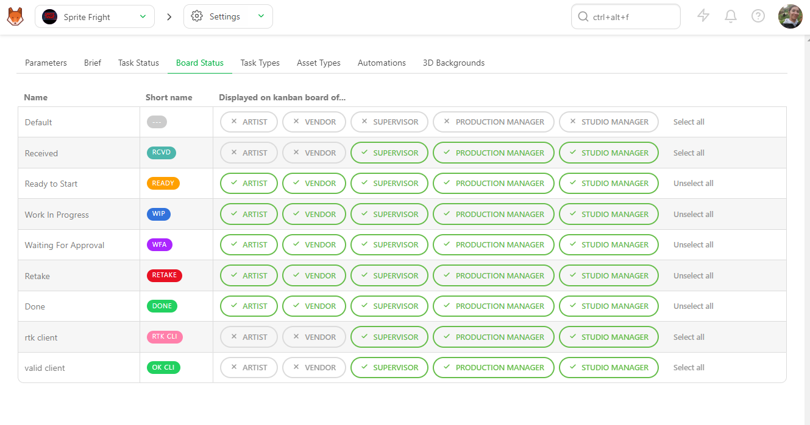

# ステータスとフィードバック

Kitsuでは、ステータスはタスクの現在の状態や進捗状況を示す指標となります。現在のステータスを一目で簡単に確認でき、ステータスが変更された際にチームメンバーに更新情報を伝えるコメントを追加できます。

## コメントパネル

タスクのステータスを変更したりコメントを追加するには、タスクのステータスをクリックします。

右側にパネルが表示され、コメントの書き込み、ステータスの変更、ファイルの添付を行うことができます。

コメントパネル**は**、2つのタブに分かれています。
- コメントを投稿
- リビジョンを公開

**ステータス**は、**コメントを投稿**タブから変更できます。

コメントでは、プレーンテキストをシンプルかつ読みやすくフォーマットするためのマークアップ言語である **Markdown** を使用できます。これにより、ユーザーは見出し、リスト、太字や斜体、リンクなど、基本的なフォーマット要素を追加することができます。特定の構文については、Markdownガイドのウェブサイトを参照してください：[Markdown Guide](https://www.markdownguide.org/basic-syntax/)。

### チームメンバーのタグ付け

コメント内でチームメンバーを**タグ付け**して、直接通知することもできます。これを行うには、`@`と入力すると、チームメンバーのリストを含むサブメニューが開きます。通知したいメンバーを選択し、コメントを送信すると、そのメンバーに通知が届きます。

「@」に続けて部署名を入力することで、部署全体に**タグ付け**することもできます。

### チェックリストの追加

独自のタスクに値しないさまざまな項目を追跡するために、チェックリスト項目も追加できます。**チェックリスト**をコメントに追加するには、**[チェックリストを追加]**ボタンをクリックします。チェックリストの最初の項目が表示されます。

**Enter**キーを押すか、ボタンを再度クリックしてチェックリスト項目を追加し、各項目に名前を付けます。

### 添付ファイルの追加

画像としてファイルを添付するには、**添付ファイルを追加**ボタンをクリックします。

**ハードドライブからファイルを選択**するか、**スクリーンショット**を貼り付けます。

**添付ファイルとして追加**をクリックして添付ファイルを検証します。

次に、ドロップダウンメニューからタスクのステータスを変更する**ステータス**を選択します。

最後に、**投稿**ボタンをクリックしてコメントとステータスの更新を送信します。

ステータスの一括変更
複数のステータスを一度に更新
複数のタスクのステータスを一度に変更することもできます。

Ctrl/CmdキーまたはShiftキーを押しながら、複数のショットまたはアセットを選択し、対象とするタスクを選択します。

次に、アクションメニューの「ステータス変更」セクションに移動します。

選択したタスクの新しいステータスを選択します (1)。 選択したすべてのタスクにコメントを追加することもできます (2)。 **Confirm** ボタンで新しいステータスを保存します。

## アーティストボードのステータス
### アーティストボードページで使用されるステータスのカスタマイズ
タスクをアーティストに割り当てると、アーティストがログインした際に、そのタスクがアーティストのToDoページに表示されます。

デフォルトの表示では、タスクは従来のリスト形式で表示されますが、ボード形式で表示することもできます。各**ステータス**は列で表され、割り当てられたタスクは、タスクの進行に合わせてステータスからステータスへとドラッグできるカードとして表示されます。

ボード形式をカスタマイズするには、制作の設定ページにアクセスします。

次に、[タスクのステータス] タブに移動します。 お客様の制作で使用されているステータスのリストが表示されます。

これらのステータスがボードページの列として使用されます。 ステータスをドラッグして移動させると、ボードビューに表示される順序を変更することができます。

次に、**[ボードのステータス]**セクションをクリックします。

ここでは、**[ボード]**ページでどの権限ロールがどのステータスを表示できるかをカスタマイズできます。

このビューにアクセスするには、「マイタスク」ページから「**ボード**」タブを選択します。 チームメンバーには、以下のようなページが表示されます

！[アーティストボードページ](../img/getting-started/artist_board_page.png)

::: ヒント
ボードビューに表示されるステータスのカスタマイズは、権限ロールごとに設定されます。 個々のユーザーごとにカスタマイズすることはできません。 
:::
