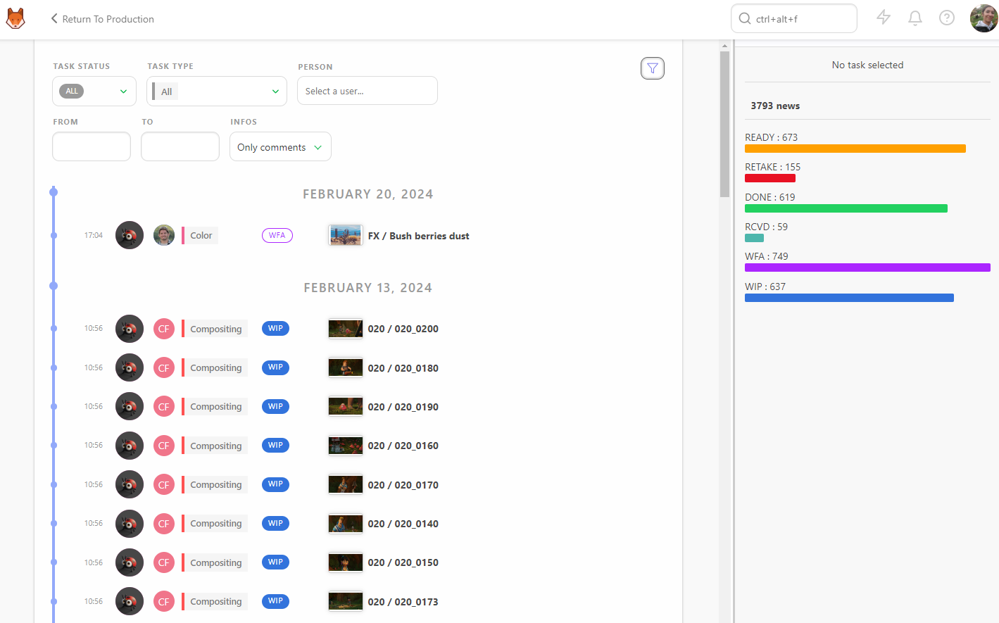
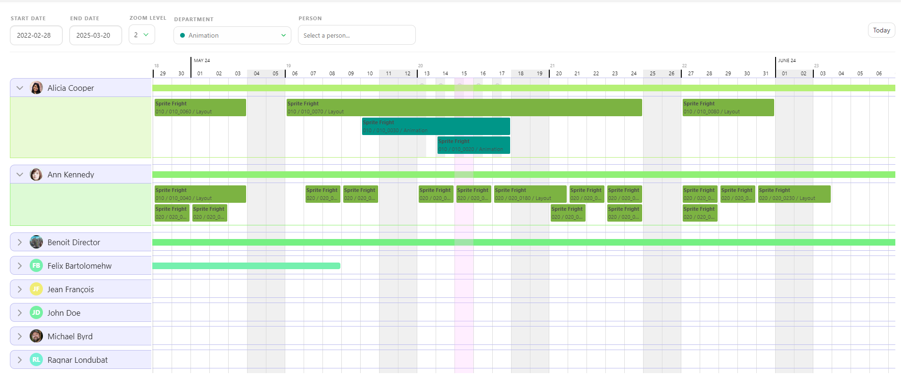
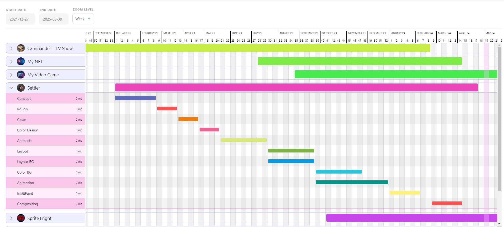

# ビルドスタジオレポート

## スタジオリソースの概要

プロデューサーは、すべてを知っておく必要があります。

通常、これは多数の詳細を追跡し、制作チームとの複数の会議に出席し、常にすべてを自分で確認することを意味します。あるいは、すべてのタスクを購読して通知に圧倒されることもできますが、通知を読むために作業を中断するたびに集中力が途切れてしまいます。

完璧なソリューションは、すべての制作統計を1ページにまとめ、常に最新の状態にしておくことです。

ようこそ、**すべてのタスク**ページへ。

ここでは、すべての制作物のステータスを一度に確認できます。**制作**、**タスクステータス**、**タスクタイプ**、**担当者**別にリストをフィルタリングできます。行をクリックすると、右側にコメントパネルが開き、必要なすべての情報を表示します。

より詳細な情報が必要な場合、特に特定の期間についての情報が必要な場合は、**[スタジオ] > [ニュースフィード]** ページを使用できます。

[フィルタービルダー] ボタンを使用すると、特定の期間を定義することができます。

たとえば、特定の月のスーパーバイザーの作業負荷に焦点を当てたい場合は、スーパーバイザーの名前を選択し、**[From]**ボックスで日付を選択します。

すべての制作の現在の状態 

スタジオが円滑に機能するためには、進行中のすべての制作を把握しておく必要があります。 **制作** セクションが役立ちます。グローバルメニューの **スタジオ** セクションからアクセスしてください。

そこから **ロード統計** ボタンをクリックすると、制作の現在の状態を確認できます。

さらに詳しい情報については、すべての制作の**シーケンス統計**ページと**アセットタイプ統計**ページをご覧ください。

### 統計ページ

**シーケンス統計**ページでは、シーケンスごとに分類された制作全体の円グラフが1ページに表示されます。 円グラフの色分けはステータスに対応しており、制作の状態を素早く把握できます。

最初の行は**すべてのシーケンス**で、制作全体を表します。最初の列の**すべて**には、すべてのタスクが同時に含まれます。

この最初の円グラフに注目することで、制作の正確な状態を確認できます。さらに詳細を確認するには、各タスクタイプの状態の全体像を把握するために、その行の残りの部分を確認します。

**アセットタイプ統計**ページでは、アセットについても同レベルの詳細情報を提供します。

また、**カウント**としてデータを表示し、ステータスごとの割合とともにショット/フレームの正確な数を示します。

このページを `.csv` テキストファイルとしてエクスポートし、スプレッドシートソフトウェアにインポートすることもできます。

画面上部の **ナビゲーション** メニューを使用して、プロダクション間を移動します。同じページに留まり、各プロダクションを選択してすべてのプロダクション統計を確認できます。

## スタジオ稼働率

**チームスケジュール**では、割り当てられたタスクを持つすべてのアーティストを確認できます。各行がアーティストを表し、アーティストの行を展開すると、そのアーティストのタスクの詳細が表示されます。

### 特定の時間枠に焦点を当てる

開始日と終了日を設定することで、特定の時間枠に焦点を絞ることができます。 割り当てられたタスクの詳細情報を得るには、ズームレベルを調整します。 すべての**部署**を表示するか、特定の部署のみを表示するかを選択でき、特定の**担当者**に焦点を絞ることもできます。

アーティストが同じ日に複数のタスクを持っている場合、**それぞれのタスクごとに1行**でタスクが積み上げられます。

### スケジュールの変更

タスクを移動するには、タスクをドラッグして別の日に配置します。 チームスケジュールで変更した内容は、タスクタイプのスケジュールにも適用されます。

アーティストが2つのタスクの間に休憩を取った場合、サマリー行は中断されず、アーティストに割り当てられた最初のタスクと最後のタスクが表示されます。

## メインスケジュールを利用する

メインスケジュール**では、すべての**制作スケジュール**に一度にアクセスすることができます。

制作を展開すると、その制作で使用されている各**タスクタイプ**の詳細が表示されます。複数の制作を展開すると、同時にどのチームが稼働しているかを確認できます。

各**タスクタイプバー**を移動して、スタジオのニーズに合わせたスケジュール調整を行うことができます。

::: 警告
変更はすべて制作スケジュールに適用されます。
:::
