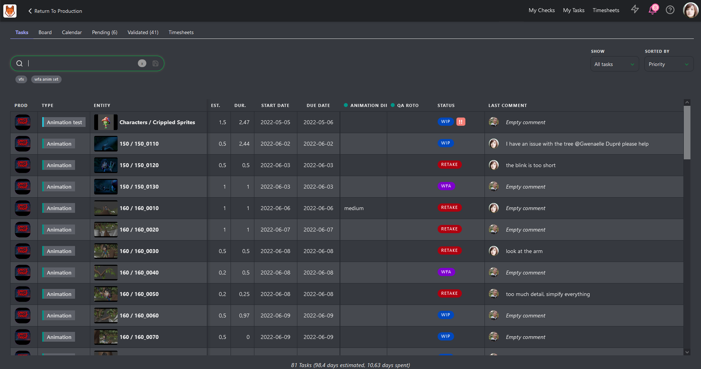

# タスクの管理

## 自分のタスクを確認する

通常、スーパーバイザーには、担当部署の管理に加えて、割り当てられたタスクがあります。つまり、自分の仕事をこなすこととチームの管理に時間を割く必要があるということです。 ここでは、自分が担当するタスクを効果的に管理する方法を説明します。

Kitsuにログインすると、画面の上部に「**マイタスク**」ボタンがあることに気づくでしょう。 ここから、**ToDoリスト**に直接アクセスできます。 デフォルトでは、リストは優先度順にソートされているため、リストの上部に表示されているタスクが、最初に処理すべきタスクです。

マイタスクページでは、生産、タスクタイプ、ステータス、その他の条件でタスクリストをフィルタリングできます。

タスクの詳細を表示するには、**ステータス**をクリックしてコメントパネルを開きます。ここで、タスクにコメントを追加したり、必要に応じて新しいリビジョンを公開することができます。

また、各ステータス列にドラッグ＆ドロップすることで、複数のタスクのステータスをすばやく更新することもできます。

## プレビューの確認

チームの全員が各自のタスクを把握したので、今度は各自の作業を確認する必要があります。通常、アーティストがタスクを完了すると、レビューのためにあなたに連絡してきます。頻繁な中断は非生産的であり、集中力を維持することが難しくなります。これを避けるために、レビューのための特定の時間枠を設定します。このアプローチは、構造化されたスケジュールを提供することで、あなたとチームの両方に利益をもたらします。アーティストはフィードバックがいつ得られるかを知ることができ、それに応じて作業を計画することができます。一方、あなたは中断のない時間を自分のタスクに専念することができます。

画面上部の「**マイチェック**」ボタンをクリックすると、部署内のすべての**WFA**タスクのリストが表示されます。

このリストには、関連するすべての**制作**、**タスクタイプ**、および**タスクステータス**が含まれています。キット内の他のページと同様に、**ステータス**をクリックすると、右側に**コメントパネル**が開き、タスクを1つずつ確認することができます。

または、「リストからプレイリストを作成」ボタンを使用して、リスト上のすべてのタスクを含むプレイリストを作成することもできます。このプレイリストには、他のビューと同じオプションが用意されており、コメントパネルを開いたり、バージョンやタスクタイプを比較したり、注釈を追加したりすることができます。

別のオプションとして、**タスクタイプページ**に移動して、**コンタクトシートとして表示**を変更することもできます。たとえば、**期限ステータス**でフィルタリングして、**今週期限**を選択することができます。

ここから、コンタクトシートをクリックしてコメントパネルを開いたり、複数のタスクを選択してプレイリストを作成することができます。

## レビューの概念

アーティストがコンセプトをアップロードすると、画面上部のナビゲーションメニューで「**コンセプト」**ページを選択して、そのコンセプトを確認することができます。

このページでは、アップロードされたすべてのコンセプトとそのステータス、割り当て、リンクされたアセットを確認できます。

コンセプトを確認するには、ステータスをクリックしてコメントパネルを開きます。コメントパネルを拡大したり、フルスクリーン表示にすることができます。コメントを入力し、ステータスを「承認済み」または「却下」に設定し、「投稿」ボタンで変更を確定します。

**ステータス**フィルタを使用してページを絞り込み、**ニュートラル**ステータスのすべてのコンセプトを表示することができます。

さらに、アーティスト別にフィルタリングしたり、ソート順を変更したりして、レビューに必要なデータをより正確に絞り込むことができます。
