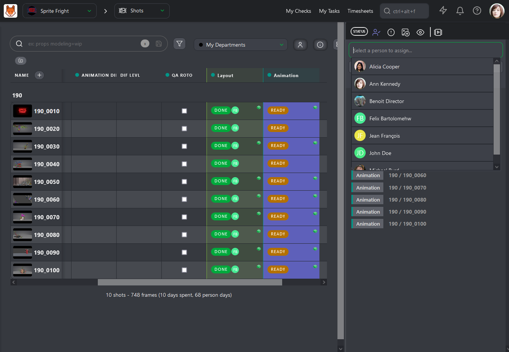
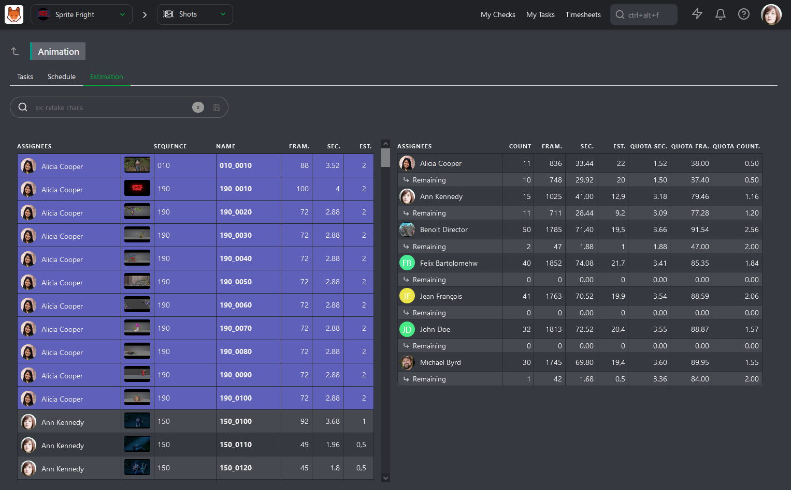
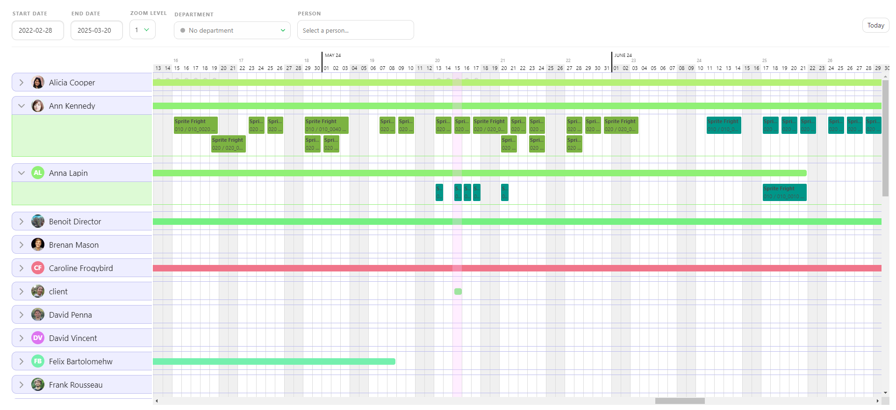
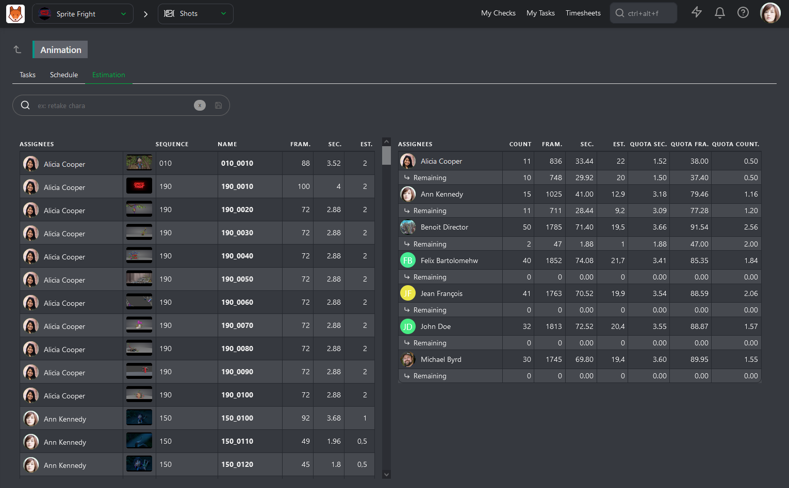
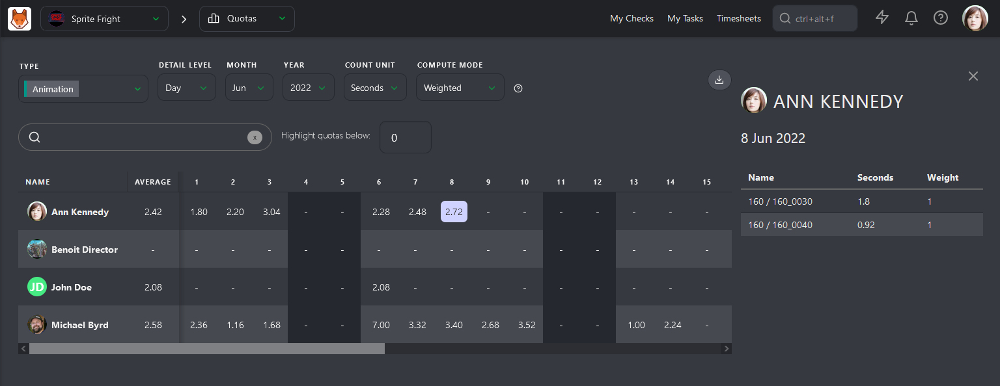
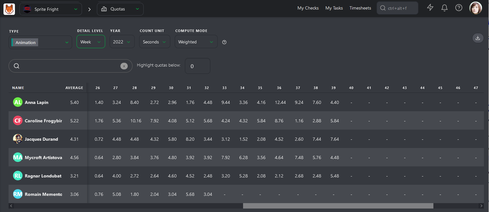
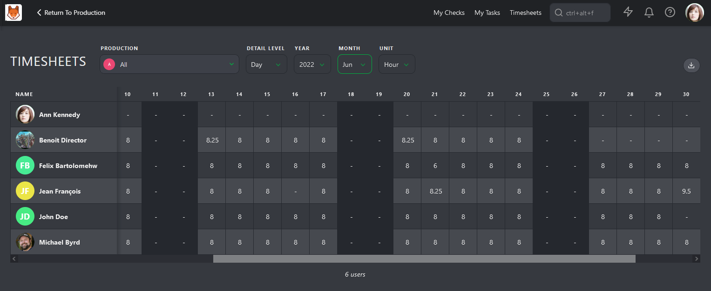
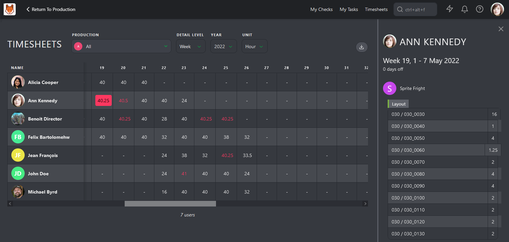

# 部署の管理

監督者の役割は、視覚効果制作のクリエイティブ面と技術面の両方を監督し、最終的な成果物がプロジェクトの芸術的なビジョン、品質基準、納期を満たしていることを確認することです。この重要な側面は、チームが自分たちが何に取り組んでいるかを把握していることを確認することです。

## タスクの割り当てと見積もり

グローバルショット/アセットページから、**[マイ部署]**によって自動的にビューがフィルタリングされます。これにより、部署のタスク**[タスクタイプ]**と、部署にリンクされた**[カスタム列]**が表示されます。

誰かに1つまたは複数のタスクを割り当てる場合、自分の部署の人員にしかアクセスできないことに気づくでしょう。これにより、タスクに適したアーティストをより迅速に見つけることができます。

すべてのアーティストにタスクを割り当てたので、今度は各タスクの**見積もり**を入力します。

**タスクタイプ**の列名をクリックすると、その専用ページが開きます。このページでは、**タスク**、**スケジュール**、**見積もり**の3つのタブにアクセスできます。ここでは、最後のタブに注目します。

**見積もり**ページは2つの部分に分かれています。左側には、アーティスト別にソートされたすべてのタスクと、フレーム数と秒数が表示されています。右側には、チームの概要が表示され、アーティストごとに1行が割り当てられ、割り当てられたタスクの合計数、フレーム数と秒数の合計、および更新された見積もり日数の合計が表示されます。

この情報により、Kitsuは異なる見積もり**クォータ**（**1秒あたりの**、**1フレームあたりの**、**1タスクあたりの**）を計算することができます。

左側の**見積もり**欄に数値を入力すると、右側に結果が表示されます。タスクの見積もりを入力すると、右側のアーティストの行が更新されます。

これにより、チームメンバー間のタスクの配分が均等になるようにし、各メンバーの生産量の見積もりを把握することができます。この作業を行う際には、各アーティストの経験と各タスクの難易度を考慮する必要があります。

## 日々の監督タスク

割り当てと見積もりが完了したら、日々の業務に集中することができます。 自分の部署のタスクの概要を簡単に確認するには、どのページからでもタスクのタイプ名をクリックします。

詳細ページが表示されたら、まず最初に**「タスクを連絡先シートとして表示」**をクリックします！[タスクを連絡先シートとして表示](../img/getting-started/contact_sheet.png) ボタン。

[タスクタイプを連絡先シートとして表示](../img/getting-started/task_type_contact_sheet.png)

これで、組み込みのフィルタを使用して、注意が必要なタスクを簡単に絞り込むことができます。 たとえば、まだ完了していないタスクだけを見たいとします。 この場合、**-done**ステータスのタスクをフィルタリングし、**Due Date Status**フィルタを追加して、**Due This Week**のタスクを表示することができます。

フィルタを有効または無効にすることで、すばやく正しい情報に絞り込むことができます。

::: ヒント
タスクについてさらに詳しい情報が必要な場合は、タスク名をクリックして右側のコメントパネルを開きます。

:::

## 部署のスケジュール管理

スーパーバイザーとして、メインメニューの**「スタジオ」 > 「チームスケジュール」**セクションからチームのスケジュールにアクセスできます。

このページでは、現在プロジェクトで作業中の部署内の全アーティストを確認できます。 個人のスケジュールを拡大して、そのタスクの詳細を確認できます。

そこから、以下の操作が可能です。
- タスクを移動して、開始日と期限を変更する。
- タスクの長さを調整する。
- タスクをドラッグ＆ドロップして、別のチームメンバーに再割り当てする。
- 休日を確認する。

## 部門別ノルマの管理

ノルマとは、アーティストが特定の期間内に完了することが期待される作業量またはタスク数を指します。これにより、プロジェクトがスケジュール通りに進行し、制作の納期が守られるようになります。

制作の開始時に、各タスクの見積もりを設定する際に、各アーティストの見積もりノルマを定義することもできます。 タスクが承認されると、タスクタイプページの見積もりタブの残りの行が更新され、残りのタスク数と更新された見積もりノルマが表示されます。

各チームメンバーの見積もりノルマが当初に設定された範囲内に収まっているかどうかを確認できます。

実際のクォータ**を確認するには、**クォータ**ページに移動します。

Kitsuには、2つのクォータ計算方法があります。1つ目は、アーティストが記入する日々のタイムシートに基づくものです。クォータは、アーティストがタスクの最初のタイムシートを記入してから作業を終了するまでで計算されます。

2つ目の方法は、ステータスに基づくものです。計算は **WIP** ステータスから始まり、**WFA** ステータスで終了します。これは **First Take** クォータであり、やりとりのコメントは計算に含まれません。

一番左の列「平均」が最も重要です。Kitsuは、各アーティストの平均ノルマを「日」「週」「月」ごとに計算します。

## 部署タイムシート

スーパーバイザーとして、チームの勤務時間を監視する責任を負う場合もあります。タイムシートページでは、チームメンバーが毎日、毎週、毎月どのくらいの時間働いているかが表示されます。

超過勤務、病欠、休暇不足など、異常なパターンを強調することは重要です。タイムシートの表示では、アーティストが時間を費やしている場所について、大まかな概要を提供することができます。これにより、チームのケアを行い、燃え尽きを防ぐことができます。

