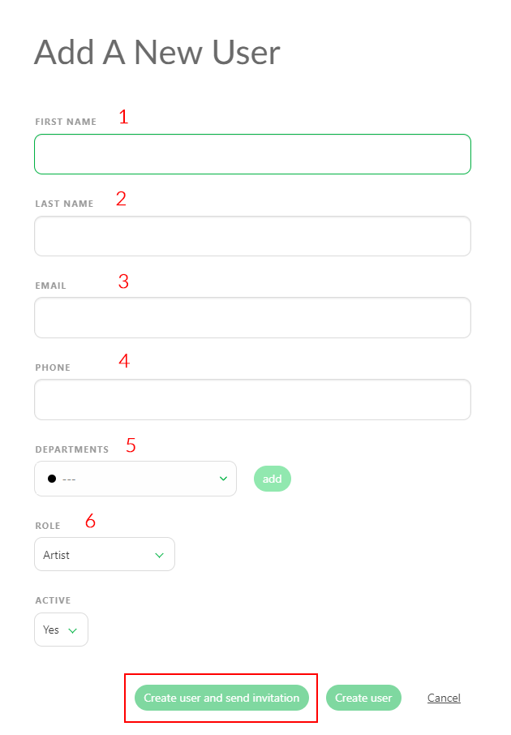
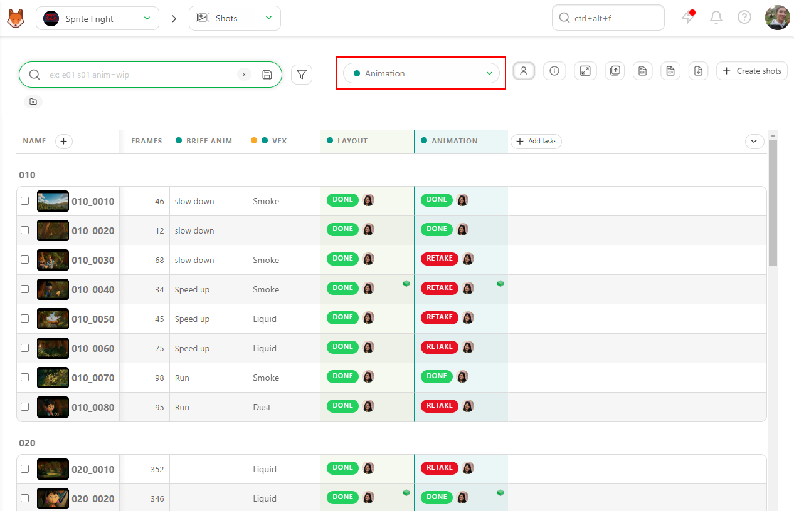
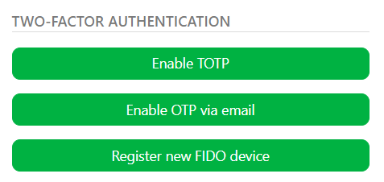

# チームの準備

ワークフローを定義したので、次に、タスクを割り当てられる担当者を確保するためにチームを編成します。

Kitsuにユーザーを追加し、部署にリンクし、権限を付与し、最後に、作業を開始できるように本番チームに追加する方法を学びます。

## ユーザーの作成
### ユーザーの作成と部署へのリンク

人にタスクを割り当てるには、まずKitsuでその人のアカウントを作成する必要があります。

警告 定義
Kitsuの他の機能と同様に、ユーザーには2つのライブラリがあります。
- **People Page**（グローバルライブラリ）は、ユーザーの権限、契約、所属する部署を決定するために使用します。
- **Team Page**（プロダクションライブラリ）は、プロジェクトで作業しているユーザーを定義し、プロダクションへのアクセス権を提供するために使用します。
:::

メインメニュー**へ移動！ [メインメニュー](../img/getting-started/main_button.png) 、**スタジオ**セクションの下にある
**人**ページを選択します。

次に、[新しいユーザーを追加](../img/getting-started/add_employee.png) ボタンをクリックします。

次に、以下の情報を入力するよう促されます。（ユーザーを作成するには、以下のフィールドが必須であることにご注意ください）
- 1) 名前（**必須**）
- 2) 姓
- 3) メールアドレス（**必須**）
- 4) 電話番号

::: 危険 重要！
アカウントを作成するには、メールアドレスは必須であり、唯一のものでなければなりません。
:::

- 5) ユーザーをリンクする**部署**を1つまたは複数指定できます。

部署に割り当てられると、**マイチェック**ページに表示される内容も影響を受け、自分の部署に関連するタスクのみが表示されます。

最終的に、タイムシートページも同様に、ユーザーの部署内のタスクのみにフィルタリングされます。

::: 詳細 部署に関する詳細情報
ユーザーが部署にリンクされると、さまざまなオプションが利用可能になります。例えば、グローバルホームページで、ユーザーの部署の表示に直接アクセスできるようになります。

部署の管理責任者は、部署内のすべてのタスクにコメントを追加したり、同じ部署の人だけにタスクを割り当てることができます。

::::

- 6) 役割： ここでユーザーの権限の役割を定義します（以下で説明します）。

- 7) アクティブ

このセクションでは、ユーザーを即座にアクティブにするかどうかを選択できます。ユーザーがすぐにKitsuにアクセスする必要がある場合は、これを「はい」に設定します。ただし、ユーザーを作成したいが、まだKitsuへのアクセス権を与える準備ができていない場合もあります（例えば、2週間後に作業を開始するアーティストのタスクをスケジュールしたい場合など）。この場合、ユーザーを作成してスケジュールし、作業を開始したらアクセス権を有効にすることができます。

::: 危険 重要！
各ユーザーは、Kitsuにログインするために個別のアカウントが必要です。
:::

## 権限ロール
### 権限ロールの理解

::: 警告 定義
権限ロールは、システムまたはアプリケーション内でユーザーに付与される一連のアクセス権と特権を定義し、ユーザーが実行できるアクションとアクセスできるリソースを決定します。
:::

ロールは非常に重要ですので、それぞれのロールが何を行うのか、また、特定のチームメンバーに関連するロールがどれなのかを理解しておくと便利です。各ロールの詳細については、以下の各セクションをクリックしてください。

- **アーティスト**
::: 詳細 アーティスト権限
アーティストは、自分が参加している制作物のみにアクセスできます。 自分に割り当てられたタスクについてのみ、コメントの追加、メディアのアップロード、ステータスの変更を行うことができます。 アクセスできるステータスは、スタジオマネージャーによってあらかじめ設定されたものに限られます。

**アーティストは、以下の操作が可能です。**
* グローバルページおよびタスクタイプページで、個人用フィルタを作成する。
* 自分のコメントを編集する。
* 割り当てられたタスクのチェックリストを確認する。
* ショットやアセットのプレイリストをその場で作成できるが、保存はできない。

**できないこと：**
* クライアントのコメントを参照する。
* 割り当てられていないプロジェクト内のものにアクセスする。

アーティストがKitsuにログインすると、最初に表示されるのは「マイタスク」ページです。

:::

- **Supervisor**
::: 詳細 Supervisor 権限
部門のスーパーバイザーは、アーティスト権限を継承します。

部門のスーパーバイザーは、担当する部門の以下の項目に対して読み取りおよび書き込みのアクセス権限を持ちます。
アセット、ショット、タスク、割り当て、統計、内訳、プレイリスト。

**次の操作が可能です。**
* 同じ部署のチームアーティストにタスクを割り当てることができます。
* すべてのタスクまたは自分の部署に関するコメントの投稿。
* 自分の部署のチェックリストの確認。
* コメントの固定。
* 自分のコメントの編集。
* スタジオまたはクライアントのプレイリストの追加/編集。
* クライアントのコメントと承認の確認。
* 他の部署からのコメントの確認。
* 自分の部署のタイムシートの表示。

**できないこと：**
* スタジオチーム、メインタイムシート、制作リストへのアクセス
* タスクタイプ、タスクステータス、アセットタイプの定義
* 自分以外の部署へのコメントの投稿。自分以外の部署のアーティストを割り当てることはできません。
:::

- **制作マネージャー**
::: 詳細 制作マネージャー権限
制作マネージャーは部署スーパーバイザー権限を継承します。

制作マネージャーは、割り当てられた制作物に対して読み取りおよび書き込みのアクセス権を持ち、これには
アセット、ショット、タスク、割り当て、統計、内訳、プレイリストが含まれます。

**制作マネージャーは、以下の操作が可能です。**

* アセットおよびショットを手動で、またはCSVバッチインポートにより作成する。
* 制作物内の任意のタスクにコメントを投稿する。
* 制作物内の任意のコメントを編集する。
* 制作物内の任意のチェックリストを確認する。
* 制作中のコメントを固定する。
* タスクの列を追加する。
* タスクを削除または追加する。
* スタジオまたはクライアント用のプレイリストを追加/編集する。
* クライアントのコメントと検証を確認する。

**できないこと：**

* スタジオページ、メインタイムシート、制作リストにアクセスする。
* タスクタイプ、タスクステータス、アセットタイプを定義する。
:::

- **スタジオマネージャー**
::: 詳細 スタジオマネージャー/管理者の権限
スタジオマネージャーは、管理者と同様に、Kitsu内のすべての制作および設定に対して読み取りおよび書き込みのアクセス権限を持ちます。 その権限には以下が含まれます。

制作の作成と編集

スタジオマネージャーは、新しい制作を作成し、その種類、FPS、アスペクト比、解像度を定義し、カバー画像を追加することができます。 また、制作の編集や削除も可能です。

#### スタジオの管理

スタジオマネージャーは、スタジオ内のすべてにアクセスできます。

* すべての制作に対する読み取り/書き込みアクセス
* グローバルタイムシートページへのアクセス
* スタジオ内のすべてのユーザーの表示
* メインスケジュールへのアクセス

「People（ユーザー）」ページでは、スタジオマネージャーが**各ユーザーの権限ロールを定義**します。

また、以下の操作も可能です。

Kitsuのグローバルな側面をカスタマイズする：例えば、タスクの種類、タスクのステータス、アセットの種類を追加・変更する。
権限ロールを設定する
スタジオ名をカスタマイズする、企業ロゴを追加する、1日の作業時間数などを定義するなど、スタジオの高レベル情報をカスタマイズする。
メディアをダウンロードする際に、オリジナルのファイル名を使用するかどうかを選択する。

#### 制作物の管理

彼らは、貴社の Kitsu サイト上のすべての制作物にフルアクセスできます。 さらに、

* スーパーバイザーと同等の権限を持ちます。
* タスクカラムの追加/削除が可能です。
* カスタムメタデータカラムの作成が可能です。
:::

- **ベンダー**
::: 詳細 ベンダーの権限
ベンダーはアーティストとほぼ同等の権限を持ちます。主な違いは、アーティストは自分の制作物内のタスクを閲覧できる（ただし、自分に割り当てられたタスクのみ編集可能）のに対し、ベンダーは自分に割り当てられたタスクのみ閲覧・編集できることです。割り当てられていないその他のタスクはすべて非表示となります。
:::

- **クライアント**
::: 詳細 クライアント 権限
クライアントは、自身が関与している制作物のみを表示できます。

**クライアントは以下の操作が可能です。**

* アセット/ショットのグローバルページにアクセスする。
* 統計ページにアクセスする。
* クライアントのプレイリストにアクセスし、コメント投稿時にタスクステータスに制限付きでアクセスする

**注記**
* クライアントのリテイクまたは検証ステータスを確認できるのは、スーパーバイザーとスタジオマネージャーのみです。

**彼らはできません。**

* タスクの割り当てを見る
* 自分が書いていないコメントを見る
:::

::: 詳細 CSV スプレッドシートファイルから従業員を追加する

従業員リストがすでにスプレッドシートファイルで用意されているかもしれません。 Kitsu では、`.csv` ファイルを直接インポートするか、データを直接 Kitsu にコピー＆ペーストするかの 2 つの方法でインポートできます。

まず、スプレッドシートを `.csv` ファイルとして保存します。

次に、Kitsu の「People」ページに戻り、「**インポート」**アイコンをクリックします。

「**CSV からデータをインポート」**というポップアップウィンドウが開きます。「**参照」**をクリックして `.csv` ファイルを選択します。

結果を確認するには、**[プレビュー]**ボタンをクリックします。

データのプレビューを使用して、列名を確認し、調整することができます。

**注意：** **[役割]**列は必須ではありません。

すべてが適切に表示されたら、**Confirm**（確認）ボタンをクリックしてデータをKitsuにインポートします。

これで、すべてのユーザーがKitsuにインポートされました。

:::

## 二要素認証
### スタジオにセキュリティを追加

**二要素認証**は、Kitsuにログインするユーザーにセキュリティの追加レイヤーを提供します。ユーザーごとに有効にできるので、どのユーザーに適用するかを決定できます。

有効にするには、画面右上のアバターをクリックし、**プロフィール**を選択します。
ページの下部に、さまざまな**二要素認証**オプションが表示されます。

利用可能な二要素認証の方法
- **TOTP**：これは、二要素認証アプリをアカウントの二次パスワードとして使用できるようにします。このオプションを選択すると、QRコードが表示されます。お好みの二要素認証アプリでこれをスキャンすると、ログインのたびにワンタイムコードが要求されます。
- **OTP Via Email** TOTP と同様ですが、2FA コードはアプリではなく、お客様のメールアドレスに送信されます
- **FIDO Device** FIDO デバイスとは、2 要素認証 (2FA) のための FIDO (Fast IDentity Online) 標準をサポートするハードウェアセキュリティキーを指します。 これらのデバイスのいずれかをお持ちの場合は、その名前をここに記入して 2 要素認証に使用することができます

## チームへのユーザーの追加
プロダクションを作成したら、ユーザーにアクセスを許可するために、プロダクションのチームにユーザーを追加する必要があります。 チームに所属することで、タスクを割り当てられるようにもなります。

::: ヒント
読み取り権限を与えるために、チームにスタジオマネージャーロールを追加する必要はありません（このロールには、いずれにしてもアクセス権があります）。ただし、タスクを割り当てる場合は、チームに追加する必要があります。
:::

ユーザーをチームに追加するには：

1. プロダクションで、ページ上部のナビゲーションドロップダウンメニューを使用して、[チーム] ページを選択します。

2. **チーム**ページでは、特定のプロジェクトのすべての担当者を参照できます。別のプロジェクトチームを確認する場合は、ページの先頭に移動します。

