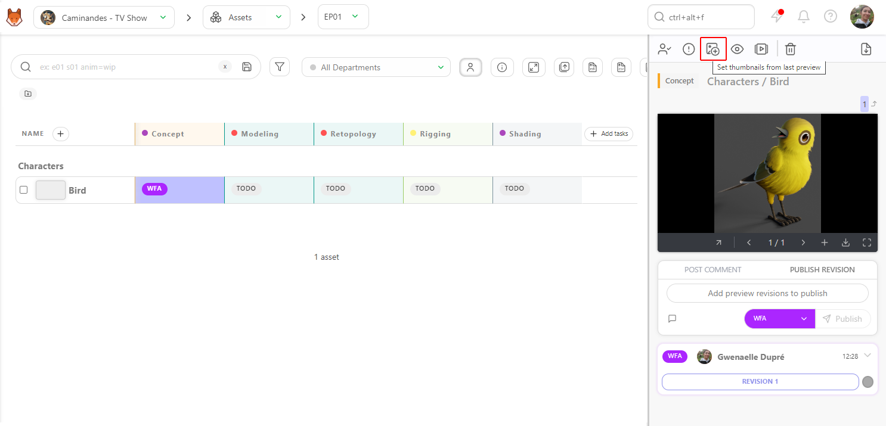
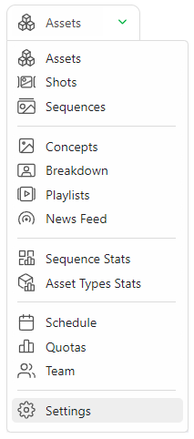

# サムネイル
## 手動でサムネイルを追加

プレビューをサムネイルとして定義するには、プレビューがリビジョンとしてアップロードされている必要があります。

リストページで希望するステータスをクリックし、右パネルの**[プレビュー]**ボタン (1) をクリックします。

ボタンをクリックすると、最初のフレームまたは任意のフレームを選択できます。フレームを選択すると、サムネイルが表示され、ボタンはグレーに変わります。

## サムネイルを自動的に追加する

サムネイルを自動的に生成したい場合は、ナビゲーションメニューを使用して、本番環境から設定ページに移動します。

**パラメータ**タブで、**新しいプレビューを自動的にサムネイルとして設定する**を選択します。

作業が完了したら、変更を**保存**することをお忘れなく。これで、プレビューをアップロードすると、自動的にサムネイルとして使用されるようになります。

## プレビューの一括アップロード（サムネイルとして

グローバルページにある**[サムネイルを追加]**ボタン ![サムネイルを追加]ボタン（../img/getting-started/add_thumbnails.png）を使用して、サムネイルを一括でインポートします。

新しいポップアップが開き、サムネイルをどのタイプのタスクにリンクするかを選択するよう求められます。

**サムネイルの一括インポートでは、画像ファイルと動画ファイルの両方が受け入れられます**。動画ファイルのサムネイルには、最初のフレームのみが使用されます。

サムネイルを正しいショットに自動的にリンクさせるには、サムネイルに「sequence_shot」という名前を付ける必要があります。

例えば、シーケンスの名前が「SEQ_001」、ショットの名前が「SH_001」の場合、サムネイルのファイル名は「SEQ_001_SH_001」となります。
