# TV番組制作の作成

Kitsuでワークフローを設計し、チームメンバーを追加したので、今度は制作を作成します。

「**新規制作の作成」**ボタンをクリックします。

制作の名前を入力し、**タイプ**として**「テレビ番組」**を選択し、制作のスタイル（2D、3D）を選択します。

次に、FPSの数、アスペクト比、解像度などの技術情報を入力します。

::: 警告
これらのデータは、お客様がアップロードしたビデオプレビューをキットが再エンコードする際に使用されます。
:::

次に、制作物の開始日と終了日を定義します。

制作ワークフローは、次のパート3から6で定義できます。

アセットタスクタイプ（3）、ショットタスクタイプ（4）、タスクステータス（5）、アセットタイプ（6）を選択する必要があります。

::: ヒント
**制作ワークフロー**を作成するには、グローバルライブラリからタスクタイプを選択します。

タスクタイプをいくつか見落としていたことに気づいた場合は、後で作成することができます。

[Kitsuの入門ガイド](../configure-kitsu/README.md)を参照してください。
:::

次に、ステップ7と8はオプションです。アセットまたはショットの一覧がすでにスプレッドシートにある場合は、**CSVのインポート**セクションを参照してください。

ボタンですべてを確認します。

## Kitsuのグローバルページの紹介

Kitsuのグローバルアセットページへようこそ。 まずは全体を見てみましょう。

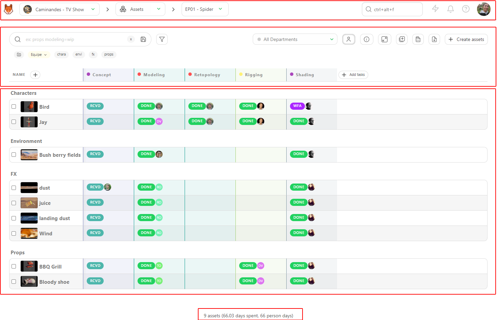

ページの上部には、**グローバルナビゲーション**があります。これは、すべての制作ページで表示されます。

**左から右へ：**

### メインメニュー

左上のボタンをクリックすると、Kitsu（またはお客様のスタジオロゴ）が表示され、メインメニューが開きます。

メインメニューでは、割り当てられたタスク、制作、グローバルおよびチームスケジュール、ワークフローのカスタマイズページ、およびKitsuの設定に直接アクセスできます。

::: 詳細 メインメニューの詳細
**ワークスペース**
- **マイタスク：** 割り当てられたタスク。
- **マイチェック：** 部署に応じて、ステータスが**フィードバックリクエスト**となっているすべてのタスク。
- **マイプロダクション：** プロダクション選択ページに戻る。

**スタジオ**
- **プロダクション：** すべてのプロダクション（オープンまたはクローズ）の詳細リスト。
- **メンバー：** スタジオ内のすべてのメンバー（アクティブまたは非アクティブ）のリスト。
- **タイムシート：** チームが制作ごとに記録した作業時間の明細。
- **メインスケジュール：** すべての制作を1つのスケジュールに表示。
- **チームスケジュール：** スタジオ内のすべてのスタッフのスケジュールとタスクを表示。
- **すべてのタスク：** すべての制作のすべてのタスクに一括してアクセス。
- **ニュースフィード：** 最新情報を入手。
- **エンティティ検索：** すべての制作にわたって、任意のアセットまたはショットを検索。

**ADMIN**
- **Departments:** 部署を作成および編集。
- **Task Types:** タスクの種類を作成および編集。
- **Asset Types:** アセットの種類を作成および編集。
- **Custom Actions:** カスタムアクションを作成および編集。
- **Automation:** 自動化を作成および編集。
- **3D Backgrounds:** HDR背景を追加。
- **Bots:** ボットを作成および編集。
- **設定**：スタジオの設定を行います。
- **ログ**

::: 警告 権限 表示
WORKSPACEセクションは、アーティストには表示されない「My Checks」を除くすべての権限に対して有効になっています。

アーティスト（およびそれ以上の権限を持つユーザー）は、自身の**タイムシート**も確認でき、**エンティティ検索**にもアクセスできます。
:::

### ナビゲーション

メインメニューアイコンの右側にナビゲーションドロップダウンメニューが表示されます。

異なる制作物の中から選択することができます。現在の制作物の名称と現在のページは常に表示されます。

複数の制作物がある場合は、ドロップダウンメニューを使用して、制作物間を移動することができます。制作物を選択すると、次のドロップダウンメニューで、その制作物の異なるページ間を移動することができます。

::: 詳細 ナビゲーション 詳細
最初のセクションは、タスクの追跡に関するものです。
- **アセット**
- **ショット**
- **シーケンス**
- **エピソード**
- **編集**（特定のタスクを作成した場合）

2番目のセクションは、制作側により重点を置いたものです。
- **コンセプト**
- **ブレイクダウン**
- **プレイリスト**
- **ニュースフィード**

3番目のセクションは、統計に関するものです。
- **シーケンス統計**
- **エピソード統計**
- **アセットタイプ統計**

第4セクションはチーム管理に関連するものです。
- **スケジュール**
- **ノルマ**
- **チーム**

第5セクションは制作の設定に関するものです。
- **設定**

::: ヒント
アセットページから開始しますが、制作ホームページを他のエンティティに変更することができます（設定ページを参照）。
:::

::: 警告
**エピソード**などの追加のナビゲーションレベルが必要ないことに気づいた場合は、制作タイプを**ショート**に変更する必要があります。
:::

### グローバル検索、ニュース、通知、およびドキュメント

ナビゲーションドロップダウンメニューの右側にグローバル検索があります。このクイックアクセス機能では、最初の4件の結果が表示されます。さらに多くの結果やフィルタリングオプションが必要な場合は、メインメニューの「**エンティティ検索**」ページにアクセスしてください。

次のアイコン  は、ニュースとフィードバックページへの直接リンクです。ここでは、すべての新機能（アニメーションGIF付き）を表示したり、Kitsuに追加してほしい機能の提案を送信したりすることができます。

次に、ベルのアイコン  は、通知（割り当て、コメント、タグ）を表示します。 未読の通知の数は、ベルのアイコンに表示されます。 さまざまなフィルター機能により、更新情報を把握し、必要なときに重要な更新情報を再確認することができます。 通知を既読または未読として簡単にマークしたり、ウォッチ/非ウォッチで素早くフィルターをかけたりして、最も重要なものに焦点を当て、フィードを整理することができます。

アバターの直前のアイコンは、ドキュメントボタンです！[ドキュメントボタン](../img/getting-started/documentation_button.png)は、まさに今あなたが読んでいるボタンです！

### 個人設定
アバターをクリックすると、プロフィールメニュー（プロフィール、カラーテーマ、ビデオチュートリアルなど）を開くことができます。

## タスクリスト

### エンティティスプレッドシート

画面の2番目の部分は、すべてのエンティティ（アセット、ショット、シーケンス、編集）に共通です。これはグローバルなタスクリストです。

ここでは、各タスクのステータス、割り当て、優先度、その他の詳細を確認できます。

::: ヒント
スプレッドシートの最初の行と列のヘッダーは、ページをスクロールしても常にページの上部に表示されます。

また、他の列を常に表示しておくために固定することもできます。
:::

### フィルター

左側の最初の要素はフィルターボックスです。 シーケンスやアセットタイプなど、簡単なフィルタリングを行う場合は、任意の文字列を入力することができます。

より高度なフィルタリングを行う場合は、フィルタービルダーボタンを使用してください。

すべてのフィルターを保存し、ページとして使用することができます。

### 表示の簡素化

画面の右側には、いくつかのボタン（左から右へ）があり、アサインメントの表示/非表示、追加カラムの表示/非表示、サムネイルの拡大/縮小を行うことができます。

### インポート / エクスポート
ここでは、サムネイルの一括インポート  を行い、最後にインポート  またはエクスポート  を行います。

### メタデータカラム
以下に、カラムの名前があります。**Name**の隣にある(+)をクリックすると、新しいメタデータカラムを作成できます。次に、タスクタイプカラムの名前があります。

### ビューのカスタマイズ
画面の一番右側、スクロールバーの隣に、追加の列（タスクタイプ以外のすべて）を非表示または表示するオプションがあります。

。

### ビューの要約
画面の一番下にある最後の部分（4）は、表示されているページの要約です。つまり、ページをフィルタリングすると、要約も更新されます。

要素（アセットまたはショット）の数、見積もり日数の合計、およびすでに費やした日数の合計を確認できます。

## アセットの作成
### 最初のアセットの作成

制作物を制作し、Kitsuインターフェースの概要を理解したので、いよいよ最初の制作物を作成します。

アセットページで、**[アセットを追加]**をクリックします。

::: 警告
アセットを作成すると、タスクワークフローが適用され、**すべてのタスクが同時に作成されます**。
:::

ポップアップウィンドウが開きます。

- **アセットタイプ**を選択するよう求められます（1）。新しいアセットタイプを追加していない場合、Kitsuは「キャラクター」、「環境」、「FX」、「小道具」などの例を提供します。まずはキャラクターから始めましょう。

::: ヒント
アセットタイプのリストとタスクパイプラインはカスタマイズすることもできます。 [アセットタイプのワークフローを参照](../configure-kitsu/README.md#specific-asset-types-workflow)
:::

このアセットをエピソードにリンクし（Kitsuではデフォルトで編集や削除ができない**Main Pack**が提供されます）、最初のエピソードとして**E01**を選択して作業を開始します。 E01の名前を変更したり削除することもできます。

(3) **名前**を付け、アーティストが何をすべきか理解し、アセットを素早く識別できるように説明を入力します。

複数のアセットを作成する場合は、**[確認して続行]**をクリックします。

アセットの種類を変更して、アセットの追加を続行できます。

::: ヒント
「確認して続行」をクリックするたびに、新しく作成されたアセットがバックグラウンドに表示されます。
:::

最後のアセットを追加したら、「確認」をクリックします。これによりアセットが作成され、ウィンドウが閉じます。

::: ヒント
「確認して続行」をクリックした後、追加するアセットがないことに気づいた場合は、「閉じる」をクリックするとウィンドウがキャンセルされます。
:::

また、アセットのワークフロー用に選択されたタスクも同時に作成されます。

さらに**アセット**を追加する必要がある場合は、**+ アセットの作成**ボタンをクリックします。

::: 詳細 CSVスプレッドシートファイルからアセットを作成
アセットのリストがすでにスプレッドシートファイルに用意されているかもしれません。
Kitsuでは、インポートする方法が2つあります。1つ目は、`.csv`ファイルをインポートし、データを直接Kitsuにコピー＆ペーストする方法です。

まず、スプレッドシートを`.csv`ファイルとして保存します。

次に、Kitsuのアセットページに戻り、**インポート**アイコンをクリックします。

ポップアップウィンドウの**「CSVからデータをインポート」**が開きます。**「参照」**をクリックして、`.csv`ファイルを選択します。

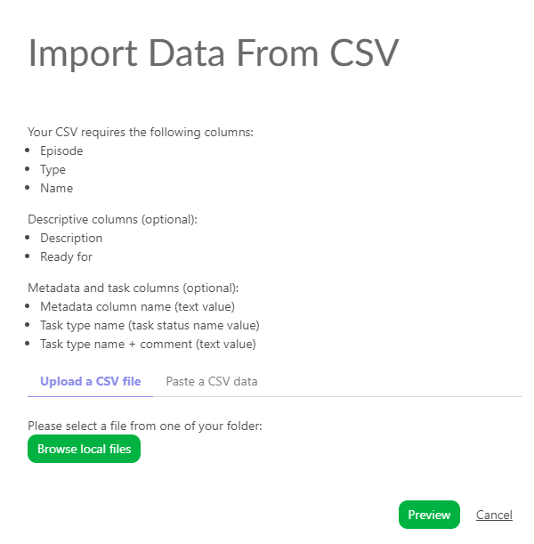

結果を確認するには、**[プレビュー]**ボタンをクリックします。

データのプレビューで列名を確認し、調整することができます。

注意：**[エピソード]**列は、**[テレビ番組]**制作の場合のみ必須です。

すべてが正しいことを確認したら、**[確認]**ボタンをクリックしてデータをKitsuにインポートします。

これで、すべてのアセットがKitsuにインポートされ、設定に従ってタスクが作成されました。

:::

::: 詳細 スプレッドシートファイルをコピー/ペーストしてアセットを作成

スプレッドシートを開き、データを選択してコピーします。

次に、Kitsuのアセットページに戻り、**インポート**アイコンをクリックします。

ポップアップウィンドウの**「CSVからデータをインポート」**が開きます。**「CSVデータを貼り付け」**タブをクリックします。

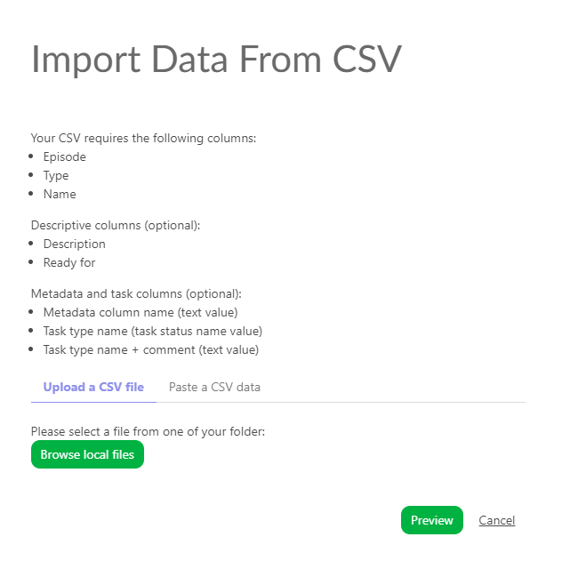

以前に選択したデータを貼り付け、**[プレビュー]**ボタンで結果を確認できます。

データのプレビューで列名を確認し、調整できます。

注意：**[エピソード]**列は、**[テレビ番組]**制作の場合のみ必須です。

すべてが正しく入力されたら、**Confirm**ボタンをクリックしてデータをKitsuにインポートします。

これで、すべてのアセットがKitsuにインポートされ、設定に従ってタスクが作成されました。

:::

### アセットの詳細の表示

アセットの詳細を表示するには、その名前をクリックします。

新しいページが開き、右側にタスク、割り当て、ステータスの更新の一覧が表示されます。

各タスクのステータスをクリックすると、コメントパネルが開き、コメントの履歴や異なるバージョンのコメントを見ることができます。

また、以下の情報にもアクセスできます。

- **キャスティング**

- このアセットにリンクされた**コンセプト**

- タスクタイプページのデータを事前に記入している場合は、**スケジュール**が利用可能です。データがすでに記入されている場合は、ここで直接修正することができます。

- さまざまなタスクタイプでアップロードされた**プレビューファイル**

- そして、このアセットのタスクでタイムシートが記入されている場合の**タイムログ**。

## アセットの更新
アセットはいつでも更新でき、名前やアセットタイプを変更したり、説明文を修正したり、グローバルページに追加したカスタム情報を追加したりすることができます。

アセットを編集するには、アセットページに移動し、変更したいアセットの上にカーソルを移動させて、行の右側にある**[編集]**ボタンをクリックします！[編集ボタン](../img/getting-started/edit_button.png) (1)

アセットのメインページで詳細を表示するには、最初の文字 (2) をクリックすると、詳細が記載されたポップアップが開きます。

アセットを削除するには、FAQ: [アセットの削除方法](../faq-deletion/README.md##how-to-delete-an-asset)を参照してください。

::: 詳細 CSV インポートによるアセットの更新
CSV インポートを使用すると、データをすばやく更新することができます。

アセットの**タイプ**、**割り当て**、タスクの**ステータス**を更新したり、**コメント**を追加したりすることができます。

**既存のデータを更新する**オプションをオンにする必要があります。すると、更新される行が青くハイライトされます。

::::

:::: 詳細 スプレッドシートファイルのコピー＆ペーストによるアセットの更新

スプレッドシートを開き、データを選択してコピーします。

次に、Kitsuのアセットページに戻り、**インポート**アイコンをクリックします！[インポートアイコン](../img/getting-started/import.png)。

ポップアップウィンドウ「**CSVからのインポート**」が開きます。「**CSVデータの貼り付け**」タブをクリックします。

以前に選択したデータを貼り付け、**[プレビュー]**ボタンで結果を確認できます。

データのプレビューで列の名前を確認し、調整できます。

オプションの**[既存のデータを更新]**をオンにする必要があります。すると、更新される行が青くハイライトされます。

これで、すべての資産をKitsuにインポートし、設定に従ってタスクを更新しました。

::::

## アセット作成後にタスクを追加する

アセットを作成した後で、タスクが不足していることに気づいた場合でも、追加することができます。

まず、不足しているタスクタイプが設定ページのタスクタイプタブに追加されていることを確認してください（そうでなければ、[Kitsuの使い方](../configure-kitsu/README.md)を参照）。

次に、アセットページに戻り、**+ タスクを追加**をクリックします。

## コンセプトの作成
### コンセプトのアップロード

**コンセプト**を作成するには、ナビゲーションメニューを使用して**コンセプト**ページに移動します。

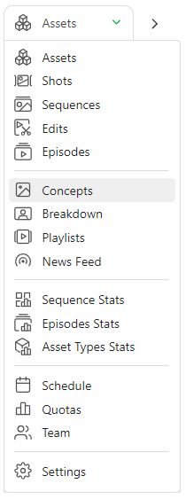

コンセプトをアップロードするには、**コンセプトへの新しい参照を追加**ボタンをクリックします。

同時に1つまたは複数のコンセプトをアップロードできます。

プレビューをアップロードすると、コンセプトページは次のようになります。

コンセプトとやりとりするには2つの方法があります。1つ目は、画像をクリックして拡大表示する方法です。2つ目は、ステータスの部分をクリックして右側の**コメントパネル**を開く方法です。

コメントパネルでは、2つのオプションがあります。コンセプトを既存のアセットにリンクするか、削除するかです。また、アセットにコメントを追加したり、ステータスを変更することもできます。

**コンセプト**ごとに1つのバージョンを持つことが基本です。承認されていない場合は、同じコンセプトの複数のバージョンを作成しないよう、新しいコンセプトをアップロードする必要があります。

1つのコンセプトは1つのタスクです。

### コンセプトとアセットのリンク

コンセプトをアップロードすると、アセットにリンクすることができます。

アセットのステータス部分にリンクが表示されます。

コンセプトのステータス部分をクリックすると、右側にコメントパネルが開きます。

コメントパネルの上部には、コンセプトをアセットにリンクするか、コンセプトを削除するかの2つのオプションがあります。

アセットをリンクするには、[リンク] ボタン  をクリックします。

Kitsu は、アップロードしたコンセプトにリンク可能なすべての **アセット** を表示します。

Kitsu は、リンクされたアセットをコメントパネルの上部にリスト表示します。現時点では、リンクはありません。

アセットをリンクするには、それをクリックします。リンクされたアセットの名前は、コンセプトのプレビューの下に画面の上部に表示されます。

コンセプトがアセットにリンクされると、アセットの詳細ページで確認できます。

アセットページに戻り、コンセプトを確認したいアセット名をクリックします。

デフォルトでは、キャスティングの詳細が画面の2番目の部分に表示されます。
ドロップダウンメニューを使用してコンセプトを選択します。

コンセプトセクションに入ると、このアセット用に作成されたすべてのコンセプトが表示されます。ステータスごとにフィルタリングすることができます。

## ショットの作成
### 最初のショットの作成

制作用の**ショット**を作成する時が来ました。

::: 警告
**ショット**は**シーケンス**にリンクされ、シーケンスはまたキットゥの**エピソード**にもリンクされます。
つまり、エピソードを作成し、次にシーケンスを作成し、このシーケンスにショットを追加する必要があります。
:::

ドロップダウンメニューを使用して**ショット**ページに移動し、**ショット**をクリックします。

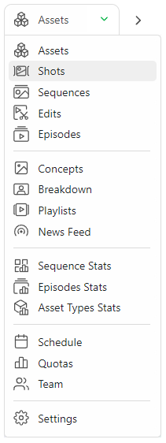

ショット作成を開始するには、**ショットを追加**ボタンをクリックします。

::: 警告
ショットを作成すると、設計したタスクワークフローが適用され、すべてのタスクがショットと同時に作成されます。

[Kitsuの使い方](../configure-kitsu/README.md)を参照してください。
:::

ショットの作成用に新しいポップアップが開きます。
これで、エピソード、シーケンス、ショットを作成できます。

Kitsuは最初のエピソードとして例として**E01**を提供しています。それを選択し、最初のシーケンス、例えばsq01を追加し、
**追加**をクリックします。

これでシーケンスが作成されたことが確認できます。このシーケンスにショットを追加するには、シーケンスを選択し、ショットを作成する必要があります。

例えば、ショットの列に「sh0010」と入力し、**「追加」**をクリックします。
ショットのパディングを定義することもできます。

::: ヒント
ショットを10個ずつSH0010、SH0020、SH0030などのように名前を付けたい場合は、「ショットのパディング」を10に設定します
:::

新しいショットがシーケンスごとにリスト化され、リンクされているのがお分かりいただけると思います。また、棚はエピソードにリンクされています。
これで、最初のエピソードの最初のシーケンスの最初のショットが作成されました。

それでは、1つ以上のショットを追加してみましょう！ご覧の通り、ボックスにはすでに名前のコードが含まれていますが、
コードがすでに含まれていますが、インクリメントされているので、**追加**をクリックして、
さらにショットを作成する必要があります。

さらにシーケンスを追加するには、左側部分に移動し、新しいシーケンスの名前を入力して、**追加**をクリックします。
2番目のシーケンスが選択され、ショットを追加できるようになります。

同じ手順でさらにエピソードを追加することができます。

新しいエピソードを作成すると、順次選択され作成されます。
シーケンスが作成されると、選択され、このシーケンスにショットを作成することができます。

::: ヒント
ショットがシーケンス上で誤った位置に配置されている場合は、ショットを編集する必要があります
！[編集ボタン](../img/getting-started/edit_button.png)をクリックし、
シーケンスを変更します。

ただし、ショットのエピソードを変更することはできません。

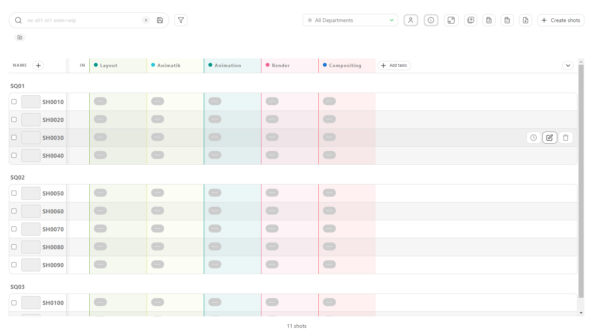

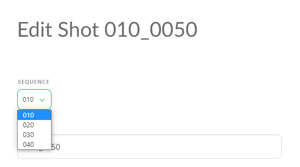
:::

ショットを削除するには、FAQを参照してください。[ショットの削除方法](../faq-deletion/README.md#how-to-delete-a-shot)

シーケンスを削除するには、FAQを参照してください。[シーケンスの削除方法](../faq-deletion/README.md#how-to-delete-a-sequence)

## EDLファイルからショットを作成

すでに**EDL**ファイルにショットリストが用意されているかもしれません。Kitsuでは、**EDL**ファイルを直接インポートして、シーケンス、ショット、フレーム数、フレームイン/アウトを作成することができます。

**グローバルショットページ**には、**[インポートEDL]**ボタンがあります。

ポップアップで、編集時に使用するビデオファイルの命名規則を選択できます。

これは、プロジェクト_シーケンス_ショット.拡張子という名前で編集上のビデオクリップが命名されていることを意味します。

LGC制作のEDLの例を以下に示します。

動画ファイルの名前はLGC_100-000.movとなっており、LGCが制作名、100がシーケンス名、000がショット名であることを意味しています。

命名規則を設定したら、EDLファイルをインポートできます。

次に、**[Upload EDL]**をクリックします。

次に、Kitsuがショットを作成します。

::: 詳細 CSVスプレッドシートファイルからショットを作成
ショットのリストがすでにスプレッドシートファイルで用意されているかもしれません。Kitsuでは、インポートする方法が2つあります。1つ目は、`.csv`ファイルを直接インポートする方法、2つ目は、データを直接Kitsuにコピー＆ペーストする方法です。

まず、スプレッドシートを`.csv`ファイルとして保存します。

次に、Kitsuのショットページに戻り、**インポート**アイコンをクリックします。

「CSVからデータをインポート」というポップアップウィンドウが開きます。「参照」をクリックして、`.csv`ファイルを選択します。

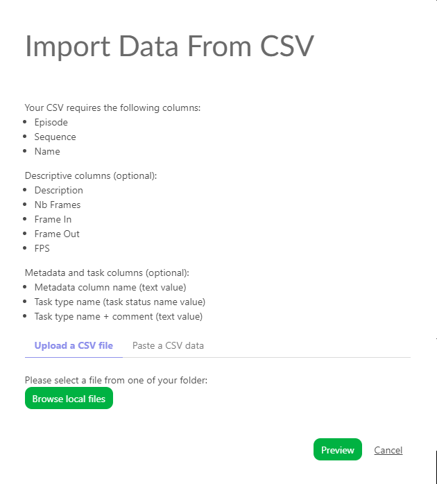

結果を確認するには、「プレビュー」ボタンをクリックします。

データのプレビューで、列の名前を確認し、調整することができます。

注意：**エピソード**の列は、**テレビ番組**の制作には必須です。

すべてが適切であることを確認したら、**確認**ボタンをクリックしてデータをKitsuにインポートします。

これで、すべてのショットがKitsuにインポートされ、**設定**に従ってタスクが作成されます。

:::

::: 詳細 スプレッドシートファイルをコピー/ペーストしてショットを作成
スプレッドシートを開き、データを選択してコピーします。

次に、キットゥのショットページに戻り、**インポート**アイコンをクリックします
！[インポートアイコン](../img/getting-started/import.png)。

ポップアップウィンドウ「**CSVからデータをインポート**」が開きますので、「**CSVデータを貼り付け**」タブをクリックします。

以前に選択したデータを貼り付け、**[プレビュー]** ボタンで結果を確認できます。

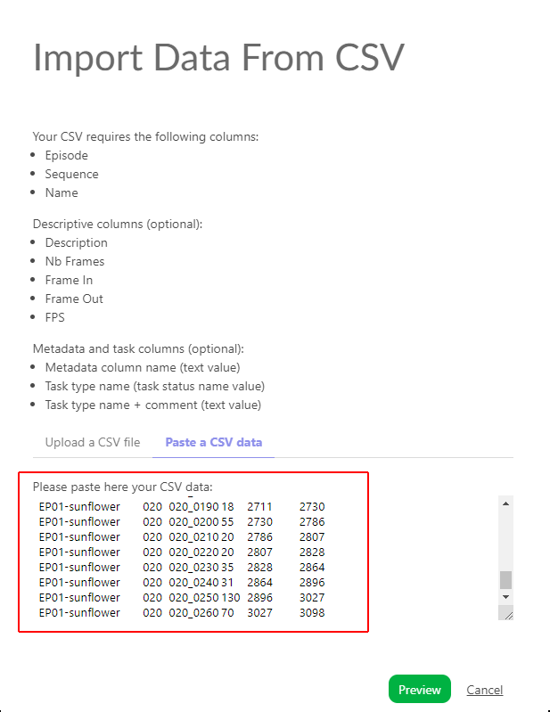

データをプレビューすることで、列の名前を確認し、調整することができます。

注：**[エピソード]** 列は、**[テレビ番組]** 制作の場合のみ必須です。

すべてが正しく入力されていることを確認したら、**確認**ボタンをクリックしてデータをKitsuにインポートします。

これで、すべてのショットがKitsuにインポートされ、**設定**に従ってタスクが作成されます。

:::

### ショットの詳細を確認する

ショットの詳細を確認したい場合は、ショット名をクリックします。

新しいページが開き、右側にタスク、アサイン、ステータスニュースフィードの一覧が表示されます。
タブ名をクリックすることで、各タブを切り替えることができます。

各タスクのステータスをクリックすると、コメントパネルが開き、コメントの履歴や異なるバージョンを確認できます。

また、**キャスティング**にもアクセスできます。

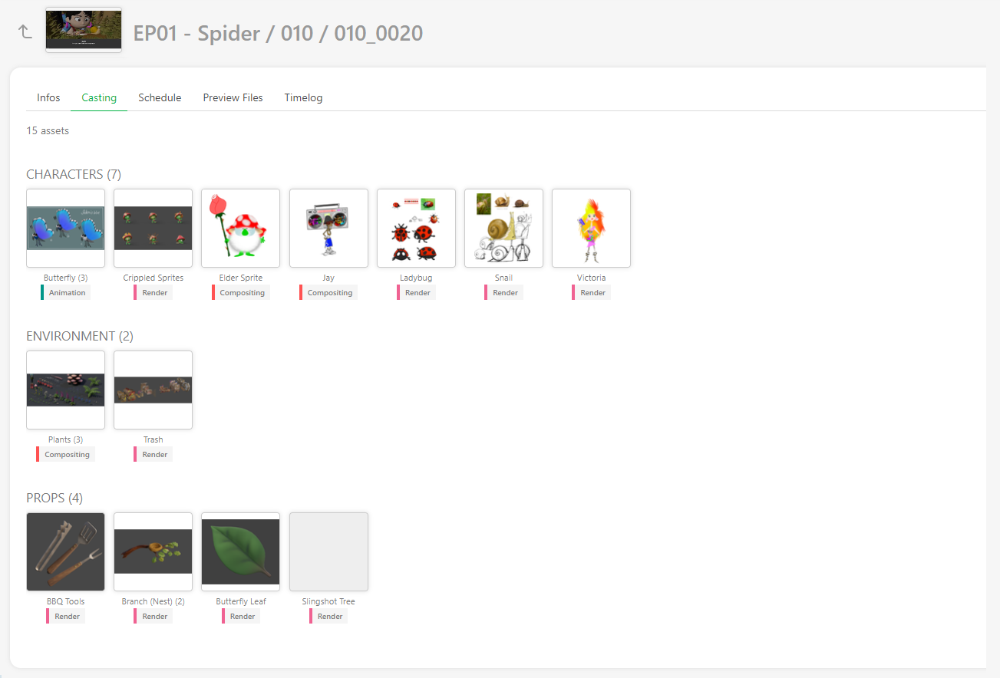

タスクタイプページのデータを事前に記入している場合は、**スケジュール**を利用できます。データがすでに記入されている場合は、ここで直接修正できます。 

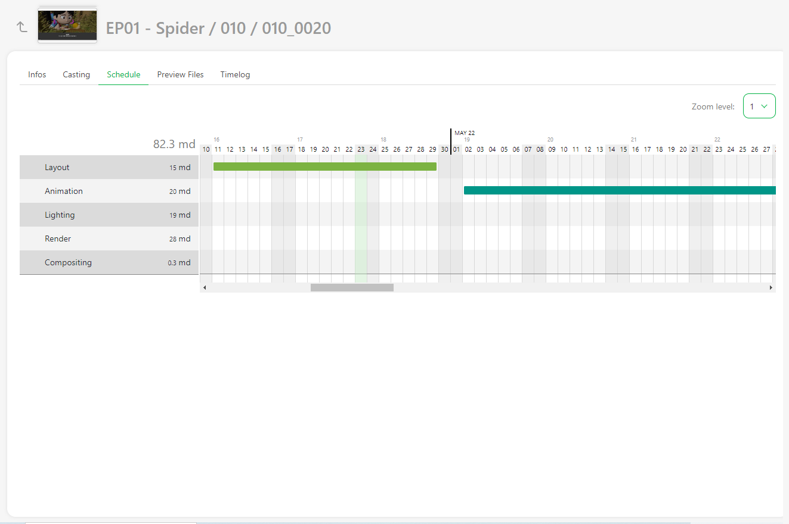

さまざまなタスクタイプでアップロードされた**プレビューファイル**、

そして、このアセットのタスクでタイムシートが記入されている場合の**タイムログ**。

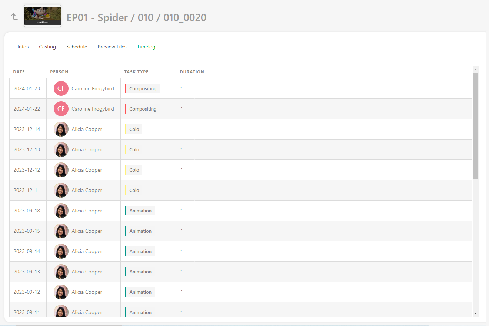

## ショットを更新する

ショットはいつでも更新でき、名前や順序を変更したり、説明文を修正したり、グローバルページに追加したカスタム情報を追加したりすることができます。

ショットページに移動し、修正したいショットの上にカーソルを合わせてから、**[編集]**ボタンをクリックしてショットを編集できます
！[編集ボタン](../img/getting-started/edit_button.png) (1) 行の右側にある。

メインショットページの説明を拡張するには、最初の文字 (2) をクリックすると、説明の全文を含むポップアップが開きます。

::: 詳細 ショット情報のCSVインポートによる更新
CSVインポート**を使用して、**NBフレーム**、**フレームIN**、**フレームOUT**、または任意のカスタム**メタデータ列**としてデータを更新することができます。

タスクの**割り当て**と**ステータス**を更新し、**コメント**を追加することができます。

スプレッドシートを開き、データを選択してコピーします。

次に、Kitsuのショットページに戻り、**インポート**アイコンをクリックします
。

ポップアップウィンドウ**インポートデータからCSV**が開きます。**CSVデータを貼り付け**タブをクリックします。

以前に選択したデータをペーストし、**[プレビュー]**ボタンで結果を確認できます。

オプション：既存のデータを更新** をオンにする必要があります。
更新されたショットは青くなります。

注：**エピソード**の列は、**テレビ番組**制作の場合のみ必須です。

すべてが適切であることを確認したら、**確認**ボタンをクリックしてデータをKitsuにインポートします。

これで、すべてのショットがKitsuにインポートされ、**設定**に従ってタスクが作成されます。

::::

## ショットを作成した後にタスクを追加する
ショットを作成した後にタスクが不足していることに気づいた場合でも、追加することができます。

まず、不足しているタスクの種類がタスクの種類タブの設定ページに追加されていることを確認します（そうでなければ、http://localhost:8080/tvshow/#update-your-shots）。

次に、ショットのページに戻り、+タスクを追加をクリックします。

## ショットにフレーム番号と範囲を追加する

この段階では、アニマティックは完成しているはずです。つまり、各ショットの時間（フレーム数）とフレーム範囲（フレームインとフレームアウト）がわかっているはずです。この情報をスプレッドシートに入力することで、フレームの計算を正確に行うことができ、フレームの抜けや重複を防ぐことができます。

::: 警告
ショットとシーケンスを手動で作成した場合、フレーム列が非表示になっている可能性があります。 表示するには、少なくとも1つのショットを編集してフレーム数を入力する必要があります。 または、CSV/スプレッドシートでフレーム数をインポートした場合は、フレーム列が表示されます。
:::

ショットにフレーム範囲情報を追加するには、以下の手順に従います。

1. **ショットの編集：**ショット行の右側にある編集ボタン（）をクリックします。

2. **フレーム範囲の入力：**編集ウィンドウでショットの開始フレームと終了フレームを入力し、確認ボタンをクリックして保存します。

ショット編集ページ](../img/getting-started/shot_edit.png)

フレーム範囲がショットページの全体スプレッドシートに表示されます。

ショット編集ページ](../img/getting-started/shot_framerange_global.png)

3. **フレーム情報の入力：** フレーム、イン、アウトの列のロックが解除されたら、グローバルショットページから直接データを入力できます。入力したいケースをクリックしてデータを追加します。

::: ヒント
フレームインとフレームアウトを入力すると、Kitsuが自動的にフレーム数を計算します。
:::

4. **CSV インポート:** フレーム範囲を素早く更新するには、CSV インポートも利用できます。 [CSV インポートでショット情報を更新](README.md#update-your-shots)

5. **ショット履歴へのアクセス:** フレーム範囲を含むショット値の履歴を表示できます。

## カスタムメタデータ列の作成

一般的なスプレッドシートページに追加情報を含めるには、カスタム**メタデータ列**を作成する必要があります。

追加したい詳細情報として、**難易度**、**天候**、**タグ**などがあるかもしれません。 すべてのテキストまたは数値情報は、カスタムメタデータ列に保存することができます。

::: 警告
1つのエピソードで作成されたカスタムメタデータ列は、すべてのエピソードに適用されます。
:::

カスタムメタデータ列を作成するには、以下の手順に従います。

1. **列の追加:** 名前列の近くにある**+**をクリックします。

2. **タイプを選択:** タイプオプションで、情報をどのように保存するかを選択します。
- **テキスト**
- **数値**
- **チェックボックス**
- **値のリスト**
- **タグのリスト**
- **チェックリスト**

::: 警告 
- **テキスト**、**数値**、および**チェックボックス**は、事前の計画なしに各エンティティに異なる情報を追加することができます。
- **値のリスト**、**タグのリスト**、および**チェックリスト**は、各エンティティに同じオプションを提供し、事前に記入する必要があります。

以下のリスト要素を入力します。利用可能な値をクリックして選択します。
:::

3. **部門へのリンク:** オプションとして、メタデータ列を1つまたは複数の部門にリンクすることができます。これにより、アーティスト/スーパーバイザーは、自分のToDoページおよび部門別にフィルタリングされたビューで表示できるようになります。

::: ヒント
メタデータ列を部署にリンクするには、リストから部署をクリックし、**追加**をクリックして適用します。

ここでは、VFX列が2つの部署にリンクされています。

:::

::: 詳細 メタデータカラムの編集
アセットまたはショットのグローバルページで、メタデータカラムの右側にある矢印をクリックし、**[編集]** を選択します。

:::

4. **情報の入力:** グローバルスプレッドシートページで直接情報を入力できます。 ケースは編集可能です。

::: ヒント
左側の複数のエンティティを選択し、メタデータカラムを一括で変更することができます。
:::

::: 詳細 手動で編集
編集ボタン（）をクリックして、情報を手動で変更することもできます。

編集ポップアップに新しい行が表示され、リストから情報を選択したり、自由形式のテキストや数値を入力したり、チェックボックスにチェックを入れたり、チェックリストを使用したりすることができます。

作業が完了したら、[Confirm] ボタンをクリックしてください。

:::

5. **編集または削除:** メタデータ列を編集または削除するには、スプレッドシートの一般ページに移動します。 メタデータ列の名前の隣にある矢印をクリックします。

::: ヒント
列名の右にある矢印をクリックしてメニューを開き、「ソート」を選択することで、この新しい列でグローバルページをソートすることもできます。

また、メタデータ列を左側に固定することもできます。
:::

## シーケンスの作成

Kitsuでは、**シーケンス**レベルでタスクを追跡することもできます。
これは、
ストーリーやカラーボード、カラーグレーディングなど、追跡するマクロタスクがある場合に特に便利です。

ナビゲーションメニューを使用して、**シーケンス**ページに移動します。

::: 警告
この新しいページは、アセットおよびショットのグローバルページと同様に動作します。

このページを使用するには、まず**グローバルライブラリ**に**シーケンス**属性を持つ専用のタスクタイプを作成する必要があります。

[新しいタスクタイプの作成方法](../configure-kitsu/README.md#studio-workflow-create-a-new-task-type)を参照してください

グローバルライブラリに**タスクタイプ**を作成したら、それを**
プロダクションライブラリ**（設定ページ）に追加します。
:::

タスクタイプが設定ページで準備できたら、シーケンス（アセットまたはショットと同じ）を作成する必要があります。

この新しいページは、アセットやショットのグローバルページと同様に動作します。**+ 新規シーケンス** ボタンで編集を追加できます。

タスクの割り当て、レビュー、ステータスの変更などを行うことができます。

メタデータ列を追加したり、説明を記入したりすることができます。

::: ヒント
シーケンスは、ここ（**+新規シーケンス**ボタン）から直接作成することも、グローバルショットページからショットにリンクされたシーケンスを作成することもできます。
:::

このページでは、アセットやショットと同様に、シーケンスのエンティティを**名前変更**したり、**削除**したりすることができます。

シーケンス名をクリックすると、そのシーケンスの詳細ページが表示されます。

詳細ページでは、シーケンスのキャスティングにアクセスできます。
シーケンス全体で使用されているすべてのアセットを確認できます。

また、シーケンスのスケジュール、プレビューファイル、アクティビティ、タイムログの**タスク**にもアクセスできます。

## 作成と編集

Kitsuでは、**編集**レベルでタスクを追跡することができます。

これは、複数の検証ステップを通じて複数の編集を追跡する必要がある場合に特に便利です。例えば、映画全体、複数の予告編、ファースト・エディット、ファイン・エディット、ミックスなどを追跡することができます。

::: 警告
デフォルトでは、**Edit** ページは、**プロダクションライブラリ**（設定ページ）にそれ用のタスクタイプが作成されるまで表示されません。

[新しいタスクタイプの作成方法]（../configure-kitsu/README.md#studio-workflow-create-a-new-task-type）を参照してください。
:::

このページを使用するには、まず**グローバルライブラリ**で**編集**属性を持つ専用のタスクタイプを作成する必要があります。

グローバルライブラリ**で**タスクタイプ**を作成したら、**プロダクションライブラリ**に追加します。その後、ナビゲーションのドロップダウンメニューに**編集**オプションが表示されます。

この新しいページは、アセットおよびショットのグローバルページと同様に動作します。**+ 新規編集**ボタンで編集を追加できます。

タスクの割り当て、レビューの実施、ステータスの変更などを行うことができます。

また、メタデータ列を追加したり、説明を記入したりすることもできます。

::: ヒント
配信内容に応じて、**[編集]** ごとの解像度を変更することもできます。
:::

::: 警告
詳細ページは、他のエンティティとは異なります。

**[編集]** は特定のロングビデオに焦点を当てているため、詳細ページはコメントの詳細ページにより近いものとなっています。
:::

このページでは、アセットやショットのエンティティと同様に、**[編集]** エンティティの **[名前の変更]** や **[削除]** を行うことができます。

## ブレイクダウンリストの作成

ブレイクダウンを記入すると、ショットの組み立てに役立ちます。
ブレイクダウンには、ショットを作成するために追加する必要のあるアセットの詳細がすべて記載されています。
これにより、何も漏れなく確実に作業を進めることができます。

ドロップダウンメニューで **[BREAKDOWN]** を選択します。

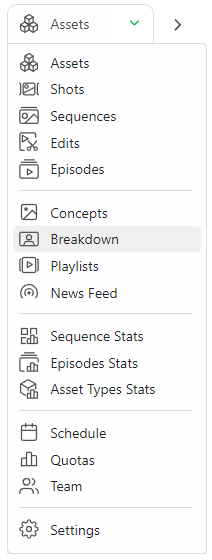

ブレークダウンページの左側には、エピソード/シーケンス/ショットメニュー（1）があります。作成したものの中から選択できます。これらは画面の右側にあり、
作成したすべてのアセットは、この制作（メインパックおよびエピソード）で利用できます（3）。さらに、
中央セクションでは、ショットの選択を行います（2）。

では、次にキャストしたいショットを選択します。

サムネイルがまだない場合はアセットをテキストで表示したり、
サムネイルのサイズを拡大することができます。

また、ブレイクダウン中にリストにアセットを追加する必要があることに気づくかもしれません。

ブレークダウンページから直接、新しいアセットを作成することができます。「利用可能なすべてのアセット」の右側にある「+」をクリックします。

また、複数のショットを一度に選択することもできます。最初のショットをクリックし、**シフト**キーを押したまま、選択する最後のショットをクリックします。

次に、割り当てたいアセットをクリックします。
キャラクター、背景など、右側の部分 (3) から選択します。
複数のショットを選択した場合、選択した内容は多数のショットに適用されます。

アセットが配置されたショットをコピーし、このアセット選択を別のショットに貼り付けます。

アセットの上にカーソルを移動させると、**+1** または **+10** と表示されます。これは、
そのアセットを追加した回数を表しており、必要なだけクリックできます。

シーケンスやショットを指定せずに、すべてのアセットをテレビ番組のエピソードにリンクすることもできます。

この方法では、ストーリーボード/アニマティックの段階の前に、すべてのアセットを1つまたは複数のエピソードにリンクすることができます。

画面中央にアセットが表示されているのが確認できます（2）。
アセット名の隣には、追加された回数が表示されています。この
例では、キャラクターアセット「Llama」を2回追加しています。

誤ってアセットを2回追加してしまった場合は、画面中央部分でこのショットのアセットを選択する必要があります（2）。そこから、**-1**をクリックします。
このショットの作業が完了したら、他のショットの作業に進みます。
選択した内容は自動的に保存されます。

ストーリーボードの作成中に新しいアセットが作成された場合は、アセットページに戻り
（ドロップダウンメニューを使用）、必要なアセットを作成します。 以前に作成されたタスクは、これらの新しいアセットに即座に適用されます。
 ただし、割り当てを行う必要があり、その後、
ブレイクダウンを継続できます。

これで、**Breakdown**ページは以下のようになります。

アセットを組み立てて個々のパーツを追跡する必要がある場合は、アセットのブレークダウンリストを作成することもできます。

画面左上にある**FOR**の下のドロップダウンメニューで**asset**を選択します。

2番目のドロップダウンメニューにアクセスして、アセットの種類を選択できます。 **キャラクター**、**環境**、**小道具**、**FX**、...

ショットの作成と同様の手順でアセットのブレークダウンページを完成させることができます。まず、左側の部分で1つまたは複数のアセットを選択し、次に右側の部分の要素を追加します。

::: 詳細 CSVファイルからブレークダウンリストを作成する

すでにスプレッドシートファイルでブレイクダウンリストが準備できているかもしれません。Kitsuでは、それをインポートする方法が2つあります。1つ目は、.csvファイルを直接インポートする方法、2つ目は、データを直接Kitsuにコピー＆ペーストする方法です。

まず、Kitsuの推奨に従って、スプレッドシートを「.csv」ファイルとして保存します。

インポート]ボタンをクリックします！[インポート]ボタン（../img/getting-started/import.png）

「CSVからデータをインポート」というポップアップウィンドウが開きます。「参照」をクリックして、`.csv`ファイルを選択します。

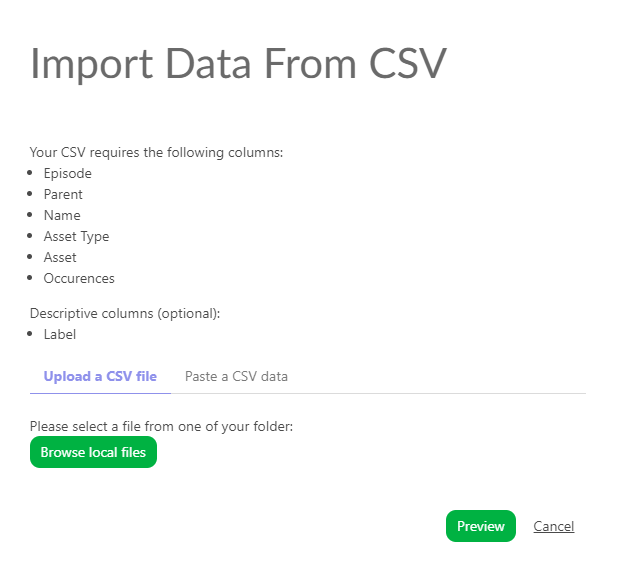

結果を確認するには、「プレビュー」ボタンをクリックします。

データのプレビューで、列の名前を確認し、調整することができます。

注意：**エピソード**の列は、**テレビ番組**の制作の場合のみ必須です。

すべてが適切であることを確認したら、**Confirm**ボタンをクリックしてデータをKitsuにインポートします。

これで、ブレークダウンがKitsuにインポートされました。

:::

::: 詳細 スプレッドシートファイルをコピー/貼り付けして内訳リストを作成

スプレッドシートを開き、データを選択してコピーします。

次に、Kitsuのブレークダウンページに戻り、**インポート**アイコンをクリックします 
。

ポップアップウィンドウ「**CSVからデータをインポート**」が開きますので、「**CSVデータを貼り付け**」タブをクリックします。

以前に選択したデータを貼り付け、**[プレビュー]** ボタンで結果を確認できます。

データのプレビューで列の名前を確認し、調整できます。

注：**[エピソード]** 列は、**[テレビ番組]** 制作には必須です。

すべてが適切に設定されたら、**Confirm**（確認）ボタンをクリックしてデータをKitsuにインポートします。

これで、すべてのアセットがKitsuにインポートされました。

:::

## アセットの状態の紹介：使用可能

ほとんどの場合、ショットタスクでアセットを使用する際に、アセットのタスクが承認されるのを待つ必要はありません。

たとえば、アセットが**コンセプト**段階で承認された場合、**ストーリーボード**段階で使用することができます。
次に、**モデリング**段階で承認された場合、**レイアウト**段階で使用することができます。

まさにアセットの状態**「準備完了」**がやっていることです。この状態は、アセットのタスクの状態を知らせ、ショットのタスクに対する使用可能性を比較します。

ブレークダウンを記入したので、どのショットにどのアセットが使用されているかが正確にわかります。

まず、タスクのステータスと関連するアセットの状態を定義する必要があります。セルをクリックして**「準備完了」**を変更することができます。ショットタスクのドロップダウンメニューが表示されます。

::: ヒント
**自動化**を使用して、作業の大部分を自動化することができます。

**準備完了**トリガーで自動化を設定できます。 

[ステータス自動化の作成方法](../configure-kitsu/README.md#automation)を参照

:::

アセットの状態をいくつか**準備完了**に変更したので、ショットページで結果を確認できます。

いくつかの白いボックスが**緑色**になっていることに気づくでしょう。このショットで使用されるすべてのアセットが、この特定のタスクの準備ができていることを意味します。

白いボックスが表示されている場合、Kitsuは、このタスクに準備ができているアセットの数を示します。

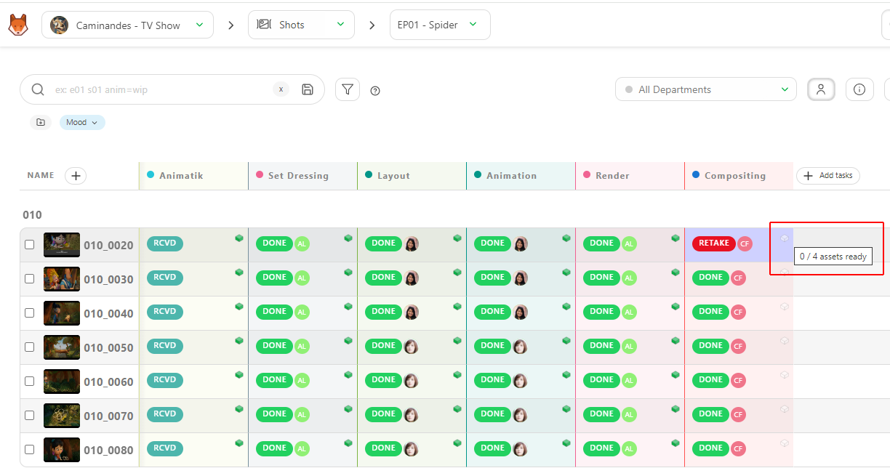

::: ヒント
ボックスが表示されていない場合、このショットにはアセットがキャストされていません。
:::

次に、ショット名をクリックして詳細ページに移動します。
すると、このショットで使用されているすべてのアセットとそのステータスが表示されます。

特定のタスクでショットを開始できるかどうかを判断する最も簡単な方法です。
